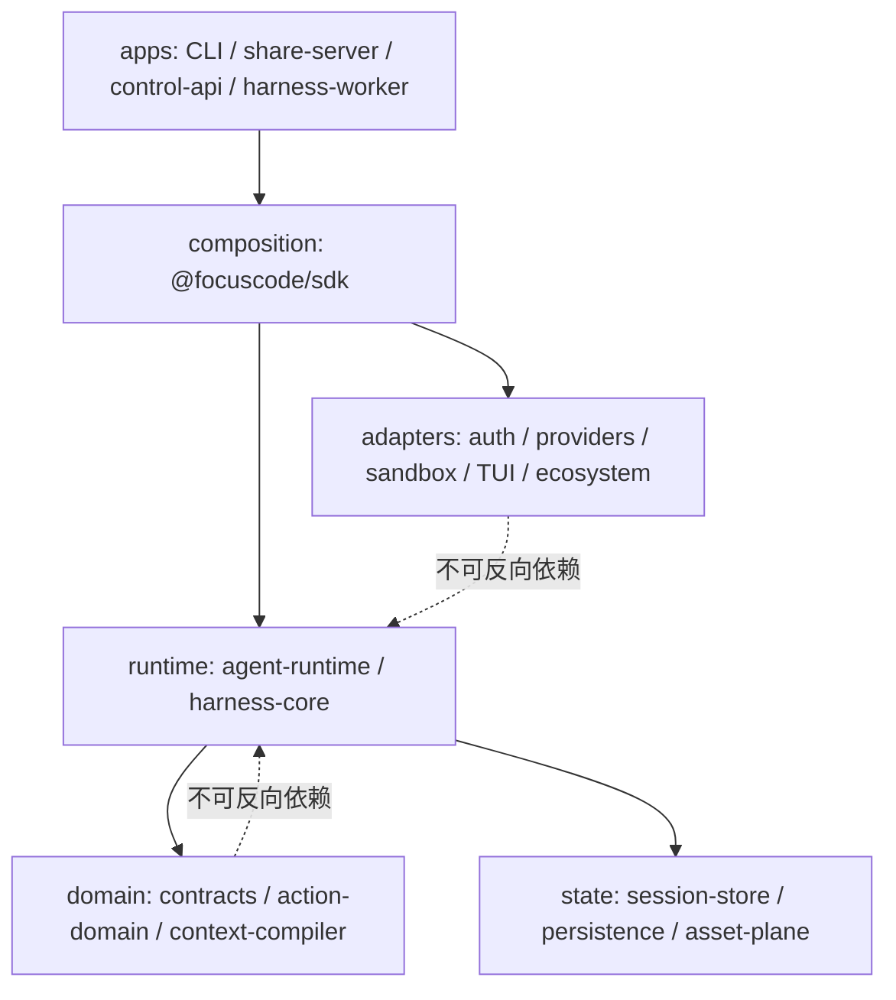

<div align="center">

# 🦊 FocusCode

**A model-portable, policy-controlled Coding Agent Harness.**

_不是某家模型的薄包装。Provider、上下文、会话、工具、权限、执行隔离与扩展资产都有稳定边界——
换模型，不丢本地会话，不丢 Harness 资产。_

`v0.5.0` · TypeScript ESM · pnpm monorepo · Apache-2.0

</div>

---

## 这是什么

FocusCode 是一个**可嵌入式、可审计、模型可迁移**的 Coding Agent Harness。它把五家国产/国际
模型方言、OAuth/OIDC、全屏 TUI、动态终端伙伴、MCP 客户端、LSP 诊断回喂、文件级 undo、
子代理委派、Docker/gVisor/SSH-VM 沙箱、Ed25519 签名分享、企业允许列表与 HMAC 审计接入同一条
CLI / SDK 可运行链路。

它**不是**：

- 不是某个模型的薄壳；
- 不是"在 prompt 里塞个 system 角色就完事"的 wrapper；
- 不假装在真实任务基准上已优于 Pi / Claude Code / Codex / OpenCode / grok-build ——
  但在**可移植设计纪律**与**双路径可审计性**两条维度上，它走在了前面。

它**是**：

- 一份可移植的工程参考实现（对照九方 Harness 报告逐条落地 14/15 条可移植设计）；
- 一条**会话型 Coding Agent**（低延迟交互）与**审计型 Focus Kernel**（可重放、Effect Receipt、
  确定性完成 Gate）并存的双轨链路；
- 一个把"模型可控、权限可证、执行可隔离"作为一等公民的 SDK。

---

## v0.5.0 三十秒速览

| 类别           | 现已实现的可执行结果                                                                                                                                                                                                                                                      |
| -------------- | ------------------------------------------------------------------------------------------------------------------------------------------------------------------------------------------------------------------------------------------------------------------------- |
| **模型可移植** | 五系 11 区域 Profile（Kimi/Qwen/GLM/DeepSeek/MiniMax + OpenAI/Anthropic/Gemini/Ollama）· 四种原生协议（OpenAI Chat/Responses/Anthropic/Gemini）· reasoning 状态回放·Retry-After·模型级覆盖·**G3 stable/dynamic prompt 分界**·**G9 Anthropic `cache_control: ephemeral`**  |
| **会话控制**   | **G1 截断拒执**（`stopReason=length` 整批拒绝执行，不再"半截代码进文件"）· **G2 doom-loop 检测**（同一工具连续失败 3 次自动止损）· 三模式 mid-turn steering（append / interrupt / follow-up）· Fallback 装饰器（429/5xx/熔断自动切换，不丢在飞请求）                      |
| **执行安全**   | deny-first 顺序求值·**G8 execpolicy 前缀规则 + 加载期 match/notMatch 自测**· Docker/gVisor/Seatbelt/SSH-VM 四类沙箱·默认断网·企业强制非 Host + 镜像 digest + `--pull never`                                                                                               |
| **扩展生态**   | **G5 beforeTool 拦截 hooks**（扩展可 veto 工具执行）· **G4 ACP 服务器**（Agent Control Protocol）· **G6 delegate 结构化 metadata**·npm pack/install/signature·MCP stdio + pin fail-closed·只读 eventSink                                                                  |
| **可审计性**   | HMAC 审计日志·append-only Fact Store·Grant→Receipt→Verifier 完成链·JSONL Session + Ed25519 签名分享·**G7 SpecEngine** 多阶段需求澄清（classifier/drafter/enhancer/confirm）                                                                                               |
| **TUI 体验**   | 全屏 alternate-screen · 6 主题 + 4 套皮肤包（sakura/ocean/arcade/matcha）· 7 只伙伴 · Foxy 九级尾巴成长 · 像素游戏风帧动画 · Model 选择器（Tab 切 provider / Alt+S 仅会话 / ←→ 切 reasoning effort）· `/model` `/character` `/skin` `/cost` `/todo` `/mcp` `/diagnostics` |
| **真实隔离**   | SSH disposable-VM adapter·gVisor·Docker·macOS Seatbelt（`(deny default)` 基线）·沙箱只包 Bash 子进程，凭据/Session/扩展 Host 留在主进程                                                                                                                                   |

---

## 为什么不是别的

FocusCode v0.5.0 对照九方 Coding Agent Harness 的 15 条可移植设计已落地 **14 条**（最后一条
是运行时 veto 完整性，已通过 G5 beforeTool 部分补足）。下表节选自
[docs/compare/focuscode-v0.5.0-gap-review.md](docs/compare/focuscode-v0.5.0-gap-review.md)：

| 设计                           | 出处         | v0.4    | v0.5                                          |
| ------------------------------ | ------------ | ------- | --------------------------------------------- |
| 稳定前缀 + prompt-cache 纪律   | mini/Codex   | ⚠       | ✅ G3 + G9                                    |
| 信任决策先于内容加载           | Pi           | ✅      | ✅                                            |
| 文件操作跨压缩累积             | Pi           | ✅ 超越 | ✅ 六维追踪                                   |
| 非破坏性压缩优先               | OpenCode     | ✅ 更优 | ✅ 投影式                                     |
| **stopReason=length 整批拒执** | Pi           | ❌      | ✅ **G1**                                     |
| steering 插话                  | Pi           | ✅      | ✅ 三模式                                     |
| 批准不跨 session 沉淀          | OpenCode     | ✅      | ✅                                            |
| 结构化编辑格式                 | Codex/OMP    | ⚠       | ✅ `apply_patch` + `git apply --check` 干运行 |
| LSP 诊断注入编辑回路           | OpenCode/OMP | ✅      | ✅ TS/Python/Go/Rust + LSP 模式               |
| **子代理回传 schema 化**       | OMP          | ❌      | ✅ **G6** JSON metadata                       |
| **默认断网 + 前缀规则自测**    | Codex        | ⚠       | ✅ **G8**                                     |
| 规则冲突 deny-first            | Claude Code  | ✅      | ✅                                            |
| **事件钩子 + 插件程序化裁决**  | OpenCode     | ❌ 只读 | ✅ **G5 beforeTool veto**                     |
| 两层扩展上下文                 | Pi           | ⚠       | ⚡ 部分（已补 beforeTool）                    |

完整对比见 [docs/compare/harness-report.v2.md](docs/compare/harness-report.v2.md)。

---

## 双路径架构

FocusCode 把"低延迟交互"与"可审计完成"做成两条独立的组合路径，共享安全原则与部分 primitive。



| 路径                            | 入口                                     | 优化目标                                   | 核心状态                                                    |
| ------------------------------- | ---------------------------------------- | ------------------------------------------ | ----------------------------------------------------------- |
| **Conversational Coding Agent** | `fox` / `focuscode agent` / RPC / SDK    | 低延迟、多轮探索、即时 steering            | Session tree · Context · Tool loop · Permission             |
| **Audited Focus Kernel**        | `focuscode run` / `createLocalHarness()` | 可重放 · Decision/Effect 分离 · 验证后完成 | TaskSpec · Checkpoint · Intent · Grant · Receipt · Verifier |

会话路径默认走单一 Policy → Grant → Receipt spine（`agent.effectSpine` 默认 true），
规则语义单源 `action-domain` 的 `PolicyEngine`；Kernel 内环闭环（Grant 落链、
GrantIssued/ActionStarted），企业版可同时打开两条路径，把 typed-intent 走到 broker。

---

## 快速开始

### 从 npm 安装（推荐终端用户）

```bash
npm install --global @focuscode/cli
focuscode --version     # 应输出 0.5.0
focuscode --help
focuscode doctor        # 检查 Node / 沙箱 / OAuth / 配置
```

除 `focuscode` 外，安装还会注册三个等价命令：`focus`、`fc`、`fox`。TTY 中不带参数
直接 `fox` 即进入全屏 TUI，由 Foxy 小狐狸鼓励师陪伴。

### 从源码开发（推荐贡献者）

```bash
corepack enable
corepack prepare pnpm@11.7.0 --activate
pnpm install --frozen-lockfile
pnpm verify          # 架构边界 + prettier + build + 带覆盖率测试
pnpm agent:demo      # 本地确定性 SSE Provider，无需 API Key
pnpm npm:verify      # 独立 bundle 的 clean-install + 真实 tool-loop 验收
```

需要 Node.js `>=22.12.0`（CI 固定 22.20.0）。

### 第一次运行

```bash
# OpenAI / Anthropic / Gemini
export OPENAI_API_KEY=...
focuscode --model openai/gpt-5 --approval ask

# Kimi / Qwen / GLM / DeepSeek / MiniMax（五系方言 Profile）
export MOONSHOT_API_KEY=...
focuscode --provider kimi --approval ask

export DASHSCOPE_API_KEY=...
focuscode --provider qwen --approval ask

export ZAI_API_KEY=...
focuscode --provider glm --approval ask

export DEEPSEEK_API_KEY=...
focuscode --provider deepseek --approval ask

export MINIMAX_API_KEY=...
focuscode --provider minimax --approval ask

# 本地 OpenAI-compatible（如 Ollama）
focuscode --provider ollama --model qwen3-coder \
  --sandbox docker --approval ask
```

默认沙箱 `auto`（gVisor → Docker → fail，**不允许回退 Host**）。机器没有隔离运行时，
可先 `focuscode sandbox doctor --kind auto` 自检；只有在完全理解风险后才显式
`--sandbox host`（CLI 会打印警告）。

---

## SDK 快速开始

FocusCode 提供 `@focuscode/sdk` 作为**唯一组合根**，把会话型 Agent 与审计型 Harness
两条路径统一暴露为可编程 API。适合把 FocusCode 嵌入自家产品、CI 流水线或自定义 IDE。

### 安装

```bash
npm install @focuscode/sdk
```

> 单包即可使用，**无需** pnpm 或 monorepo。Node `>=22.12.0`。

### 最小示例：会话型 Agent

```typescript
import { createCodingAgent } from "@focuscode/sdk";

const { agent } = await createCodingAgent({
  cwd: process.cwd(),
  provider: "kimi", // kimi | qwen | glm | deepseek | minimax | openai | anthropic | gemini | ollama | custom
  model: "kimi-k2",
  baseUrl: "https://api.moonshot.cn/v1",
  apiKeyEnv: "MOONSHOT_API_KEY", // 仅 env 名,不传 secret 本身
  approval: "ask", // ask | auto-edit | full-auto | deny
  sandbox: { kind: "auto" }, // gvisor | docker | seatbelt | vm | host
});

// submit 返回 Promise;事件流通过 onEvent 回调订阅
const result = await agent.submit("解释当前目录下的入口文件");
console.log(result.text);
```

### 最小示例：审计型 Harness（CI / 批处理）

```typescript
import { createLocalHarness } from "@focuscode/sdk";

const harness = await createLocalHarness({
  repoRoot: "/path/to/repo",
  stateDirectory: "/path/to/.focuscode-state",
  approvalMode: "auto-safe", // deny | prompt | auto-safe
  trustRepoConfig: true, // 信任 .focuscode/ 中的 verification 命令白名单
  model: {
    kind: "openai-compatible",
    modelId: "kimi-k2",
    baseUrl: "https://api.moonshot.cn/v1",
    apiKey: process.env.MOONSHOT_API_KEY,
  },
});

const result = await harness.run(
  {
    schemaVersion: "task-spec.v1",
    repoId: "/path/to/repo",
    baseRef: "WORKTREE",
    mode: "change", // explore | change | review | verify
    objective: "为 utils.ts 补齐单元测试",
    acceptanceCriteria: [{ id: "test", description: "pnpm test 通过" }],
  },
  { taskId: `ci-${Date.now()}` }, // 指定 taskId 可幂等恢复
);

console.log(result.checkpoint.state); // REVIEW_READY / FAILED / ...
console.log(result.verification?.conclusion); // PASS / FAIL / REGRESSION
```

### 核心导出

| 工厂函数                            | 用途                                            | 返回                                                      |
| ----------------------------------- | ----------------------------------------------- | --------------------------------------------------------- |
| `createCodingAgent(options)`        | 会话型 Agent（低延迟交互、steering、流式）      | `{ agent, sessions, extensions, resources, config }`      |
| `createLocalHarness(options)`       | 审计型 Kernel（可重放、Grant→Receipt→Verifier） | `LocalHarness`（含 `run`/`inspect`）                      |
| `createSessionEffectSpine(options)` | 桥接会话工具循环到审计型 EffectPort             | `{ effectPort, effectContext, runtime, setApprovalMode }` |

完整 API 参数表、错误模式与 cookbook 示例见：

- [docs/API_MANUAL.md §3](docs/API_MANUAL.md) —— SDK 组合根完整参数表
- [docs/USAGE_SOP.md §17](docs/USAGE_SOP.md) —— SDK 嵌入式集成 SOP
- [examples/sdk/](examples/sdk/) —— 可运行示例与 cookbook
- [docs/reviews/sdk-review-2026-07-28.md](docs/reviews/sdk-review-2026-07-28.md) —— SDK 深度 review 报告

---

## 核心能力巡礼

### SpecEngine：多阶段需求澄清

`v0.5.0` 引入可选的 SpecEngine 预处理流水线，把模糊用户意图转成结构化任务规格：
classifier → drafter → enhancer → confirm 四阶段，每阶段可路由到不同模型（成本敏感场景
可让小模型做 classifier，大模型做 enhancer）。开启方式：

```bash
focuscode --spec-engine enabled=on,classifier-model=deepseek-chat,enhancer-model=kimi-k2
```

TUI 中 `/spec` 命令查看进度，`spec-progress` widget 可视化当前阶段。

### 截断拒执 + Doom-Loop 检测

- **G1 截断拒执**：当模型返回 `stopReason: "length"`（被 max_output_tokens 截断）时，
  FocusCode **不会** 把那半截代码写进文件，而是整批拒绝执行并追加 error result，
  让模型在下一轮重写。
- **G2 Doom-Loop 检测**：同一工具调用连续失败 3 次（默认阈值可调），自动停止循环并
  提示「Try a different approach」，避免 agent 反复在同一棵树上撞死。

### Mid-turn Steering：三模式插话

| 模式        | 时机                                         | 典型用途         |
| ----------- | -------------------------------------------- | ---------------- |
| `append`    | 排入 FIFO，模型当前生成完成后处理            | "顺便再写个测试" |
| `interrupt` | 立即打断当前生成，仅生成内容已渲染的部分保留 | "停，方向不对"   |
| `followup`  | 当前响应完成后再追加一轮                     | "下一步做 X"     |

TUI 直接打字即默认 `append`；`/interrupt <text>` 与 `/followup <text>` 显式切换。

### MCP 集成（fail-closed pin）

MCP server 在 CLI 主进程通过 stdio JSON-RPC 2.0 通信，工具注册发生在
`CodingAgent.create` 之前。每个工具按 `mcp_<serverId>_<toolName>` 命名，
effect 映射：`readOnlyHint → read` / `destructiveHint → write` / 其余 → network。

`mcp.pins`（`McpToolPinV1` = `serverId + serverVersion + toolName + schemaDigest + transportDigest`）
声明后 **fail-closed**：任何 schema/transport 漂移或缺失 tool 抛错并使 CLI 非零退出。
MCP server 子进程不接触 Provider token。

```bash
focuscode --mcp-config .focuscode/mcp.json --mcp-pin servers.json
```

### beforeTool 扩展钩子（v0.5.0 新增）

扩展可以注册 `beforeTool` 回调，在工具执行**之前**收到调用参数并返回 `{allow: false}` 否决：

```ts
export function activate(api: ExtensionApi) {
  api.beforeTool((call) => {
    if (call.toolName === "bash" && /rm\s+-rf/.test(call.args.command)) {
      return { allow: false, reason: "禁止递归删除" };
    }
    return { allow: true };
  });
}
```

buggy hooks fail-open（不阻断主流程，但会上报错误）；进程隔离扩展不支持 beforeTool
（仅进程内 `ExtensionHost` 支持）。

### execpolicy：shell 前缀规则 + 加载期自测

`v0.5.0` 把 shell 命令策略做成可声明式规则集，支持 `match` / `notMatch` 前缀匹配。
加载期会跑一组自测样本，任何规则冲突或误命中都会让 CLI 启动失败（fail-closed）。

```json
{
  "rules": [
    { "match": ["git status", "git diff"], "effect": "allow" },
    { "notMatch": ["rm -rf", "curl"], "effect": "deny" }
  ]
}
```

CLI 暴露 `--command-rules <path>` 与 `focuscode execpolicy check` 子命令。

### TUI：终端里的伙伴

全屏 alternate-screen，差分刷新，流式输出。7 只伙伴（foxy/mochi/byte/nori/pico/bubu/kumo），
每只 8 种 mood + 像素游戏风帧动画。默认 Foxy 小狐狸：

- 每完成一轮对话 +1 XP，工具调用 +2 XP；
- 9 个等级：幼尾小福 → 二尾小福 → … → 九尾天福；
- 升级时切换 `celebrating` mood 持续 3 秒；
- 状态持久化到 `~/.focuscode/companion.json`。

```bash
fox                                   # 默认 Foxy
focuscode --theme candy --mascot pico # 换主题与伙伴
focuscode mascots                     # 列出所有伙伴
fox companion                         # 查看 Foxy 当前等级 / XP / 尾巴数
```

皮肤包是 canonical JSON（`focuscode-skin.v1`），支持用户导入：

```bash
fox skins list
fox skins import ./my-skin.json
fox skins export ./out.json
fox skins apply sakura
```

### 检查点 / Undo

`CheckpointStore` 在 `write`/`edit`/`apply_patch` 之前以相对路径快照文件，
manifest schema `focuscode-checkpoint.v1`。上限 50 个、目录 0700、文件 0600。
`/undo` 与 `fox` API 回滚到上一个文件状态（区别于 session fork 的对话分叉语义）。

### LSP 诊断回喂

每次 `write`/`edit`/`apply_patch` 成功后，自动追加 `tsc`（或 `ruff`/`gopls`/`rustc`）
诊断输出到上下文，形成"改完即看错误"的闭环。`FOCUSCODE_LSP=1` 时切换到真实 LSP 客户端
（JSON-RPC 2.0 over stdio，Content-Length framing），连接失败 fail-quiet 回退到 spawn。

### 图片输入

PNG/JPEG/WebP/GIF，本地或 HTTPS，CLI/TUI/RPC/SDK 全入口。内容验证、Session 持久化、
模型能力 Gate；企业模式默认禁止远程 URL。

```bash
focuscode -i ./screen.png "按截图修复布局"
focuscode --model anthropic/claude-model-id -i https://example.com/diagram.png "解释这张架构图"
```

### 扩展与会话分享

```bash
# 打包与安装扩展（npm 签名 + 权限声明）
focuscode extension pack examples/extension-hello --out ./dist
focuscode extension install ./dist/focuscode-example-hello-extension-0.1.0.tgz --allow-unsigned
focuscode extension list

# Ed25519 签名分享
focuscode share export --session SESSION_ID --out review.focuscode-share.json
focuscode share import review.focuscode-share.json --repo /path/to/repo
```

默认分享会移除工具输出、图片二进制和常见凭据；只有明确指定
`--include-tool-output` / `--include-images` 才保留；导入前会验证 Ed25519 签名。
签名证明内容未被修改，**不代表**你信任签名者或其中的 Prompt。

---

## Provider 矩阵

| Provider    | 协议                    | 默认区域 | 备注                                                          |
| ----------- | ----------------------- | -------- | ------------------------------------------------------------- |
| `openai`    | OpenAI Chat / Responses | global   | gpt-5 / o3 系列                                               |
| `anthropic` | Anthropic Messages      | global   | claude-sonnet/opus，**支持 `cache_control: ephemeral`**（G9） |
| `gemini`    | Gemini                  | global   | gemini-2.5 系列                                               |
| `kimi`      | OpenAI Chat 兼容        | cn       | moonshot，**reasoning state 回放**                            |
| `qwen`      | OpenAI Chat 兼容        | cn       | dashscope                                                     |
| `glm`       | OpenAI Chat 兼容        | cn       | zhipu                                                         |
| `deepseek`  | OpenAI Chat 兼容        | cn       | deepseek-v3/r1                                                |
| `minimax`   | OpenAI Chat 兼容        | cn       | minimax                                                       |
| `ollama`    | OpenAI Chat 兼容        | local    | 本地推理                                                      |
| 自定义      | OpenAI Chat 兼容        | —        | `.focuscode/agent.json` 显式配置                              |

非兼容协议实现 `ModelClient` 接口即可，**不要**把 Provider 条件写进 `CodingAgent`。

---

## 沙箱与执行隔离

四类沙箱可替换端口，**默认 `auto`** 选择链：gVisor → Docker → fail。

| 沙箱       | 隔离强度     | 适用平台            | 备注                                                              |
| ---------- | ------------ | ------------------- | ----------------------------------------------------------------- |
| `gvisor`   | 强           | Linux               | runsc，需 root 或 user namespace                                  |
| `docker`   | 强           | Linux/macOS/Windows | 镜像 digest pin、`--pull never`、默认断网                         |
| `seatbelt` | 中           | macOS only          | `sandbox-exec` + seatbelt profile language，`(deny default)` 基线 |
| `vm`       | 极强         | Linux + SSH         | disposable-VM adapter，每次任务起一份新 VM                        |
| `host`     | **不是沙箱** | 全平台              | 兼容路径，仅 `allowHostFallback: true` 时回退                     |

容器只包住 Bash 及其子进程；Provider/OAuth/Session/Extension Host 留在 CLI 主进程，
模型凭据**不进入**不可信执行环境，Tool 子进程只获得精简环境。

```bash
focuscode sandbox doctor --kind auto
focuscode sandbox doctor --kind gvisor
focuscode --sandbox docker --sandbox-image registry.example.com/focuscode/node22@sha256:<64-hex>
```

详见 [docs/SANDBOXING.md](docs/SANDBOXING.md) 与 [SECURITY.md](SECURITY.md)。

---

## 企业模式

```bash
focuscode init --enterprise \
  --provider deepseek --model deepseek-v4-pro \
  --sandbox-image registry.example.com/focuscode/node22@sha256:<64-hex-digest>

export FOCUSCODE_AUDIT_HMAC_KEY="$(openssl rand -base64 48)"  # ≥32 字节
focuscode doctor --repo .
```

企业模式对 Provider/model/extension、远程图片、Sandbox（强制非 Host、digest 镜像、
`--pull never`）和 32 字节+ audit HMAC key 全部 **fail closed**。只有 `doctor` 返回
`"ready": true` 才应进入 smoke test；这不替代目标 Docker/runsc/VM 的对抗性攻击验收。

---

## Monorepo

```text
apps/cli                  npm CLI 与 TUI/print/json/rpc 组合根
apps/share-server         不可变签名会话存储参考服务
apps/control-api          只读控制面入口
apps/action-runtime       工具清单与执行面边界
apps/harness-worker       审计 Kernel worker
packages/agent-runtime    会话循环、Provider、工具、权限、Session、steering、multimodal、MCP、SpecEngine
packages/auth             OAuth 2.0、PKCE/device/refresh、AES-256-GCM 凭据库
packages/tui              全屏终端状态机、主题、快捷键、伙伴、皮肤包
packages/sandbox          Host/Docker/gVisor/SSH VM/Seatbelt 执行器
packages/ecosystem        npm 扩展分发与 Ed25519 会话分享
packages/sdk              可嵌入 Coding Agent 与审计 Harness 组合 API
packages/harness-core     可恢复任务状态机与确定性完成 Gate
packages/model-gateway    Atomic Decision 与声明式 Model Pack
packages/contracts        规范契约（typebox schema）
packages/protocols        协议边界映射
packages/action-*         Intent/Policy/Grant/Receipt 与受控 backend
packages/context-*        Canonical Context 与 Repo Profile
packages/persistence      append-only Fact/Checkpoint
packages/verifier-eval    baseline/target 验证
packages/asset-plane      Memory 与可移植资产
packages/testkit          测试工具（不参与覆盖率统计）
```

**架构边界由 `scripts/check-boundaries.mjs` 在 CI 强制**（违反即 `pnpm lint` 失败）：

- `contracts` 不依赖任何 `@focuscode/*` 或 Provider SDK
- `harness-core` 禁止 `node:fs`、`node:child_process`、`fetch(`、action-backends、model-gateway
- `model-gateway` 禁止依赖 action-backends、action-domain
- `agent-runtime` 禁止依赖 harness-core、model-gateway、persistence、sdk、auth、ecosystem、sandbox、tui
- `auth`、`ecosystem`、`sandbox`、`tui` 是叶子 adapter，禁止依赖任何 `@focuscode/*`
- 只有 `apps/*` 和 `packages/sdk` 可以组合以上模块

---

## 常用命令速查

```bash
# 开发
pnpm verify          # 架构边界 + prettier + build + 带覆盖率测试（必需门禁）
pnpm build           # pnpm -r build，各包 tsc -p tsconfig.json 编译到 dist/
pnpm test            # 先 build 再 vitest run（vitest 跑构建产物 dist/）
pnpm lint            # check-boundaries + export-schemas --check + prettier --check
pnpm format          # 提交前运行（lint 包含 prettier --check，不要手工排版）
pnpm schemas         # contracts/schema 变更后必须运行，并提交重新生成的 docs/schemas/

# 单个测试
pnpm build && npx vitest run packages/<pkg>/test/<file>.test.ts

# Demo
pnpm demo            # 确定性 demo
pnpm agent:demo      # 本地确定性 SSE Provider，无需 API Key

# 发布
pnpm npm:bundle      # 独立 npm CLI bundle 构建
pnpm npm:verify      # clean-install + 真实本地 SSE tool-loop 验收
pnpm release:check   # CI 完整门禁 = verify + demo + agent:demo + npm:verify
pnpm manifest        # 重新生成 SOURCE_MANIFEST.sha256（仅在交付/发布变更时）
```

---

## 验证与边界

自动化覆盖四类原生协议、五系 Provider 方言、reasoning state 回放、OAuth/OIDC、图片验证、
三类 steering、全屏 TUI、自定义主题/伙伴/皮肤、扩展签名策略、会话分享与服务器、
沙箱命令契约、真实 Host 进程 timeout/abort、CLI 进程 E2E、SDK 与 npm clean install。

覆盖率阈值（仓库底线）：statements 75 / branches 60 / functions 80 / lines 80，
只统计 `packages/*/src`（排除 `src/index.ts` 与 testkit）。

本仓库已实现 Docker/gVisor/VM 驱动与对抗性命令构造测试；是否真的获得物理隔离仍取决于
部署机安装并正确配置相应运行时。**Host 模式不是安全沙箱。扩展仍是进程内可信代码，
npm 签名与权限声明不是运行时 containment。** 详见 [SECURITY.md](SECURITY.md)。

---

## 文档索引

`docs/` 是权威深入资料，优先于按文件名猜测。

### 架构与专题

- [ARCHITECTURE.md](docs/ARCHITECTURE.md) —— 两条执行路径与分层
- [CLI_AGENT_ARCHITECTURE.md](docs/CLI_AGENT_ARCHITECTURE.md) —— CLI 工程设计与扩展接口
- [API_MANUAL.md](docs/API_MANUAL.md) —— 嵌入式集成者 API 手册
- [USAGE_SOP.md](docs/USAGE_SOP.md) —— 终端用户与运维使用 SOP
- [OAUTH_AND_PROVIDERS.md](docs/OAUTH_AND_PROVIDERS.md) —— OAuth 与 Provider
- [TUI_AND_MULTIMODAL.md](docs/TUI_AND_MULTIMODAL.md) —— TUI 与多模态
- [EXTENSIONS_AND_SHARING.md](docs/EXTENSIONS_AND_SHARING.md) —— 扩展与会话分享
- [SANDBOXING.md](docs/SANDBOXING.md) —— 隔离与部署
- [NPM_RELEASE.md](docs/NPM_RELEASE.md) —— npm 发布与安装
- [V0.4_ENTERPRISE_DEPLOYMENT.md](docs/V0.4_ENTERPRISE_DEPLOYMENT.md) —— 企业接入与发布 Gate

### 进度与对照

- [DEVELOPMENT_STATUS.md](docs/DEVELOPMENT_STATUS.md) —— 开发进度
- [TEST_REPORT.md](docs/TEST_REPORT.md) —— 测试报告
- [V0.4_PI_APPLE_TO_APPLE_REVIEW.md](docs/V0.4_PI_APPLE_TO_APPLE_REVIEW.md) —— v0.4 Pi 同条件审查
- [V0.4_PI_PARITY_ANALYSIS.md](docs/V0.4_PI_PARITY_ANALYSIS.md) —— Pi 能力对照
- [V0.3_CAPABILITY_ARCHITECTURE.md](docs/V0.3_CAPABILITY_ARCHITECTURE.md) —— v0.3 历史能力与架构
- [compare/focuscode-v0.5.0-gap-review.md](docs/compare/focuscode-v0.5.0-gap-review.md) —— v0.5.0 九方差距复核
- [compare/harness-report.v2.md](docs/compare/harness-report.v2.md) —— 九方 Harness 对比研究
- [compare/code-harness-review.md](docs/compare/code-harness-review.md) —— 代码 Harness 综述
- [PI_PARITY.md](docs/PI_PARITY.md) —— Pi 能力对照
- [REFERENCES.md](docs/REFERENCES.md) —— 一手实现参考

### 深度资料

- `docs/adr/` —— 架构决策记录
- `docs/threat-models/` —— 威胁模型
- `docs/runbooks/` —— 运维手册
- `docs/schemas/` —— 导出 JSON Schema（由 `pnpm schemas` 生成）
- `docs/specs/` —— 设计规格（如 Firecracker microVM 沙箱后端）

---

## 安全要点

详见 [SECURITY.md](SECURITY.md)。要点：

- `--sandbox host` 不是安全沙箱，只是兼容路径；默认 `auto` 不允许回退 Host
- 容器只包住 Bash 及其子进程；模型凭据不进入不可信执行环境
- MCP server 在 CLI 主进程通过 stdio 通信；`mcp.pins` 声明后 fail-closed
- 扩展默认进程内运行，是**显式可信代码**；`extensions.host: "process"` 提供进程级崩溃隔离但不是沙箱
- 项目 Instructions/Skills/Extensions 仅在 `--trust-project` 后加载；非 TTY 下 `ask` 降级为 `deny`
- Provider secret 不进入 Prompt、Session、Tool 环境或普通日志
- 会话分享默认脱敏并省略工具输出与图片，导入/下载/服务器均验 Ed25519 签名
- 企业模式对 Provider/model/extension、远程图片、Sandbox 和 32 字节+ audit HMAC key 全部 fail closed
- 贡献者规则：不让 Approval 覆盖组织 hard deny；工具参数完整解析与 schema 验证前不执行

---

## 贡献

欢迎 Issue 与 PR。在提交前请：

1. 跑 `pnpm verify` 必须通过；
2. 契约/schema 变更后跑 `pnpm schemas` 并提交 `docs/schemas/`；
3. PR 范围：Harness 代码、Model Pack、Tool Registry、Policy、schema 变更尽量可拆分；
4. 说明兼容性影响、信任边界影响、回滚与证据；
5. 不要把无关依赖升级与安全敏感改动混在一起。

详见 [AGENTS.md](AGENTS.md) 与 [CONTRIBUTING.md](CONTRIBUTING.md)。

---

## License

Apache-2.0。

---

<div align="center">

**[🦉 文档](docs/) · [🛡 安全](SECURITY.md) · [📦 发布](docs/NPM_RELEASE.md) · [🏗 架构](docs/ARCHITECTURE.md)**

_FocusCode is engineered with discipline, not magic._

</div>
