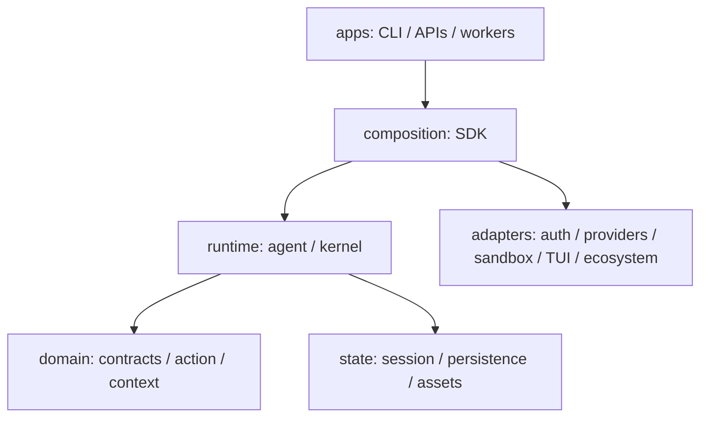

# FocusCode v0.4 架构：会话 Agent 与审计 Kernel

FocusCode 当前保留两条明确的组合路径，共享安全原则和部分 primitive。v0.4 已把企业 allowlist、
物理 Sandbox、扩展策略和 HMAC audit 接入会话主路径。Kernel 内环已闭环（Grant 落链、
GrantIssued/ActionStarted）；会话路径默认走单一 Policy → Grant → Receipt spine
（`agent.effectSpine` 默认 true；显式 `false` 保留 legacy 直执逃生门）。规则语义单源于
`action-domain` 的 PolicyEngine（ApprovalMode 矩阵 + shell/路径规则），`PermissionController`
降级为本地 adapter，不再自持规则表。正式企业版仍应共享唯一的 typed-intent 和 effect broker，
同时允许低风险交互选择更轻的验证策略。

## 1. 两条执行路径

| 路径                        | 入口                                         | 优化目标                                 | 核心状态                                               |
| --------------------------- | -------------------------------------------- | ---------------------------------------- | ------------------------------------------------------ |
| Conversational Coding Agent | TUI / interactive / print / JSON / RPC / SDK | 低延迟、多轮探索、编辑与即时 steering    | Session tree、Context、Tool loop、Permission           |
| Audited Focus Kernel        | `focuscode run` / `createLocalHarness()`     | 可重放、Decision/Effect 分离、验证后完成 | TaskSpec、Checkpoint、Intent、Grant、Receipt、Verifier |

会话 Agent 在 `packages/agent-runtime`；审计 Kernel 在 `packages/harness-core`。两者都通过受控工具、
权限和明确完成条件工作，但当前不会把同一次调用同时写入两套状态机。

## 2. 分层

- `contracts` 无运行时 Provider、文件、Shell 或 UI 依赖；
- `harness-core` 不访问 fs、child_process、fetch 或具体 adapter；
- `agent-runtime` 不依赖 auth、sandbox、TUI、ecosystem 或 apps；
- auth/ecosystem/sandbox/TUI 是叶子 adapter，互不依赖 FocusCode core；
- CLI/SDK 是唯一允许组合这些模块的地方；
- `scripts/check-boundaries.mjs` 在 CI 强制上述方向。

## 3. Conversational Agent

核心对象：

- `CodingAgent`：单主循环、child model controller、SteeringQueue；
- `ModelClient`：四种原生协议的统一端口；
- `FallbackModelClient`：装饰器，主模型失败（429/5xx/熔断）时按 `fallbackModels`
  链自动切换，`onFallback` 回调上报告警，不丢失在飞请求；
- `AgentToolRegistry`：内置和扩展工具注册；
- `McpStdioClient` + `registerMcpServers`：MCP server 在 `CodingAgent.create`
  之前注册工具，pin 校验（`McpToolPinV1` = serverId + serverVersion + toolName
  - schemaDigest + transportDigest）fail-closed，任何 schema/transport 漂移或缺失
    tool 抛错并使 CLI 非零退出；
- `PermissionController`：本地 permission adapter，规则语义委托 action-domain PolicyEngine；
- `SessionStore`：append-only tree、fork、compaction、runtime validation；
- `ConversationContext`：active branch 和 token budget；
- `ExtensionHost`：可信进程内扩展；
- `ShellExecutor`：Host/Docker/gVisor/VM/Seatbelt 可替换端口；
- `LspClient` + `createLspDiagnosticProvider`：JSON-RPC 2.0 over stdio（Content-Length
  framing）的真实 LSP 客户端，适配进 `DiagnosticProvider` 接口，`FOCUSCODE_LSP=1`
  开启后替代 spawn-based provider，连接失败 fail-quiet 回退；
- Skills：`loadSkills`（inline manifest）+ `loadSkillsFromDirectory`（递归扫描
  `SKILL.md`，YAML frontmatter + body prompt，跳过 `node_modules`/`.git`），
  `selectSkills`（keyword 触发）+ `selectSkillsForTools`（`trigger.toolNames` 触发，
  去重），`buildSkillPrompt` 组装注入。

更完整的数据流、接口和约束见 [V0.3_CAPABILITY_ARCHITECTURE.md](V0.3_CAPABILITY_ARCHITECTURE.md)。

## 4. Audited Kernel

Kernel 仍遵循：

1. Model 只产生 `ModelDecisionV1`；
2. Policy 将 Action Intent 转为短期 Capability Grant；
3. Action Runtime 执行并产生 Effect Receipt；
4. Ledger 从 Receipt 汇总 changed files/risk；
5. Verifier 在 baseline/target 证据充分时允许 `REVIEW_READY`；
6. Checkpoint 和 Domain Events 支持任务恢复。

文件层持久化已硬化：Fact/Checkpoint/Audit 的 append 全部 fsync，checkpoint 走
tmp → fsync → rename → 目录 fsync，事件加载逐条重验 digest（篡改 fail-closed），torn tail
仅容忍最后一行，stale 锁带 pid+时间戳并在 TTL 后可被抢占。崩溃恢复语义明确到窗口：窗口 B
（checkpoint 新于 events）从 events 重建而不再 wedge，窗口 C（`ActionStarted` 已落盘但无
Receipt）落 `EffectUnknown` 事件并等待 reconciliation，不再自动重执行。这条路径的长期目标
仍是 durable outbox、unknown-effect reconciliation 和多 Worker fencing——文件层硬化不等于
数据库事务，不应作为跨主机 exactly-once 保证。

## 5. 组合根

CLI：

- 解析用户配置与显式 override；
- 从加密凭据库提供 access token callback；
- 创建 SandboxExecutor 并注入 Bash Tool；
- 加载通过签名策略的 npm Extension；
- 选择 TUI/interactive/print/JSON/RPC；
- 将图片和 session share 转换为 runtime 类型。

SDK 执行同样的 Sandbox 与 Extension 组合，同时允许企业注入自己的 `ShellExecutor`、
`accessTokenProvider`、approval callback 和 event sink。

## 6. 数据所有权

用户侧资产：Session JSONL、Compaction、OAuth account metadata/token、Extension lock、share
identity、项目指令和 Harness 配置。Provider 只收到当前请求所需上下文；Tool 子进程不收到
Provider Token。替换 Provider 不迁移或重置用户资产。

## 7. 运行时边界

- Bash 可进入物理 Sandbox；文件 primitive 在 Harness 进程但受 workspace/permission 控制；
- Provider/OAuth/Session/Extension Host 不在 Bash 容器；
- Extension 目前是可信进程内代码；
- 分享服务只存验签后的不可变 blob，不成为 Session 执行者；
- MCP server 在 CLI 主进程通过 stdio 通信，工具注册发生在 `CodingAgent.create`
  之前；pin 校验 fail-closed，server 子进程不接触 Provider token；
- Sandbox backend 链：`auto` = gVisor → Docker → seatbelt（仅 darwin，fail-quiet
  于非 darwin）→ Host（仅 `allowHostFallback` 时）→ fail。`seatbelt` 使用 macOS
  `sandbox-exec` 与 seatbelt profile language（`(deny default)` 基线 + 显式 allow
  系统二进制与 workspace 写），无需 Docker 即可获得 OS-level containment；
- A2A/ACP 仍以 contract/boundary 为主，不在 v0.4 冒充完整认证网络实现。

## 8. 正式版收敛目标

1. `CodingAgent` 和 `FocusKernel` 共享 Policy → Grant → Started → Receipt 主链（已落地：会话
   路径默认走 EffectPort spine，规则语义单源于 action-domain PolicyEngine；spine 下工具调用
   按模型顺序串行执行，并行只读优化属 legacy 逃生门）；
2. Provider adapter 只负责方言，所有 continuation state 进入 portable Session envelope；
3. Extension 与 A2A workload 通过 capability broker，不在 CLI 主进程获得 Node 全权限；
4. audit journal 记录不可抵赖的副作用元数据，Session 保存用户工作内容，两者不重复存储；
5. crash 后对未知 effect 做 reconciliation，再决定重试、补偿或人工接管。
