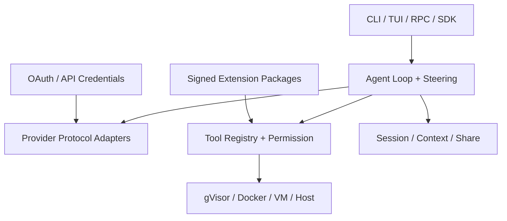

# FocusCode v0.3 Harness 能力与架构

版本：`0.3.0-alpha.1`  
日期：2026-07-19

## 1. 设计结论

FocusCode 的产品核心是模型之上的用户侧执行层，而不是某个模型 SDK 的封装。v0.3 将一次
Coding 任务拆成可替换的六个平面：交互、模型、编排、能力、执行和资产。模型权重可以替换；
会话、上下文压缩、权限决策、工具结果、扩展配置和分享身份由用户持有。

依赖方向是单向的：核心循环不知道 OAuth 如何登录、TUI 如何渲染、Docker 如何启动，也不
知道 npm 如何安装扩展。CLI 与 SDK 是组合根。这使同一 Agent Loop 可以在不同模型、终端、
凭据系统和执行环境中复用。

## 2. 一次任务的完整路径

1. CLI/TUI/RPC/SDK 将文字和图片规范化为 `AgentPromptInput`。
2. `SessionStore` 运行时校验消息和图片，追加到 JSONL 会话树。
3. `ConversationContext` 从 active branch 编译上下文；超过预算时生成可审阅摘要。
4. `ModelClient` 通过所选原生协议发送系统指令、历史、图片和工具 Schema。
5. 模型流式输出文本、reasoning 摘要和 Tool Call；Tool 参数完整解析后才可执行。
6. `PermissionController` 根据工具 effect、路径、命令风险、保护路径和审批模式授权。
7. Bash 交给 `SandboxExecutor`；文件工具继续受 workspace/realpath/symlink 边界控制。
8. Tool Result 追加到会话并回送模型，直到完成、预算耗尽、用户 abort 或发生错误。
9. 运行中的新输入进入 `SteeringQueue`：append 等待安全边界，interrupt 只取消当前模型请求。
10. 会话可 fork、压缩、导出 HTML、签名分享或迁移到另一个 Provider。

## 3. 稳定接口

| 接口                      | 生产者                   | 消费者            | 不变量                                                               |
| ------------------------- | ------------------------ | ----------------- | -------------------------------------------------------------------- |
| `ModelClient.complete()`  | Provider adapter         | `CodingAgent`     | 返回统一 text/reasoning/toolCalls/usage/stopReason；支持 AbortSignal |
| `AgentTool`               | 内置工具/扩展            | Tool Registry     | 完整 JSON 参数后执行；声明 effect；返回结构化错误而非抛出进程        |
| `ShellExecutor.execute()` | Sandbox package/用户 SDK | Bash tool         | cwd 必须在 workspace；timeout/abort/输出上限；报告 backend           |
| `SessionStore`            | Agent Loop               | Context/UI/share  | append-only event；active leaf 明确；消息和图片运行时校验            |
| `AgentEvent`              | Agent Loop               | TUI/JSON/RPC/扩展 | 流式文本、工具、审批、usage、steering 和结束事件统一                 |
| `AgentExtensionApi`       | Extension Host           | npm/本地扩展      | 注册 tool/command/event/prompt；Tool 仍过 Permission Controller      |
| `SessionShareBundle`      | Ecosystem                | CLI/share server  | canonical JSON + Ed25519；导入和下载都验签                           |

这些接口使用结构类型和小型数据对象，不把某家 Provider 的 event、Docker 参数或 TUI widget
泄漏到核心循环。

## 4. Provider 可移植性

原生协议不是一个巨型 `if provider`：四个 adapter 都实现同一 `ModelClient`，Provider
Profile 负责 endpoint、认证、上下文和 Tool Mode。

| 协议               | 流式文本 | reasoning                  | 原生工具                       | 图片                | 认证                              |
| ------------------ | -------- | -------------------------- | ------------------------------ | ------------------- | --------------------------------- |
| OpenAI Responses   | SSE/JSON | summary/text delta         | function item + argument delta | `input_image`       | API Key / Bearer / OAuth callback |
| OpenAI Chat        | SSE/JSON | compatible reasoning delta | `tool_calls`                   | image URL/data URL  | API Key / Bearer                  |
| Anthropic Messages | SSE/JSON | thinking delta             | `tool_use` / `tool_result`     | base64/URL source   | x-api-key / Bearer                |
| Google Gemini      | SSE/JSON | thought part               | functionCall/functionResponse  | inlineData/fileData | x-goog-api-key / Bearer           |

OpenAI-compatible 开源服务仍可选择 `native`、`prompt-json` 或 `auto`。因此弱 Tool Calling 模型
可以使用严格 JSON fallback，强原生模型不会被迫降级到文本解析。配置支持 Ollama、llama.cpp、
vLLM、LM Studio、SGLang、DeepSeek、Qwen、Moonshot、Groq、Mistral、xAI、Together、
OpenRouter 和自定义 endpoint。

## 5. Steering 并发模型

`CodingAgent.submit()` 同一时刻只允许一个主任务，避免两个写循环争用同一 Worktree；
`steer()` 是唯一可并发进入的控制路径。

- append：有界 FIFO，当前 generation/tool 边界结束后以新的 user message 顺序加入；
- interrupt：入队后取消当前 model child controller，不取消整个 turn；
- abort：取消父 controller，终止整个 turn；
- Tool 执行不会被 append steering 抢占，避免半个 effect；interrupt 也只定义为 generation 中断；
- 队列收据记录接收时的 size，避免快速消费导致 UI 误报零；
- Provider 若返回 `aborted` 或直接抛 AbortError，循环都会恢复并应用 steering。

这比“每条新输入启动一个 Agent”更简单，也消除了同一 Worktree 并发写的主要竞态。

## 6. 隔离模型

默认 `auto` 探测顺序是 gVisor → Docker → fail。只有配置 `allowHostFallback: true` 才会回退
Host。Docker/gVisor 命令固定包含：

- read-only rootfs、writable tmpfs；
- 默认 `--network none`；
- `--cap-drop ALL`、`no-new-privileges` 和 Docker 默认 seccomp；
- PID、内存、CPU 限制；
- Linux 上映射当前非 root UID/GID；
- workspace 单独 bind mount；
- `--init`、唯一容器名、timeout/abort 后强制 `docker rm --force`。

VM driver 使用 BatchMode、严格 Host Key、空环境、远端绝对 workspace 和远端 `timeout` 进程组。
它适配预置 Firecracker、QEMU、云 VM 或其他 SSH 可达的可丢弃实例，不负责创建虚拟机。

## 7. 资产与生态

- 会话：append-only JSONL、branch/fork、compaction、usage、图片、模型 metadata；
- OAuth：加密凭据库与多 account，不写入项目配置和 Session；
- 扩展：npm package manifest、exact dependency、忽略 install scripts、signature audit、integrity、
  FocusCode lock 和权限声明；
- 分享：默认删除工具输出、图片和常见 secret；Ed25519 自签身份；导入重定位 workspace 并生成
  新 session id；参考服务器只保存验签后的不可变 bundle；
- npm：CLI bundle 包含运行期内部模块，安装方不依赖 workspace package。

## 8. 明确的非目标与剩余风险

v0.3 完成本阶段七项能力的 Alpha 实现，但不把以下事项伪装成已完成：

- 当前测试机未安装 Docker、runsc、Firecracker 或 QEMU，所以真实物理运行时没有在本机执行；
  驱动、选择逻辑、超时清理和参数安全由自动化测试覆盖；
- Extension 在 Node 进程内运行。npm 签名、integrity 和权限声明降低供应链风险，但不是 capability
  sandbox；只加载可信扩展；
- JSONL Session 没有数据库事务、WAL、lease、worker fencing 或 unknown-effect reconciliation；
- SSH VM driver 不创建、回收或证明 VM 镜像；生产调度器需负责生命周期和 attestation；
- 分享签名证明完整性和持有私钥，不等价于组织身份、信任或内容安全；
- 没有完成真实 Repo、多模型、同预算的 Pi 对照基准，因此不能宣称胜率更高；
- Bedrock/Vertex/Azure 的云控制面认证与 catalog 尚未作为独立原生 adapter 实现，可通过兼容
  endpoint 或后续插件接入。

## 9. 下一阶段工程 Gate

1. 在 CI 增加 Docker 与 runsc adversarial job：网络、secret、daemon、fork bomb、symlink、OOM；
2. 加入 VM provisioner/lease/attestation 与销毁回收；
3. 将 Extension Host 移到独立进程或 WASI/capability sandbox；
4. 为会话和 effect 增加 WAL、checksum、migration、repair 和 unknown-effect reconciliation；
5. 建立固定模型 revision 的 Provider recordings 与 10–30 个真实 Repo 同模型 A/B；
6. 发布各 Provider 能力证书，而不是仅按营销名称选择模型。
