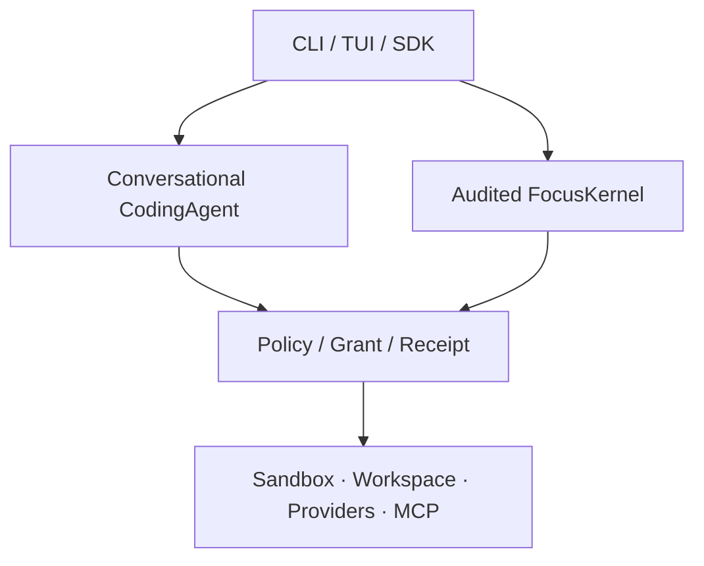

# FocusCode v0.5.0 深度代码与设计审查报告

> 审查对象：[`tohnee/focuscode`](https://github.com/tohnee/focuscode)  
> 固定快照：[`a0759cda328250af159de19b1cbf4eaacbcae972`](https://github.com/tohnee/focuscode/commit/a0759cda328250af159de19b1cbf4eaacbcae972)  
> 审查日期：2026-07-28（America/Los_Angeles）  
> 审查性质：只读、独立代码审查；未修改仓库

## 1. 执行摘要

### 最终判断

FocusCode 不是“空壳项目”。它有清晰的 TypeScript monorepo 分层、严格编译选项、规模可观的自动化测试，以及几个确实有价值的设计：WorkspaceGuard 的 realpath 边界、默认隔离沙箱的 fail-closed 选择、凭据文件的 AEAD 加密、Action/Grant/Receipt 合约、崩溃后不盲目重放未知副作用的 Kernel 语义。

但当前 `main` **不应按“企业级安全执行框架”或可发布的 v0.5.0 GA 使用**。核心原因不是功能还少，而是多个已经对外宣称完成的边界在默认路径上并不成立：

1. `execpolicy` 在默认 effect spine 下不生效；关闭 spine 后，allow 前缀规则又能绕过 critical command hard deny。
2. MCP pin 没有校验 `serverVersion`，也没有覆盖决定权限等级的 annotations，导致“pin 通过”不等于权限语义没有漂移。
3. FactStore/SessionStore 的 torn-tail 恢复只忽略残行、却不截断；下一次 append 会返回成功，但新事件不可读取，直接破坏审计链。
4. `web_fetch` 在宿主 Node 进程执行，允许 localhost、私网/云元数据地址和跟随重定向，构成 SSRF 边界缺口。
5. Provider fallback 没有把请求模型改为备用 profile 的模型，且被丢弃尝试的流式输出仍会泄漏到消费者。
6. 当前 release gate 因旧版本号硬编码确定性失败，而仓库内测试报告仍写着 `release:check` 全部通过。

**定位建议：**把当前版本视为“工程质量较好的预生产 Beta / 安全架构原型”，而不是企业生产基线。综合成熟度约 **5.8/10**；在 P0 清零、真实 Provider/沙箱矩阵跑通、持久化恢复语义修正前，不建议开放无人值守 `full-auto`、外部 MCP、Host 网络工具或多进程共享任务。

### 风险分布

| 级别 | 数量 | 含义                                           |
| ---- | ---: | ---------------------------------------------- |
| P0   |    4 | 安全/审计/发布阻断，应在下一个可分发版本前修复 |
| P1   |   12 | 高概率造成错误行为、不可恢复状态或企业策略失真 |
| P2   |    7 | 设计债、验证盲区或文档/产品完整性问题          |

### 维度评分

| 维度         |   评分 | 判断                                                                                 |
| ------------ | -----: | ------------------------------------------------------------------------------------ |
| 架构分层     | 7.5/10 | 合约和包边界清楚，但存在双执行路径和字符串式边界检查                                 |
| 代码可维护性 | 7.0/10 | TS 严格度高、命名较清楚；部分私有字段注入和重复适配破坏封装                          |
| 安全边界     | 4.0/10 | 默认 fail-closed 意图正确，但 policy、MCP pin、SSRF 和 Seatbelt 有关键缺口           |
| 可靠性/恢复  | 4.5/10 | 有 fsync、digest、CAS；torn-tail、锁租约、fallback 和共享 AbortController 使承诺失真 |
| 自动化测试   | 7.5/10 | 1,617 项通过、覆盖率可用；真实 Provider/隔离环境和关键反例缺失                       |
| 文档可信度   | 4.0/10 | 文档丰富，但版本、门禁结果和能力声明互相矛盾                                         |
| 发布成熟度   | 3.5/10 | 当前 npm clean-install 验证失败，状态文档仍声称通过                                  |

## 2. 范围、方法与限制

### 审查范围

- 544 个 tracked files。
- 22 个 workspace package/app；17 个 packages、5 个 apps。
- 生产 `src/*.ts` 约 38,969 行；全部 TypeScript（含测试）约 68,485 行。
- `docs/` 下约 96 个文件，包含架构、API、状态、测试、企业部署、竞品对照和历史 review。
- 深读模块：
  - `agent-runtime`：agent loop、Provider、fallback、circuit breaker、权限、session、checkpoint、MCP、SpecEngine、扩展、web tools。
  - `sdk`：组合入口、effect spine、hooks、AsyncIterable、local harness。
  - `action-domain` / `action-backends`：PolicyEngine、shell policy、LocalActionRuntime、WorkspaceGuard。
  - `sandbox`：Docker/gVisor/Seatbelt/SSH-VM、进程运行器、自动选择。
  - `harness-core` / `persistence`：Kernel 状态机、event log、checkpoint、崩溃恢复。
  - `auth` / `ecosystem` / TUI / CLI / control-api / share-server。

### 执行验证

| 命令/检查                        | 结果                                                               |
| -------------------------------- | ------------------------------------------------------------------ |
| `pnpm install --frozen-lockfile` | 通过                                                               |
| `pnpm verify`                    | 通过                                                               |
| 测试                             | 141 files passed、2 skipped；1,617 tests passed、14 skipped        |
| 覆盖率                           | Statements 78.95%、Branches 69.66%、Functions 85.03%、Lines 82.04% |
| `pnpm demo`                      | 通过（审计型 Kernel 的确定性脚本 demo）                            |
| `pnpm agent:demo`                | 通过，但明确使用 Host executor，不证明隔离                         |
| `pnpm npm:verify`                | **失败**：期望 `0.4.0-beta.2`，实际 CLI 为 `0.5.0`                 |
| GitHub 当前 open issues          | 0                                                                  |

本地运行时为 Node 24.14.0；仓库 CI 固定 Node 22.20.0。版本号硬编码导致的 npm 验证失败与 Node 版本无关。

### 未覆盖的外部验证

- 未使用真实 Provider 凭据；11 个 live Provider tests 默认跳过。
- 当前为 Linux 环境，未运行 macOS `sandbox-exec` 的两项真实集成测试和系统剪贴板测试。
- 当前环境未证明真实 Docker/gVisor/VM 的攻击性隔离矩阵。
- 未做生产流量、长时间 soak、多机共享存储、故障注入或灾备演练。

因此，本报告对“代码可证明的正确性/错误”结论置信度高；对真实 Provider 方言、真实隔离兼容性和 HA 吞吐不作通过判断。

## 3. 架构审查

### 当前真实结构



设计试图让两条路径共享 Action/Policy 合约，但实际只共享了一部分：

- Conversational path 默认通过 SDK 现场组装的 `LocalActionRuntime`。
- Kernel path 通过持久化 FactPort、Started/Observed 事件和恢复逻辑运行。
- legacy conversational path 仍有独立 `PermissionController`。
- `execpolicy` 只接入 legacy controller，没有接入默认 spine。
- 默认 session spine 没有 ReceiptJournal，无法继承 Kernel 的跨进程恢复语义。

所以“单一 Policy → Grant → Receipt spine”在类型形状上接近成立，在**配置传播、持久性和恢复语义**上尚未成立。双路径本身不是错误，但项目文档把“共享合约”表述成“行为/耐久性已统一”，放大了实际风险。

### 做得好的部分

1. **类型与工程基线扎实。** `strict`、`noUncheckedIndexedAccess`、`exactOptionalPropertyTypes` 和 ESM 约束减少了大量常见错误；包划分也比单体 agent loop 更容易审查。
2. **WorkspaceGuard 设计正确。** 普通文件工具在既有路径和缺失路径的父目录上都做 realpath containment，能拒绝指向 workspace 外部的 symlink。
3. **默认沙箱选择意图正确。** `auto` 不会静默降级到 Host；企业模式还拒绝非 Docker/gVisor/VM executor。
4. **凭据文件实现值得保留。** `EncryptedCredentialStore` 使用 AES-256-GCM、0600、独占创建密钥和临时文件 rename；`list()` 不返回 token。
5. **Kernel 对未知副作用的态度正确。** `ActionStarted` 先于 dispatch，恢复时把无 receipt 的动作标为 UNKNOWN，而不是假设没执行并盲目重放。
6. **事件存储有正确的基础积木。** append 后 fsync、checkpoint 临时文件 + rename + 目录 sync、乐观版本和逐事件 digest 都是正确方向。
7. **分享服务的默认启动姿态较谨慎。** 默认 loopback、默认要求 token、常量时间比较、体积限制、签名和可选 signer allowlist 都是合理的 Beta 基线。

## 4. P0：发布前必须修复

### P0-1：命令策略出现 split-brain，默认路径忽略 execpolicy，legacy 路径可绕过 hard deny

**证据**

- CLI 将 `prefixRules` 只放入 `CodingAgent.permission`；默认 `agent.effectSpine=true` 时，工具调用走 `effectPort`，不再经过该 controller。
- [`createSessionEffectSpine()`](https://github.com/tohnee/focuscode/blob/a0759cda328250af159de19b1cbf4eaacbcae972/packages/sdk/src/effect-spine.ts#L180-L192) 的 permission config 根本没有 `prefixRules`。
- legacy [`PermissionController.decide()`](https://github.com/tohnee/focuscode/blob/a0759cda328250af159de19b1cbf4eaacbcae972/packages/agent-runtime/src/permissions.ts#L116-L147) 又让 allow prefix 在 `PolicyEngine` 前直接返回 grant。
- 最小复现中，`mode:"deny"`、allow prefix `"rm"` 使 `rm -rf /` 得到：

```json
{ "allowed": true, "reason": "Prefix rule allowed: test" }
```

**影响**

- README 主打的 G8 execpolicy 在默认执行路径无效。
- 用户关闭 effect spine 以使用规则时，allow 规则反而能覆盖 critical shell hard deny。
- “Approval/规则不能覆盖组织 hard deny”的安全声明不成立。

**修复**

1. 把 PrefixRuleEngine 移入 `action-domain` 的 PolicyEngine，作为**附加约束**而不是提前 grant。
2. 顺序固定为：参数/schema → 绝对 hard deny（critical/protected/capability）→ prefix deny → prefix allow → approval matrix。
3. 将规则集 digest 纳入 `policySnapshot` 和 receipt。
4. 删除 legacy 与 spine 的独立配置传播；建立同一组 differential/property tests。
5. 加入回归例：allow `rm`、allow `git`、混合 shell、受保护路径、默认 spine on/off 必须同判。

### P0-2：MCP pin 可在版本和权限语义漂移后继续通过

**证据**

- [`McpToolPinV1`](https://github.com/tohnee/focuscode/blob/a0759cda328250af159de19b1cbf4eaacbcae972/packages/agent-runtime/src/mcp.ts#L611-L618) 生成 `serverVersion`、`schemaDigest`、`transportDigest`。
- [`verifyPins()`](https://github.com/tohnee/focuscode/blob/a0759cda328250af159de19b1cbf4eaacbcae972/packages/agent-runtime/src/mcp.ts#L621-L639) 只比较 schema 和 transport，完全不比较 `serverVersion`。
- schema digest 只覆盖 `inputSchema`；不覆盖 `annotations`、description、输出 schema或能力。
- [`effectOf()`](https://github.com/tohnee/focuscode/blob/a0759cda328250af159de19b1cbf4eaacbcae972/packages/agent-runtime/src/mcp.ts#L750-L755) 却信任 server-provided `readOnlyHint` 来决定工具是否被自动视为只读。
- 最小复现：expected server `1.0.0`、observed server `9.0.0`，同时把 `readOnlyHint` 从 false 改为 true，`verifyPins()` 仍通过。

**影响**

一个升级或被攻陷的 MCP server 可以保持同一输入 schema/URL、改变行为和权限 annotation，在 pin “fail-closed”通过后获得更宽松的自动授权。HTTP headers、stdio env 和未声明的新增工具也不在当前 pin 的完整性边界内。

**修复**

1. 比较所有 pin 字段，至少强制 `serverVersion` 相等。
2. 新建 canonical tool contract digest，覆盖 name、input/output schema、annotations、effect/risk、server identity。
3. 企业模式采用 exact allowlist：只注册被 pin 的工具，额外工具默认拒绝。
4. 不允许远端 annotation 单方面降低权限；本地 policy 配置应是上限，未知 MCP 工具至少按 network/write 审批。
5. 给 HTTP transport pin 增加不泄密的 auth/config identity digest。

### P0-3：torn-tail 恢复会“成功确认”一个实际不可读取的新事件

**证据**

- [`FileFactStore.loadEvents()`](https://github.com/tohnee/focuscode/blob/a0759cda328250af159de19b1cbf4eaacbcae972/packages/persistence/src/file-fact-store.ts#L178-L208) 发现最后一行 JSON 损坏时只跳过，不截断文件。
- 下一次 [`append()`](https://github.com/tohnee/focuscode/blob/a0759cda328250af159de19b1cbf4eaacbcae972/packages/persistence/src/file-fact-store.ts#L144-L175) 直接在残行后追加 JSON。
- 本地复现结果：

```json
{ "ackLastSeq": 2, "loadedSeqs": [1] }
```

底层第二行实际变成：

```text
{"schemaVersion":"domain-ev{"schemaVersion":"domain-event.v1", ... "seq":2 ...}
```

- SessionStore 在 [`readEvents()` / `write()`](https://github.com/tohnee/focuscode/blob/a0759cda328250af159de19b1cbf4eaacbcae972/packages/agent-runtime/src/session-store.ts#L337-L389) 使用同一模式，因此有同类问题。

**影响**

- append 返回的“已提交、已 fsync”事件之后无法读取。
- 再次 append 会把原坏行变成非尾部坏行，随后整个日志 fail-closed。
- Kernel 的事件版本、checkpoint 和 receipt 可能永久分叉；“torn-tail 容忍”和“durable audit”声明不成立。

**修复**

1. 在持锁状态下扫描最后一个有效换行边界，对 torn tail 执行 `truncate(validOffset)` + fsync 后再 append。
2. 或改为长度前缀/CRC framing、SQLite/PostgreSQL WAL。
3. append 后至少重读并验证最后一条 seq/digest，再返回 ack。
4. SessionStore 同步修复，加入 crash-point tests：写一半 → reopen → append → reopen → 再 append。
5. 增加修复工具，不能只在 list 时跳过损坏 session。

### P0-4：`web_fetch` 是宿主侧 SSRF 通道，绕过 shell 沙箱网络策略

**证据**

- [`parseFetchUrl()`](https://github.com/tohnee/focuscode/blob/a0759cda328250af159de19b1cbf4eaacbcae972/packages/agent-runtime/src/web-tools.ts#L176-L190) 只检查 http/https 和 URL 内嵌凭据。
- [`fetchWithTimeout()`](https://github.com/tohnee/focuscode/blob/a0759cda328250af159de19b1cbf4eaacbcae972/packages/agent-runtime/src/web-tools.ts#L239-L262) 在宿主进程使用 `fetch(..., redirect:"follow")`，不解析/过滤 DNS 和重定向目标。
- 它不是在 Docker/gVisor/VM 内执行，因此 `sandbox.network:"none"` 不约束它。
- 本地复现成功读取 `http://127.0.0.1:<port>/internal`：

```json
{ "isError": false, "content": "LOCAL_SECRET_PROBE", "status": 200 }
```

**影响**

在 `full-auto` 下 network effect 会直接 grant。模型可探测 localhost 服务、RFC1918 网络、link-local/云元数据端点；公开 URL 的 30x 也可把请求导向私网。返回内容会进入模型上下文，构成数据泄露链。

**修复**

1. 默认拒绝 loopback、link-local、RFC1918、ULA、multicast、Unix socket 等目标。
2. 自行处理 redirect，每一跳重新做 scheme、DNS 和解析后 IP 检查；处理 DNS rebinding。
3. 更优方案：把网络工具放进受控 egress proxy/沙箱，策略由同一 EffectPort 执行。
4. 企业模式使用域名 allowlist、端口限制、请求/响应审计和凭据隔离。
5. 加入 IPv4、IPv6、十进制/八进制 IP、CNAME、redirect 和 metadata endpoint 测试。

## 5. P1：高优先级可靠性与设计缺陷

### P1-1：Provider fallback 没有真正切换模型，流式失败尝试也未隔离

[`FallbackModelClient.complete()`](https://github.com/tohnee/focuscode/blob/a0759cda328250af159de19b1cbf4eaacbcae972/packages/agent-runtime/src/fallback-model-client.ts#L57-L96) 把同一个 `ModelRequest` 原样传给所有 client。Agent 请求中的 `model` 永远来自 primary profile。最小复现：

```json
[
  ["primary", "gpt-primary"],
  ["fallback", "gpt-primary"]
]
```

这意味着 Anthropic/OpenRouter/DeepSeek fallback 收到的仍可能是 primary 模型名。与此同时，代码直接把 `onEvent` 传给每个尝试，和注释“discarded attempts are suppressed”相反；失败主模型的 partial delta 已经发给 UI 后无法撤回。最终 session model、价格计算和使用量也仍标记 primary。CLI 至少创建了 fallback client chain；SDK `createCodingAgent()` 则直接调用 `createModelClient(config.model)`，完全没有使用已解析的 `config.fallbackModels`。

**建议：**fallback chain 元素应绑定完整 `ModelProfile + ModelClient`，每次重写 model/request dialect；尝试期间缓冲事件，确认成功后再发布；结果携带 actual provider/model、各尝试 usage/latency/error 和成本。

### P1-2：SDK `preToolUse` 每次执行两次，第二次 veto 无效

- SDK 把 hook 通过强制类型转换塞进 `ExtensionHost` 的私有 `beforeToolHooks` 数组：[`coding-agent.ts#L151-L174`](https://github.com/tohnee/focuscode/blob/a0759cda328250af159de19b1cbf4eaacbcae972/packages/sdk/src/coding-agent.ts#L151-L174)。
- 同一个 hook 又由 [`tool_start → preToolUse`](https://github.com/tohnee/focuscode/blob/a0759cda328250af159de19b1cbf4eaacbcae972/packages/sdk/src/hooks.ts#L203-L228) 分发。

第一次在执行前可 veto；第二次发生在 `tool_start` 事件后，返回值被忽略。副作用型 hook、审批、计费、遥测会重复，第二次“拒绝”没有意义。

**建议：**给 `ExtensionHostLike` 增加公开 `registerBeforeToolHook()`；`preToolUse` 只走 veto 管线，事件路由不再调用它。

### P1-3：SDK 流式 API 会在可恢复 error 上提前结束，并且队列无上限

`streamSubmit()` / `runCodingAgent()`：

- 任何 `event.type === "error"` 都终止 generator。
- Agent 会发出可恢复 error 后继续下一轮，例如输出截断时拒绝半成品 tool call。
- 因而消费者可能在最终 `agent_end` 前退出，`result` 仍在后台运行。
- 内部 `AgentEvent[]` 无上限、无 backpressure；不消费或慢消费会无限增长。
- 临时替换全局 event sink，也不支持同一 agent 上并发 streamSubmit。

**建议：**只以 `agent_end` 或 submit settle 作为终态；区分 warning/recoverable/fatal；使用 bounded async channel，定义 overflow/backpressure；用订阅模型替代全局 sink 替换。

### P1-4：MCP HTTP 一次超时会永久污染客户端

[`McpHttpClient`](https://github.com/tohnee/focuscode/blob/a0759cda328250af159de19b1cbf4eaacbcae972/packages/agent-runtime/src/mcp.ts#L407-L590) 为整个 client 只创建一个 AbortController。任一 request timer 调用 `abort()` 后：

- 所有并发请求一起取消；
- controller 永久 aborted，后续请求立即失败；
- `notifications/initialized` 被标注 best-effort并吞掉错误，但它超时后 `connect()` 仍可成功返回一个已坏客户端。

本地复现得到 `connected:true`，随后 `tools/list` 立即报 timeout。

**建议：**每个请求独立 controller，并组合 client-close signal；notification 用真正无 id 的 JSON-RPC 请求；超时不应把整个连接状态标记为成功。

### P1-5：SDK 忽略 `extensions.host:"process"`

CLI 会根据 config 选择 `ProcessExtensionHost`，但 SDK 的 [`createCodingAgent()`](https://github.com/tohnee/focuscode/blob/a0759cda328250af159de19b1cbf4eaacbcae972/packages/sdk/src/coding-agent.ts#L107-L150) 永远 `new ExtensionHost(registry)`，返回类型也固定为 `ExtensionHost`。

同一份项目配置从 CLI 和 SDK 启动会得到不同的扩展隔离/崩溃行为，和“组合入口一致”目标冲突。企业嵌入式场景尤其容易误判。

**建议：**SDK 与 CLI 共用 composition factory，返回 `ExtensionHostLike`；显式暴露 process host 的 lifecycle/dispose。

### P1-6：默认 effect spine 的 Receipt/Ledger 仅在内存中

[`createSessionEffectSpine()`](https://github.com/tohnee/focuscode/blob/a0759cda328250af159de19b1cbf4eaacbcae972/packages/sdk/src/effect-spine.ts#L79-L113) 创建 `LocalActionRuntime` 时没有注入 ReceiptJournal。`LocalActionRuntime` 自己也明确只有在可选 journal 存在时才跨重启持久。

默认会话路径每次使用 fresh actionId，没有跨重启 dedupe；receipt metadata 可进入当次事件/audit，但不构成 crash-safe effect log。“Policy → Grant → Receipt”应被描述为**进程内策略与可观测性 spine**，不是 durable audited execution。

**建议：**在文档中立即降级承诺；中期接入 started/receipt outbox、fencing 和 UNKNOWN reconciliation，或让 conversational path 直接使用 Kernel 的持久化协议。

### P1-7：Checkpoint 不使用 realpath guard，restore 存在 symlink/TOCTOU 越界

[`CheckpointStore.capture()`](https://github.com/tohnee/focuscode/blob/a0759cda328250af159de19b1cbf4eaacbcae972/packages/agent-runtime/src/checkpoints.ts#L43-L80) 使用词法路径检查后 `stat/copyFile`，会跟随 workspace 内指向外部的 symlink。[`restoreLatest()`](https://github.com/tohnee/focuscode/blob/a0759cda328250af159de19b1cbf4eaacbcae972/packages/agent-runtime/src/checkpoints.ts#L106-L123) 信任 manifest path 并再次 copy/remove，未重做 WorkspaceGuard/realpath 校验。

而 checkpoint 在 permission 判断前捕获。工具本身可能正确拒绝 symlink，但 checkpoint 已经跨过边界；restore 前 symlink 被替换时还可能写到新的 workspace 外目标。

**建议：**capture/restore 都使用同一 WorkspaceGuard；拒绝 symlink 或保存 inode/realpath 并在 restore 复验；manifest 做完整 schema、路径、seq 和 digest 验证；restore 操作本身也应过 policy/审计。

### P1-8：30 秒“锁租约”没有 heartbeat，可抢占仍在执行的进程

SessionStore 和 FileFactStore 都把超过 30 秒的锁直接视为 stale：

- SessionStore 甚至在检查 PID 前先按年龄判死。
- FileFactStore 不检查 PID/hostname，只看 `acquiredAt`。
- `fork()` 会在持有 source session lock 时逐条复制并 fsync，完全可能超过 30 秒。
- 大 event log 每次 append 还要完整 load/校验，运行时间随文件增长。

**建议：**使用 OS advisory lock，或 token + heartbeat + ownership-checked delete；release 时确认 lock token 仍属于自己；长操作缩短临界区。多机文件系统不能依赖本地 PID。

### P1-9：Seatbelt profile 可被路径破坏，且使用 PATH 查找安全边界程序

[`SeatbeltSandbox`](https://github.com/tohnee/focuscode/blob/a0759cda328250af159de19b1cbf4eaacbcae972/packages/sandbox/src/seatbelt.ts#L42-L138)：

- 默认执行 `"sandbox-exec"` 而不是固定 `/usr/bin/sandbox-exec`，可受 PATH 影响。
- workspace、Node、shell 路径直接插入 SBPL 字符串，没有 quote/escape。
- profile 只放行有限系统目录，尚未证明常见 macOS toolchain 可正常运行。

另外 [`runHostProcess()`](https://github.com/tohnee/focuscode/blob/a0759cda328250af159de19b1cbf4eaacbcae972/packages/sandbox/src/process-runner.ts#L4-L58) 只 kill shell child，不建立/终止 process group，超时后孙进程或 daemon 可能残留。

**建议：**固定系统二进制、严格 SBPL 转义、真实 macOS 对抗测试；POSIX 下使用 detached process group 并 group kill，Windows 使用 Job Object。

### P1-10：当前 release gate 确定性失败

[`scripts/verify-npm-package.mjs#L32`](https://github.com/tohnee/focuscode/blob/a0759cda328250af159de19b1cbf4eaacbcae972/scripts/verify-npm-package.mjs#L30-L33) 仍硬编码 `0.4.0-beta.2`，而 root、CLI 和 package 都是 `0.5.0`。CI workflow 明确运行此脚本，因此当前源状态不能通过仓库定义的完整门禁。

**建议：**从被打包的 package.json 读取 expected version，只保留一个版本源；发布时再校验所有 workspace package/CLI 常量一致。

### P1-11：SpecEngine 在并发保护前调用模型

`CodingAgent.submit()` 先运行可选 SpecEngine 预处理，再检查 `this.running`。并发 submit 可以先发起 classifier/drafter/clarification 事件和费用，最后才抛“already processing”。

**建议：**在所有 I/O 和事件之前原子获取 run mutex；如果要支持排队则显式提供 queue API 和取消语义。

### P1-12：Circuit breaker/bulkhead 对取消和失败分类过于粗糙

[`CircuitBreakingModelClient`](https://github.com/tohnee/focuscode/blob/a0759cda328250af159de19b1cbf4eaacbcae972/packages/agent-runtime/src/circuit-breaker.ts#L75-L99) 在 gate 后等待 semaphore：

- semaphore queue 不接收 AbortSignal，排队请求无法及时取消。
- half-open probe 可在队列里长期占用“probeInFlight”。
- 除 caller-abort 外的所有 throw 都计为 Provider failure，包括 400、协议/解析 bug 和本地 hook 错误。
- CLI 为每个 client 默认创建独立 registry，注释所说“per-provider 共享 bulkhead”并未跨实例发生。

**建议：**按错误类别计数；semaphore 支持 signal/deadline；先取得 slot 再 gate probe；composition root 注入共享 registry。

## 6. P2：需要进入近期整改计划

| 编号 | 问题                                      | 影响与建议                                                                                                                                                                                                                                                                                |
| ---- | ----------------------------------------- | ----------------------------------------------------------------------------------------------------------------------------------------------------------------------------------------------------------------------------------------------------------------------------------------- |
| P2-1 | 文档版本和结论漂移                        | `AGENTS.md` 仍写 0.4.0-beta.2，`SECURITY.md` 写 beta1，多个部署/状态文档写 0.4；`TEST_REPORT.md` 声称 release gate 全部通过。建立版本化 docs index，历史文档加醒目 archive 标记，测试结果由 CI 自动生成。                                                                                 |
| P2-2 | 架构边界检查只是字符串扫描                | `check-boundaries.mjs` 对 forbidden substring 做 `includes()`，不是解析 import graph；可漏动态 import/alias，也可对注释误报。改用 TS compiler API、dependency-cruiser 或自建 AST graph。                                                                                                  |
| P2-3 | SDK 生产依赖 testkit                      | `@focuscode/sdk` 的 `local-harness.ts` 在生产导出中依赖 `ScriptedDecisionPort`，把测试基础设施带进 SDK 依赖面。把 scripted harness 独立为 `@focuscode/sdk-testkit` 或仅 dev dependency。                                                                                                  |
| P2-4 | TUI “鼠标支持”只是解析                    | `TerminalInputDecoder` 能解析 SGR mouse，但 [`handleMouseEvent()`](https://github.com/tohnee/focuscode/blob/a0759cda328250af159de19b1cbf4eaacbcae972/packages/tui/src/app.ts#L1582-L1595) 明确是 no-op placeholder。最新 commit message 把 mouse 列作已修复，实际只能称“协议解析已实现”。 |
| P2-5 | 真实环境测试盲区                          | 14 个 skip 包括 11 Provider、2 Seatbelt、1 macOS clipboard；`agent:demo` 使用 Host。至少建立 nightly live-provider conformance 和 Linux/macOS 隔离矩阵。                                                                                                                                  |
| P2-6 | control-api 容易被误部署                  | 默认 loopback 尚可，但自定义 bind 后没有 auth/TLS/rate limit，且仍报告 `0.1.0-alpha.1`。启动时对非 loopback 强制 token/TLS 或直接拒绝；文档明确只用于本地只读诊断。                                                                                                                       |
| P2-7 | OAuth 远端请求缺统一 timeout/response cap | OIDC discovery 有 timeout/1MB 限制，但 token/device/revoke 的 `formRequest()` 没有 signal、deadline 和响应体上限。统一使用 bounded transport，并对 retry/backoff 做上限。                                                                                                                 |

## 7. 文档声明与实现对照

| 文档声明                                                | 实际实现                                                                             | 判断                     |
| ------------------------------------------------------- | ------------------------------------------------------------------------------------ | ------------------------ |
| 默认会话走单一 Policy → Grant → Receipt                 | 默认确实走 LocalActionRuntime，但 execpolicy 未传播，receipt 默认内存态              | **部分成立，语义被夸大** |
| critical command / 保护路径不能被普通 approval/规则覆盖 | legacy allow prefix 可直接 grant critical；ask 模式的 protected path 可进入 approval | **不成立**               |
| MCP pin 任一字段漂移 fail-closed                        | `serverVersion` 未比较，annotations 不入 digest，额外工具仍注册                      | **不成立**               |
| 文件层 fsync + torn-tail 容忍                           | fsync 存在，但 torn tail 未 truncate，下一 append 可假成功                           | **关键反例，不成立**     |
| fallback model 自动接管                                 | client 会切换，但 model ID、stream、成本/身份未切换干净                              | **功能不完整**           |
| CLI/SDK 共享配置与隔离策略                              | SDK 忽略 process extension host，也不组装 fallback chain                             | **不一致**               |
| mouse 已修复/支持                                       | 只解析事件，handler no-op                                                            | **不成立**               |
| `pnpm release:check` 已通过                             | 当前 `npm:verify` 因旧版本硬编码失败                                                 | **不成立**               |
| Session 无 fsync                                        | 当前代码已 fsync                                                                     | **SECURITY.md 过时**     |
| Session 已具数据库级 durability                         | 项目部分文档自己也承认没有 WAL/migration/lease；代码还有 torn-tail 和锁问题          | **不应如此表述**         |

文档数量很大，但缺少“当前规范的单一入口”。大量历史 review、执行日志和竞品对照与当前实现并存，容易让读者把历史结论误当当前保证。尤其仓库内 review 文档不应作为发布 Gate 的权威证据；Gate 必须来自当前 commit 的机器结果。

## 8. 测试与覆盖率解读

### 正面信号

- 1,617 项自动化测试通过，规模和模块分布优于普通个人项目。
- 有 property-based tests、协议分片、权限 differential、CAS、digest、crash-window、extension process 和 TUI snapshot。
- branch coverage 69.66% 虽不高，但并非只追求行覆盖。
- frozen lockfile 安装和依赖 build policy 正常。

### 为什么测试仍漏掉 P0

1. **测试只验证“读取时忽略 torn tail”，没有验证“忽略后再 append”。**
2. **fallback 测试所有 profile 都使用同一个 `"test"` model，没有断言备用请求模型。**
3. **流式 fallback 的失败 response 内容为空，因此没有看到 discarded delta 污染。**
4. **execpolicy 分别测了 prefix engine 和 effect spine parity，却没有把 CLI 的默认 composition root 与规则文件放在同一 E2E。**
5. **MCP pin 测 schema/transport mismatch，没有用 serverVersion/annotations 漂移做反例。**
6. **web tools 测 scheme、体积和解析，没有 localhost/metadata/redirect/IPv6 SSRF 矩阵。**
7. **TUI mouse tests 只测 decoder，不测点击/滚动产生状态变化。**

### 覆盖率薄弱点

- `agent-runtime/src/extension-runner.ts`：0%。
- TUI `app.ts` 约 47%，renderer 约 69%，completion/width 约 52%–54%。
- `agent.ts` branch coverage 约 65%，而它承载最多状态交互。
- workspace 相关部分约 63%。

这些位置恰好是进程边界、终端状态机和路径安全的高风险面。建议把“安全边界代码最低 branch coverage”单独设阈值，而不是只看全仓 aggregate。

## 9. 分阶段整改建议

### 0–7 天：冻结发布，清 P0

1. 修复 FileFactStore/SessionStore torn-tail truncate，并加入 reopen/append/reopen crash tests。
2. 统一命令策略顺序；让 execpolicy 进入默认 spine；禁止 allow 覆盖 hard deny。
3. 修复 MCP pin canonical digest、版本校验和 exact registration。
4. 默认禁用宿主 `web_fetch`，直到 SSRF/egress policy 完成。
5. 修复 npm version 单一来源，重新跑完整 `release:check`。
6. 把 `TEST_REPORT.md` 和首页能力表更新为当前事实。

### 1–4 周：清 P1、统一 composition

1. 重构 fallback 为 profile-bound attempts，隔离流式事件和 usage。
2. CLI/SDK 共用 model、extension、MCP、effect spine composition factory。
3. 修复 hook 一次调用和 streaming 终态/backpressure。
4. 改造 MCP HTTP per-request cancellation。
5. Checkpoint 接入 WorkspaceGuard，锁改 heartbeat/token/advisory lock。
6. Seatbelt 做真实 macOS 测试并修复 profile escaping/PATH/process group。
7. 明确 conversational spine 与 Kernel durability 的产品边界。

### 1–3 个月：进入生产候选前

1. 用事务型存储/outbox/fencing 替代文件锁承担的多进程承诺。
2. 建立 live Provider conformance：模型名、tool call、reasoning、usage、cancel、fallback。
3. 建立 Docker/gVisor/macOS/VM 对抗矩阵：网络、挂载、symlink、进程逃逸、timeout 后残留。
4. 引入 SBOM、依赖/secret scanning、签名发布、provenance 和 canary。
5. 建立 SLO：成功率、P95、fallback rate、unknown effect、session repair、receipt gap。
6. 做至少一次故障注入和恢复演练，再讨论 enterprise GA。

## 10. 建议新增的阻断测试

以下测试应成为 release gate，而不是普通回归：

```text
policy:
  effectSpine=true + command-rules allow rm + "rm -rf /" => hard deny
  effectSpine=false 同一输入 => 同判

persistence:
  valid event + partial tail + reopen + append + reopen => seq 连续且 digest 可验
  同场景连续 append 两次 => 不出现非尾部坏行

mcp:
  serverVersion drift => pin mismatch
  annotations/effect drift => pin mismatch
  unpinned extra tool in enterprise => 不注册
  notification timeout => connect 失败或 client 后续可用，不能“成功但已死”

web:
  localhost / RFC1918 / 169.254.169.254 / ::1 / redirect-to-private => deny

fallback:
  primary gpt-X → fallback claude-Y => fallback request.model === claude-Y
  failed attempt emits PARTIAL => consumer 只能看到 winner events

sdk:
  recoverable error → generator 继续直到 agent_end
  preToolUse 计数严格为 1，veto 后无 tool_start/tool execute

checkpoint:
  workspace symlink → outside；capture/restore 都拒绝
```

## 11. 结论

FocusCode 的最大优点是：它已经把很多正确的企业 agent 概念变成了可运行代码，而不是只写设计稿。最大问题也由此而来：仓库把“类型/骨架已存在”多次等同于“默认组合、故障恢复和安全语义已经闭环”。

当前最危险的不是某个 TODO，而是**跨层组合没有被测试为一个产品**：PolicyEngine 本身可以正确，CLI 传播却漏掉规则；MCP pin 类型可以完整，验证却少比较字段；fsync 可以真实存在，torn-tail 恢复却让下一次提交丢失；sandbox 可以 fail-closed，宿主 web tool 又另开网络通道。

建议发布决策为：

- **开发/研究/受控本地 Beta：有条件通过。**
- **含外部 MCP、full-auto、共享 session 或无人值守网络工具：不通过。**
- **企业生产/HA/审计合规基线：不通过。**

在 P0 清零并用上述阻断测试重跑前，不应把当前 `main` 标记为安全发布候选。
