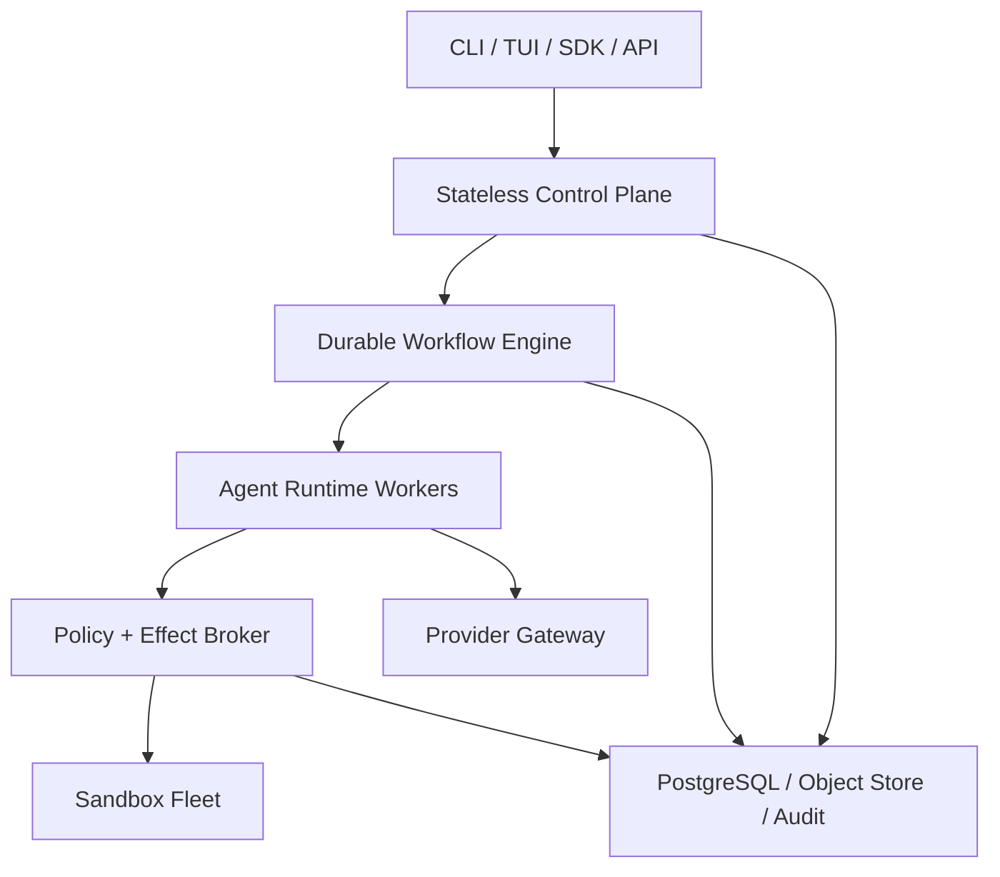
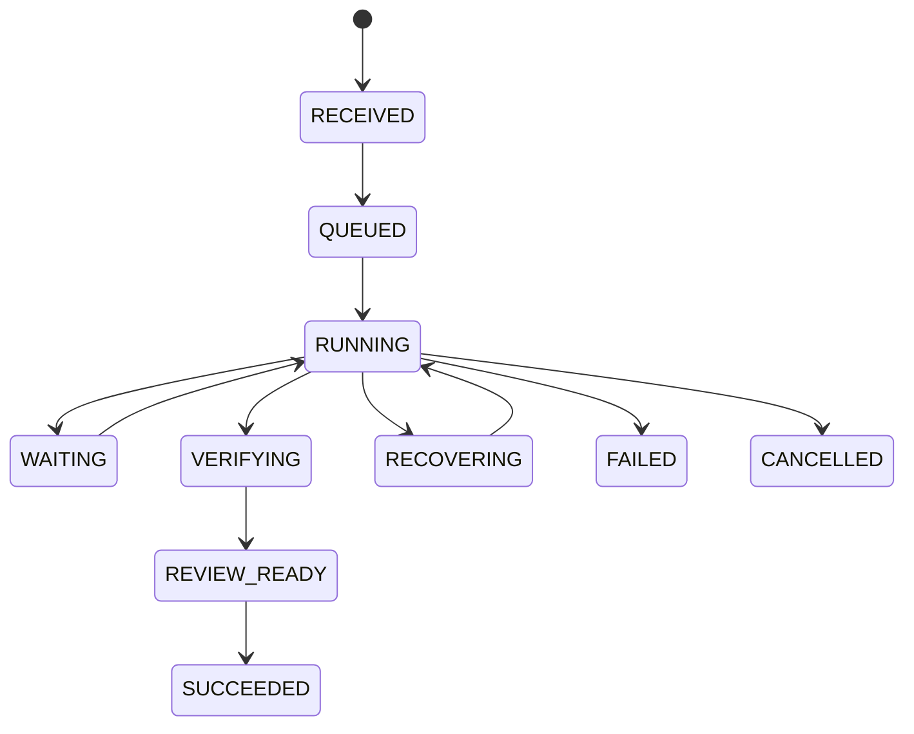
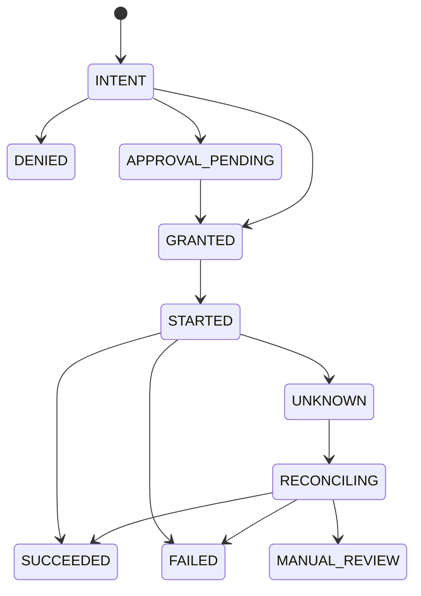

# FocusCode 企业级高可用 Coding Agent 实现、测试与发布计划 v1.0

版本：`1.0`  
基线代码：FocusCode `0.4.0-beta.1`  
计划日期：2026-07-19  
目标：从“企业预生产 Beta”演进为可在企业内规模化部署、可恢复、可审计、可回滚的
FocusCode `1.0`。

## 0. 结论与资源假设

FocusCode v0.4 已经解决了“能否运行”的问题，但距离企业级高可用，主要差距不再是主题、宠物
或增加更多 Tool，而是以下七个系统性问题：

1. 会话型 `CodingAgent` 与审计型 `FocusKernel` 仍有两条副作用执行链；
2. File JSONL/Checkpoint 不具备数据库事务、WAL、租约、跨节点恢复和在线迁移能力；
3. Control API、Worker、Sandbox 尚未形成多副本调度、背压、故障转移和灾备系统；
4. Docker/gVisor/VM driver 已有，但没有完整 Sandbox lifecycle、attestation、Secret/Egress Broker；
5. OIDC 有协议实现，但缺少企业租户、RBAC/ABAC、服务身份、密钥轮换和数据隔离；
6. 五类 Provider 有方言适配，但缺 live contract、模型 revision 证书、熔断、容量和受控降级；
7. 缺少完整 SLI/SLO、OpenTelemetry、容量测试、混沌测试、SBOM/provenance、金丝雀和 DR 演练。

推荐按 24 周实施，默认投入：

- 4 名 Runtime/Backend 工程师；
- 2 名 Platform/SRE/Security 工程师；
- 1 名 CLI/TUI/SDK 工程师；
- 1 名 Test/Eval Automation 工程师；
- 产品、企业安全和模型运营各提供兼职 Owner。

4 人团队在保持同样范围时，现实周期约 36–44 周。以下估算不包含企业自有 IdP、Git、KMS、
Kubernetes 和模型采购流程的等待时间。

## 1. 什么叫“企业级高可用 Coding Agent”

高可用不能只用 HTTP 健康检查衡量。FocusCode 的可用性分为六层：

| 层次       | 目标                                                       | 不能接受的伪实现            |
| ---------- | ---------------------------------------------------------- | --------------------------- |
| 接入可用   | CLI/API 可提交、重连、审批、steering                       | API 200，但任务被丢弃       |
| 任务可恢复 | Worker/Pod/节点失败后从已提交边界恢复                      | 从头重跑并重复副作用        |
| 副作用可靠 | 每个写入、命令、Git、网络动作可识别、幂等或 reconciliation | 宣称无法证明的 exactly-once |
| 安全可用   | 故障时仍不越权、不泄密、不回退到 Host                      | 为“可用”而关闭隔离或审批    |
| 模型可用   | Provider 限流/故障时按策略等待、切换或降级                 | 静默换模型、区域或数据策略  |
| 运维可用   | 可观测、可扩容、可升级、可回滚、可灾备                     | 只能人工查看日志和重启      |

### 1.1 推荐 SLO

SLO 要把 FocusCode 自身故障与外部模型故障分开统计。

| SLI                                 |                  Beta 目标 |                1.0 GA 目标 | 统计边界                                |
| ----------------------------------- | -------------------------: | -------------------------: | --------------------------------------- |
| Control API 月可用性                |                      99.9% |                     99.95% | 不含企业 IdP 全局故障                   |
| 已确认任务持久化成功率              |                     99.99% |                    99.999% | API 返回 accepted 后不得丢失            |
| Worker 丢失后的恢复时间 p95         |                     120 秒 |                      60 秒 | 从 lease 过期到新 attempt 继续          |
| SSE/RPC 重连恢复 p95                |                      10 秒 |                       5 秒 | 使用 event cursor，不丢 committed event |
| Harness 内部错误导致的任务失败率    |                      <0.5% |                      <0.1% | 排除 Provider/用户代码失败              |
| 已提交高风险副作用审计完整率        |                       100% |                       100% | 缺一条即发布阻断                        |
| 未 reconciliation 的 UNKNOWN effect |                   <10 分钟 |                    <5 分钟 | 高风险 effect 不允许自动盲重试          |
| Sandbox 非 Host 执行比例            |                       100% |                       100% | 企业模式硬门禁                          |
| Provider profile contract 通过率    |                        99% |                       100% | 每个允许的 model revision               |
| 发布自动回滚时间                    |                    20 分钟 |                    10 分钟 | 从告警到稳定旧版本                      |
| 单区域 RPO/RTO                      | RPO ≤5 分钟 / RTO ≤60 分钟 | RPO ≤1 分钟 / RTO ≤30 分钟 | 数据库和对象存储演练结果                |

模型任务完成率、Accepted & Verified、Token 成本和首次正确 Patch 时间是产品质量 SLI，不能与
平台可用性混成一个数字。

### 1.2 1.0 非目标

以下内容不应阻塞首个企业 GA：

- 多区域 active-active 写入；1.0 采用单区域多 AZ + 跨区域 warm standby；
- 公共扩展市场；企业版默认只运行组织 allowlist；
- 无限制多 Agent 自治协作；先保证单任务单写者和有限只读 delegation；
- 音视频和高拟真宠物；它们不属于 HA 主路径；
- “所有副作用 exactly-once”；工程目标是 at-least-once orchestration + 幂等键 + fencing +
  reconciliation。

## 2. 当前基线与 GA 差距

| 能力域          | v0.4 现状                           | GA 缺口                                                   | 优先级 |
| --------------- | ----------------------------------- | --------------------------------------------------------- | -----: |
| Agent/Kernel    | 两条可运行链，共享部分 contract     | 唯一 ToolIntent/Policy/Grant/Receipt 主链                 |     P0 |
| 状态持久化      | JSONL Session、File Fact/Checkpoint | PostgreSQL 事务、迁移、checksum、租约、备份               |     P0 |
| 工作流          | 单进程 loop，可手动恢复             | durable workflow、signal、retry、cancel、reconciliation   |     P0 |
| Control API     | 只读/验证型 HTTP server             | OIDC、多租户 API、idempotency、SSE cursor、限流           |     P0 |
| Worker          | 读取本地 job JSON 的单进程          | 多副本队列、心跳、fencing、背压、drain                    |     P0 |
| Sandbox         | Host/Docker/gVisor/SSH VM driver    | 生命周期控制器、镜像证明、warm pool、orphan reaper        |     P0 |
| Secret/Egress   | 子进程环境清理、默认断网            | 短期凭据 Broker、mTLS、DNS/HTTP egress policy             |     P0 |
| Provider        | 五系 Profile、reasoning/retry       | live conformance、revision pin、熔断、容量、受控 fallback |     P0 |
| Session/Context | tree/fork/compact/provider state    | schema migration、WAL、delta checkpoint、崩溃恢复         |     P0 |
| Extension       | npm 签名/allowlist，仍在主进程      | 独立 process/WASI capability host                         |     P0 |
| Audit           | 本地 HMAC 链                        | 集中式、KMS 签名、WORM、轮换、tenant retention            |     P0 |
| Observability   | 事件和测试报告                      | OTel trace/metric/log、SLO dashboard、alert/runbook       |     P0 |
| Release         | npm clean-install Gate              | OCI/Helm、SBOM、SLSA provenance、签名、canary/rollback    |     P0 |
| TUI/Remote      | 本地全屏 TUI/RPC                    | 远程连接、重连、cursor、审批通知、版本协商                |     P1 |
| Coding Quality  | 基础 compaction/tools               | LSP/symbol retrieval、diff review、affected tests         |     P1 |
| A2A/MCP/ACP     | contract boundary                   | 身份化、预算化、只读优先的有限 delegation                 |     P2 |

## 3. 目标架构



### 3.1 架构决策

1. **控制面无状态化**：Control API 不保存进程内任务状态，至少 3 副本跨 AZ；
2. **生产工作流使用 durable engine**：推荐 Temporal TypeScript adapter；本地开发保留 inline
   adapter，不自行重造分布式 timer/signal/replay 系统；
3. **PostgreSQL 是业务事实源**：Tenant、Task、Session、Effect、Approval、Policy、Model
   Certificate 和 Outbox 都在事务库；Temporal history 负责 orchestration，不保存大段 Token；
4. **对象存储保存大对象**：图片、Patch、Diff、日志、checkpoint delta、share bundle；数据库只存
   digest、URI、size、classification 和 encryption metadata；
5. **消息总线不是事实源**：NATS JetStream/Kafka 只承载 outbox 通知、stream fanout 和 cache
   invalidation；消费者必须可从 PostgreSQL cursor 补放；
6. **唯一副作用通道**：Agent 只能生成 `ToolIntent`，不得直接调用 Tool implementation；
7. **每任务一个 home region 和一个有效 writer fence**：1.0 不做跨区域并发写；
8. **Sandbox 是 workload，不是 library**：独立控制器创建/销毁，每个 workload 有短期身份；
9. **Provider fallback 是显式策略**：模型、区域、数据边界、费用和 capability 不满足时宁可暂停，
   不静默换模型；
10. **Telemetry 与 Audit 分离**：Telemetry 可采样且不含正文；Audit 不采样并有完整性证明。

Temporal 的事件历史和 deterministic replay 适合长任务恢复，但模型调用、网络和文件 I/O 必须
作为 Activity；Token delta 不写入 workflow history。生产实现必须通过 `WorkflowEnginePort`，
避免把核心领域对象绑定到单个调度产品。

### 3.2 故障域

| 故障                     | 系统行为                                                                       |
| ------------------------ | ------------------------------------------------------------------------------ |
| Control API Pod 退出     | 客户端重试到其他副本；相同 Idempotency-Key 返回原 task                         |
| Agent Worker 退出        | workflow activity timeout；新 worker 从 committed session/effect boundary 恢复 |
| Sandbox 节点丢失         | effect 标记 UNKNOWN；重建 workspace，再 reconcile，禁止盲重放高风险动作        |
| Provider 429/5xx         | 路由器按 Retry-After、预算和熔断器处理；不占满 worker                          |
| Provider 首 Token 后断流 | 保存 attempt；允许同模型重新生成，但不得重复已提交 Tool effect                 |
| PostgreSQL 主库切换      | API 暂停接受写，连接池重连；已 accepted task 由 workflow 恢复                  |
| 消息总线不可用           | Outbox 累积；事实仍提交数据库，恢复后补发                                      |
| 对象存储短时不可用       | 不提交引用该 artifact 的数据库状态；有界重试后暂停任务                         |
| IdP 不可用               | 已验证短期 session 继续到 TTL；新登录/高风险审批 fail closed                   |
| KMS/Secret Broker 不可用 | 不下发新凭据；任务等待，不回退静态 secret                                      |
| 单区域不可用             | DNS/入口切到 warm standby，恢复到已复制 checkpoint；禁止双写                   |

## 4. 唯一任务与副作用状态机

### 4.1 TaskRun



`WAITING` 必须带 reason：`USER_INPUT`、`APPROVAL`、`PROVIDER_CAPACITY`、`SANDBOX_CAPACITY`、
`DEPENDENCY`。Terminal state 只能通过 CAS/version check 提交。

### 4.2 EffectAttempt



规则：

- `action_id`、`intent_digest`、`task_id` 组成稳定幂等身份；
- 每次调度有递增 `attempt_no` 和不可回退的 `fencing_token`；
- `STARTED` 在执行前持久化；进程失联后进入 `UNKNOWN`，不把“没收到结果”当成“没执行”；
- 文件改动在任务 workspace 内可通过 checkpoint/diff reconcile；
- Git push/PR/外部 API 必须使用目标系统 idempotency key 或先查询后决定；
- 无法 reconcile 的高风险命令进入 `MANUAL_REVIEW`；
- approval 绑定 intent digest、policy version、identity、TTL 和最大 effect，不允许批准后换参数。

## 5. 核心代码接口

### 5.1 Durable workflow port

建议新增 `packages/workflow-domain` 与 `packages/workflow-temporal`：

```ts
export interface WorkflowEnginePort {
  start(request: StartTaskRequest, idempotencyKey: string): Promise<TaskHandle>;
  signal(taskId: string, signal: TaskSignal, signalId: string): Promise<void>;
  cancel(taskId: string, reason: string, requestId: string): Promise<void>;
  status(taskId: string): Promise<TaskWorkflowStatus>;
}

export type TaskSignal =
  | { type: "steer"; mode: "append" | "interrupt" | "follow-up"; text: string }
  | { type: "approval"; approvalId: string; disposition: "approve" | "deny" }
  | { type: "user_input"; requestId: string; answers: unknown }
  | { type: "provider_profile_changed"; revision: string };
```

Workflow 只做 deterministic orchestration；LLM、数据库外读写、Sandbox、Git 和验证都是 Activity。

### 5.2 Task store

```ts
export interface TaskStore {
  create(input: NewTaskRun, idempotencyKey: string): Promise<TaskRun>;
  append(taskId: string, expectedVersion: number, events: NewTaskEvent[]): Promise<TaskEvent[]>;
  checkpoint(checkpoint: TaskCheckpoint, expectedVersion: number): Promise<void>;
  read(taskId: string, tenantId: string): Promise<TaskSnapshot>;
  events(taskId: string, afterSequence: bigint, limit: number): Promise<TaskEvent[]>;
}
```

所有写操作在 transaction 内同时写 `task_events` 与 `outbox_messages`。事件 envelope 必须包含
`tenant_id/task_id/sequence/schema_version/trace_id/actor/policy_revision/created_at/digest`。

### 5.3 Effect broker

```ts
export interface EffectBroker {
  authorize(intent: ToolIntent, context: PolicyContext): Promise<AuthorizationResult>;
  execute(grant: CapabilityGrant, fence: bigint): Promise<EffectReceipt>;
  reconcile(effectId: string, evidence: ReconciliationEvidence): Promise<EffectReceipt>;
}
```

`packages/agent-runtime` 中现有 `executeCalls()` 要改为提交 intent；`PermissionController` 变成
本地 `PolicyDecisionPort` adapter。`packages/action-domain` 的 Policy/Ledger 成为唯一语义源，
CLI local mode 与 remote enterprise mode 不再维护两套风险规则。

### 5.4 Sandbox control

```ts
export interface SandboxControlPort {
  acquire(spec: SandboxSpec, requestId: string): Promise<SandboxLease>;
  exec(lease: SandboxLeaseRef, request: ExecRequest, fence: bigint): Promise<ExecReceipt>;
  checkpoint(lease: SandboxLeaseRef): Promise<WorkspaceCheckpoint>;
  attest(lease: SandboxLeaseRef): Promise<SandboxAttestation>;
  release(lease: SandboxLeaseRef, reason: string): Promise<void>;
}
```

Lease 包含 tenant/task/workspace、runtime class、image digest、node、expiry、attestation digest 和
fence。Controller 必须有 orphan reaper；Worker 不直接访问 Docker socket 或 Kubernetes API。

### 5.5 Provider router

```ts
export interface ProviderRouter {
  resolve(request: ModelRoutingRequest, policy: RoutingPolicy): Promise<ResolvedModelEndpoint>;
  report(outcome: ModelAttemptOutcome): Promise<void>;
}
```

路由输入必须包含 capability、model revision、region、data classification、max cost、deadline、
tenant quota 和 fallback group。只有 `ResolvedModelEndpoint.certificateId` 在 allowlist 中才能调用。

## 6. 数据模型与迁移

### 6.1 PostgreSQL 表

| 表                           | 关键字段/约束                                                               |
| ---------------------------- | --------------------------------------------------------------------------- |
| `tenants`                    | id、status、home_region、kms_key_ref、retention_policy                      |
| `identities` / `memberships` | subject、tenant、roles、groups、last_seen；唯一 `(issuer, subject)`         |
| `repositories`               | tenant、provider、repo_ref、default_policy、data_classification             |
| `task_runs`                  | tenant、state、version、workflow_id、base_revision、budget、home_region     |
| `task_events`                | task、sequence、schema_version、digest；唯一 `(task_id, sequence)`          |
| `task_attempts`              | worker、started/ended、failure_class、checkpoint_ref                        |
| `session_entries`            | branch、parent、role、content_ref/provider_state_ciphertext、token metadata |
| `workspace_checkpoints`      | base commit、delta object、digest、size、previous checkpoint                |
| `effect_intents`             | action_id、intent_digest、policy_revision、risk、idempotency key            |
| `effect_attempts`            | attempt_no、fence、state、started、receipt、reconcile status                |
| `approvals`                  | approver、intent digest、TTL、decision、reason、MFA claim                   |
| `provider_profiles`          | provider/model/revision、capabilities、compatibility、region、status        |
| `provider_certificates`      | fixture/live results、issued_at、expires_at、artifact digest                |
| `policy_bundles`             | tenant、revision、source、compiled digest、effective period                 |
| `audit_records`              | tenant、sequence、previous digest、event digest、KMS signature batch        |
| `artifacts`                  | object key、digest、size、classification、encryption metadata、retention    |
| `outbox_messages`            | topic、aggregate、sequence、payload、published_at；唯一 event identity      |
| `idempotency_keys`           | tenant、scope、key hash、request digest、response ref、expiry               |

每张多租户表包含 `tenant_id`，应用层条件和 PostgreSQL RLS 双重约束。正文/图片/Tool output 不
进入普通索引或 telemetry。`provider_state` 单独加密并设置短 retention。

### 6.2 Migration 规则

- 使用 expand → backfill → switch-read → contract 四阶段；
- 一个版本不得同时要求新 schema 并删除旧字段；
- migration 有 dry-run、估算锁时间、statement timeout 和 rollback/forward-fix 文档；
- event schema 只追加兼容字段；破坏性变更使用新 `schema_version` 和 upcaster；
- 每个 GA 支持至少前两个 minor 版本的 Session/Task 读取；
- 从 File store 到 PostgreSQL 提供 import/checksum/report，不原地破坏旧数据。

## 7. Monorepo 调整

### 7.1 新增 package/app

```text
packages/workflow-domain          Task/Effect 状态、事件、ports、upcasters
packages/workflow-temporal        生产 workflow/activity/signal adapter
packages/task-store-postgres      migrations、repositories、transactional outbox
packages/effect-broker            Policy/Grant/Fence/Receipt/Reconciliation
packages/provider-router          quota、circuit breaker、routing policy、certificates
packages/identity-policy          OIDC claims、RBAC/ABAC、tenant context
packages/secret-broker            短期凭据和审计接口，不绑定具体 Vault/KMS
packages/observability            OTel semantic attributes、metrics、redaction
packages/workspace-checkpoint     content-addressed delta、restore、checksum
packages/extension-runner         独立进程/WASI capability protocol
apps/scheduler                    workflow client、outbox relay、reconciliation sweep
apps/sandbox-controller           runtime lifecycle、attestation、orphan reaper
apps/agent-worker                 remote Agent activity worker
apps/egress-proxy                 allowlisted DNS/HTTP、request receipt
deploy/helm/focuscode             HA charts、PDB、topology spread、NetworkPolicy
infra/kind                        本地多节点/chaos 验收环境
specs                             Effect lifecycle TLA+/状态模型
```

### 7.2 改造现有模块

| 现模块           | 修改                                                                                     |
| ---------------- | ---------------------------------------------------------------------------------------- |
| `agent-runtime`  | Tool execution 替换为 `EffectBrokerPort`；Session/steering 改为 durable adapter          |
| `harness-core`   | 保留 deterministic state semantics，合并到 workflow-domain；去除直接 EffectPort 批量假设 |
| `action-domain`  | 成为 Policy/Grant/Receipt 唯一来源，增加 fence/unknown/reconcile                         |
| `persistence`    | File adapter 降级为 local/dev；生产使用 PostgreSQL/Object Store                          |
| `sandbox`        | 保留 runtime driver；远程模式通过 sandbox-controller，不直接 spawn Docker/SSH            |
| `auth`           | OIDC token verification、JWKS cache/rotation、tenant membership、service identity        |
| `ecosystem`      | Extension 从动态 import 改为 runner IPC；Share 接企业 identity/retention                 |
| `sdk`            | `createLocalCodingAgent` 与 `createRemoteFocusCodeClient` 分离，协议版本协商             |
| `cli`            | remote endpoint、device login、SSE cursor/reconnect、离线只读和审批通知                  |
| `control-api`    | 替换只读 File API，加入 task/session/approval/steering/admin API                         |
| `harness-worker` | 不再读取含 secret 的本地 job JSON，改为 workload identity + task queue                   |

## 8. 分阶段代码实现计划

### Phase 0：可靠性契约与基线（W1–W2，v0.5-dev）

目标：先固定“不允许被绕过”的语义，再引入分布式组件。

| ID     | 实现                                                | 主要文件                     | 完成标准                                         |
| ------ | --------------------------------------------------- | ---------------------------- | ------------------------------------------------ |
| HA-001 | 定义 Task/Effect/Approval 状态和 error taxonomy     | `workflow-domain`            | property tests 覆盖所有合法/非法 transition      |
| HA-002 | 定义 idempotency、fence、UNKNOWN/reconcile contract | `contracts`、`effect-broker` | 断点模型审查通过                                 |
| HA-003 | 抽取 `EffectBrokerPort`                             | `agent-runtime`              | Agent 不再直接引用 Tool implementation           |
| HA-004 | local adapter 保持 CLI 功能兼容                     | `sdk`、`action-backends`     | 现有 89 项测试及 npm demo 不退化                 |
| HA-005 | 建立 OTel attribute/redaction contract              | `observability`              | trace 无 Prompt、Token、源码正文                 |
| HA-006 | 写 Effect lifecycle TLA+/property model             | `specs`                      | 无双 writer、过期 grant 或 terminal resurrection |
| HA-007 | 形成 SLO dashboard schema 与 failure taxonomy       | `docs/runbooks`              | 每个错误可归属 Focus/Provider/User/Infra         |

Stop Gate：任何 Tool 仍可绕过统一 Broker，Phase 1 不得开始远程写路径。

### Phase 1：持久化与可恢复单写者（W3–W6，v0.5.0-alpha）

目标：单区域、单任务 writer 故障后可恢复，不重复已知副作用。

| ID     | 实现                                        | 验收                                          |
| ------ | ------------------------------------------- | --------------------------------------------- |
| HA-101 | PostgreSQL schema、RLS、migration runner    | transaction/rollback/tenant escape tests      |
| HA-102 | TaskStore CAS append + checkpoint           | 并发 append 只有一个成功，event sequence 无洞 |
| HA-103 | Transactional outbox + relay                | broker 断开时数据不丢，恢复后无重复业务消费   |
| HA-104 | Temporal workflow adapter                   | worker kill 后从 committed round 恢复         |
| HA-105 | durable steering/approval/user-input signal | signal ID 幂等，重放顺序稳定                  |
| HA-106 | effect STARTED/UNKNOWN/reconciliation       | kill-point 矩阵全部有确定结果                 |
| HA-107 | workspace delta checkpoint/restore          | sandbox 丢失后 digest 一致恢复                |
| HA-108 | File store import/checksum/report           | v0.4 Session/Task 可迁移且原文件保留          |

Release Gate：连续 10,000 次 crash-injection run 无丢 task、无未检测 duplicate、无 terminal state
逆转。

### Phase 2：单区域多 AZ 高可用（W7–W10，v0.6.0-alpha）

目标：控制面、Worker 和数据层任一单节点/AZ 故障不丢已接受任务。

| ID     | 实现                                                     | 验收                                    |
| ------ | -------------------------------------------------------- | --------------------------------------- |
| HA-201 | Control API v2、OIDC/JWKS、Idempotency-Key               | 3 副本滚动重启，提交/查询无错乱         |
| HA-202 | SSE event cursor、Last-Event-ID、RPC version negotiation | 断网/切 Pod 后恢复 committed event      |
| HA-203 | Worker queue、concurrency、heartbeat、graceful drain     | PDB/节点 drain 时任务迁移               |
| HA-204 | Provider/Sandbox 容量队列和背压                          | 过载返回可操作 retry/queue 状态，不 OOM |
| HA-205 | PostgreSQL HA、PITR、对象存储 versioning                 | 主库切换和 point-in-time restore 演练   |
| HA-206 | Outbox fanout + consumer cursor                          | 消息总线重建后从 DB 补放                |
| HA-207 | Kubernetes topology spread/PDB/HPA                       | 单 AZ loss 满足恢复 SLO                 |
| HA-208 | Reconciliation scheduler leader election                 | 多副本只有有效 leader 扫描，接管不遗漏  |

Kubernetes Lease 可用于 controller leader election，但 task writer fence 仍以数据库/workflow
version 为准，不能把 Kubernetes Lease 当成业务 exactly-once 保证。

### Phase 3：Sandbox、身份、Secret 与 Extension（W11–W14，v0.7.0-alpha）

目标：执行不可信仓库时，故障和扩容都不降低安全边界。

| ID     | 实现                                                         | 验收                                                    |
| ------ | ------------------------------------------------------------ | ------------------------------------------------------- |
| HA-301 | sandbox-controller + per-task lease                          | Worker 无 Docker socket/K8s 权限                        |
| HA-302 | gVisor production RuntimeClass、rootless/container hardening | escape/secret/socket/network adversarial suite          |
| HA-303 | disposable VM adapter lifecycle                              | provision→attest→execute→destroy，orphan=0              |
| HA-304 | image SBOM/signature/digest admission                        | unsigned/unapproved image 100% 拒绝                     |
| HA-305 | SPIFFE/SPIRE 或等价 workload identity                        | mTLS、短期 SVID/JWT，Pod 重建自动轮换                   |
| HA-306 | Secret Broker                                                | task/repo/provider scoped token，Tool 环境无长期 secret |
| HA-307 | Egress Proxy                                                 | DNS/IP/HTTP policy、size/time limit、receipt、默认拒绝  |
| HA-308 | Extension runner/WASI capability protocol                    | 恶意 extension 不能读 Host/Token/任意网络               |
| HA-309 | centralized audit + KMS-signed Merkle batch/WORM             | key rotation、tamper、gap detection、retention tests    |

Stop Gate：企业 remote mode 不允许 in-process extension；Host fallback 在编译/配置/运行三层都
必须关闭。

### Phase 4：Provider 高可用与可移植上下文（W15–W17，v0.8.0-beta）

目标：Provider 故障可控，模型切换不破坏企业策略和 Session 资产。

| ID     | 实现                                                        | 验收                                                  |
| ------ | ----------------------------------------------------------- | ----------------------------------------------------- |
| HA-401 | 五系脱敏 recorded-stream fixtures                           | text/reasoning/tool/image/usage/abort/overflow 全覆盖 |
| HA-402 | 每个批准 revision 的 live conformance certificate           | certificate 到期自动禁新任务或告警                    |
| HA-403 | circuit breaker、bulkhead、tenant/provider quota            | 单 Provider 429 不拖垮其他 Provider                   |
| HA-404 | pre-first-token retry 与 post-first-token attempt semantics | 不重复已提交 Tool effect                              |
| HA-405 | routing/fallback policy                                     | 区域、能力、费用、分类不匹配时 fail closed            |
| HA-406 | Session schema migration/encryption/retention               | provider state 可回放、分享仍强制剥离                 |
| HA-407 | structured compaction/branch summary                        | 长任务重放结果和关键事实稳定                          |
| HA-408 | model catalog signed update + rollback                      | bad profile 可在 10 分钟内回滚                        |

默认不做生成请求 hedging；它会增加费用和不确定性。仅在只读、无副作用、租户明确允许且有
严格取消语义时实验。

### Phase 5：可观测、质量与运营（W18–W20，v0.9.0-beta）

| ID     | 实现                                          | 验收                                                |
| ------ | --------------------------------------------- | --------------------------------------------------- |
| HA-501 | OpenTelemetry traces/metrics/logs + Collector | task→model→effect→sandbox 全链 trace                |
| HA-502 | SLO/error-budget dashboard                    | Focus/Provider/User/Repo/Infra 五类分拆             |
| HA-503 | alert rules + runbooks                        | 每条 page 有 Owner、diagnosis、mitigation、rollback |
| HA-504 | cost/token/context/cache metrics              | tenant budget 达限前预警并 fail closed              |
| HA-505 | LSP/symbol retrieval、affected-test planner   | 真实 Repo 质量和 token 效率提升有 A/B               |
| HA-506 | diff review/approval UX、remote TUI reconnect | 高风险动作可在上下文内审批                          |
| HA-507 | 24h/7d soak、memory/fd/session leak tests     | 无持续增长，满足容量模型                            |
| HA-508 | Pi 同模型/同预算 30 Repo A/B                  | 发布报告包含胜率、成本、时延和干预次数              |

OpenTelemetry JavaScript 当前 traces/metrics 稳定、logs 仍处于 development 状态，因此日志管道
采用普通结构化 logger + trace correlation，OTel logs adapter 放在可替换边界。

### Phase 6：供应链、灾备与 GA（W21–W24，v0.9 RC → v1.0）

| ID     | 实现                                              | 验收                                           |
| ------ | ------------------------------------------------- | ---------------------------------------------- |
| HA-601 | npm/OCI/Helm 固定版本和 compatibility matrix      | clean install/upgrade/rollback 全通过          |
| HA-602 | SPDX/CycloneDX SBOM、SLSA provenance、Cosign 签名 | admission 和离线验证通过                       |
| HA-603 | multi-arch image、镜像漏洞 Gate                   | critical=0；high 有限期例外与 Owner            |
| HA-604 | expand/contract migration rehearsal               | 当前版和前两 minor 混跑无数据损坏              |
| HA-605 | canary + feature flags + auto rollback            | 1/5/25/50/100% 分批，异常自动停止              |
| HA-606 | 跨区域 warm standby 与 game day                   | 达到 RPO/RTO，确认无 split-brain               |
| HA-607 | 安全红队/威胁模型/渗透修复                        | P0/P1 关闭，剩余风险经签字接受                 |
| HA-608 | 30 天 production-like soak                        | SLO、容量、成本、on-call 均通过                |
| HA-609 | GA readiness review                               | Product/SRE/Security/Data/Model Owner 共同签字 |

## 9. API 与用户接入计划

### 9.1 外部 API

```text
POST   /v1/tasks                         Idempotency-Key 必填
GET    /v1/tasks/{task_id}
GET    /v1/tasks/{task_id}/events        SSE + Last-Event-ID
POST   /v1/tasks/{task_id}/steering      signal_id 必填
POST   /v1/tasks/{task_id}/cancel        request_id 必填
GET    /v1/tasks/{task_id}/approvals
POST   /v1/approvals/{approval_id}        intent digest 和 MFA claim 校验
GET    /v1/sessions/{session_id}
POST   /v1/sessions/{session_id}/fork
POST   /v1/sessions/{session_id}/share
GET    /v1/models                         仅返回 tenant allowlist + certificate 状态
GET    /v1/health/live
GET    /v1/health/ready
GET    /v1/version                        API/contract/min-client versions
```

响应使用稳定 error code、`request_id/trace_id/retryable/retry_after_ms`。不能把数据库、Provider
正文或内部堆栈返回给用户。

### 9.2 CLI

```bash
focuscode login --endpoint https://focuscode.example.com
focuscode remote doctor
focuscode run --repo org/repo --base <commit> "修复测试"
focuscode attach TASK_ID
focuscode approve APPROVAL_ID
focuscode task events TASK_ID --after EVENT_ID
```

CLI 保存 endpoint、account 和非敏感 cursor；Token 进入 OS keychain/加密 store。远程断线后按
event cursor 重连，不重新提交 Prompt。客户端和服务端做最低/最高协议版本协商。

## 10. 测试战略

### 10.1 测试层级与频率

| 层级             | 内容                                                       | 频率       | 目标                                 |
| ---------------- | ---------------------------------------------------------- | ---------- | ------------------------------------ |
| Unit             | state、policy、parser、redaction、routing                  | 每 PR      | <8 分钟，critical package ≥90% lines |
| Property/Fuzz    | transition、idempotency、SSE、Provider stream、path        | 每 PR/夜间 | 无未处理输入和非法状态               |
| Contract         | PostgreSQL、Temporal、KMS、object store、Provider fixtures | 每 PR      | adapter 行为固定                     |
| Integration      | API→workflow→worker→broker→sandbox→verify                  | 每 PR      | 真实依赖容器环境                     |
| Live Provider    | 五系批准 revision                                          | 每日/发布  | 脱敏、低成本、限流保护               |
| Chaos/Kill-point | worker/db/bus/object/provider/sandbox 故障                 | 每晚/每周  | 恢复和 UNKNOWN 语义                  |
| Security         | tenant/IDOR/prompt/tool/extension/egress/supply chain      | 每晚/RC    | P0/P1 为零                           |
| Load/Soak        | 并发、长 Session、流式 fanout、compaction                  | 每周/RC    | 满足容量和 SLO                       |
| Eval             | 30 Repo、同模型 Pi A/B、回归任务                           | nightly/RC | 质量不退化                           |
| DR               | 主库/区域/密钥/对象恢复                                    | 每月/RC    | RPO/RTO 实测通过                     |

### 10.2 Kill-point 矩阵

每个副作用至少在以下位置强制 kill 100 次：

1. intent 已写入、policy 未完成；
2. grant 已写入、未 dispatch；
3. STARTED 已提交、Sandbox 未收到；
4. Sandbox 已执行、receipt 未返回；
5. receipt 已返回、数据库未提交；
6. effect 已提交、session/checkpoint 未提交；
7. checkpoint 已提交、outbox 未 publish；
8. event 已发送、客户端未 ack。

断言：event sequence 连续、terminal state 不复活、过期 fence 被拒绝、已知幂等 effect 不重复、
未知高风险 effect 不盲重试、恢复后的 workspace digest 与预期一致。

### 10.3 Provider contract matrix

每个允许模型 revision 必测：

- text JSON/stream、Unicode 和超长 chunk；
- reasoning on/off/effort 与 continuation replay；
- zero/one/parallel Tool call、畸形 arguments、Tool error；
- image input（若声明）、MIME/size/count；
- usage/cache/context limit；
- 400/401/403/408/409/425/429/5xx、Retry-After；
- DNS/TLS/connect/read timeout、首 Token 前后断流；
- cancel/abort、服务端仍继续计费的观测；
- model alias 变更和字段兼容性；
- 数据区域与 endpoint certificate。

Profile 只有通过 recorded fixture、live smoke、安全审查和成本上限后才生成 certificate。证书有
过期时间，不能永久信任 alias。

### 10.4 安全测试

映射 OWASP Agentic Top 10 与 NIST AI RMF：

- goal/prompt hijack：仓库 README、测试输出、图片和 Tool output 中注入指令；
- tool misuse：参数偷换、未声明 effect、approval 后修改；
- identity/privilege abuse：跨 tenant IDOR、group 变更、过期 JWT、confused deputy；
- memory/context poisoning：恶意 Session/share/compaction/provider state；
- extension/A2A：IPC spoof、capability escalation、递归 delegation；
- secret exfiltration：Prompt、日志、trace、DNS、HTTP redirect、crash dump；
- Sandbox：symlink、procfs、Host HOME、Docker socket、metadata service、fork bomb、OOM；
- supply chain：恶意 npm lifecycle、dependency confusion、unsigned image、SBOM mismatch；
- audit：删行、插行、重排、key rotation、WORM retention bypass。

### 10.5 性能与容量

建立三种负载：

- Small：50k 文件以下、10 rounds、2 Tool calls；
- Medium：250k 文件、30 rounds、10 Tool calls、2 images；
- Long：100 rounds、3 次 compaction、5 次 steering、worker/sandbox 各 kill 一次。

至少验证 10/100/500/1,000 并发 task；分别测 API ack、queue wait、first event、model wait、effect
latency、checkpoint size、DB write IOPS、object throughput、worker memory、stream fanout 和单任务
总成本。容量结论必须包含安全余量和 scale-up 时间。

## 11. CI/CD 与发布计划

### 11.1 Pipeline

PR Gate：

```text
format → architecture → typecheck → unit/property → contract → integration
       → dependency/license/secret scan → migration lint → package clean install
```

Nightly：live Provider、kill-point、fuzz、30 Repo eval、multi-node kind。  
Weekly：load/soak、Sandbox adversarial、dependency update、restore drill。  
RC：全部 Gate + 24h/7d soak + migration rehearsal + security review + DR game day。

### 11.2 发布制品

- `@focuscode/cli`、`@focuscode/sdk` npm packages；
- control-api、worker、scheduler、sandbox-controller、egress-proxy OCI images；
- Helm chart、CRD/values schema、NetworkPolicy、PodSecurity、PDB；
- PostgreSQL migration bundle；
- SPDX/CycloneDX SBOM；
- SLSA provenance 和 Cosign signature/attestation；
- model profile/certificate bundle；
- compatibility matrix、release notes、known issues、rollback/runbook；
- source manifest 和 reproducible build evidence。

SLSA provenance 用于证明 artifact 从何处、何时、如何构建；Cosign 负责 OCI/blob 签名与验证。
生产 admission 必须验证 builder identity、source repository、tag/commit 和签名策略。

### 11.3 版本与兼容策略

- 对外 npm/HTTP/Session/Event 使用 SemVer；
- public packages 采用 fixed release train，内部 package 可独立但必须锁精确版本；
- API path `v1` 内只做兼容追加；
- event/schema 使用显式版本和 upcaster；
- CLI 支持服务端当前 minor 及前两个 minor；
- model profiles 独立版本，可紧急回滚而不重发整个 CLI；
- feature flag 使用 vendor-neutral adapter；关键安全行为不能由普通租户 flag 关闭。

### 11.4 金丝雀顺序

1. CI synthetic + ephemeral environment；
2. staging 100% synthetic；
3. internal dogfood、只读任务；
4. 1% tenant、低风险写；
5. 5% 单 AZ；
6. 25% → 50% → 100%，每级观察至少一个业务峰值周期；
7. 高风险 effect 和新 Provider 分别独立放量。

自动停止/回滚条件：API error budget burn、task loss、UNKNOWN effect 超阈、审计 gap、跨 tenant
denial、Sandbox attestation failure、Provider contract error、成本异常或 migration lag。

### 11.5 数据库发布

- Release N：expand，新旧代码均可工作；
- 后台 backfill 有 checkpoint/rate limit；
- Release N+1：切换读路径并验证；
- Release N+2：contract，只有确认旧版本完全退出才删除；
- 发生问题优先回滚应用或 forward-fix，不回滚已经产生新业务事实的 migration。

## 12. 版本里程碑

| 版本         | 周期     | 可承诺能力                                                               | 不可承诺               |
| ------------ | -------- | ------------------------------------------------------------------------ | ---------------------- |
| v0.5 alpha   | W1–W6    | 唯一 effect chain、Postgres、durable workflow、crash recovery            | 多 AZ、完整企业身份    |
| v0.6 alpha   | W7–W10   | 单区域多 AZ、remote API/CLI、backpressure、PITR                          | 安全生产认证           |
| v0.7 alpha   | W11–W14  | Sandbox lifecycle、workload identity、Secret/Egress、extension isolation | Provider 全证书        |
| v0.8 beta    | W15–W17  | 五系 conformance、熔断/fallback、Session migration                       | GA SLO                 |
| v0.9 beta/RC | W18–W22  | OTel/SLO、质量基准、供应链、canary、DR                                   | 未完成 soak 的正式 SLA |
| v1.0 GA      | W23–W24+ | 30 天 soak 后的企业单区域多 AZ + 跨区域 DR                               | active-active 多区域写 |

如果 P0 安全或 durability Gate 未过，只能顺延，不能通过降低门槛按日期发布。

## 13. 运营与组织准备

必须明确 Owner：

| 领域      | Owner 职责                                      |
| --------- | ----------------------------------------------- |
| Runtime   | Task/Effect 语义、兼容和恢复                    |
| SRE       | SLO、容量、部署、on-call、DR                    |
| Security  | Identity、Policy、Sandbox、Secret、供应链、红队 |
| Model Ops | Provider certificate、成本、quota、fallback     |
| Data      | schema、retention、backup、restore、privacy     |
| Product   | 风险等级、approval UX、GA 接受标准              |

上线前需要：服务目录、on-call rotation、严重级别、升级路径、状态页、客户通知模板、事故回顾
机制、Provider outage runbook、数据导出/删除流程、密钥轮换和 break-glass 双人审批。

## 14. 风险登记

| 风险                        | 影响                     | 缓解                                                     |
| --------------------------- | ------------------------ | -------------------------------------------------------- |
| 两条执行链长期并存          | 安全策略绕过、审计不完整 | HA-003 是所有远程写前置 Gate                             |
| 过早微服务化                | 运维复杂度超过收益       | 控制面保持模块化单体，只拆 Worker/Sandbox/egress         |
| 自研 workflow engine        | 大量隐蔽恢复 bug         | 使用 durable engine adapter，不把领域绑定厂商            |
| Provider alias 漂移         | 线上协议突然失败         | revision certificate、TTL、canary、紧急 profile rollback |
| Sandbox warm pool 污染      | 跨任务数据泄漏           | immutable base、每任务 overlay、销毁验证、随机抽检       |
| 审计保存过多正文            | 新的敏感数据仓库         | digest/metadata 优先，正文单独分类、加密和 retention     |
| 自动 fallback 改变质量/区域 | 合规或行为不一致         | tenant policy、capability/region/cost 硬约束、显式事件   |
| exactly-once 营销承诺       | 无法满足、隐藏重复       | UNKNOWN/reconcile 和幂等语义写入产品契约                 |
| 多区域双写过早              | split-brain、Repo 冲突   | 1.0 home-region + warm standby                           |
| TUI/宠物抢占 P0             | 核心可靠性延期           | UI 只保留远程重连/审批/可观测必需项                      |

## 15. 企业 GA Definition of Done

以下全部满足才可标记 `1.0 GA`：

- Agent Runtime 中不存在绕过 Effect Broker 的写/Shell/Git/Network 执行路径；
- accepted task 在 Worker/Pod/节点故障后按 SLO 恢复；
- kill-point 矩阵没有丢事件、未检测重复或过期 fence 执行；
- 企业任务 100% 在 attested Docker/gVisor/VM，Host fallback 不可配置；
- Provider allowlist 中每个 model revision 有未过期 certificate；
- OIDC、RBAC/ABAC、tenant RLS、workload identity 和 short-lived secret 通过红队；
- Extension 在独立 capability runtime；
- audit 100% 完整，KMS rotation/WORM/verify 演练通过；
- PostgreSQL PITR、对象存储恢复和跨区域 DR 达到 RPO/RTO；
- OTel dashboard/alert/runbook 和 24×7 on-call 准备完成；
- npm/OCI/Helm/migration clean install、升级和回滚通过；
- SBOM、provenance、signature 和 admission policy 可离线验证；
- 30 天 production-like soak 未耗尽 error budget；
- 30 Repo 同模型 Pi A/B 无阻断级质量回归；
- Security、SRE、Data、Model Ops、Product Owner 完成风险签字。

## 16. 建议立即开始的前 10 个 PR

1. `workflow-domain`：Task/Effect 状态、error taxonomy、property tests；
2. contracts：`ToolIntentV2`、`CapabilityGrantV2`、`EffectReceiptV2`、fence/unknown；
3. `EffectBrokerPort` 注入 `CodingAgent`，现有 local Tool 通过 adapter；
4. 删除/阻断 Agent 内直接 Tool execution 的旁路测试；
5. PostgreSQL migration `001_tenant_task_event_outbox`；
6. `TaskStorePostgres` CAS append + RLS integration tests；
7. `workspace-checkpoint` content-addressed delta + restore tests；
8. Temporal spike：一个模型 round、steering signal、worker kill/replay；
9. OTel trace/metric/redaction primitives；
10. kind 三节点测试环境和第一个 worker-kill Gate。

前 10 个 PR 完成后再决定 Temporal adapter 的最终生产化细节。若 spike 不能满足 Session
signal、history size、部署和团队运维要求，应在 `WorkflowEnginePort` 后替换方案，而不是修改
Agent/Effect 领域契约。

## 17. 参考标准与工程依据

- [Temporal Workflow replay](https://docs.temporal.io/workflows)：durable history、deterministic
  replay，以及将 LLM/文件/网络调用置于 Activity；
- [Kubernetes Leases](https://kubernetes.io/docs/concepts/architecture/leases/)：controller leader
  election 和 heartbeat；
- [PostgreSQL locking](https://www.postgresql.org/docs/current/explicit-locking.html)：事务锁和
  advisory lock 的语义与限制；
- [OpenTelemetry JavaScript](https://opentelemetry.io/docs/languages/js/)：Node.js trace/metric/log
  状态和 OTLP 生态；
- [SPIFFE/SPIRE](https://spiffe.io/docs/latest/spiffe-about/overview/)：短期、可证明的 workload
  identity；
- [SLSA Provenance](https://slsa.dev/provenance)：构建来源和过程证明；
- [Sigstore Cosign](https://docs.sigstore.dev/cosign/signing/signing_with_containers/)：OCI artifact
  签名与 OIDC identity；
- [OWASP Agentic Top 10 2026](https://genai.owasp.org/resource/owasp-top-10-for-agentic-applications-for-2026/)：Agent goal、Tool、Identity、Memory、A2A 等风险；
- [NIST Generative AI Profile](https://www.nist.gov/publications/artificial-intelligence-risk-management-framework-generative-artificial-intelligence)：Govern、Map、Measure、Manage 风险治理；
- [OpenFeature](https://openfeature.dev/)：vendor-neutral feature flag boundary。
