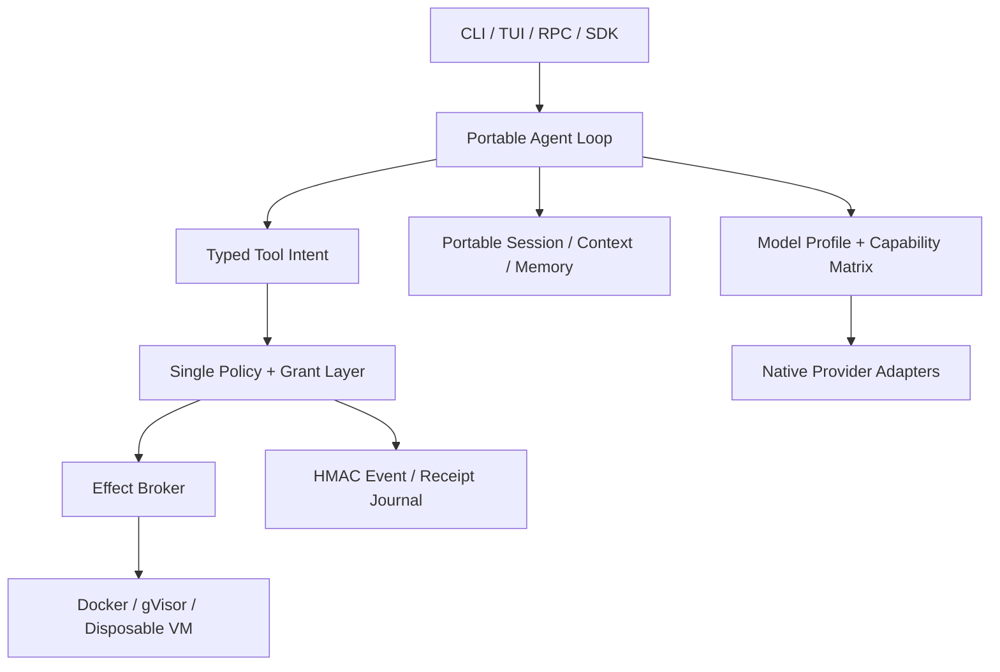

# FocusCode v0.3 Alpha1 vs Pi 0.80.10：Apple-to-Apple Harness 审查

报告日期：2026-07-19  
FocusCode 审查基线：`0.3.0-alpha.1`  
修复后版本：`0.4.0-beta.1`  
Pi 审查快照：`@earendil-works/pi-coding-agent@0.80.10`

## 1. 结论先行

FocusCode v0.3 的六项重点能力并非全部缺失。真正的问题是：多数能力已经有 Alpha 代码，
但 Provider 差异、企业策略、审计、扩展和 CLI 对话循环没有完全收敛成一条不可绕过的执行链。

本轮修复后：

- FocusCode 在企业私有代码场景的默认隔离、权限硬拒绝、模型/扩展允许列表、审计完整性和
  会话分享安全上，形成了 Pi 核心默认实现没有提供的差异化；
- FocusCode 已有 Kimi、Qwen、GLM、DeepSeek、MiniMax 的原生 Profile 和模型级覆盖，不再只是
  把所有端点粗略当作 OpenAI-compatible；
- FocusCode 的 TUI、三类 mid-turn 队列、多模态、npm 扩展和签名分享已达到可使用 Beta；
- Pi 在终端编辑器、Provider/模型目录、订阅 OAuth、扩展 API 深度、包生态、会话树交互、
  compaction 质量和长期真实使用成熟度上仍明显领先；
- 因此目前不能诚实地宣称 FocusCode “全面优于 Pi”。更准确的判断是：**Pi 仍是更成熟的个人
  通用 CLI Harness；FocusCode 已成为更强的企业安全 Harness 架构候选，但必须通过真实隔离、
  Provider live contract 和同模型 Repo 基准三类 Gate，才能称为企业开箱即用正式版。**

## 2. 比较方法

### 2.1 Apple-to-Apple 边界

只比较模型之上的用户侧执行层，不把模型本身能力算到 Harness：

- Agent loop、上下文、工具、权限、执行隔离；
- Provider/Auth/模型方言适配；
- TUI、会话、队列、多模态；
- 扩展、分发、分享、SDK/RPC；
- 企业治理、审计、可运维性。

不比较品牌、模型榜单或未经同一实验协议验证的主观体验。实际质量比较必须固定：同一模型
revision、同一 Provider、同一 Prompt、同一工具语义、同一 token/turn/time budget、同一仓库
snapshot 和同一验收脚本。

### 2.2 Pi 取证范围

本报告检查了当前 npm 包的 README、docs、`dist` Provider 实现和公开接口，而非只依据产品页：

- 包：`@earendil-works/pi-coding-agent@0.80.10`；
- 配套包：`pi-agent-core`、`pi-ai`、`pi-tui` 同版本；
- 重点：Provider catalog、OpenAI compatibility、message queue、session tree、compaction、TUI、
  extensions、packages、project trust、sharing 和 container 文档；
- 官方入口：[pi.dev](https://pi.dev/)、
  [GitHub](https://github.com/earendil-works/pi)、
  [npm](https://www.npmjs.com/package/@earendil-works/pi-coding-agent)。

### 2.3 成熟度刻度

| 分值 | 含义                               |
| ---: | ---------------------------------- |
|    0 | 不存在                             |
|    1 | 只有设计或边界                     |
|    2 | 可运行原型                         |
|    3 | Alpha/Beta 可用，有明显缺口        |
|    4 | 工程成熟，主要风险可控             |
|    5 | 长期生产级、生态成熟或已有广泛验证 |

分数不是营销总分；企业安全和个人 UX 的权重不同。

## 3. 逐项对比

| 能力                | FocusCode v0.3 | FocusCode v0.4 Beta1 | Pi 0.80.10 | 当前判断                                                              |
| ------------------- | -------------: | -------------------: | ---------: | --------------------------------------------------------------------- |
| CLI 模式            |              4 |                    4 |          5 | 两者均有交互/print/JSON/RPC/SDK；Pi 入口和边角更成熟                  |
| Provider 广度       |            2.5 |                    4 |          5 | Focus 新增五系十一 Profile；Pi 仍有更大目录和自动刷新                 |
| 模型方言适配        |              2 |                    4 |          5 | Focus 已有 model override、reasoning/tool/retry；Pi 方言矩阵更深      |
| OAuth/Auth          |              3 |                    4 |          5 | Focus 有 PKCE/device/OIDC/revoke/加密库；Pi 有多家订阅原生登录        |
| Agent loop          |            3.5 |                    4 |          5 | Focus loop 完整；Pi 的 retry/compaction/cache/transport 更成熟        |
| Coding tools        |              4 |                    4 |        4.5 | Focus 10 个受控工具；Pi 默认 4 个但扩展和交互成熟                     |
| 全屏 TUI            |            2.5 |                  3.5 |          5 | Focus 已全屏、差分、主题/伙伴；编辑器与组件生态仍落后                 |
| 可爱助手/自定义外观 |            3.5 |                  4.5 |        3.5 | Focus 内置 6 只多状态伙伴并支持校验后的自定义 JSON                    |
| 图片/多模态         |              3 |                  3.5 |        4.5 | Focus 四协议映射完整；Pi 多了剪贴板、拖入和终端体验                   |
| Session/tree/fork   |            3.5 |                    4 |          5 | Focus 数据结构具备；Pi 的树 UI、label/clone/branch summary 更完整     |
| Compaction          |            2.5 |                  2.5 |          5 | Focus 有有界摘要；Pi 有成熟的结构化自动压缩和分支摘要                 |
| Mid-turn queue      |              3 |                  4.5 |          5 | Focus 新增 append/interrupt/follow-up；仍缺队列取回和 delivery mode   |
| Extension API       |              3 |                  3.5 |          5 | Focus 有工具/命令/事件；Pi 可拦截、改写、持久状态和自定义 UI          |
| Package 分发        |              3 |                  3.5 |          5 | Focus npm exact/signature/lock；Pi 支持 npm/git/local、更新和资源过滤 |
| Session share       |            3.5 |                  4.5 |          4 | Focus 签名/脱敏/信任/TTL/限流更安全；Pi 的分享路径更成熟易用          |
| Permission          |              4 |                  4.5 |          2 | Focus 默认策略和 hard deny 是核心优势；Pi 官方说明无内建权限系统      |
| OS 隔离             |            3.5 |                 4.5* |        2.5 | Focus 有 Docker/gVisor/VM fail-closed；`*` 仍需目标平台实跑           |
| 企业审计            |            2.5 |                    4 |        2.5 | Focus 新增内容最小化 HMAC 链；Pi Session 是历史记录而非防篡改审计     |
| 企业允许列表        |            2.5 |                  4.5 |          2 | Focus Provider/model/extension/media/sandbox 均可 fail-closed         |
| 可嵌入性            |              4 |                    4 |          5 | 两者均有 SDK/RPC；Pi 已有更多真实集成                                 |
| 简洁性/低开销       |              3 |                  3.5 |          5 | Pi 的最小 Harness 和成熟 TUI 更简洁；Focus 的治理层必然更重           |
| A2A/MCP/ACP         |            1.5 |                  1.5 |          2 | Focus 以 contract 为主；Pi 可由扩展实现，但都不是完整企业 A2A         |
| 真实基准证据        |              1 |                    1 |     未纳入 | 尚无同模型、同预算、同 Repo 的可复现 A/B，不能判胜负                  |

### 3.1 按使用场景给结论

| 场景                           | 当前更合适                    | 原因                                                        |
| ------------------------------ | ----------------------------- | ----------------------------------------------------------- |
| 个人开发者、最佳终端编辑体验   | Pi                            | TUI、Provider、会话、扩展和生态成熟                         |
| 快速定制个人工作流             | Pi                            | Extension/Pi Package API 更深、社区资产更多                 |
| 企业私有代码、默认禁止越权     | FocusCode                     | policy hard deny、保护路径、无 Host 静默回退                |
| 需要可验证 OS 隔离             | FocusCode（通过实机 Gate 后） | 内建 Docker/gVisor/VM driver 和 fail-closed 配置            |
| 需要防篡改审计与模型可迁移资产 | FocusCode                     | HMAC audit、独立 Session/Profile/asset 边界                 |
| 当前即可大规模生产推广         | 均需组织验收                  | Pi 缺企业治理默认值；Focus 仍是 Beta 且缺实机/Provider 基准 |

## 4. 用户指定六项差距：是否仍存在

| 差距                          | v0.3 审查结论                                               | v0.4 修复                                                                     | 是否仍存在                                                                                  |
| ----------------------------- | ----------------------------------------------------------- | ----------------------------------------------------------------------------- | ------------------------------------------------------------------------------------------- |
| OAuth 与五类开源模型          | 协议骨架有，GLM/MiniMax 缺，Kimi/Qwen/DeepSeek 方言过粗     | 11 个区域 Profile、模型级覆盖、OIDC discovery、revoke、reasoning replay/retry | **部分**：五类 API key 已覆盖；厂商订阅 OAuth 不能凭空通用化，需官方授权或企业 OIDC gateway |
| 全屏 TUI/主题/快捷键/卡通助手 | 全屏和内置主题/伙伴已有，但整帧刷新、不能安全加载自定义对象 | 差分刷新、title、自定义主题/多状态伙伴 JSON 校验                              | **部分**：仍缺 Pi 级编辑器、autocomplete、IME/clipboard、Markdown/代码块组件                |
| 图片及多模态                  | 四协议和文件/URL已有                                        | 企业远程图片 egress policy、模型能力 Gate、模型级 image profile               | **部分**：核心图片闭环完成；剪贴板/拖入、音视频未做                                         |
| 扩展分发与会话分享            | npm/签名分享已有，但企业运行时边界弱                        | 企业扩展 allowlist/签名/特权拒绝；share signer trust/TTL/auth/rate limit      | **部分**：扩展仍是 allowlisted in-process trusted code；无市场、撤销服务和 HA 多租户存储    |
| Mid-turn steering             | append/interrupt 已有                                       | 新增 follow-up、RPC/TUI/SDK 一致、队列上限配置                                | **基本关闭**：仍缺队列取回、one-at-a-time/all delivery 策略                                 |
| Docker/gVisor/VM 真隔离       | 代码存在，不是只有 Host Bash；但只做命令契约测试            | 企业 digest pin、pull-never、IPC/log 隔离、doctor、SDK/CLI一致 fail-closed    | **代码差距关闭，运行证据仍缺**：必须在目标 Docker/runsc/VM 实跑攻击矩阵                     |

## 5. v0.3 设计过程中此前没有充分考虑的事项

### 5.1 Provider 不是 endpoint + protocol 两个字段

不同模型还会改变：

- reasoning 开关格式：`enable_thinking`、`thinking.type`、`reasoning_effort`；
- assistant/tool continuation 是否必须回放 `reasoning_content`；
- `max_tokens` 或 `max_completion_tokens`；
- stream usage、parallel tools、tool choice、ZAI `tool_stream`；
- 图片、工具、reasoning 是否是具体模型能力，而非 Provider 全局能力；
- 429/5xx/网络错误的重试、`Retry-After`、timeout；
- 区域 base URL、API key 环境变量和默认模型。

v0.4 把这些放入 `ModelProfile.capabilities/compatibility/reliability`，并允许
`models["provider/model"]` 覆盖。这是跨模型 Harness 的必要资产层，不应散落在 if/else 中。

### 5.2 “有权限模块”不等于“企业策略不可绕过”

v0.3 的 deterministic Focus Kernel 与 conversational CodingAgent 是两条组合路径；CLI 日常
对话没有自动经过 FocusKernel 的 Event/Receipt/Verifier。v0.4 先把 enterprise allowlist、Sandbox、
Extension 和 HMAC audit 接到 CLI/SDK 主路径，但两套 Policy/Effect 模型仍未合一。这是正式版前
最大的架构债务之一。

### 5.3 Extension 签名不是 containment

npm signature/integrity 只能说明包来自某个供应链记录且未被替换，不能阻止扩展调用 Node API。
FocusCode 企业模式现在默认不加载项目扩展，只运行签名且 allowlisted、无 network/shell 权限的
扩展；但允许列表内代码仍在主进程。最终方案必须是独立进程/WASI/容器 + capability broker。

### 5.4 真隔离必须包含供应链和验收

Docker 参数正确不等于隔离成立。此前遗漏了：

- image digest pin 和禁止运行时自动 pull；
- 目标 daemon/runtime 是否真的是 runsc；
- 容器逃逸、Host HOME、Docker socket、默认网络、OOM/fork bomb/abort cleanup；
- VM 的 provision、attestation、lease、snapshot 和 destroy；
- 每次版本发布对目标基础设施的实机 Gate。

### 5.5 审计不应复制敏感内容

完整保存 Prompt/Tool output 会制造第二个 secret store。v0.4 审计只保存必要元数据、字节数和
内容摘要，用 HMAC 链连接记录；Session 仍保存用户工作内容，两者职责分离。

### 5.6 企业可用性还包括运维，不只是功能

此前低估的内容还有：model catalog revision、recorded stream conformance、session migration/
repair、crash reconciliation、OIDC/RBAC、Secret/Egress Broker、SBOM/provenance、SLO/metrics、
灰度/回滚、Windows/macOS/remote workspace matrix。

## 6. 本轮源码修复清单

### 6.1 Provider 与 Auth

- 新增 Kimi global/CN、Kimi Coding、Qwen CN/International、GLM global/CN、DeepSeek、
  MiniMax global/CN；
- 增加 default model、context/output、image/reasoning/tool capability；
- 增加 per-model profile override；
- 条件发送不兼容字段，增加 Qwen/ZAI/DeepSeek thinking 方言和 reasoning continuation；
- 修复 Session 校验丢弃 Provider continuation state；完整保存并回放 OpenAI
  `reasoning_content` 与 Anthropic thinking/signature blocks，分享时始终剥离；
- Kimi K3 使用顶层 `reasoning_effort=max` 而非 K2 `thinking`；DeepSeek 默认迁移到
  `deepseek-v4-pro`，按 V4 tool-loop 关闭 `tool_choice` 并保证 assistant content 非 null；
- 对 408/409/425/429/5xx 和网络错误做有界重试并发出 `model_retry`；
- OIDC discovery、client auth negotiation、refresh/revoke 和加密多账号凭据库。

### 6.2 TUI、多模态和队列

- 全屏 alternate screen 保留，增加差分行更新；
- 支持 `--theme path.json`、`--mascot path.json`，严格限制颜色、帧、尺寸和控制字符；
- 保留 5 主题、6 个动画伙伴和可配置 keymap；
- 图片在发送前检查具体模型 `capabilities.input`；企业模式拒绝 HTTPS 远程图片；
- append、interrupt、follow-up 三队列语义；interrupt 只取消当前 generation，不取消任务。

### 6.3 Enterprise、安全与生态

- Provider、model、extension allowlist；
- 企业模式强制签名扩展、禁止临时 `--extension`、默认禁项目扩展；
- 企业模式强制 Docker/gVisor/VM、禁止 Host/fallback；
- 容器镜像必须 `@sha256:`，运行时 `--pull never`；
- HMAC 链式 audit journal 和离线验签；
- share server 增加 authentication fail-closed、signer fingerprint allowlist、最大年龄和限流；
- 新增 `focuscode doctor` 聚合检查配置、审计 key、Sandbox、扩展和远程媒体策略。

## 7. 目标 Harness 架构

最优 Harness 的原则：

1. 模型可替换，但 Profile、Session、Memory、Policy、Audit 和评测资产归用户；
2. Agent loop 只消费能力声明，不在核心中硬编码厂商；
3. 模型只提出 intent，策略和执行由确定性层控制；
4. 所有副作用产生 grant、started、receipt、verification，崩溃后可 reconciliation；
5. Extension/A2A 是不可信 workload，不能获得主进程默认权限；
6. 性能优化建立在 canonical context、prompt cache 和事件流上，不牺牲审计边界。

## 8. 仍需优化、可简化与不应优先的内容

### P0：正式企业版前必须完成

1. 合并 CodingAgent Permission 与 FocusKernel Policy/Effect Receipt，消除双主链；
2. 五类 Provider 的 recorded fixture + live smoke，固定 model revision 与兼容证书；
3. 真实 Docker/runsc/VM adversarial CI；
4. Session WAL/checksum/migration/repair 和 effect unknown-state reconciliation；
5. Extension 独立 capability host；
6. OIDC/RBAC、workload identity、Secret/Egress Broker；
7. 同模型 Pi A/B 基准和 24h soak。

### P1：决定日常体验是否真正达到 Pi

1. 终端 editor：undo/kill ring/word movement/selection/IME/hardware cursor；
2. `@file` fuzzy autocomplete、路径和 slash command completion；
3. Markdown/代码高亮、折叠 Tool/Thinking、diff review UI；
4. 剪贴板图片、drag/drop、队列取回和 delivery mode；
5. Model catalog 自动更新、favorites/scoped cycling、费用/cache/context 指标；
6. 模型生成的结构化 compaction、branch summary 和 file-operation tracking。

### P2：可以延后

- 公共扩展市场和社交发现；
- 多人实时协同 TUI；
- 音频/视频输入；
- 高拟真图形宠物、游戏化和复杂动画；
- 大规模多 Agent 自治写入。

### 应简化或删除的方向

- 不为每个 Provider 复制一套 Agent loop；只增加声明式 Profile 和最小 adapter；
- 不把 Provider OAuth 当成必然能力；五家命名模型优先官方 API key，OAuth 通过官方订阅协议或
  企业 gateway；
- 不在 Alpha 同时建设公共 Marketplace、A2A 网络和多人协作；先关掉 effect durability 与
  extension isolation；
- 不维护两套含义不同的工具/权限模型；统一 typed intent 后再扩展；
- 不把宠物渲染放入核心；它只能是可替换 UI asset。

## 9. 可证实的工程状态

当前自动化证据：23 个 workspace project 构建，26 个测试文件、89 项测试，Statements 77.46%、
Branches 65.12%、Functions 82.73%、Lines 81.81%；architecture/format Gate 通过。npm Gate 会执行
pack、洁净安装、文件 allowlist、已安装 CLI 版本/伙伴命令，以及本地 SSE Provider 的两轮真实
Tool loop。

这些证据不包含外部模型 key、真实 Docker/runsc、远端 VM 或同模型 Pi benchmark，因此对应
结论仍明确标记为未验收。

## 10. 参考资料

- Pi 当前产品与源码：[pi.dev](https://pi.dev/)、
  [earendil-works/pi](https://github.com/earendil-works/pi)
- Kimi API：[Kimi Platform Overview](https://platform.kimi.ai/docs/overview)
- Qwen API：[Qwen API Reference](https://help.aliyun.com/zh/model-studio/qwen-api-reference/)
- Qwen OpenAI-compatible：[Chat Completions](https://help.aliyun.com/zh/model-studio/qwen-api-via-openai-chat-completions)
- DeepSeek：[API Docs](https://api-docs.deepseek.com/)
- GLM：[GLM-5.2 Guide](https://docs.z.ai/guides/llm/glm-5.2)
- MiniMax：[MiniMax M3](https://www.minimax.io/models/text/m3)

模型 ID、上下文和协议会变化；内置 Profile 是有版本的默认值，不是永远正确的事实。生产部署
必须通过 model-level config pin 和 Provider contract test 固定当次行为。
